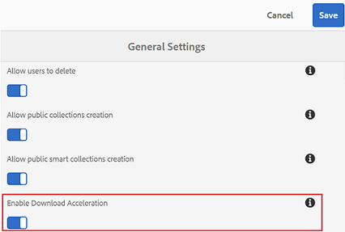

# Acelere os downloads do Brand Portal {#guide-to-accelerate-downloads-from-brand-portal}

O Brand Portal permite aprimorar o desempenho de download de arquivos de ativos grandes integrando-se à IBM Aspera Connect, que é um aplicativo de instalação sob demanda. O aplicativo usa tecnologia proprietária para remover despesas gerais de TCP e ajuda a melhorar a velocidade de transferência dos arquivos de ativos. Essa integração garante uma melhor experiência de download.

>[!NOTE]
>
>A velocidade de download varia para os usuários, pois depende de fatores como largura de banda da rede, latência do servidor e localização geográfica dos clientes.

Se ativados, os usuários do Brand Portal podem reduzir significativamente o tempo gasto para baixar os arquivos de ativos desejados do Brand Portal ou por meio de um link compartilhado instalando o cliente Aspera Connect.

## Pré-requisitos para acelerar o download de arquivos {#prerequisites-to-accelerate-file-download}

Para baixar os arquivos mais rapidamente, verifique o seguinte:

* **[!UICONTROL Ative a Aceleração]** de download (que está desativada por padrão) em Configurações [!UICONTROL gerais] no painel de ferramentas administrativas.
* A porta 33001 (TCP e UDP) está aberta no firewall. Para obter mais informações sobre os pré-requisitos, consulte [a documentação](https://downloads.asperasoft.com/en/documentation/8)do Aspera Connect Client.
* Instale o Aspera Connect usando privilégios de administrador.
* Para obter suporte à plataforma do cliente de transferência Aspera, consulte Matriz de suporte à plataforma [Aspera Connect](https://www.asperasoft.com/company/support/transfer-clients/).

## Baixar domínios {#download-domains}

A seguir estão os domínios de download para diferentes regiões geográficas:

| Código da região | Domínio |
|---|---|
| NA OU1 | downloads-na1.brand-portal.adobe.com |
| NA VA5 | downloads-na2.brand-portal.adobe.com |
| EMEA LON5 | downloads-emea1.brand-portal.adobe.com |
| APAC SIN2 | downloads-apac1.brand-portal.adobe.com |

## Exemplo de desempenho de download usando o acelerador de arquivos {#expected-download-performance-using-file-accelerator}

A tabela a seguir mostra o desempenho do download para arquivos de 2 GB usando o acelerador de download de arquivos Aspera Connect:

**Os resultados observados variam devido a fatores como largura de banda da rede, latência do servidor e localização do cliente, considerando que o servidor Brand Portal está no Oregon (Estados Unidos).*

| Local do cliente | Latência entre cliente e servidor (milissegundos) | Velocidade com o Acelerador de transferência de arquivos Aspera Connect (MBps) | Tempo gasto para fazer o download de um arquivo de 2 GB com o Acelerador de Transferência de Arquivos Aspera (segundos) |
|---------------------------|-----------------------------------|---------------------------------------------|-------------------------------------------------------------------------|
| U.S. West (N. Califórnia) | 18 | 36 | 57 |
| Oeste dos EUA (Oregon) | 42 | 36 | 57 |
| Leste dos EUA (N. Virgínia) | 85 | 35 | 58 |
| APAC (Tóquio) | 124 | 36 | 57 |
| Noida (Índia) | 275 | 13.36 | 153 |
| Sydney | 175 | 29 | 70 |
| Londres | 179 | 35 | 58 |
| Cingapura | 196 | 34 | 60 |

## Download do fluxo de trabalho usando o acelerador de arquivos {#download-workflow-using-file-accelerator}

Para fazer o download dos recursos mais rapidamente do Brand Portal:

1. Faça logon no Brand Portal usando um navegador compatível.
2. Procure e selecione o arquivo de ativo, a pasta ou a coleção desejada para download. Toque/ clique na opção de download.
A caixa de diálogo Download é exibida com a opção [Ativar aceleração] de download selecionada.
   

   >[!NOTE]
   >
   >A funcionalidade de enviar notificação por email com o link para baixar ativos não é atualmente suportada enquanto downloads mais rápidos são ativados.

   

3. Toque/clique na opção **[!UICONTROL Download]** .
Para acelerar a experiência de download em sua conta de locatário do Brand Portal, é necessário ter o aplicativo cliente Aspera Connect instalado no sistema.

4. **Baixar como cliente Connect** Se o Aspera Connect não estiver instalado no seu sistema ou o cliente existente do Aspera Connect estiver desatualizado, um prompt será exibido na página do navegador a partir da qual você pode baixar o cliente Aspera Connect específico do sistema selecionando **[!UICONTROL Baixar versão]** mais recente.

   

   Para baixar a versão mais recente do Aspera Connect em [https://downloads.asperasoft.com/connect2/](https://downloads.asperasoft.com/connect2/), selecione **[!UICONTROL Baixar agora]** e siga as instruções.

5. **Instale o Aspera Connect Client** Para instalar a configuração do cliente IBM Aspera Connect, execute a instalação do arquivo .msi do aplicativo cliente IBM Aspera Connect e siga o assistente de instalação.

6. Depois que o cliente for instalado com êxito, atualize a página do navegador e inicie as etapas de download novamente ou selecione **[!UICONTROL Reiniciar]** na caixa de diálogo **[!UICONTROL Download]** do ativo (Etapa 2).
Ao usar o Aspera Connect pela primeira vez, o navegador solicitará a abertura do link usando o **[!UICONTROL IBM Aspera Connect]**. Para ignorar essa caixa de diálogo no futuro, ative **[!UICONTROL Lembrar minha escolha para links]** de FASP.

   >[!NOTE]
   >
   >Essa mensagem é diferente em navegadores diferentes.

7. Uma caixa de diálogo confirma se a transferência deve ser feita ou não. Selecione **[!UICONTROL Permitir]** para começar.
Para ignorar esta caixa de diálogo no futuro, ative **[!UICONTROL Usar minha escolha para todas as conexões com este host]**.
O download é iniciado. Uma caixa de diálogo mostra o progresso do download. Use a caixa de diálogo para **[!UICONTROL pausar]**, **[!UICONTROL retomar]** ou **[!UICONTROL cancelar]** o download.
Uma vez que o aplicativo Connect fornece uma janela de atividade no sistema na qual o usuário pode exibir e gerenciar todas as sessões de transferência. Para obter mais informações, consulte [a documentação](https://downloads.asperasoft.com/en/documentation/8)do Aspera Connect Client.

Após a conclusão bem-sucedida do download, uma caixa de diálogo mostra o local onde os ativos são baixados para o sistema do usuário. Se houver uma falha, ela mostrará um erro.

>[!NOTE]
>
>Há uma limitação conhecida no aplicativo cliente Aspera Connect de que nenhum prompt para selecionar o local de download será exibido se **[!UICONTROL Sempre perguntar onde salvar arquivos]** baixados estiver ativado na guia [!UICONTROL Transferências] dentro de [!UICONTROL Preferências]. Antes de qualquer download começar, forneça o local na caixa de texto **[!UICONTROL Salvar arquivos baixados]**.

## Uso do acelerador de arquivos no navegador Microsoft Edge {#using-file-accelerator-on-microsoft-edge-browser}

O Microsoft Edge é executado no EPM (Enhanced Protected Mode), impedindo a comunicação com o servidor Aspera Connect, na mesma rede privada ou com um Site Confiável. Portanto, uma pop-up é exibida sempre que uma conexão com o servidor é estabelecida.

Para usar a funcionalidade de download acelerado no Microsoft Edge, remova o site do Brand Portal da lista de sites confiáveis.

1. Abra o Painel de controle (pressione a tecla **[!UICONTROL Janela + X]** e selecione **[!UICONTROL Painel]** de controle).
2. Vá para **[!UICONTROL Rede e Internet &gt; Opções]** da Internet. Clique na guia **[!UICONTROL Segurança]** .
3. Clique na zona **[!UICONTROL Sites]** confiáveis e clique em **[!UICONTROL Sites]**.
4. Remova o site do Brand Portal da lista.

## Preferências de cliente do Connect {#aspera-connect-client-preferences}

Há algumas preferências úteis que podem ser definidas na preferência do IBM Aspera Connect Client clicando com o botão direito do mouse no ícone e selecionando **[!UICONTROL Preferências]**.

Você pode definir o local de download padrão.

Além disso, o cliente Aspera Connect pode ser marcado para iniciar automaticamente na inicialização do sistema para que o cliente Connect esteja em execução e disponível para que o download seja iniciado mais rápido.

## Solução de problemas com a aceleração de download {#troubleshoot-issues-with-download-acceleration}

Se a aceleração de download não estiver funcionando para você, siga estas etapas para solucionar o problema:

1. Verifique se as portas não estão bloqueadas, visitando [https://test-connect.asperasoft.com](https://test-connect.asperasoft.com/) do computador.

   Se as portas não estiverem OK, entre em contato com a equipe de rede e verifique se as portas 33001 (TCP e UDP) não estão bloqueadas no firewall.

2. Se as portas estiverem OK, verifique se sua rede não está lenta, medindo a largura de banda disponível usando [https://www.speedtest.net/](https://www.speedtest.net/).

   Se a largura de banda for de alguns (1-10 Mbps) ou em Kbps, use as Preferências de Aspera e tente limitar a largura de banda igual à largura de banda disponível.

3. Para confirmar se os downloads do servidor de demonstração Aspera estão funcionando, use [https://demo.asperasoft.com/aspera/user](https://demo.asperasoft.com/aspera/user).\
   (login:  asperaweb , senha:  demoaspera )

4. Se nenhuma das etapas de solução de problemas acima funcionar, desmarque a opção Habilitar aceleração de download e use o download normal.
