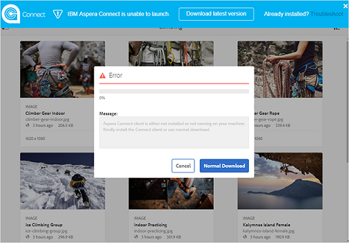
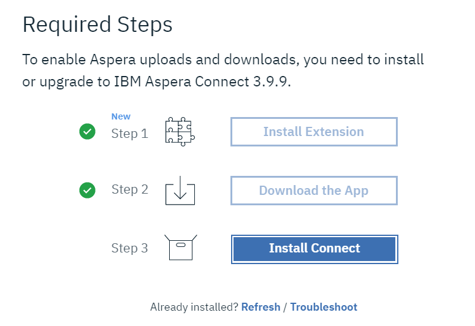
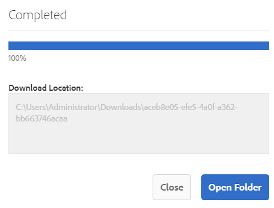
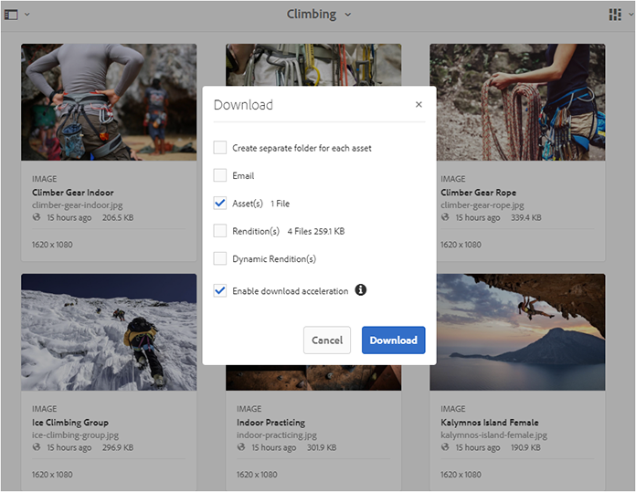
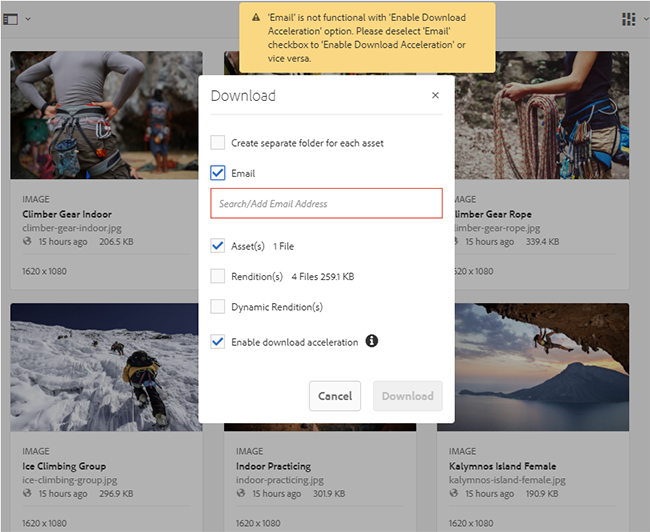
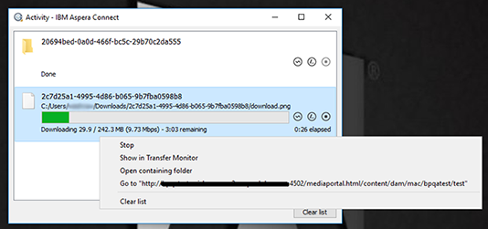
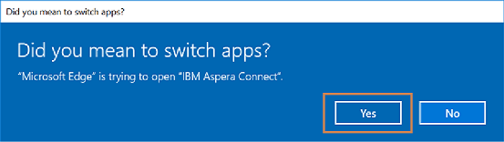
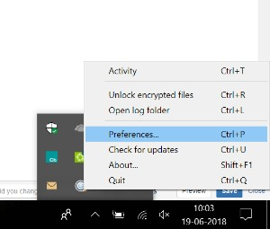
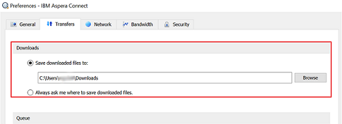
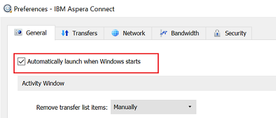

# Acelere os downloads do Brand Portal {#guide-to-accelerate-downloads-from-brand-portal}

O Portal de marcas do Adobe Experience Manager Assets permite melhorar o desempenho de download de arquivos de ativos grandes integrando-se à IBM Aspera Connect, que é um aplicativo de instalação sob demanda. O aplicativo usa tecnologia proprietária para remover despesas gerais de TCP e ajuda a melhorar a velocidade de transferência dos arquivos de ativos. Essa integração garante uma melhor experiência de download.

>[!NOTE]
>
>A velocidade de download varia para os usuários, pois depende de fatores como largura de banda da rede, latência do servidor e localização geográfica dos clientes.

A configuração **[!UICONTROL Download rápido]** está ativada por padrão, o que reduz significativamente o tempo gasto para baixar os arquivos de ativos desejados do Brand Portal.

## Pré-requisitos para acelerar o download do arquivo {#prerequisites-to-accelerate-file-download}

Para baixar os arquivos mais rapidamente, verifique o seguinte:

* Navegue até **[!UICONTROL Ferramentas]** > **[!UICONTROL Baixar]** e verifique se a configuração **[!UICONTROL Download rápido]** está ativada em **[!UICONTROL Configurações de download]**.
* Verifique se a porta 33001 (TCP e UDP) está aberta no firewall. Para obter mais informações sobre os pré-requisitos, consulte [a documentação do IBM Aspera Connect Client](https://downloads.asperasoft.com/en/documentation/8).
* [Instale o IBM Aspera Connect 3.9.9](https://www.ibm.com/support/knowledgecenter/SSXMX3_3.9.9/kc/connect_welcome.html) na extensão do seu navegador usando privilégios de administrador.
* Para obter suporte de plataforma para o cliente de transferência Aspera, consulte [Matriz de suporte de plataforma IBM Aspera Connect](https://www.asperasoft.com/company/support/transfer-clients/).

## Baixar domínios {#download-domains}

A seguir estão os domínios de download para diferentes regiões geográficas:

| Código da região | Domínio |
|---|---|
| NA OU1 | downloads-na1.brand-portal.adobe.com |
| NA VA5 | downloads-na2.brand-portal.adobe.com |
| EMEA LON5 | downloads-emea1.brand-portal.adobe.com |
| APAC SIN2 | downloads-apac1.brand-portal.adobe.com |

## Amostra do desempenho de download usando o acelerador de arquivos {#expected-download-performance-using-file-accelerator}

A tabela a seguir mostra o desempenho do download para arquivos de 2 GB usando o acelerador de download de arquivos Aspera Connect:

*Os resultados observados variam devido a fatores como largura de banda da rede, latência do servidor e localização do cliente, considerando que o servidor Brand Portal está no Oregon (Estados Unidos).*

| Local do cliente | Latência entre cliente e servidor (milissegundos) | Velocidade com o Acelerador de transferência de arquivos Aspera Connect (MBps) | Tempo gasto para fazer o download de um arquivo de 2 GB com o Acelerador de Transferência de Arquivos Aspera (segundos) |
|---------------------------|-----------------------------------|---------------------------------------------|-------------------------------------------------------------------------|
| U.S. West (N. Califórnia) | 18 | 36 | 57 |
| Oeste dos EUA (Oregon) | 42 | 36 | 57 |
| Leste dos EUA (N. Virgínia) | 85 | 35 | 58 |
| APAC (Tóquio) | 124 | 36 | 57 |
| Noida (Índia) | 275 | 13,36 | 153 |
| Sydney | 175 | 29 | 70 |
| Londres | 179 | 35 | 58 |
| Cingapura | 196 | 34 | 60 |

## Baixar fluxo de trabalho usando o acelerador de arquivos {#download-workflow-using-file-accelerator}

Para fazer o download dos recursos mais rapidamente do Brand Portal:

1. Faça logon no seu locatário do Brand Portal. Por padrão, a visualização **[!UICONTROL Arquivos]** é aberta, contendo todos os ativos e pastas publicados.

   Faça uma das seguintes opções:

   * Selecione os ativos ou pastas que deseja baixar. Na barra de ferramentas na parte superior, clique no ícone **[!UICONTROL Download]**.

      

   * Para baixar representações específicas de ativos de um ativo, passe o ponteiro sobre o ativo e clique no ícone **[!UICONTROL Download]** disponível nas miniaturas de ação rápida.

      

1. A caixa de diálogo **[!UICONTROL Baixar]** listando todos os ativos selecionados é aberta.

   Para preservar a hierarquia de pastas do Brand Portal ao baixar ativos, marque a caixa de seleção **[!UICONTROL Criar pasta separada para cada ativo]**.

   O botão de download reflete a contagem dos itens selecionados. Quando terminar de aplicar as regras, clique em **[!UICONTROL Baixar itens]**. Para saber mais sobre como aplicar regras, consulte [baixar ativos](../using/brand-portal-download-assets.md#download-assets).

   

1. Por padrão, a configuração **[!UICONTROL Download rápido]** está ativada em **[!UICONTROL Configurações de download]**. Portanto, uma caixa de confirmação é exibida para baixar ativos usando o IBM Aspera Connect.

   Se você estiver baixando os ativos pela primeira vez e não tiver o IBM Aspera Connect instalado em seu navegador ou a versão existente estiver desatualizada, ele solicitará que você [instale o Acelerador de download Aspera](https://www.ibm.com/support/knowledgecenter/SSXMX3_3.9.9/kc/connect_welcome.html).

   

1. **Instalar o Aspera Connect Client**

   Para instalar a configuração do cliente IBM Aspera Connect, execute a configuração a partir do arquivo .msi do aplicativo cliente IBM Aspera Connect e siga o assistente de instalação.

   

1. Depois que o cliente for instalado com êxito, atualize a página do navegador e inicie as etapas de download novamente.

1. Para continuar usando **[!UICONTROL Download rápido]**, clique em **[!UICONTROL Permitir]**. Todas as renderizações selecionadas são baixadas em uma pasta zip usando o IBM Aspera Connect.

   Após a conclusão bem-sucedida do download, uma caixa de diálogo mostra o local onde os ativos são baixados no sistema do usuário.

   

   Se você não quiser usar o IBM Aspera Connect, clique em **[!UICONTROL Negar]**. Se **[!UICONTROL Download rápido]** for negado ou falhar, o sistema preencherá uma mensagem de erro. Clique no botão **[!UICONTROL Download normal]** para continuar baixando os ativos.

>[!NOTE]
>
>Se a configuração **[!UICONTROL Download rápido]** for desativada pelo administrador, as renderizações selecionadas serão baixadas diretamente em uma pasta zip sem usar o IBM Aspera Connect.

<!-- 
On successful completion of the download, a dialog box shows the location where assets are downloaded onto the user's system. If there is a failure, it shows error.

   >[!NOTE]
   >
   >There is a known limitation in Aspera Connect client application that no prompt to select download location appears if **[!UICONTROL Always ask me where to save downloaded files]** is enabled under the tab **[!UICONTROL Transfers]** within **[!UICONTROL Preferences]**. Before any download begins, provide the location in the text box **[!UICONTROL Save downloaded files to]**.

1. Log in to Brand Portal using a supported browser.
1. Browse and select the folders or assets you want to download. From the toolbar at the top, click the **[!UICONTROL Download]** icon. the **[!UICONTROL Download]** dialog appears with the **[!UICONTROL Asset(s)]** and **[!UICONTROL Enable download acceleration]** check boxes selected by default. 

   

   >[!NOTE]
   >
   >The functionality to send email notification with the link to download assets is presently not supported while faster downloads are enabled.

   

1. Click **[!UICONTROL Download]**.

   To speed up the download experience on your Brand Portal tenant account, you need to have Aspera Connect client application installed in your browser's extension.

1. **Download Aspera Connect Client**

   If Aspera Connect client is not installed on your system or the existing Aspera Connect client is out of date, a prompt is displayed on the browser page from where you can download the system-specific Aspera Connect client by selecting **[!UICONTROL Download Latest Version]**.

   

   To download the latest version of Aspera Connect from [https://downloads.asperasoft.com/connect2/](https://downloads.asperasoft.com/connect2/), select **[!UICONTROL Download Now]** and follow the instructions.

1. **Install Aspera Connect Client**

   To install IBM Aspera Connect client setup, run the setup from  .msi  file of IBM Aspera Connect client application and follow the installation wizard.

1. Once the client is successfully installed, refresh the browser page and initiate the download steps again.

   When using Aspera Connect for the first time, the browser prompts to open the link using **[!UICONTROL IBM Aspera Connect]**. To skip this dialog in future, enable **[!UICONTROL Remember my choice for FASP links]**.

   >[!NOTE]
   >
   >This message is different on the different browsers.

1. A dialog box confirms whether to proceed the transfer or not. Select **[!UICONTROL Allow]** to begin.
To skip this dialog in future, enable **[!UICONTROL Use my choice for all connections with this host]**.
Download begins. A dialog box shows the progress of the download. Use the dialog box to **[!UICONTROL pause]**, **[!UICONTROL resume]**, or **[!UICONTROL cancel]** the download.
Aspera Connect application provides an Activity Window on the system where user can view and manage all transfer sessions. For more information, refer [Aspera Connect Client documentation](https://downloads.asperasoft.com/en/documentation/8).

On successful completion of the download, a dialog box shows the location where assets are downloaded onto the user's system. If there is a failure, it shows error.

   >[!NOTE]
   >
   >There is a known limitation in Aspera Connect client application that no prompt to select download location appears if **[!UICONTROL Always ask me where to save downloaded files]** is enabled under the tab **[!UICONTROL Transfers]** within **[!UICONTROL Preferences]**. Before any download begins, provide the location in the text box **[!UICONTROL Save downloaded files to]**.
-->

## Usando o acelerador de arquivos no navegador Microsoft Edge {#using-file-accelerator-on-microsoft-edge-browser}

O Microsoft Edge é executado no EPM (Enhanced Protected Mode), impedindo a comunicação com o servidor Aspera Connect, na mesma rede privada ou com um Site Confiável. Portanto, uma pop-up é exibida sempre que uma conexão com o servidor é estabelecida.

Para usar a funcionalidade de download acelerado no Microsoft Edge, remova o site do Brand Portal da lista de site confiável.

1. Abra o Painel de controle do Campaign (**[!UICONTROL Chave da janela + X]** e selecione **[!UICONTROL Painel de controle do Campaign]**).
1. Vá para **[!UICONTROL Rede e Internet]** > **[!UICONTROL Opções da Internet]**. Clique na guia **[!UICONTROL Security]**.
1. Clique em **[!UICONTROL Zona de sites confiáveis]** e, em seguida, clique em **[!UICONTROL Sites]**.
1. Remova o site do Brand Portal da lista.

## Aspera as preferências do cliente Connect {#aspera-connect-client-preferences}

Existem algumas preferências úteis que podem ser definidas na preferência do IBM Aspera Connect Client clicando com o botão direito do mouse no ícone e selecionando **[!UICONTROL Preferências]**.

Você pode definir o local de download padrão.

Além disso, o cliente Aspera Connect pode ser marcado como start automático na inicialização do sistema para que o cliente Connect esteja em execução e disponível para que o download seja iniciado mais rápido.

## Solução de problemas com a aceleração de download {#troubleshoot-issues-with-download-acceleration}

Se a aceleração de download não estiver funcionando para você, siga estas etapas para solucionar o problema:

1. Verifique se as portas não estão bloqueadas visitando [https://test-connect.asperasoft.com](https://test-connect.asperasoft.com/) do computador.

   Se as portas não estiverem OK, entre em contato com a sua equipe de rede e verifique se as portas 33001 (TCP e UDP) não estão bloqueadas no firewall.

1. Se as portas estiverem OK, verifique se sua rede não está lenta, medindo a largura de banda disponível usando [https://www.speedtest.net/](https://www.speedtest.net/).

   Se a largura de banda for de alguns (1-10 Mbps) ou em Kbps, use as Preferências de Aspera e tente limitar a largura de banda igual à largura de banda disponível.

1. Para confirmar se os downloads do servidor de demonstração Aspera estão funcionando, use [https://demo.asperasoft.com/aspera/user](https://demo.asperasoft.com/aspera/user).\
   (login:  asperaweb , senha:  demoaspera )

1. Se nenhuma das etapas de solução de problemas acima funcionar, desmarque a opção Habilitar aceleração de download e use o download normal.
