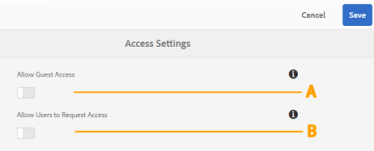

# Administrar acesso de usuários no Brand Portal {#administer-user-access-on-brand-portal}

A partir do Portal de Marcas do AEM Assets 6.4.2, os administradores podem configurar o acesso de convidados e permitir que os usuários solicitem acesso ao Portal de Marcas de sua organização. Essas configurações foram fornecidas como configurações **[!UICONTROL de Configurações de]** acesso no painel administrativo. Ambas as configurações estão desativadas por padrão.

**Uma** configuração para permitir o acesso de convidados no Brand Portal usando o Acesso de **[!UICONTROL convidados?]** link na tela de boas-vindas do Brand Portal. (O padrão está desativado)

**B** Configuração para permitir que os usuários solicitem acesso ao Brand Portal usando **[!UICONTROL Precisa de acesso?]** link na tela de boas-vindas do Brand Portal. (O padrão está desativado)

## Permitir acesso de convidado {#allow-guest-access}

Ao permitir o acesso de convidados, os usuários podem acessar os ativos públicos sem precisar fazer logon no Brand Portal.
Para permitir acesso de convidado, o administrador deve executar as seguintes etapas:

1. Selecione o logotipo do AEM para acessar as ferramentas administrativas na barra de ferramentas na parte superior.
1. No painel de ferramentas administrativas, selecione **[!UICONTROL Acesso]** para abrir a página Configurações **[!UICONTROL de]** acesso.
1. Ative a configuração **[!UICONTROL Permitir acesso]** de convidado.
1. **[!UICONTROL Salve as alterações.]**
1. Faça logout para permitir que as alterações entrem em vigor.

## Permitir que usuários solicitem acesso {#allow-users-to-request-access}

Os administradores podem permitir que os usuários da organização solicitem acesso ao Brand Portal a partir da tela de boas-vindas. No entanto, os administradores precisam ativar a configuração **[!UICONTROL Permitir que usuários solicitem acesso]** para que o link de acesso da solicitação seja exibido na tela de boas-vindas.

Para permitir que os usuários da organização solicitem acesso ao Brand Portal, os administradores precisam:

1. Selecione o logotipo do AEM para acessar as ferramentas administrativas na barra de ferramentas na parte superior.
1. No painel de ferramentas administrativas, selecione **[!UICONTROL Acesso]** para abrir a página Configurações **[!UICONTROL de]** acesso.
1. Ative a configuração **[!UICONTROL Permitir que usuários solicitem acesso]** .
1. **[!UICONTROL Salve as alterações.]**
1. Faça logout para permitir que as alterações entrem em vigor.
