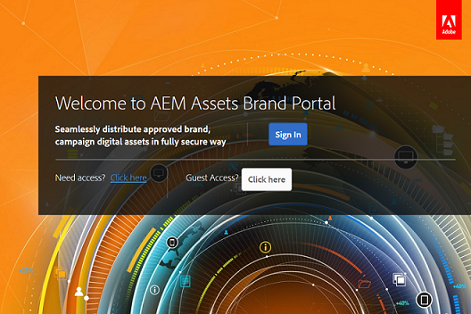

# Administrar o acesso do usuário no Brand Portal {#administer-user-access-on-brand-portal}

A partir do AEM Assets Brand Portal 6.4.2, os administradores autorizam os administradores a configurar o acesso a convidados e permitir que os usuários solicitem acesso no Brand Portal de sua organização. Essas configurações foram fornecidas como [!UICONTROL configurações de Configurações de acesso] no painel administrativo. Ambas as configurações são desativadas por padrão.

**Uma** configuração para permitir o acesso ao convidado no Brand Portal usando [!UICONTROL o Acesso a convidados?] na tela de boas-vindas do Brand Portal. (O padrão está desativado)

**Configuração B** para permitir que os usuários solicitem acesso ao Brand Portal usando o acesso [!UICONTROL necessário?] na tela de boas-vindas do Brand Portal. (O padrão está desativado)

## Permitir acesso de convidado {#allow-guest-access}

Para permitir o acesso a convidados no Brand Portal, para que os usuários não precisem fazer logon para acessar ativos públicos, os administradores precisam:

1. Selecione o logotipo do AEM para acessar ferramentas administrativas, na barra de ferramentas na parte superior.
2. No painel de ferramentas administrativas, selecione **[!UICONTROL Acesso]** para abrir **[!UICONTROL a página Configurações]** de acesso.
3. Habilitar a configuração **[!UICONTROL Permitir acesso]** de convidado.
4. **[!UICONTROL Salve as alterações.]**
5. Faça logout para que as alterações tenham efeito.

## Permitir que usuários solicitem acesso {#allow-users-to-request-access}

Os administradores podem permitir que os usuários da organização solicitem acesso ao Brand Portal na tela de boas-vindas. No entanto, os administradores precisam ativar a configuração **[!UICONTROL Permitir acesso]** aos usuários para que o link de acesso a solicitações apareça na tela de boas-vindas.

Para permitir que os usuários da organização solicitem acesso no Brand Portal, os administradores precisam:

1. Selecione o logotipo do AEM para acessar ferramentas administrativas, na barra de ferramentas na parte superior.
2. No painel de ferramentas administrativas, selecione **[!UICONTROL Acesso]** para abrir **[!UICONTROL a página Configurações]** de acesso.
3. Habilite **[!UICONTROL a configuração Permitir acesso]** aos usuários.
4. **[!UICONTROL Salve as alterações.]**
5. Faça logout para que as alterações tenham efeito.
