# Gerenciar usuários, grupos e funções de usuário {#manage-users-groups-and-user-roles}

Os administradores podem usar o Adobe Admin Console para criar usuários e perfis de produto do AEM Assets Brand Portal e gerenciar suas funções usando a interface do usuário do Brand Portal. Esse privilégio não está disponível para Visualizadores e Editores.

Em [[!UICONTROL Admin Console]](http://adminconsole.adobe.com/enterprise/overview), você pode visualizar todos os produtos associados à sua organização. Um produto pode ser qualquer solução Experience Cloud, como Adobe Analytics, Adobe Target ou AEM Brand Portal. Você deve escolher o produto AEM Brand Portal e criar Perfis de produto.

<!--
Comment Type: draft

<note type="note">

Product Profiles (formerly known as product configurations*). 

* The nomenclature has changed from product configurations to product profiles in the new Adobe Admin Console.

</note>
-->
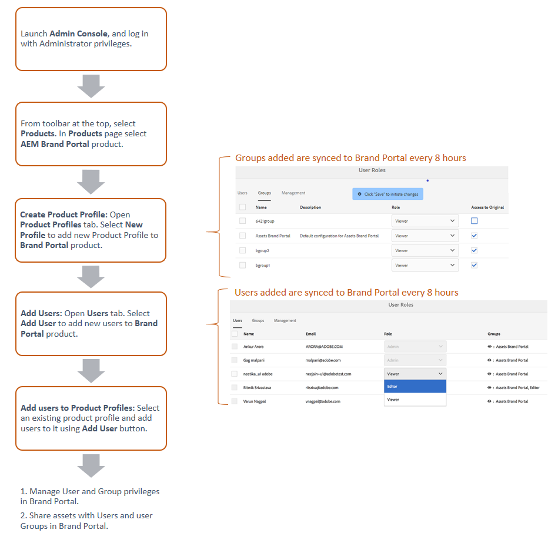

Esses perfis de produtos são sincronizados com a interface do usuário do Brand Portal a cada 8 horas e visíveis como grupos no Brand Portal. Depois de adicionar usuários e criar perfis de produtos e adicionar usuários a esses perfis de produtos, você pode atribuir funções a usuários e grupos no Brand Portal.

>[!NOTE]
>
>Para criar grupos no Brand Portal, no Adobe [!UICONTROL Admin Console], use **[!UICONTROL Produtos > Perfis de produto]**, em vez de **[!UICONTROL Página de usuário > Grupos de usuário]**. Os perfis de produto no Adobe [!UICONTROL Admin Console] são usados para criar grupos no Brand Portal.

## Adicionar um usuário {#add-a-user}

Se você for um administrador de produto, use o Adobe [[!UICONTROL Admin Console]](http://adminconsole.adobe.com/enterprise/overview) para criar usuários e atribuí-los a perfis de produto (*anteriormente conhecido como configurações de produto*), que são exibidos como grupos no Brand Portal. Você pode usar grupos para executar operações em massa, como gerenciamento de função e compartilhamento de ativos.

>[!NOTE]
>
>Os novos usuários que não têm acesso ao Brand Portal podem solicitar acesso pela tela de logon do Brand Portal. Para obter mais informações, consulte [Solicitar acesso ao Brand Portal](../using/brand-portal.md#request-access-to-brand-portal). Depois de receber notificações de solicitação de acesso em sua área de notificação, clique na notificação relevante e em **[!UICONTROL Conceder acesso]**. Como alternativa, siga o link no email de solicitação de acesso recebido. Em seguida, para adicionar um usuário por meio de [Adobe [!UICONTROL Admin Console]](http://adminconsole.adobe.com/enterprise/overview), siga as Etapas 4 a 7 no procedimento abaixo.

>[!NOTE]
>
>Você pode fazer logon no [Adobe [!UICONTROL Admin Console]](http://adminconsole.adobe.com/enterprise/overview) diretamente ou do Brand Portal. Se você fizer logon diretamente, siga as Etapas 4 a 7 no procedimento abaixo para adicionar um usuário.

1. Na barra de ferramentas AEM na parte superior, clique no logotipo Adobe para acessar as ferramentas administrativas.

   

1. No painel Ferramentas administrativas, clique em **[!UICONTROL Usuários]**.

   

1. Na página [!UICONTROL Funções de usuário], clique na guia **[!UICONTROL Gerenciamento]** e, em seguida, clique em **[!UICONTROL Iniciar Admin Console]**.

   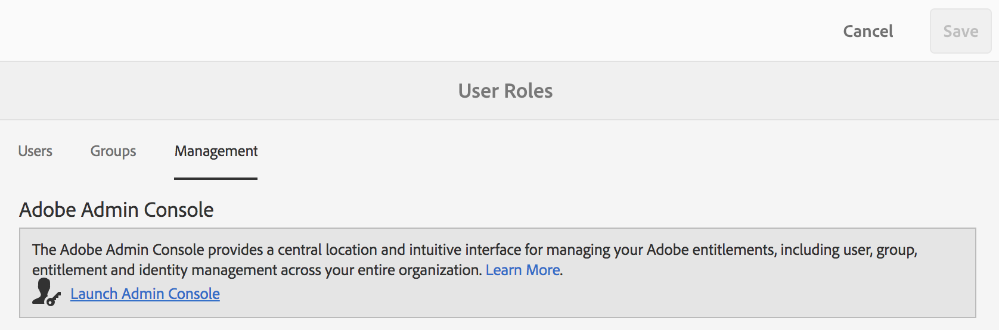

1. No Admin Console, siga um destes procedimentos para criar um novo usuário:

   * Na barra de ferramentas na parte superior, clique em **[!UICONTROL Visão geral]**. Na página [!UICONTROL Visão geral], clique em **[!UICONTROL Atribuir usuários]** no cartão de produto Brand Portal.

   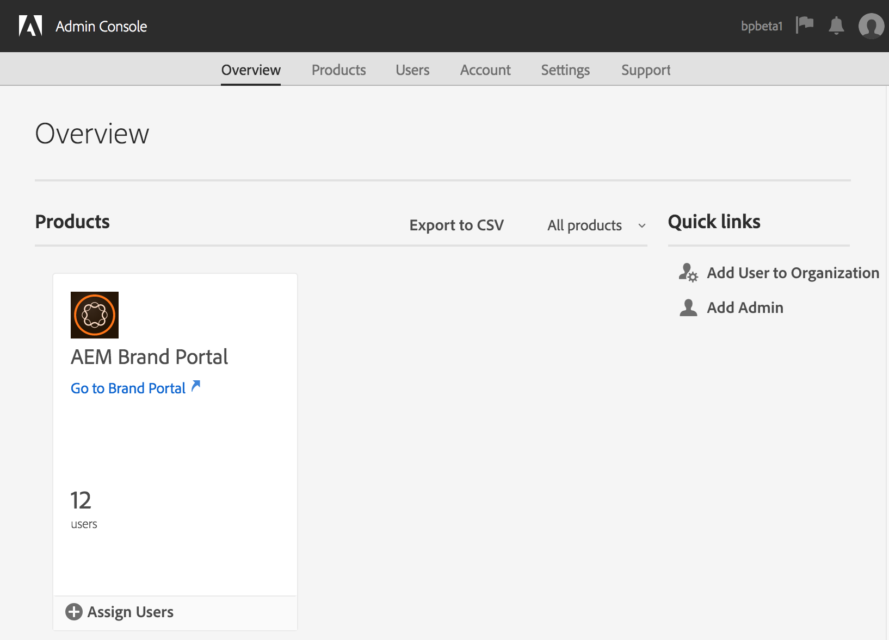

   * Na barra de ferramentas na parte superior, clique em **[!UICONTROL Users]**. Na página [!UICONTROL Users], [!UICONTROL Users] no painel à esquerda é selecionado por padrão. Clique em **[!UICONTROL Adicionar Usuário]**.

   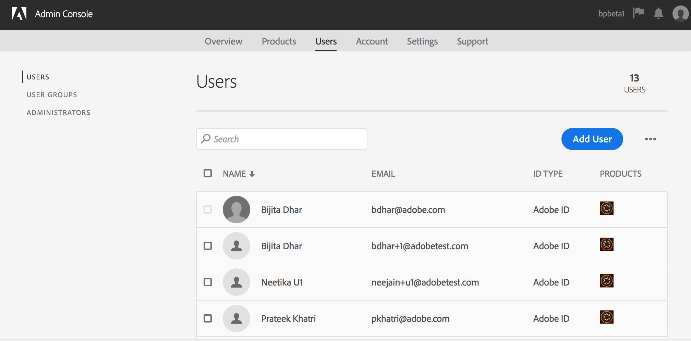

1. Na caixa de diálogo adicionar usuário, digite a ID do email do usuário que você deseja adicionar ou selecione o usuário na lista de sugestões que aparecem à medida que você digita.

   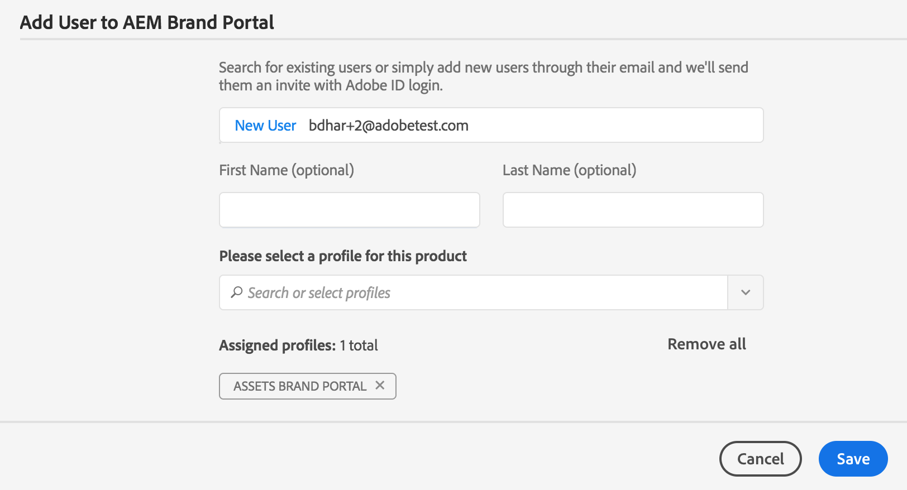

1. Atribua o usuário a pelo menos um perfil de produto (anteriormente conhecido como configurações de produto) para que ele possa acessar o Brand Portal. Selecione o perfil de produto apropriado no campo **[!UICONTROL Selecione um perfil para este produto]**.
1. Clique em **[!UICONTROL Salvar]**. Um email de boas-vindas é enviado ao usuário adicionado. O usuário convidado pode acessar o Brand Portal clicando no link do email de boas-vindas e fazendo logon usando um [!UICONTROL Adobe ID]. Para obter mais informações, consulte [Experiência de login pela primeira vez](../using/brand-portal-onboarding.md).

   >[!NOTE]
   >
   >Se um usuário não conseguir fazer logon no Brand Portal, o Administrador da organização deverá visitar o Adobe [!UICONTROL Admin Console] e verificar se o usuário está presente e foi adicionado a pelo menos um perfil de produto.

   Para obter informações sobre a concessão de privilégios administrativos ao usuário, consulte [Fornecer privilégios de administrador aos usuários](../using/brand-portal-adding-users.md#provideadministratorprivilegestousers).

## Adicionar um perfil de produto {#add-a-product-profile}

Os perfis de produto (conhecidos anteriormente como configurações de produto) no [!UICONTROL Admin Console] são usados para criar grupos no Brand Portal para que você possa realizar operações em massa, como gerenciamento de função e compartilhamento de ativos no Brand Portal. **Brand** Portalis é o perfil de produto padrão disponível; você pode criar mais perfis de produtos e adicionar usuários aos novos perfis de produtos.

>[!NOTE]
>
>Você pode fazer logon no [[!UICONTROL Admin Console]](http://adminconsole.adobe.com/enterprise/overview) diretamente ou do Brand Portal. Se você fizer logon diretamente no [!UICONTROL Admin Console], siga as Etapas 4 a 7 no procedimento abaixo para adicionar um perfil de produto.

1. Na barra de ferramentas AEM na parte superior, clique no logotipo Adobe para acessar as ferramentas administrativas.

   

1. No painel Ferramentas administrativas, clique em **[!UICONTROL Usuários]**.

   

1. Na página [!UICONTROL Funções de usuário], clique na guia **[!UICONTROL Gerenciamento]** e, em seguida, clique em **[!UICONTROL Iniciar Admin Console]**.

   

1. Na barra de ferramentas na parte superior, clique em **[!UICONTROL Produtos]**.
1. Na página [!UICONTROL Products], [!UICONTROL Product Profiles] é selecionado por padrão. Clique em **[!UICONTROL Novo perfil]**.

   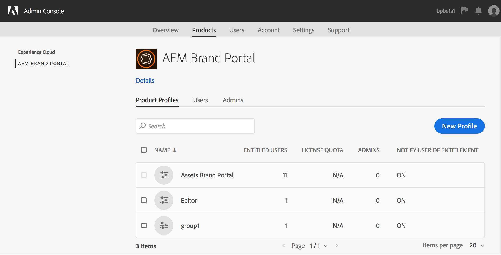

1. Na página [!UICONTROL Criar um novo perfil], forneça o nome do perfil, o nome de exibição, a descrição do perfil e escolha se deseja notificar os usuários por email quando eles forem adicionados ou removidos do perfil.

   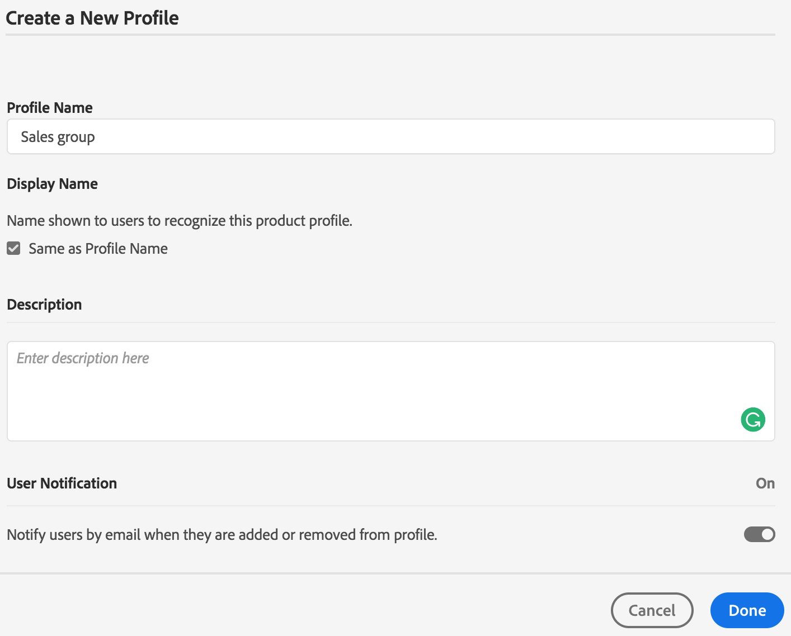

1. Clique em **[!UICONTROL Concluído]**. O grupo de configuração do produto, por exemplo **[!UICONTROL Sales group]**, é adicionado ao Brand Portal.

   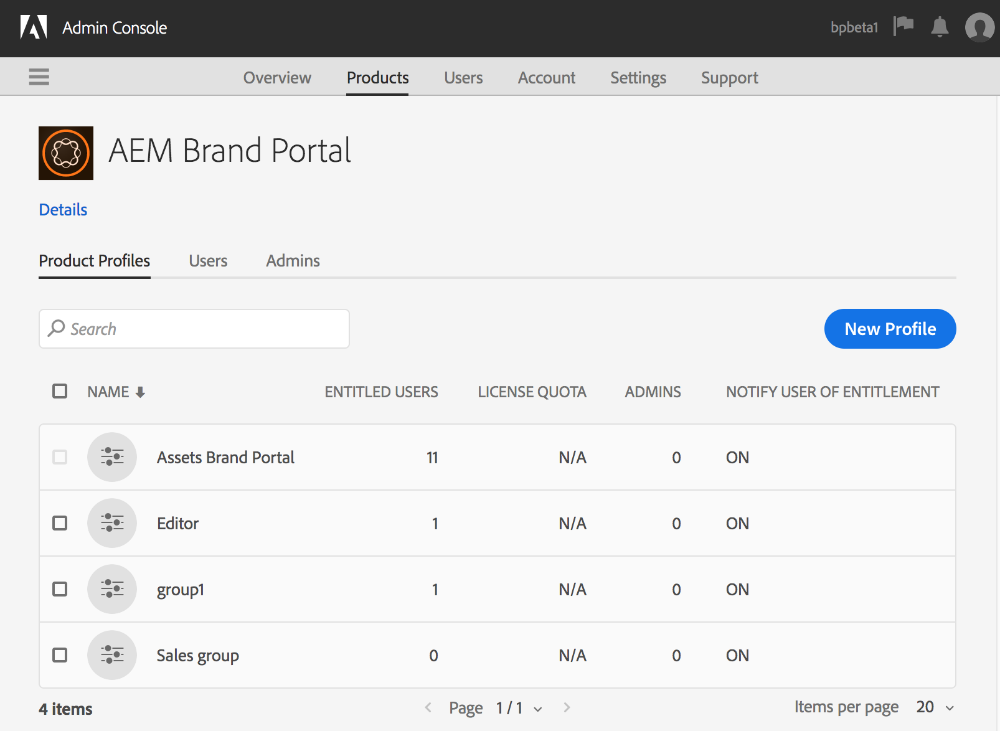

## Adicionar usuários a um perfil de produto {#add-users-to-a-product-profile}

Para adicionar usuários a um grupo do Brand Portal, adicione-os ao perfil de produto correspondente (anteriormente conhecido como configurações de produto) em [!UICONTROL Admin Console]. Você pode adicionar usuários individualmente ou em massa.

>[!NOTE]
>
>Você pode fazer logon no [[!UICONTROL Admin Console]](http://adminconsole.adobe.com/enterprise/overview) diretamente ou do Brand Portal. Se você fizer logon no Admin Console diretamente, siga as Etapas 4 a 7 no procedimento abaixo para adicionar usuários a um perfil de produto.

1. Na barra de ferramentas AEM na parte superior, clique no logotipo Adobe para acessar as ferramentas administrativas.

   

1. No painel Ferramentas administrativas, clique em **[!UICONTROL Usuários]**.

   

1. Na página [!UICONTROL Funções de usuário], clique na guia **[!UICONTROL Gerenciamento]** e, em seguida, clique em **[!UICONTROL Iniciar Admin Console]**.

   ![Lançamento [!DNL Admin Console]](assets/launch_admin_console.png)

1. Na barra de ferramentas na parte superior, clique em **[!UICONTROL Produtos]**.
1. Na página [!UICONTROL Products], [!UICONTROL Product Profiles] é selecionado por padrão. Abra o perfil de produto ao qual deseja adicionar um usuário, por exemplo, [!UICONTROL Grupo de vendas].

   

1. Para adicionar usuários individuais ao perfil do produto, faça o seguinte:

   * Clique em **[!UICONTROL Adicionar Usuário]**.

   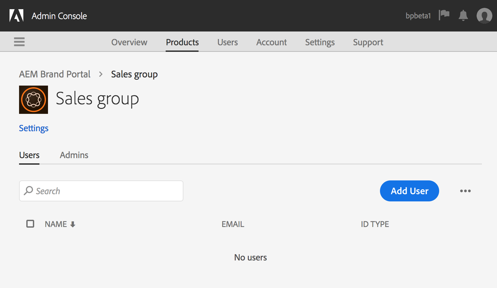

   * Na página [!UICONTROL Adicionar usuário ao grupo de vendas], digite a ID do email do usuário que deseja adicionar ou selecione o usuário na lista de sugestões que aparecem à medida que você digita.

   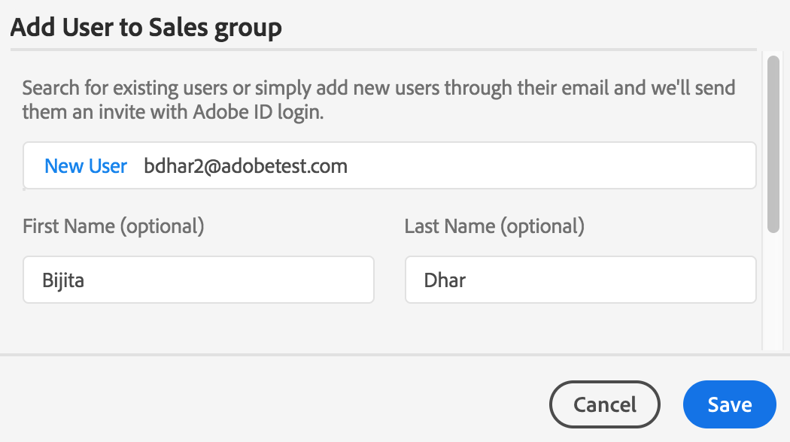

   * Clique em **[!UICONTROL Salvar]**.

1. Para adicionar usuários em massa ao perfil do produto, faça o seguinte:

   * Escolha **[!UICONTROL elipses (...) > Adicionar usuários por CSV]**.

   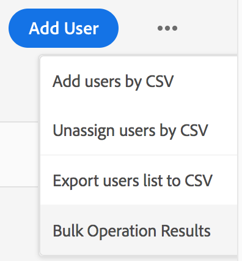

   * Na página **[!UICONTROL Adicionar usuários por CSV]** , baixe um modelo CSV ou arraste e solte um arquivo CSV.

   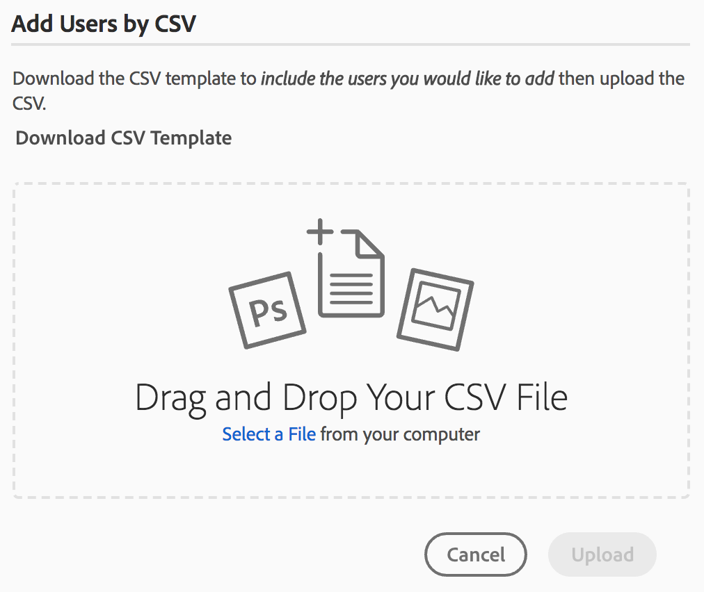

   * Clique em **[!UICONTROL Fazer upload]**.
   Se você adicionou usuários ao perfil de produto padrão, ou seja, Brand Portal, um email de boas-vindas é enviado para a ID de email dos usuários adicionados. Os usuários convidados podem acessar o Brand Portal clicando no link do email de boas-vindas e fazendo logon usando um [!UICONTROL Adobe ID]. Para obter mais informações, consulte [Experiência de login pela primeira vez](../using/brand-portal-onboarding.md).

   Os usuários adicionados a um perfil de produto personalizado ou a um novo não recebem notificações por email.

## Fornecer privilégios de administrador aos usuários {#provide-administrator-privileges-to-users}

Você pode fornecer o privilégio de administrador do sistema ou administrador do produto a um usuário do Brand Portal. Não forneça outros direitos administrativos disponíveis em [!UICONTROL Admin Console], como administrador de perfil de produto, administrador de grupo de usuários e administrador de suporte. Para saber mais sobre essas funções, consulte [Funções administrativas](https://helpx.adobe.com/enterprise/using/admin-roles.html).

>[!NOTE]
>
>Você pode fazer logon no [[!UICONTROL Admin Console]](https://adminconsole.adobe.com/enterprise/overview) diretamente ou do Brand Portal. Se você fizer logon diretamente no [!UICONTROL Admin Console], siga as Etapas 4 a 8 no procedimento abaixo para adicionar um usuário a um perfil de produto.

1. Na barra de ferramentas AEM na parte superior, clique no logotipo Adobe para acessar as ferramentas administrativas.

   

1. No painel Ferramentas administrativas, clique em **[!UICONTROL Usuários]**.

   

1. Na página [!UICONTROL Funções de usuário], clique na guia **[!UICONTROL Gerenciamento]** e, em seguida, clique em **[!UICONTROL Iniciar Admin Console]**.

   

1. Na barra de ferramentas na parte superior, clique em **[!UICONTROL Users]**.
1. Na página [!UICONTROL Users], [!UICONTROL Users] no painel à esquerda é selecionado por padrão. Clique no nome de usuário para o qual você deseja fornecer privilégios de administrador.

   

1. Na página de perfil do usuário, localize a seção **[!UICONTROL Direitos administrativos]** na parte inferior e escolha **[!UICONTROL reticências (...) > Editar direitos administrativos]**.
   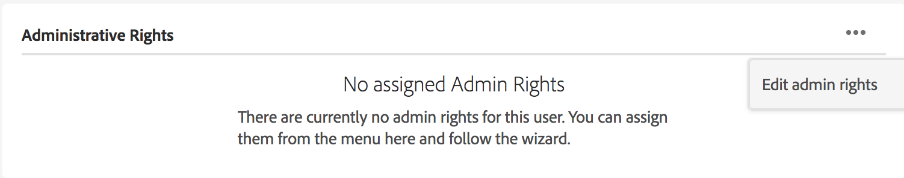

1. Na página [!UICONTROL Editar Admin], selecione Administrador do Sistema ou Administrador do Produto.

   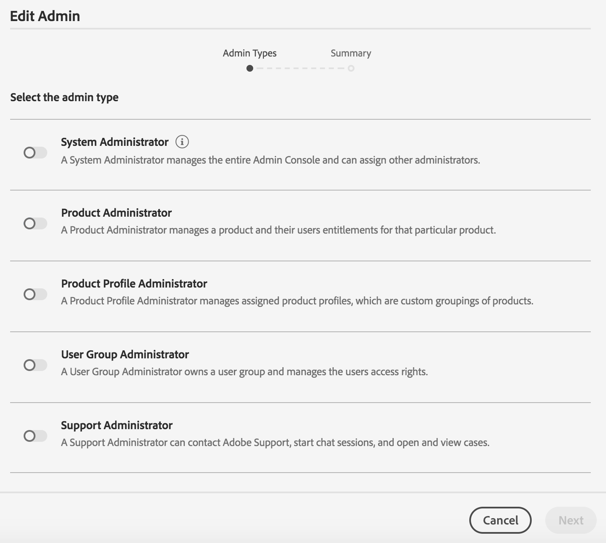

   >[!NOTE]
   >
   >O Brand Portal suporta apenas as funções Administrador do Sistema e Administrador do Produto.
   >
   >O Adobe recomenda evitar o uso da função Administrador do sistema, pois concede privilégios de administrador em toda a organização para todos os produtos de uma organização. Por exemplo, um administrador de sistema de uma organização que inclui três produtos da Marketing Cloud tem todo o conjunto de privilégios para os três produtos. Somente um Administrador do sistema pode configurar o AEM Assets para que os ativos possam ser publicados do AEM Assets para o Brand Portal. Para obter mais informações, consulte [Configurar o AEM Assets com Brand Portal](../using/configure-aem-assets-with-brand-portal.md).
   >
   >Por outro lado, a função Administrador de produto concede privilégios de administrador somente para um produto específico. Se quiser impor um controle de acesso mais granular no Brand Portal, use a função Administrador de produto e selecione o produto como Brand Portal.

   >[!NOTE]
   >
   >A Brand Portal não oferece suporte aos privilégios de administrador do perfil do produto (anteriormente conhecido como administrador de configuração). Evite atribuir direitos de administrador de perfil de produto a um usuário.

1. Revise a seleção do tipo de administrador e clique em **[!UICONTROL Salvar]**.

   >[!NOTE]
   >
   >Para revogar privilégios de administrador para um usuário, faça as alterações apropriadas na página **[!UICONTROL Editar Admin]** e clique em **[!UICONTROL Salvar]**.

## Gerenciar funções de usuário {#manage-user-roles}

Um Administrador pode modificar funções para usuários no Brand Portal.

Além da função Administrador, o Brand Portal oferece suporte às seguintes funções:

* [!UICONTROL Visualizador]: Os usuários com essa função podem visualizar os arquivos e pastas que um Administrador compartilha com eles. Os visualizadores também podem pesquisar e baixar ativos. No entanto, os visualizadores não podem compartilhar conteúdo (arquivos, pastas, [!UICONTROL coleções]) com outros usuários.
* [!UICONTROL Editor]: Os usuários com essa função têm todos os privilégios de um Visualizador. Além disso, os Editores podem compartilhar conteúdo (pastas, [!UICONTROL coleções], links) com outros usuários.

1. Na barra de ferramentas AEM na parte superior, clique no logotipo Adobe para acessar as ferramentas administrativas.

   

1. No painel Ferramentas administrativas, clique em **[!UICONTROL Usuários]**.

   

1. Na página [!UICONTROL User Roles], a guia [!UICONTROL Users] é selecionada por padrão. Para o usuário cuja função você deseja alterar, selecione **[!UICONTROL Editor]** ou **[!UICONTROL Visualizador]** no menu suspenso **[!UICONTROL Função]**.

   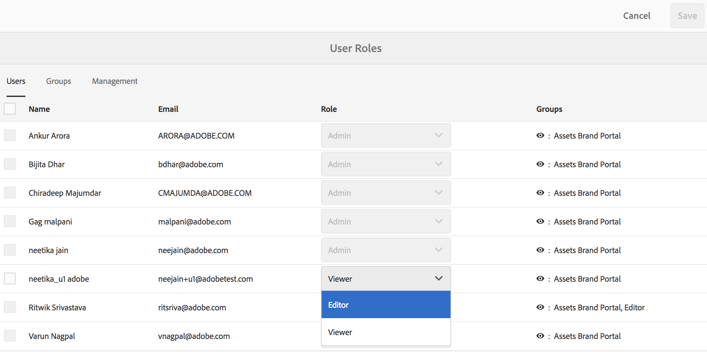

   Para modificar a função de vários usuários simultaneamente, selecione os usuários e escolha a função apropriada no menu suspenso **[!UICONTROL Role]**.

   >[!NOTE]
   >
   >A lista de [!UICONTROL Função] para usuários do Administrador está desabilitada. Não é possível selecionar esses usuários para modificar suas funções.

   >[!NOTE]
   >
   >A função de usuário também será desativada se o usuário for membro do grupo Editor . Para revogar privilégios de edição do usuário, remova o usuário do grupo Editor ou altere a função do grupo inteiro para Visualizador.

1. Clique em **[!UICONTROL Salvar]**. A função é modificada para o usuário correspondente. Se você selecionou vários usuários, as funções de todos os usuários serão modificadas simultaneamente.

   >[!NOTE]
   >
   >As alterações nas permissões do usuário são refletidas na página **[!UICONTROL Funções do usuário]** somente depois que os usuários fazem logon novamente no Brand Portal.

## Gerenciar funções e privilégios de grupo {#manage-group-roles-and-privileges}

Um Administrador pode associar privilégios específicos a um [grupo](../using/brand-portal-adding-users.md#main-pars-title-278567577) de usuários no Brand Portal. A guia **[!UICONTROL Groups]** na página **[!UICONTROL User Roles]** permite que os administradores:

* Atribuir funções a grupos de usuários
* Restrinja grupos de usuários para baixar representações originais de arquivos de imagem (.jpeg, .tiff, .png, .bmp, .gif, .pjpeg, x-portable-anymap, x-portable-bitmap, x-portable-graymap, x-portable-pixmap, x-rgb, x-xbitmap, x-xpixmap, x-icon, imagem/photoshop, imagem/x-photoshop , .psd, image/vnd.adobe.photoshop) do Brand Portal.

>[!NOTE]
>
>Para os ativos compartilhados como o link, a permissão para acessar representações originais de arquivos de imagem será aplicada com base nas permissões do usuário que está compartilhando os ativos.

Para modificar a função e o direito de acessar representações originais para membros de grupos específicos, siga estas etapas:

1. Na página **[!UICONTROL Funções de usuário]**, navegue até a guia **[!UICONTROL Grupos]**.
1. Selecione os grupos para os quais você deseja alterar funções.
1. Selecione a função apropriada na lista suspensa **[!UICONTROL Role]**.

   Para permitir que os membros de um grupo tenham acesso a representações originais de arquivos de imagem (.jpeg, .tiff, .png, .bmp, .gif, .pjpeg, x-portable-anymap, x-portable-bitmap, x-portable-graymap, x-portable-pixmap, x-rgb, x-xbitmap, x-xpixmap, x-icon, imagem/photoshop, / x-photoshop, .psd, image/vnd.adobe.photoshop) que eles baixam do portal ou link compartilhado, mantenha a opção **[!UICONTROL Acesso ao original]** selecionada para esse grupo. Por padrão, a opção **[!UICONTROL Access to Original]** é selecionada para todos os usuários. Para impedir que um grupo de usuários acesse representações originais, desmarque a opção correspondente a esse grupo.

   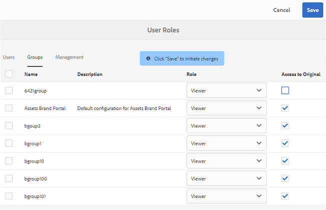

   >[!NOTE]
   >
   >Se um usuário for adicionado a vários grupos e um desses grupos tiver restrições, as restrições serão aplicadas a esse usuário.
   >
   >Além disso, as restrições para acessar representações originais de arquivos de imagem não se aplicam a administradores mesmo que sejam membros de grupos restritos.

1. Clique em **[!UICONTROL Salvar]**. A função é modificada para os grupos correspondentes.

   >[!NOTE]
   >
   >A associação usuário-grupo, ou a associação de grupo de um usuário, é sincronizada com o Brand Portal a cada 8 horas. As alterações nas funções de usuário ou grupo são efetivas após a próxima execução do trabalho de sincronização.
