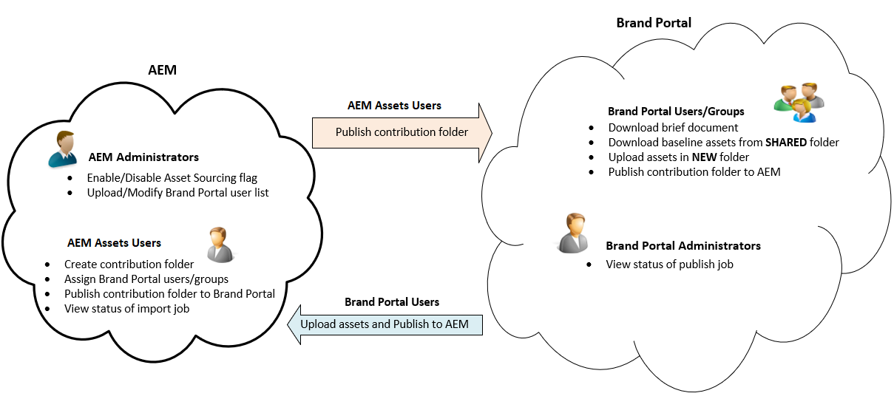

# Visão geral da Fonte de ativos {#overview-asset-sourcing-in-bp}

**A Fonte** de ativos permite que usuários do AEM (administradores/usuários não administradores) criem novas pastas com uma propriedade de contribuição **de** ativos adicional, garantindo que a nova pasta criada seja aberta para envio de ativos por usuários do Brand Portal. Isso aciona automaticamente um fluxo de trabalho que cria duas subpastas adicionais, chamadas de **COMPARTILHADO** e **NOVO**, na pasta recém-criada **Contribuição** . O administrador do AEM define o requisito fazendo upload de um resumo sobre os tipos de ativos que devem ser adicionados à pasta de contribuição, bem como de um conjunto de ativos de linha de base, à pasta **SHARED** para garantir que os usuários da BP tenham as informações de referência de que precisam. O administrador pode conceder aos usuários ativos do Brand Portal acesso à pasta de contribuição antes de publicar a pasta recém-criada **Contribuição** no Brand Portal. Quando o usuário terminar de adicionar conteúdo na pasta **NEW** , poderá publicar a pasta de contribuição de volta no ambiente do autor do AEM. Observe que pode levar alguns minutos para concluir a importação e refletir o conteúdo recém-publicado nos ativos AEM.

Além disso, toda a funcionalidade existente permanece inalterada. Os usuários do Brand Portal podem exibir, pesquisar e baixar ativos da pasta de contribuição, bem como de outras pastas permitidas. E os administradores podem compartilhar ainda mais a pasta de contribuição, modificar as propriedades e adicionar ativos às coleções.

>[!VIDEO](https://video.tv.adobe.com/v/29365/?quality=12&captions=por_br)

>[!NOTE]
>
>A Seleção de recursos no Brand Portal é compatível com o AEM 6.5.2.0 e superior.
>
>O recurso não é suportado nas versões anteriores - AEM 6.3 e AEM 6.4.
>
>Entre em contato com o suporte da Adobe para atualizar sua instância do AEM para a versão mais recente do AEM compatível.

## Pré-requisitos {#prerequisites}

* AEM 6.5.0.2 ou superior.
* Certifique-se de que sua instância do AEM Assets esteja integrada ao Brand Portal. Consulte [Configurar a integração do AEM Assets com o Brand Portal](https://helpx.adobe.com/experience-manager/6-5/assets/using/brand-portal-configuring-integration.html).

## Consulte também:{#reference-articles}

**Para administradores**

* [Configurar fonte de ativos no AEM](brand-portal-configure-asset-sourcing.md)
* [Carregar lista de usuários do Brand Portal](brand-portal-configure-asset-sourcing.md)
* [Configurar pasta de contribuição](brand-portal-contribution-folder.md)
* [Carregar ativos da linha de base para a pasta de contribuição](brand-portal-upload-baseline-assets.md)
* [Publicar pasta de contribuição no Brand Portal](brand-portal-publish-contribution-folder-to-brand-portal.md)

**Para usuários do Brand Portal**

* [Baixar requisitos de ativos](brand-portal-download-asset-requirements.md)
* [Carregar novos ativos para a pasta de contribuição](brand-portal-upload-assets-to-contribution-folder.md)
* [Publicar pasta de contribuição nos ativos AEM](brand-portal-publish-contribution-folder-to-aem-assets.md)
