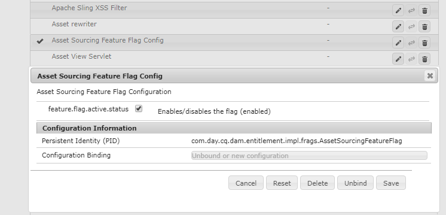
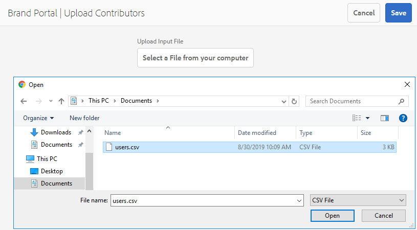

# Visão geral da origem dos ativos {#overview-asset-sourcing-in-bp}

**A** origem do ativo permite que os usuários do AEM (administradores/usuários não administradores) criem novas pastas com uma propriedade adicional  **de** contribuição do ativo, garantindo que a nova pasta criada seja aberta para o envio de ativos pelos usuários do Brand Portal. Isso aciona automaticamente um workflow que cria duas subpastas adicionais, chamadas **SHARED** e **NEW**, na pasta recém-criada **Contribution**. O administrador do AEM então define o requisito fazendo o upload de um resumo sobre os tipos de ativos que devem ser adicionados à pasta de contribuição, bem como um conjunto de ativos da linha de base, à pasta **SHARED** para garantir que os usuários da BP tenham as informações de referência necessárias. O administrador pode conceder aos usuários ativos do Brand Portal acesso à pasta de contribuição antes de publicar a pasta recém-criada **Contribuição** no Brand Portal. Quando o usuário terminar de adicionar conteúdo na pasta **NEW**, ele poderá publicar a pasta de contribuição de volta no ambiente do autor do AEM. Observe que pode levar alguns minutos para concluir a importação e refletir o conteúdo recém-publicado no AEM Assets.

Além disso, todas as funcionalidades existentes permanecem inalteradas. Os usuários do Brand Portal podem visualizar, pesquisar e baixar ativos da pasta de contribuição, bem como das outras pastas permitidas. Além disso, os administradores podem compartilhar a pasta de contribuição, modificar as propriedades e adicionar ativos às coleções.

>[!VIDEO](https://video.tv.adobe.com/v/29365/?quality=12)

## Pré-requisitos {#prerequisites}

* AEM Assets como uma instância do Cloud Service, AEM Assets 6.5.2 ou superior.
* Certifique-se de que a instância do AEM Assets esteja configurada com o Brand Portal. Consulte [Configurar o AEM Assets com Brand Portal](../using/configure-aem-assets-with-brand-portal.md).

<!--
* Ensure that your Brand Portal tenant is configured with one AEM Assets author instance.
-->

>[!NOTE]
>
>O recurso de origem dos ativos é ativado por padrão no AEM Assets as a Cloud Service, AEM Assets 6.5.9 e superior.
>
>As configurações existentes continuarão a funcionar nas versões anteriores.

>[!NOTE]
>
>Há um problema conhecido no AEM Assets 6.5.4. Os usuários do Brand Portal não podem publicar os ativos da pasta de contribuição no AEM Assets ao atualizar para o Adobe Developer Console.
>
>O problema é corrigido no AEM 6.5.5. Você pode atualizar sua instância do AEM Assets para o service pack mais recente AEM 6.5.5 e [atualizar suas configurações](https://docs.adobe.com/content/help/pt-BR/experience-manager-65/assets/brandportal/configure-aem-assets-with-brand-portal.html#upgrade-integration-65) no Console do Desenvolvedor do Adobe.
>
>Para uma correção imediata no AEM 6.5.4, é recomendável [baixar o hotfix](https://www.adobeaemcloud.com/content/marketplace/marketplaceProxy.html?packagePath=/content/companies/public/adobe/packages/cq650/hotfix/cq-6.5.0-hotfix-33041) e instalar na instância do autor.

<!--
## Configure Asset Sourcing {#configure-asset-sourcing}

**Asset Sourcing** is configured from within the AEM Assets author instance. The administrators can enable the Asset Sourcing feature flag configuration from the **AEM Web Console Configuration** and upload the active Brand Portal users list in **AEM Assets**.

>[!NOTE]
>
>Asset Sourcing is by default enabled on AEM Assets as a Cloud Service. The AEM administrator can directly upload the active Brand Portal users to allow them access to the Asset Sourcing feature.

>[!NOTE]
>
>Before you begin with the configuration, ensure that your AEM Assets instance is configured with Brand Portal. See, [Configure AEM Assets with Brand Portal](../using/configure-aem-assets-with-brand-portal.md). 

The following video demonstrates, how to configure Asset Sourcing on your AEM Assets author instance:

>[!VIDEO](https://video.tv.adobe.com/v/29771)
-->

<!--
### Enable Asset Sourcing {#enable-asset-sourcing}

AEM administrators can enable the Asset Sourcing feature flag from within the AEM Web Console Configuration (a.k.a Configuration Manager).

>[!NOTE]
>
>This step is not applicable for AEM Assets as a Cloud Service.

**To enable Asset Sourcing:**
1. Log in to your AEM Assets author instance and open Configuration Manager. 
Default URL: http:// localhost:4502/system/console/configMgr.
1. Search using the keyword **Asset Sourcing** to locate **[!UICONTROL Asset Sourcing Feature Flag Config]**.
1. Click **[!UICONTROL Asset Sourcing Feature Flag Config]** to open the configuration window.
1. Select the **[!UICONTROL feature.flag.active.status]** check box.
1. Click **[!UICONTROL Save]**.

-->

### Fazer upload da lista de usuários do Brand Portal {#upload-bp-user-list}

AEM administradores podem fazer upload do arquivo de configuração de usuário (.csv) do Brand Portal que contém a lista de usuários ativos do Brand Portal no AEM Assets para permitir o acesso ao recurso de origem dos ativos.

Uma pasta de contribuição só pode ser compartilhada com os usuários ativos da Brand Portal definidos na lista de usuários. O administrador também pode adicionar novos usuários no arquivo de configuração e fazer upload da lista de usuários modificada.

>[!NOTE]
>
>Certifique-se de que a instância do AEM Assets esteja configurada com o Brand Portal. Consulte [Configurar o AEM Assets com Brand Portal](../using/configure-aem-assets-with-brand-portal.md).

>[!NOTE]
>
>O formato do arquivo CSV é o mesmo que o compatível no Admin Console para importação de usuários em massa. Email, nome e sobrenome são obrigatórios.

Os administradores podem adicionar novos usuários AEM Admin Console, consulte [Gerenciar usuários](brand-portal-adding-users.md) para obter informações detalhadas. Após adicionar usuários no Admin Console, eles podem ser adicionados ao arquivo de configuração do usuário do Brand Portal e, em seguida, atribuídos permissão para acessar a pasta de contribuição.

**Para fazer upload da lista de usuários do Brand Portal:**
1. Faça logon na instância do AEM Assets.
1. No painel **Ferramentas**, navegue até **[!UICONTROL Ativos]** > **[!UICONTROL Usuários do Brand Portal]**.

1. A janela Brand Portal Upload Contributors é aberta.
Navegue pelo computador local e faça o upload do arquivo **configuration (.csv)** contendo a lista de usuários ativos do Brand Portal.
1. Clique em **[!UICONTROL Salvar]**.

   

Os administradores podem fornecer acesso a usuários específicos nesta lista de usuários enquanto configuram uma pasta de contribuição. Somente os usuários atribuídos a uma pasta de contribuição terão acesso à pasta de contribuição e publicarão ativos do Brand Portal na AEM Assets.

## Consulte também:{#reference-articles}

* [Configurar e publicar a pasta de contribuição no Brand Portal](brand-portal-publish-contribution-folder-to-brand-portal.md)

* [Publicar a pasta de contribuição no AEM Assets](brand-portal-publish-contribution-folder-to-aem-assets.md)
