# Personalizar papel de parede, cabeçalho e mensagem de email {#customize-wallpaper-header-and-email-message}

Os administradores do Brand Portal podem fazer personalizações limitadas na interface exibida para os usuários. Você pode escolher uma imagem de plano de fundo específica (wallpaper) para a página de logon do Brand Portal. Você também pode adicionar uma imagem de cabeçalho e personalizar e-mails de compartilhamento de ativos para corresponder à marca do cliente.

## Personalizar o wallpaper da tela de login {#customize-the-login-screen-wallpaper}

Na ausência de uma imagem de wallpaper personalizada, um wallpaper padrão é exibido na página de login.

1. Na barra de ferramentas do AEM na parte superior, clique no logotipo da Adobe para acessar as ferramentas administrativas.

   

1. No painel de ferramentas administrativas, clique em **[!UICONTROL Marca]**.

   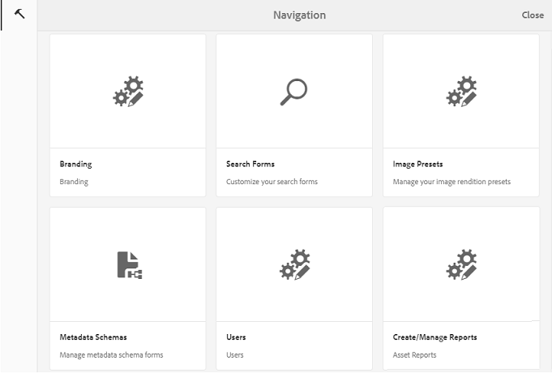

1. No painel esquerdo da página [!UICONTROL Configurar marca] , o [!UICONTROL wallpaper] é selecionado por padrão. A imagem de plano de fundo padrão que aparece na página de login é exibida.

   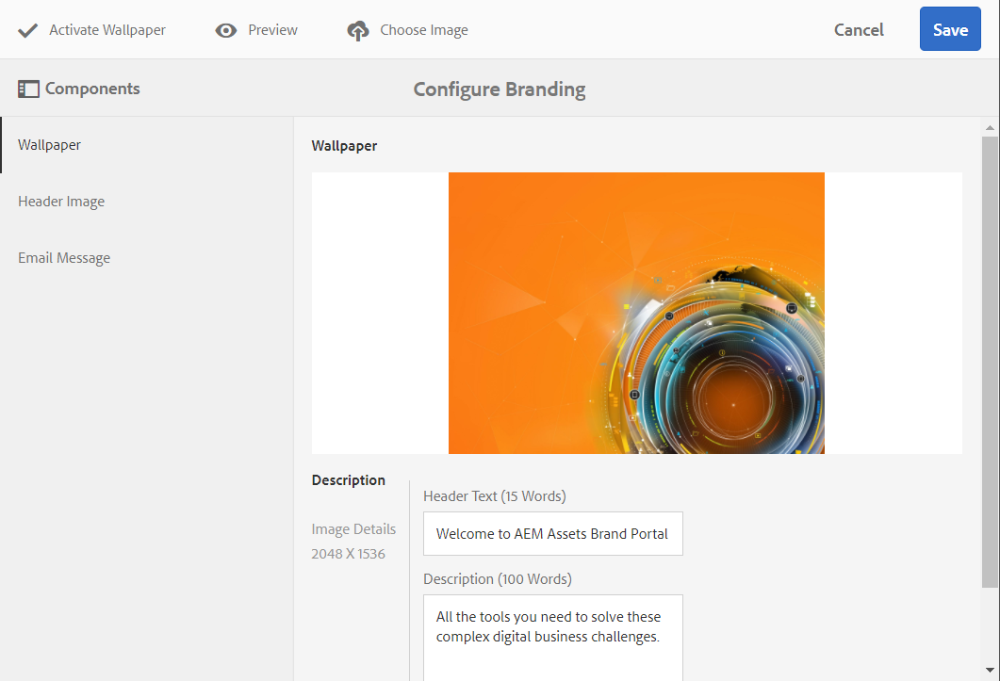

1. Para adicionar uma nova imagem de plano de fundo, clique no ícone **[!UICONTROL Escolher imagem]** na barra de ferramentas na parte superior.

   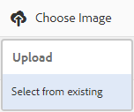

   Faça uma das seguintes opções:

   * Para carregar uma imagem do seu computador, clique em **[!UICONTROL Carregar]**. Navegue até a imagem desejada e faça upload dela.
   * Para usar uma imagem existente do Brand Portal, clique em **[!UICONTROL Selecionar existente]**. Escolha uma imagem usando o seletor de ativos.
   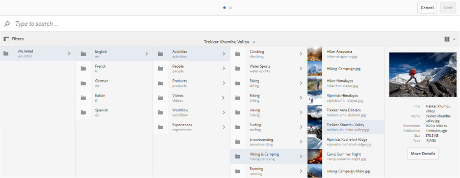

1. Especifique um texto de cabeçalho e uma descrição para a imagem de plano de fundo. Para salvar as alterações, clique em **[!UICONTROL Salvar]** na barra de ferramentas na parte superior.

1. Na barra de ferramentas na parte superior, clique no ícone **[!UICONTROL Visualizar]** para gerar uma visualização da interface do Brand Portal com a imagem.

   

   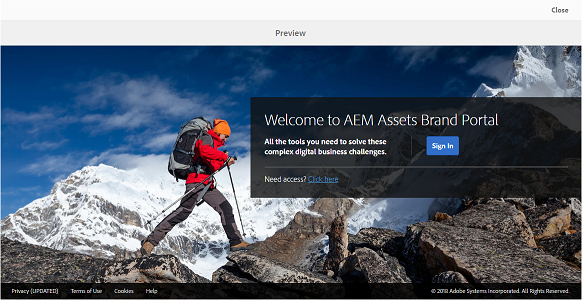

1. Para ativar ou desativar o wallpaper padrão, faça o seguinte na página **[!UICONTROL Configurar marca &gt; Wallpaper]** :

   * Para exibir a imagem padrão do wallpaper na página de logon do Brand Portal, clique em **[!UICONTROL Desativar o Wallpaper]** na barra de ferramentas na parte superior. Uma mensagem confirma que a imagem personalizada está desativada.
   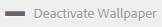

   * Para restaurar a imagem personalizada na página de logon do Brand Portal, clique em **[!UICONTROL Ativar o Wallpaper]** na barra de ferramentas. Uma mensagem confirma que a imagem foi restaurada.
   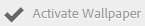

   * Click **[!UICONTROL Save]** to save the changes.

## Personalizar o cabeçalho {#customize-the-header}

O cabeçalho é exibido em várias páginas do Brand Portal depois que você faz logon no Brand Portal.

1. Na barra de ferramentas do AEM na parte superior, clique no logotipo da Adobe para acessar as ferramentas administrativas.

   

1. No painel de ferramentas administrativas, clique em **[!UICONTROL Marca]**.

   

1. Para personalizar o cabeçalho da página para a interface do Brand Portal, na página [!UICONTROL Configurar marca] , selecione Imagem **[!UICONTROL do]** cabeçalho no painel esquerdo. A imagem do cabeçalho padrão é exibida.

   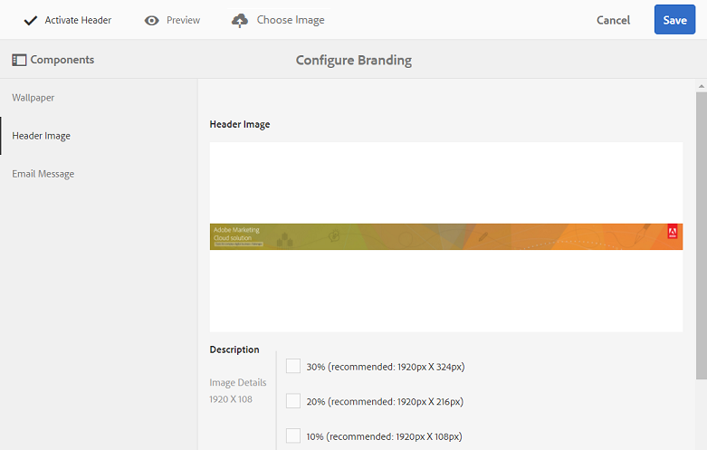

1. Para carregar uma imagem de cabeçalho, clique no ícone **[!UICONTROL Escolher imagem]** e escolha **[!UICONTROL Carregar]**.

   Para usar uma imagem existente do Brand Portal, escolha **[!UICONTROL Selecionar do existente]**.

   

   Escolha uma imagem usando o seletor de ativos.

   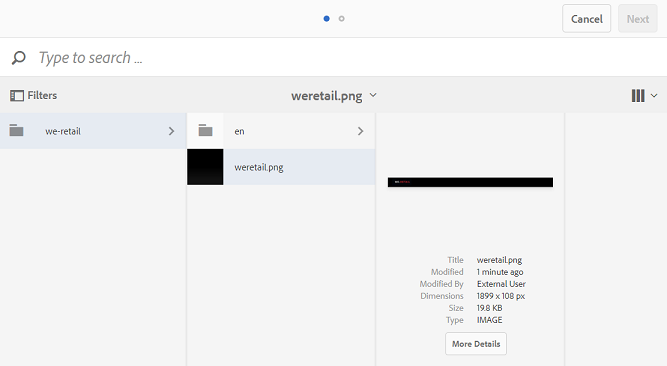

1. Para incluir um URL na imagem do cabeçalho, especifique-o na caixa URL [!UICONTROL da] imagem. Você pode especificar URLs externos ou internos. Os links internos também podem ser links relativos, por exemplo,
   [!UICONTROL `/mediaportal.html/content/dam/mac/tenant_id/tags`].
Esse link direciona os usuários para a pasta de tags.
Para salvar as alterações, clique em **[!UICONTROL Salvar]** na barra de ferramentas na parte superior.

   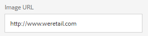

1. Na barra de ferramentas na parte superior, clique no ícone **[!UICONTROL Visualizar]** para gerar uma visualização da interface do Brand Portal com a imagem do cabeçalho.

   
   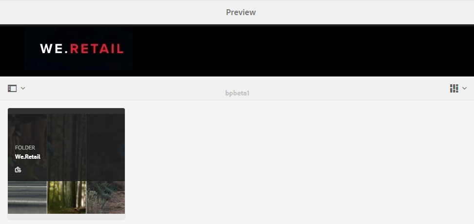

1. Para ativar ou desativar a imagem do cabeçalho, faça o seguinte na página **[!UICONTROL Configurar marca &gt; Imagem]** do cabeçalho:

   * Para impedir que uma imagem de cabeçalho apareça nas páginas do Brand Portal, clique em **[!UICONTROL Desativar cabeçalho]** na barra de ferramentas na parte superior. Uma mensagem confirma que a imagem está desativada.
   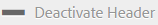

   * Para fazer a imagem do cabeçalho reaparecer nas páginas do Brand Portal, clique em **[!UICONTROL Ativar cabeçalho]** na barra de ferramentas na parte superior. Uma mensagem confirma que a imagem está ativada.
   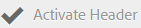

   * Click **[!UICONTROL Save]** to save the changes.

## Personalizar as mensagens de email {#customize-the-email-messaging}

Quando os ativos são compartilhados como um link, os usuários recebem um email contendo o link. Os administradores podem personalizar as mensagens, ou seja, o logotipo, a descrição e o rodapé desses emails.

1. Na barra de ferramentas do AEM na parte superior, clique no logotipo da Adobe para acessar as ferramentas administrativas.

   

1. No painel de ferramentas administrativas, clique em **[!UICONTROL Marca]**.

   

1. Quando os ativos são compartilhados como links ou baixados por email e quando [!UICONTROL as coleções] são compartilhadas, as notificações por email são enviadas aos usuários. Para personalizar a mensagem de email, na página [!UICONTROL Configurar marca] , selecione Mensagem **[!UICONTROL de]** email no painel esquerdo.

   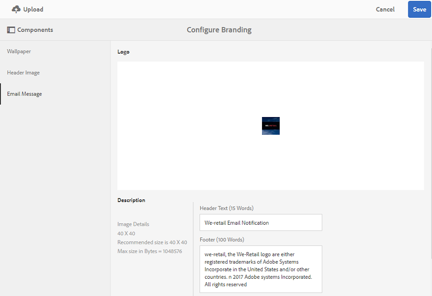

1. Para adicionar um logotipo a emails de saída, clique em **[!UICONTROL Carregar]** na barra de ferramentas na parte superior.

1. Na seção [!UICONTROL Descrição] , especifique o cabeçalho e o texto do rodapé do email. Para salvar as alterações, clique em **[!UICONTROL Salvar]** na barra de ferramentas na parte superior.

   >[!NOTE]
   >
   >Se você não usar o tamanho recomendado para o logotipo, ou se o texto do cabeçalho e do rodapé exceder a contagem de palavras recomendada, o conteúdo da mensagem de email pode parecer distorcido.
