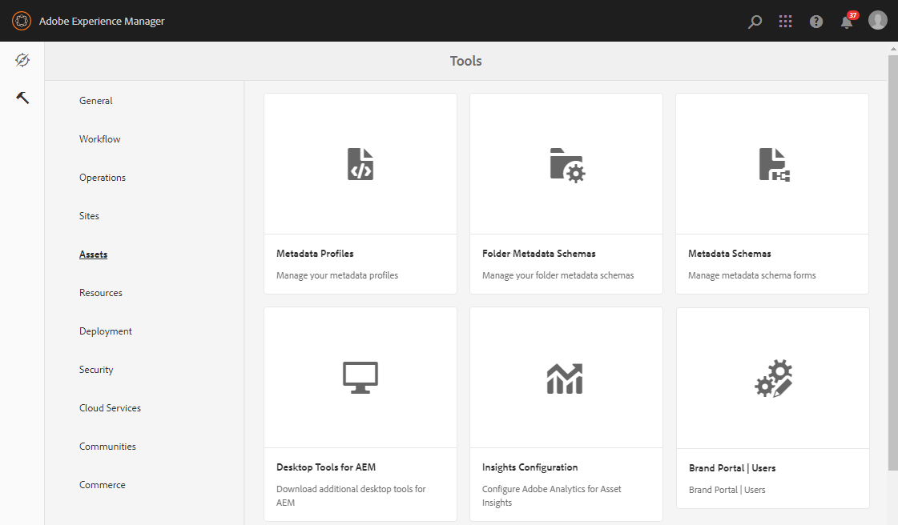

# Configurar origem de ativos {#configure-asset-sourcing}

AEM administradores podem configurar **Origem de ativos** a partir da instância do autor AEM. O administrador habilita a configuração do sinalizador do recurso Origem de ativos de **AEM Configuração do Console Web** e carrega a lista ativa de usuários do Portal de marcas em **AEM Assets**.

>[!NOTE]
>
>Antes de começar com a configuração, verifique se a instância do AEM Assets está configurada com o Brand Portal. Consulte, [Configurar o AEM Assets com o Brand Portal](../using/configure-aem-assets-with-brand-portal.md).

O vídeo a seguir demonstra como configurar a origem do ativo na instância do autor do AEM:

>[!VIDEO](https://video.tv.adobe.com/v/29771)

## Habilitar Origem de Ativos {#enable-asset-sourcing}

Os administradores AEM podem ativar a Origem de ativos na AEM Configuração do console da Web (também conhecido como Gerenciador de configuração).

**Para ativar a Seleção de fornecedor de ativos:**
1. Faça logon na instância do autor AEM e abra o Configuration Manager
URL padrão: http:// localhost:4502/system/console/configMgr
1. Pesquise usando a palavra-chave **Origem de ativos** para localizar **[!UICONTROL Configuração do sinalizador de recurso de origem de ativos]**
1. Clique em **[!UICONTROL Configuração do sinalizador do recurso de origem de ativos]** para abrir a janela de configuração
1. Marque a caixa de seleção **[!UICONTROL feature.flag.ative.status]**.
1. Clique em **[!UICONTROL Salvar]**.

## Carregar lista de usuários do Brand Portal {#upload-bp-user-list}

Os administradores AEM podem carregar o arquivo de configuração de usuário (.csv) do Brand Portal que contém a lista de usuário ativa do Brand Portal no AEM Assets. Uma pasta de contribuição só pode ser compartilhada com os usuários ativos do Brand Portal definidos na lista do usuário. O administrador também pode adicionar novos usuários ao arquivo de configuração e fazer upload da lista de usuário modificada.

>[!NOTE]
>
>O formato do arquivo CSV é o mesmo que o suportado no Admin Console para a importação de usuários em massa. Email, nome e sobrenome são obrigatórios.

O administrador pode adicionar novos usuários AEM Admin Console, consulte [Gerenciar usuários](brand-portal-adding-users.md) para obter informações detalhadas. Depois de adicionar usuários ao Admin Console, esses usuários podem ser adicionados ao arquivo de configuração do usuário do Brand Portal e, em seguida, recebem permissão para acessar a pasta de contribuição.

**Para fazer upload da lista de usuários do Brand Portal:**
1. Faça logon na sua instância AEM autor
URL padrão: http:// localhost:4502/aem/start.html
1. No painel **Ferramentas**, navegue até **[!UICONTROL Ativos > Usuários do Brand Portal]**

   

1. A janela Colaboradores de Upload do Portal de Marcas é aberta.
Procure no computador local e carregue o arquivo **configuration (.csv)** que contém a lista ativa de usuários do Brand Portal.
1. Clique em **[!UICONTROL Salvar]**.

   

Os administradores podem fornecer acesso a usuários específicos desta lista de usuário ao configurar a pasta de contribuição.

Para obter mais informações, consulte [Configurar pasta de contribuição](brand-portal-contribution-folder.md).
