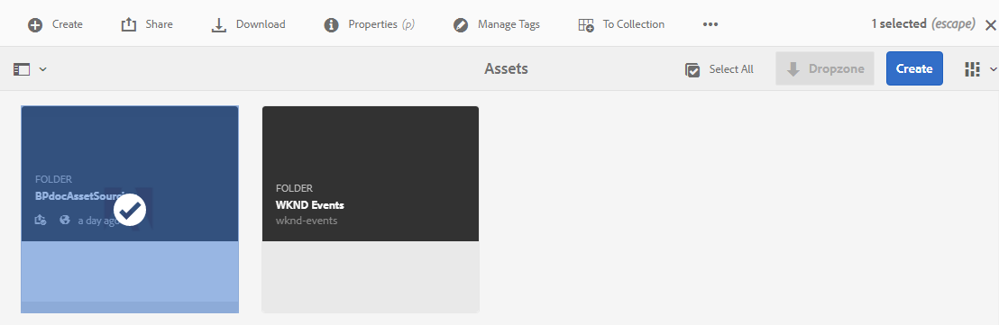
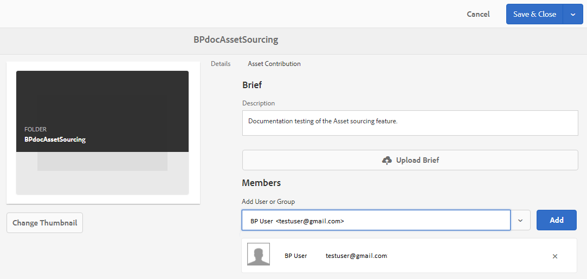

# Configurar propriedades da pasta de contribuição {#configure-contribution-folder-properties}

O administrador do AEM realiza as seguintes atividades ao configurar as propriedades de uma pasta de contribuição.

* **Adicionar descrição**: Forneça uma descrição de alto nível da pasta de contribuição.
* **Resumo** do upload:  Carregue o documento de Requisito de ativo que contém informações relacionadas ao ativo.
* **Adicionar colaboradores**: Adicione usuários ou grupos do Brand Portal para conceder acesso à pasta de contribuição.

O requisito de ativo se refere aos detalhes fornecidos pelos administradores para ajudar os contribuidores (usuários do Brand Portal) a entender a necessidade e os requisitos da pasta de contribuição. O administrador carrega um documento de requisito de ativo que contém um resumo sobre o tipo de ativos que devem ser adicionados à pasta de contribuição e às informações relacionadas ao ativo, por exemplo, finalidade, tipo de imagens, tamanho máximo etc.

O administrador pode conceder acesso aos usuários/grupos do Brand Portal à pasta de contribuição antes de publicar a pasta de contribuição recém-criada no Brand Portal.

**Para configurar as propriedades da pasta de contribuição:**
1. Faça logon na instância do autor de AEMURL padrão: http:// localhost:4502/aem/start.html
1. Navegue até **[!UICONTROL Ativos &gt; Arquivos]** e localize a pasta de contribuição.
1. Selecione a pasta de contribuição e clique em **[!UICONTROL Propriedades]** . A janela de propriedades da pasta é aberta.
   
1. Navegue até a guia Contribuição **[!UICONTROL do]** ativo.
1. Digite a **[!UICONTROL Descrição]** de alto nível da pasta de contribuição.
1. Clique em **[!UICONTROL Carregar resumo]**  para navegar pelo computador local e fazer upload de um documento **de requisitos de** ativos.
1. Em **[!UICONTROL Adicionar usuário ou grupo]**, pesquise e **[!UICONTROL adicione]** usuários ou grupos do Brand Portal com os quais você deseja compartilhar a pasta de contribuição.
Esses usuários/grupos do Brand Portal terão permissão para acessar a pasta de contribuição e fazer upload do conteúdo da interface do Brand Portal sem precisar acessar a instância do autor do AEM.
1. Clique em **[!UICONTROL Salvar]**.
   

>[!NOTE]
>
>Os resultados da pesquisa são baseados na lista de usuários do Brand Portal configurada nos ativos AEM. Certifique-se de ter a lista atualizada de usuários do Brand Portal. Consulte [Carregar lista](brand-portal-configure-asset-sourcing.md)de usuários do Brand Portal.