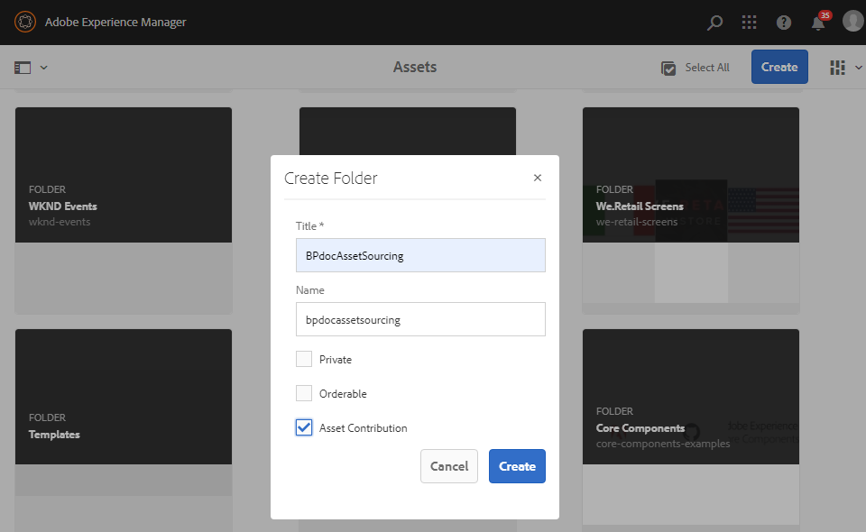
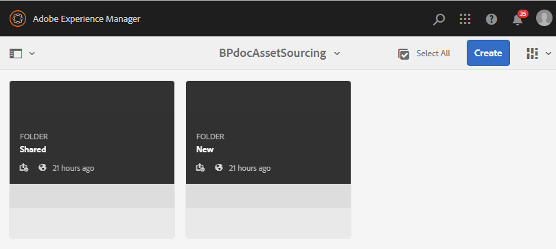

# Create contribution folder {#create-contribution-folder}

Os administradores do AEM e usuários não administradores com permissão para criar uma nova pasta podem criar uma pasta **Contribuição** no AEM Assets.
Para criar uma pasta **Contribuição** , crie uma nova pasta do tipo Contribuição **de** ativo, garantindo que a nova pasta criada esteja aberta para o envio de ativos pelos usuários do Brand Portal.  Isso aciona automaticamente um fluxo de trabalho que cria duas subpastas adicionais, chamadas de **COMPARTILHADO** e **NOVO**, na pasta recém-criada **Contribuição** .

**Para criar uma nova pasta de contribuição:**
1. Faça logon na instância do autor de AEMURL padrão: http:// localhost:4502/aem/start.html
1. Navegue até **[!UICONTROL Ativos > Arquivos]** Ele lista todas as pastas existentes no repositório do AEM Assets.
1. Click **[!UICONTROL Create]** to create a new folder. A janela pop-up Criar pasta é aberta.
1. Digite **[!UICONTROL Título]** e **[!UICONTROL Nome]** da pasta e marque a caixa de seleção **[!UICONTROL Contribuição]**do ativo.
É recomendável usar pequenos alfabetos sem espaço para nomear a pasta.
1. Clique em **[!UICONTROL Criar]**.
   
1. Você pode ver a pasta de contribuição recém-criada listada no repositório AEM Assets.
1. Clique para abrir a pasta de contribuição, você pode ver duas subpastas -**[!UICONTROL COMPARTILHADO]** e **[!UICONTROL NOVO]** são criadas automaticamente na pasta de contribuição.\
   

Agora você pode configurar as propriedades da pasta Contribuição. Consulte [Configurar propriedades](brand-portal-configure-contribution-folder-properties.md)da pasta Contribuição.

>[!NOTE]
>
>Certifique-se de fornecer um nome apropriado para a pasta Contribuição, pois não é possível modificar o nome da pasta após a criação.
>
>O aninhamento da pasta Contribuição não é suportado. Não crie uma pasta de contribuição dentro de outra pasta de contribuição.

