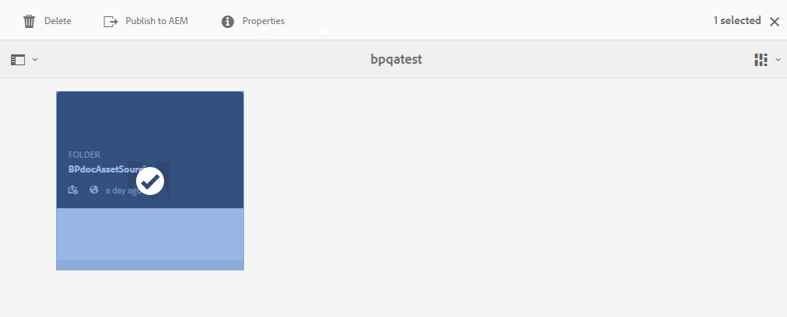

# Baixar requisitos de ativos {#using-asset-souring-in-bp}

Os usuários do Brand Portal recebem automaticamente notificações por e-mail/pulso sempre que uma pasta de contribuição é compartilhada pelo usuário do AEM, permitindo que eles baixem o documento resumido (requisito de ativo), bem como baixem os ativos da linha de base (conteúdo de referência) da pasta **SHARED** para garantir que eles compreendam os requisitos de ativos.

O usuário do Brand Portal realiza as seguintes atividades para baixar os requisitos de ativos:

* **Download do resumo**: Baixe o resumo (documento de requisito de ativo) anexado à pasta de contribuição que contém informações relacionadas ao ativo, como tipo de ativos, finalidade, formatos suportados, tamanho máximo do ativo etc.
* **Baixar ativos** da linha de base: Baixe os ativos de linha de base que podem ser usados para entender os tipos de ativos necessários. Os usuários do Brand Portal podem usar esses ativos como referência para criar novos ativos para contribuição.

O painel do Brand Portal reflete todas as pastas existentes permitidas para o usuário do Brand Portal junto com a pasta de contribuição compartilhada recentemente. Neste exemplo, o usuário do Brand Portal só tem acesso à pasta de contribuição recém-criada, nenhuma outra pasta existente é compartilhada com o usuário.

**Para baixar os requisitos de ativos:**

1. Faça logon na instância do Brand Portal.
1. Selecione a pasta de contribuição no painel Brand Portal.
1. Clique em **[!UICONTROL Propriedades]** . A janela Propriedade é aberta, exibindo os detalhes da pasta Contribuição do ativo.
   
1. Clique em **[!UICONTROL Baixar resumo]**  para baixar o documento de requisito de ativos em sua máquina local.
   
1. Volte para o painel do Brand Portal.
1. Clique para abrir a pasta de contribuição, você pode ver duas subpastas -**[!UICONTROL COMPARTILHADO]** e **[!UICONTROL NOVO]** na pasta de contribuição. A pasta COMPARTILHADA contém todos os ativos de linha de base (conteúdo de referência) compartilhados pelos administradores.
1. Você pode baixar a pasta **[!UICONTROL COMPARTILHADA]** que contém todos os ativos de linha de base em sua máquina local.
Ou, você pode abrir a pasta **[!UICONTROL COMPARTILHADA]** e clicar no ícone **Download**  para baixar arquivos/pastas individuais.
   

Percorra o resumo (documento de requisito de ativo) e consulte os ativos da linha de base para entender os requisitos do ativo. Agora, você pode criar novos ativos para contribuição e carregá-los na pasta de contribuição. Consulte [Fazer upload de ativos para a pasta](brand-portal-upload-assets-to-contribution-folder.md)de contribuição.

