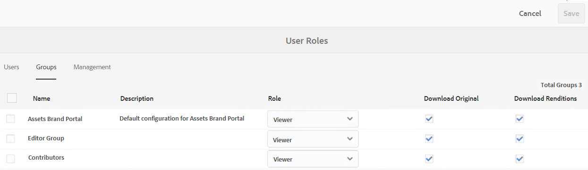
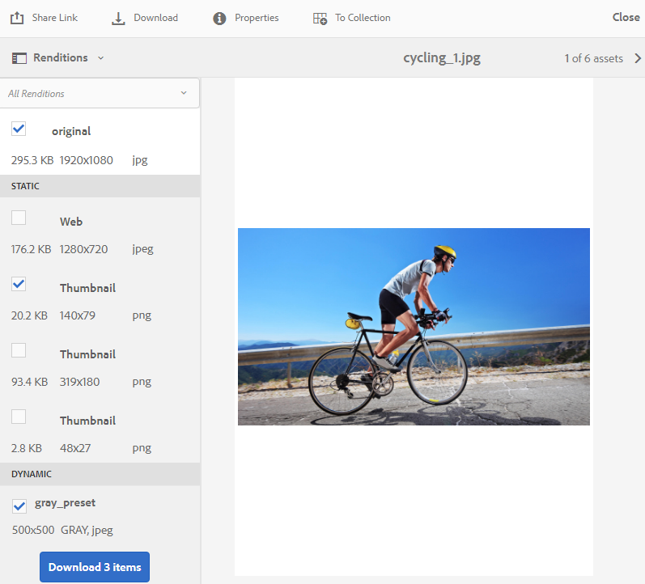

# Baixar ativos do Brand Portal {#download-assets-from-bp}

<!-- Before update in Download experience - 26th Aug 2020 comment by Vishabh.
 All users can simultaneously download multiple assets and folders accessible to them from Brand Portal. This way, approved brand assets can be securely distributed for offline use. Read on to know how to download approved assets from Brand Portal, and what to expect from the [download performance](../using/brand-portal-download-assets.md#main-pars-header).
-->

O Portal de marcas do Adobe Experience Manager Assets aprimora a experiência de download, permitindo que os usuários baixem simultaneamente vários ativos e pastas acessíveis a eles no Portal de marcas. Dessa forma, os ativos aprovados da marca podem ser distribuídos com segurança para uso offline. Leia para saber como baixar os ativos aprovados no Brand Portal e o que esperar do desempenho [do](../using/brand-portal-download-assets.md#expected-download-performance)download.

>[!NOTE]
>
>No Brand Portal 2020.10.0 (e superior), a configuração de Download **** rápido está ativada por padrão, que usa o IBM Aspera Connect para download acelerado dos ativos. Instale o IBM Aspera Connect 3.9.9 na extensão do seu navegador antes de baixar os ativos do Brand Portal.
>
>Se você não quiser usar o IBM Aspera Connect e continuar com o processo normal de download, entre em contato com o administrador do Brand Portal para desativar a configuração de Download **** rápido.

## Configurar download de ativos {#configure-download}

Os administradores do Brand Portal podem definir as configurações e permissões de download de ativos para os usuários do Brand Portal, permitindo que eles acessem e baixem representações de ativos da interface do Brand Portal.

O acesso e o download das execuções do Brand Portal são definidos pelas seguintes configurações:

* Ativar configurações de download
* Configurar permissões de download

### Ativar configurações de download {#enable-download-settings}

Os administradores podem ativar as Configurações **[!UICONTROL de]** download de ativos para definir o conjunto de execuções acessíveis aos usuários do Brand Portal para download.

As configurações disponíveis são:

* **[!UICONTROL Download rápido]**

   Ele fornece download acelerado dos ativos usando o IBM Aspera Connect. Por padrão, a configuração Download **** rápido está ativada nas Configurações **[!UICONTROL de]** download.

   Para saber mais, consulte o [guia para acelerar os downloads do Brand Portal](../using/accelerated-download.md).

* **[!UICONTROL Representações personalizadas]**

   Permite baixar representações personalizadas e (ou) dinâmicas dos ativos.

   Todas as representações de ativos diferentes do ativo original e representações geradas pelo sistema são chamadas de representações personalizadas. Inclui representações estáticas e dinâmicas disponíveis para o ativo. Qualquer usuário pode criar uma execução estática personalizada no AEM Assets, enquanto que, somente o administrador do AEM pode criar execuções dinâmicas personalizadas. Para saber mais, consulte [como aplicar predefinições de imagens ou representações](../using/brand-portal-image-presets.md)dinâmicas.

* **[!UICONTROL Representações do sistema]**

   Permite baixar representações dos ativos geradas pelo sistema.

   Estas são as miniaturas que são geradas automaticamente no AEM Assets com base no fluxo de trabalho &quot;Ativo de atualização do DAM&quot;.

Faça logon no locatário do Brand Portal como administrador e navegue até **[!UICONTROL Ferramentas]** > **[!UICONTROL Download]**.

Os administradores podem habilitar qualquer combinação de configurações para que os usuários do Brand Portal acessem e baixem execuções.

>[!NOTE]
>
>Somente os administradores podem baixar os ativos expirados. Para obter mais informações sobre ativos expirados, consulte [gerenciar direitos digitais de ativos](../using/manage-digital-rights-of-assets.md).

### Configurar permissões de download {#configure-download-permissions}

Além das Configurações **[!UICONTROL de]** download, os administradores do Brand Portal podem configurar ainda mais as permissões para diferentes grupos de usuários para visualização e (ou) download dos ativos originais e suas execuções.

Faça logon no locatário do Brand Portal como administrador e navegue até **[!UICONTROL Ferramentas]** > **[!UICONTROL Usuários]**. Na página Funções **[!UICONTROL do]** usuário, navegue até a guia **[!UICONTROL Grupos]** para configurar as permissões de visualização e download para os grupos de usuários.

>[!NOTE]
>
>Se um usuário for adicionado a vários grupos e um deles tiver restrições, as restrições serão aplicadas ao usuário.

Com base na configuração, o fluxo de trabalho de download permanece constante para ativos independentes, vários ativos, pastas que contêm ativos, ativos licenciados ou não licenciados e o download de ativos usando o link de compartilhamento.

A matriz a seguir define se um usuário teria acesso às execuções dependendo das configurações [de](#configure-download)download:

| **Configurações de download: Representações personalizadas** | **Configurações de download: Representações do sistema** | **Permissões do grupo de usuários: Download original** | **Permissões do grupo de usuários: Baixar execuções** | **Resultado** |
|---|---|---|---|---|
| LIGADO | LIGADO | LIGADO | LIGADO | Visualização e download de todas as execuções |
| LIGADO | LIGADO | DESLIGADO | DESLIGADO | Visualização do ativo original |
| DESLIGADO | DESLIGADO | LIGADO | LIGADO | Visualização e download do ativo original |
| LIGADO | DESLIGADO | LIGADO | LIGADO | Visualização e download de ativos originais e representações personalizadas |
| DESLIGADO | LIGADO | LIGADO | LIGADO | Visualização e download de ativos originais e execuções do sistema |
| LIGADO | DESLIGADO | DESLIGADO | DESLIGADO | Visualização do ativo original |
| DESLIGADO | LIGADO | DESLIGADO | DESLIGADO | Visualização do ativo original |
| DESLIGADO | DESLIGADO | DESLIGADO | LIGADO | Visualização do ativo original |
| DESLIGADO | DESLIGADO | LIGADO | DESLIGADO | Visualização e download do ativo original |
| DESLIGADO | DESLIGADO | DESLIGADO | DESLIGADO | Visualização do ativo original |

## Baixar ativos {#download-assets}

Os usuários do Brand Portal podem baixar vários ativos, pastas que contêm ativos e coleções da interface do Brand Portal.

>[!NOTE]
>
>Entre em contato com o administrador do Brand Portal se você não tiver permissões para acessar ou baixar as execuções.

Se o usuário tiver acesso às execuções, o usuário receberá a caixa de diálogo aprimorada **[!UICONTROL Download]** com os seguintes recursos:
* Visualização todas as representações disponíveis de qualquer ativo na lista de download.
* Exclua representações dos ativos que não são necessárias para download.
* Aplique o mesmo conjunto de representações a todos os tipos de ativos semelhantes em um clique.
* Aplique um conjunto diferente de representações para diferentes tipos de ativos.
* Crie uma pasta separada para cada representação de ativo.
* Baixe os ativos selecionados e suas representações.

>[!NOTE]
>
>A caixa de diálogo **[!UICONTROL Download]** é exibida somente se os ativos estiverem selecionados para download e as Representações **** personalizadas ou Representações **[!UICONTROL do]** sistema estiverem ativadas nas Configurações **[!UICONTROL de]** download.

### Etapas para baixar ativos {#bulk-download}

Veja a seguir as etapas para baixar ativos ou pastas que contêm ativos da interface do Brand Portal:

1. Faça logon no seu locatário do Brand Portal. Por padrão, a visualização **[!UICONTROL Arquivos]** é aberta, contendo todos os ativos e pastas publicados.

   Faça uma das seguintes opções:

   * Selecione os ativos ou pastas que deseja baixar. Na barra de ferramentas na parte superior, clique no ícone **[!UICONTROL Download]** .

      

   * Para baixar representações específicas de ativos de um ativo, passe o ponteiro sobre o ativo e clique no ícone **[!UICONTROL Download]** disponível nas miniaturas de ação rápida.

      

      >[!NOTE]
      >
      >Se você estiver baixando os ativos pela primeira vez e não tiver o IBM Aspera Connect instalado em seu navegador, ele solicitará a instalação do Acelerador de download Aspera.

      >[!NOTE]
      >
      >Se os ativos que você está baixando também incluírem ativos licenciados, você será redirecionado para a página Gerenciamento **[!UICONTROL de]** direitos autorais. Nesta página, selecione os ativos, clique em **[!UICONTROL Concordar]** e, em seguida, clique em **[!UICONTROL Download]**. Se você optar por discordar, os ativos licenciados não serão baixados.
      > 
      >Os ativos protegidos por licença têm o contrato de [licença anexado](https://helpx.adobe.com/experience-manager/6-5/assets/using/drm.html#DigitalRightsManagementinAssets) a eles, o que é feito ao configurar a propriedade [de](https://helpx.adobe.com/experience-manager/6-5/assets/using/drm.html#DigitalRightsManagementinAssets) metadados do ativo nos Ativos Experience Manager.

      

1. A caixa de diálogo **[!UICONTROL Download]** que lista todos os ativos selecionados é aberta.

   Clique em qualquer ativo para visualização das representações disponíveis e marque as caixas de seleção correspondentes às representações que deseja baixar.

   Você pode selecionar ou excluir manualmente as representações de ativos individuais, ou clicar no ícone **Aplicar** para selecionar o mesmo conjunto de representações a serem baixadas para tipos de ativos semelhantes (todos os arquivos de imagem neste exemplo). Na caixa de diálogo **[!UICONTROL Aplicar tudo]** , clique em **[!UICONTROL Concluído]** para aplicar a regra a todos os ativos semelhantes.

   

   Você também pode remover um ativo da lista de download (se necessário) clicando no ícone **Remover** .

   

   Para preservar a hierarquia de pastas do Brand Portal ao baixar ativos, marque a caixa de seleção **[!UICONTROL Criar pasta separada para cada ativo]** . Por padrão, a hierarquia de pastas do Brand Portal é ignorada e todos os ativos são baixados em uma pasta zip.

   O botão de download reflete a contagem dos itens selecionados. Quando terminar de aplicar as regras, clique em **[!UICONTROL Download de itens]**.

   

1. Por padrão, a configuração Download **** rápido está ativada nas Configurações **[!UICONTROL de]** download. Portanto, uma caixa de confirmação é exibida para permitir o download acelerado usando o IBM Aspera Connect.

   Para continuar usando o Download **** rápido, clique em **[!UICONTROL Permitir]**. Todas as renderizações selecionadas são baixadas em uma pasta zip usando o IBM Aspera Connect.

   Se você não quiser usar o IBM Aspera Connect, clique em **[!UICONTROL Negar]**. Se o Download **** rápido for negado ou falhar, o sistema preencherá uma mensagem de erro. Clique no botão Download **** normal para continuar baixando os ativos. As renderizações selecionadas são baixadas em uma pasta zip sem usar o IBM Aspera Connect.

>[!NOTE]
>
>Se a configuração Download **** rápido for desativada pelo administrador, as renderizações selecionadas serão baixadas diretamente em uma pasta zip sem usar o IBM Aspera Connect.

>[!NOTE]
>
>Se mais de 20 ativos forem selecionados para download, a caixa de diálogo **[!UICONTROL Download]** será ignorada e todas as renderizações acessíveis ao usuário, excluindo as renderizações dinâmicas, serão baixadas diretamente em uma pasta zip.
>
>O mesmo comportamento é seguido ao baixar as pastas que contêm ativos e coleções. As renderizações acessíveis, excluindo as renderizações dinâmicas, são baixadas diretamente em uma pasta zip.

>[!NOTE]
>
>O Brand Portal suporta a configuração de Dynamic Media em ambos os modos - Híbrido e Scene 7.
>
>(*Se AEM instância do autor estiver em execução no modo **Híbrido do***Dynamic Media)
>
>Para pré-visualização ou download de representações dinâmicas de um ativo, verifique se a mídia dinâmica está ativada e se a representação temporária do ativo em Pirâmide existe na instância do autor da AEM Assets de onde os ativos foram publicados. Quando um ativo é publicado de AEM para o Brand Portal, sua representação em pirâmide também é publicada.

Se você não estiver [autorizado pelo administrador a ter acesso às representações](../using/brand-portal-adding-users.md#main-pars-procedure-202029708)originais, as representações originais dos ativos selecionados não serão baixadas.

<!-- This issue has been resolved, check with engineering.
>[!NOTE]
>
>Once you have downloaded the asset renditions, the **[!UICONTROL Download]** button is disabled to avoid creating duplicate copies of the renditions. To download more (missing or another copy of renditions), refresh the browser to re-enable the download button.
-->

### Baixar ativos da página de detalhes do ativo {#download-assets-from-asset-details-page}

Além do fluxo de trabalho de download, há outro método para baixar as representações de ativos individuais diretamente da página de detalhes do ativo.

Os usuários podem pré-visualização representações diferentes, selecionar representações específicas e baixá-las diretamente do painel **[!UICONTROL Representações]** na página de detalhes do ativo sem precisar abrir a caixa de diálogo **[!UICONTROL Download]** .

Veja a seguir as etapas para baixar representações de ativos na página de detalhes do ativo:

1. Faça logon no locatário do Brand Portal e clique no ativo para abrir a página de detalhes do ativo.
1. Clique no ícone de sobreposição à esquerda e clique em **[!UICONTROL Representações]**.

   

1. O painel **[!UICONTROL Representações]** lista todas as representações de ativos acessíveis com base nas configurações [de](#configure-download)download de ativos.

   Selecione as representações específicas que deseja baixar e clique em **[!UICONTROL Download de itens]**.

   

1. Por padrão, a configuração Download **** rápido está ativada nas Configurações **[!UICONTROL de]** download. Portanto, uma caixa de confirmação é exibida para permitir o download acelerado usando o IBM Aspera Connect.

   Para continuar usando o Download **** rápido, clique em **[!UICONTROL Permitir]**. Todas as renderizações selecionadas são baixadas em uma pasta zip usando o IBM Aspera Connect.

   Se você negar o uso do Download **** rápido, o sistema preencherá uma mensagem de erro. Clique no botão Download **** normal para continuar o download. As renderizações selecionadas são baixadas em uma pasta zip sem usar o IBM Aspera Connect.

>[!NOTE]
>
>Se a configuração Download **** rápido for desativada pelo administrador, as renderizações selecionadas serão baixadas diretamente em uma pasta zip sem usar o IBM Aspera Connect.

>[!NOTE]
>
>Os ativos que são baixados individualmente ficam visíveis no relatório de download de ativos. No entanto, se uma pasta que contém ativos for baixada, a pasta e os ativos não serão exibidos no relatório de download de ativos.

<!--
>[!NOTE]
>
>Assets that are individually downloaded are visible in the assets download report. However, if a folder containing assets is downloaded, the folder and assets are not displayed in the assets download report.
-->

<!-- Backup of content before updating the new feature docs.
## Configure asset download {#configure-download}

The download configuration allows the Brand Portal administrators to define the set of renditions available to the Brand Portal users for downloading the assets. The administrator can configure the asset **[!UICONTROL Download]** settings from the Brand Portal interface. 

The available configurations are:

* **[!UICONTROL Fast Download]** 

  Enables high-speed download of the assets. To know more, see [guide to accelerate downloads from Brand Portal](../using/accelerated-download.md).

* **[!UICONTROL Custom Renditions]** 
  
  Download custom and (or) dynamic renditions of the assets. 
  All the asset renditions other than the original asset and system-generated renditions are called as custom renditions. It includes static as well as dynamic renditions available for the asset. Any user can create a custom static rendition in AEM Assets, whereas, only the AEM administrator can create custom dynamic renditions. To know more, see [how to apply image presets or dynamic renditions](../using/brand-portal-image-presets.md)

* **[!UICONTROL System Renditions]** 

  Download system-generated renditions of the assets. These are the thumbnails which are automatically generated in AEM Assets based on the "DAM update asset" workflow. 

Log in to your Brand Portal tenant as an administrator and navigate to **[!UICONTROL Tools]** > **[!UICONTROL Download]**. By default, the **[!UICONTROL Fast Download]** configuration is enabled in the **[!UICONTROL Download Settings]**. 

The administrators can enable any combination to configure the asset download process.

Based on the configuration, the download workflow remains constant for stand-alone assets, multiple assets, folders containing assets, licensed or unlicensed assets, and downloading assets using share link. 

* If both **[!UICONTROL Custom Renditions]** and **[!UICONTROL System Renditions]** configurations are turned-off, the original renditions of the assets are downloaded without any additional dialog being presented to the users.    

* If any of the **[!UICONTROL Custom Renditions]** or **[!UICONTROL System Renditions]** configuration is enabled, an additional **[!UICONTROL Download]** dialog box appears wherein you can choose whether to download the original asset along with its renditions, or download only specific renditions. 

>[!NOTE]
>
>Only the administrators can download the expired assets. For more information about expired assets, see [manage digital rights of assets](../using/manage-digital-rights-of-assets.md).

## Steps to download assets {#steps-to-download-assets}

Following are the steps to download assets or folders containing assets from Brand Portal:

1. From the Brand Portal interface, do one of the following:

   * Select the folders or assets you want to download. From the toolbar at the top, click the **[!UICONTROL Download]** icon.

     

   * To download a specific asset or folder, hover the pointer over the asset or folder and click the **[!UICONTROL Download]** icon available in the quick action thumbnails.

     

     >[!NOTE]
     >
     >If you are downloading the assets for the first time and do not have IBM Aspera Connect installed in your browser, it will prompt you to install the Aspera download accelerator. 

     >[!NOTE]
     >
     >If the assets you are downloading also include licensed assets, you are redirected to the **[!UICONTROL Copyright Management]** page. In this page, select the assets, click **[!UICONTROL Agree]**, and then click **[!UICONTROL Download]**. If you choose to disagree, licensed assets are not downloaded. 
     > 
     >License-protected assets have [license agreement attached](https://helpx.adobe.com/experience-manager/6-5/assets/using/drm.html#DigitalRightsManagementinAssets) to them, which is done by setting asset's [metadata property](https://helpx.adobe.com/experience-manager/6-5/assets/using/drm.html#DigitalRightsManagementinAssets) in Experience Manager Assets.

     

     
     >[!NOTE]
     >
     >Ensure to select all the required asset renditions while downloading them from the asset details page, and click **[!UICONTROL Download]**. The selected renditions are downloaded to your local machine.
     > 
     >Once you download, the **[!UICONTROL Download]** button is disabled to avoid creating duplicate copies of the downloaded renditions. To download more (missing or another copy of renditions), refresh the browser to re-enable the download button.

     If any of the **[!UICONTROL Custom Renditions]** or **[!UICONTROL System Renditions]** configuration is enabled in the **[!UICONTROL Download Settings]**, the **[!UICONTROL Download]** dialog appears with the **[!UICONTROL Asset(s)]** check box selected by default. If the **[!UICONTROL Fast Download]** configuration is enabled, the **[!UICONTROL Enable download acceleration]** check box is selected by default.

     

     >[!NOTE]
     >
     >If the downloading assets are image files, and you select only the **[!UICONTROL Asset(s)]** check box in the **[!UICONTROL Download]** dialog but are not [authorized by the administrator to have access to the original renditions of image files](../using/brand-portal-adding-users.md#main-pars-procedure-202029708) then no image files are downloaded and a notification appears, stating that you have been restricted by the administrator to access original renditions.

     

1. To download the renditions in addition to the original assets, select the **[!UICONTROL Rendition(s)]** check box. However, if you want to download the system-generated renditions along with the custom renditions, clear the **[!UICONTROL Exclude System Renditions]** check box.

   

   * To download only the renditions, clear the **[!UICONTROL Asset(s)]** check box.

     >[!NOTE]
     >
     >By default, only the assets are downloaded. However, original renditions of image files are not downloaded if you are not [authorized by the administrator to have access to the original renditions of image files](../using/brand-portal-adding-users.md#main-pars-procedure-202029708).

    * To share the selected assets with other users through a link, select the **[!UICONTROL Email]** check box. An email notification is sent to the users with the download link. To know how to download assets from shared links, see [downloading assets from shared links](../using/brand-portal-link-share.md#main-pars-header-1703469193).  

      

      >[!NOTE]
      >
      >The download link on email notification expires after 45 days.
      >
      >The administrators can customize email messages, that is, logo, description, and footer, using the [Branding](../using/brand-portal-branding.md) feature.

    * You can select a predefined image preset or create a custom dynamic rendition from the **[!UICONTROL Download]** dialog box. 

      To apply a [custom image preset to the asset and its renditions](../using/brand-portal-image-presets.md#applyimagepresetswhendownloadingimages), select the **[!UICONTROL Dynamic Rendition(s)]** check box. Specify the image preset properties (such as size, format, color space, resolution, and image modifier) to apply the custom image preset while downloading the asset and its renditions. To download only the dynamic renditions, clear the **[!UICONTROL Asset(s)]** check box.

      

      >[!NOTE]
      >
      >Brand Portal supports configuring Dynamic Media in both - Hybird and Scene 7 mode. 
      >
      >(*If AEM author instance is running on **Dynamic Media Hybrid mode***)
      >
      >To preview or download dynamic renditions of an asset, ensure that the dynamic media is enabled and the asset's Pyramid tiff rendition exists at the AEM Assets author instance from where the assets have been published. When an asset is published to Brand Portal, its Pyramid tiff rendition is also published.
      
  
    * To preserve the Brand Portal folder hierarchy while downloading assets, select the **[!UICONTROL Create separate folder for each asset]** check box. By default, the Brand Portal folder hierarchy is ignored and all the assets are downloaded in one folder in your local system.

1. Click **[!UICONTROL Download]**.

   The assets (and renditions if selected) are downloaded as a zip file to your local folder. However, no zip file is created if a single asset is downloaded without any of the renditions. 

   If you are not [authorized by the administrator to have access to the original renditions](../using/brand-portal-adding-users.md#main-pars-procedure-202029708), the original renditions of the selected assets are not downloaded. 

   >[!NOTE]
   >
   >Assets that are individually downloaded are visible in the assets download report. However, if a folder containing assets is downloaded, the folder and assets are not displayed in the assets download report.
-->

## Desempenho de download esperado {#expected-download-performance}

A experiência de download de arquivo pode variar para usuários em diferentes locais de cliente, dependendo de fatores como conectividade local à Internet e latência do servidor. O desempenho de download esperado para o arquivo de 2 GB observado em diferentes locais de clientes é o seguinte, com o servidor Brand Portal, no Oregon, Estados Unidos:

| Local do cliente | Latência entre cliente e servidor | Velocidade de download esperada | Tempo necessário para baixar um arquivo de 2 GB |
|-------------------------|-----------------------------------|-------------------------|------------------------------------|
| Oeste dos EUA (N. Califórnia) | 18 milissegundos | 7,68 MB/s | 4 minutos |
| Oeste dos EUA (Oregon) | 42 milissegundos | 3,84 MB/s | 9 minutos |
| Leste dos EUA (N. Virgínia) | 85 milissegundos | 1,61 MB/s | 21 minutos |
| APAC (Tóquio) | 124 milissegundos | 1,13 MB/s | 30 minutos |
| Noida | 275 milissegundos | 0,5 MB/s | 68 minutos |
| Sydney | 175 milissegundos | 0,49 MB/s | 69 minutos |
| Londres | 179 milissegundos | 0,32 MB/s | 106 minutos |
| Cingapura | 196 milissegundos | 0,5 MB/s | 68 minutos |

>[!NOTE]
>
>Os dados citados são observados em condições de teste, que podem variar para usuários em locais diferentes que testemunham latência e largura de banda variadas.

