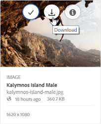

# Baixar ativos {#download-assets-from-bp}

O Adobe Experience Manager Assets Brand Portal melhora a experiência de download ao permitir que os usuários baixem simultaneamente ativos e pastas acessíveis a eles do Brand Portal. Dessa forma, os recursos de marca aprovados podem ser distribuídos com segurança para uso offline. Leia para saber como baixar ativos (ativos aprovados) da Brand Portal e o que esperar da [desempenho de download](#expected-download-performance).

>[!NOTE]
>
>No Brand Portal 2020.10.0 (e posterior), a variável **[!UICONTROL Download rápido]** A configuração está ativada por padrão, o que usa o IBM Aspera Connect para acelerar o download dos ativos. Instale o IBM Aspera Connect 3.9.9 (`https://www.ibm.com/docs/en/aspera-connect/3.9.9`) na extensão do navegador antes de baixar os ativos da Brand Portal. Para obter mais detalhes, consulte [guia para acelerar downloads do Brand Portal](../using/accelerated-download.md).
>
>Se não quiser usar o IBM Aspera Connect e continuar com o processo normal de download, entre em contato com o administrador do Brand Portal para desativar o **[!UICONTROL Download rápido]** configuração.

## Configurar o download de ativos {#configure-download}

Os administradores do Brand Portal podem definir o download de ativos e as configurações de grupo de usuários para os usuários do Brand Portal, permitindo que eles acessem e baixem representações de ativos na interface do Brand Portal.

>[!NOTE]
>
>As configurações de download aplicadas na interface do usuário facilitam uma experiência de autoatendimento aos usuários do Brand Portal para configurar e baixar facilmente representações de ativos. Isso não restringe o download de ativos na camada do aplicativo. Por exemplo, os usuários ainda podem acessar e baixar representações de ativos com o caminho completo do URL.

O acesso e o download das representações de ativos na interface do Brand Portal são definidos pelas seguintes configurações:

* Ativar configurações de download
* Definir configurações do grupo de usuários

### Ativar configurações de download {#enable-download-settings}

Os administradores podem habilitar o ativo **[!UICONTROL Configurações de download]** para definir o conjunto de representações acessível aos usuários do Brand Portal para download.

As configurações disponíveis são:

* **[!UICONTROL Download rápido]**

   Ele fornece download acelerado dos ativos usando o IBM Aspera Connect. Por padrão, a variável **[!UICONTROL Download rápido]** está ativada na variável **[!UICONTROL Configurações de download]**.

* **[!UICONTROL Representações personalizadas]**

   Permite o download de representações personalizadas e (ou) dinâmicas dos ativos.

   Todas as representações de ativos que não sejam o ativo original e as representações geradas pelo sistema são chamadas de representações personalizadas. Inclui representações estáticas e dinâmicas disponíveis para o ativo. Qualquer usuário pode criar uma representação estática personalizada no Experience Manager Assets, enquanto somente o administrador pode criar representações dinâmicas personalizadas. Para obter detalhes, consulte [como aplicar predefinições de imagens ou representações dinâmicas](../using/brand-portal-image-presets.md).

* **[!UICONTROL Representações do sistema]**

   Permite o download de representações geradas pelo sistema dos ativos.

   Essas são as miniaturas que são geradas automaticamente no Experience Manager Assets com base no fluxo de trabalho &quot;Ativo de atualização do DAM&quot;.

* **[!UICONTROL Download de ativo]**

   Permite o download das representações em uma pasta separada para cada ativo. A configuração é aplicável em pastas, coleções e download em massa de ativos (mais de 20 ativos).

Faça logon no locatário do Brand Portal como administrador e navegue até **[!UICONTROL Ferramentas]** > **[!UICONTROL Baixar]**.

Os administradores podem ativar qualquer combinação de configurações para que os usuários do Brand Portal acessem e baixem representações de ativos.

>[!NOTE]
>
>Somente os administradores podem baixar os ativos expirados. Para obter mais informações sobre ativos expirados, consulte [gerenciar direitos digitais dos ativos](../using/manage-digital-rights-of-assets.md).

### Definir configurações do grupo de usuários {#configure-user-group-settings}

Além do **[!UICONTROL Configurações de download]**, os administradores do Brand Portal podem definir configurações adicionais para diferentes grupos de usuários para visualizar e (ou) baixar os ativos originais e suas representações.

Faça logon no locatário do Brand Portal como administrador e navegue até **[!UICONTROL Ferramentas]** > **[!UICONTROL Usuários]**. No **[!UICONTROL Funções do usuário]** , navegue até o **[!UICONTROL Grupos]** guia para definir a visualização e (ou) baixar as configurações para os grupos de usuários.

>[!NOTE]
>
>Se um usuário for adicionado a vários grupos e se um desses grupos tiver restrições, essas restrições serão aplicadas ao usuário.

Com base na configuração, o fluxo de trabalho de download permanece constante para ativos independentes, vários ativos, pastas que contêm ativos, ativos licenciados ou não licenciados e ativos baixados usando o link compartilhado.

A matriz a seguir define se um usuário terá acesso às representações dependendo da variável [baixar configurações](#configure-download):

| **Configurações de download: representações personalizadas** | **Configurações de download: representações do sistema** | **Configurações do grupo de usuários: Baixar original** | **Configurações do grupo de usuários: Baixar representações** | **Resultado** |
|---|---|---|---|---|
| LIGADO | LIGADO | LIGADO | LIGADO | Exibir e baixar todas as representações |
| LIGADO | LIGADO | DESLIGADO | DESLIGADO | Exibir ativo original |
| DESLIGADO | DESLIGADO | LIGADO | LIGADO | Exibir e baixar o ativo original |
| LIGADO | DESLIGADO | LIGADO | LIGADO | Exibir e baixar o ativo original e as representações personalizadas |
| DESLIGADO | LIGADO | LIGADO | LIGADO | Exibir e baixar representações do ativo e do sistema originais |
| LIGADO | DESLIGADO | DESLIGADO | DESLIGADO | Exibir ativo original |
| DESLIGADO | LIGADO | DESLIGADO | DESLIGADO | Exibir ativo original |
| DESLIGADO | DESLIGADO | DESLIGADO | LIGADO | Exibir ativo original |
| DESLIGADO | DESLIGADO | LIGADO | DESLIGADO | Exibir e baixar o ativo original |
| DESLIGADO | DESLIGADO | DESLIGADO | DESLIGADO | Exibir ativo original |

## Baixar ativos {#download-assets}

Os usuários do Brand Portal podem baixar vários ativos, pastas contendo ativos e coleções na interface da Brand Portal.

>[!NOTE]
>
>Entre em contato com o administrador do Brand Portal se não tiver permissão para acessar ou baixar as representações do ativo.

Se o usuário tiver acesso a representações, ele receberá a **[!UICONTROL Baixar]** com os seguintes recursos:

* Visualize todas as representações disponíveis de qualquer ativo na lista de downloads.
* Exclua as representações dos ativos que não são necessárias para o download.
* Aplique o mesmo conjunto de representações a todos os tipos de ativos semelhantes com um só clique.
* Aplique um conjunto diferente de representações para tipos de ativos diferentes.
* Crie uma pasta separada para cada ativo.
* Baixar ativos selecionados e suas representações.

>[!NOTE]
>
>A variável **[!UICONTROL Baixar]** será exibida somente se **[!UICONTROL Representações personalizadas]** e (ou) **[!UICONTROL Representações do sistema]** está ativado na variável **[!UICONTROL Configurações de download]**.

### Etapas para baixar ativos {#bulk-download}

Veja a seguir as etapas para baixar ativos ou pastas que contêm ativos na interface do Brand Portal:

1. Faça logon no seu locatário do Brand Portal. Por padrão, a variável **[!UICONTROL Arquivos]** a visualização abre, que contém todos os ativos e pastas publicados.

   Siga uma das seguintes opções:

   * Selecione os ativos ou pastas que deseja baixar. Na barra de ferramentas na parte superior, clique no botão **[!UICONTROL Baixar]** ícone.

      

   * Para baixar representações de ativos específicos de um ativo, passe o mouse sobre o ativo e clique no link **[!UICONTROL Baixar]** ícone disponível nas miniaturas de ação rápida.

      

      >[!NOTE]
      >
      >Se você estiver baixando os ativos pela primeira vez e não tiver o IBM Aspera Connect instalado no navegador, ele solicitará que você instale o acelerador de download Aspera (`https://www.ibm.com/docs/en/aspera-connect/3.9.9`).

      >[!NOTE]
      >
      >Se os ativos que você estiver baixando também incluírem ativos licenciados, você será redirecionado para a página **[!UICONTROL Gerenciamento de direitos autorais]** página. Nesta página, selecione os ativos, clique em **[!UICONTROL Concordo]** e clique em **[!UICONTROL Baixar]**. Se você optar por discordar, os ativos licenciados não serão baixados.
      > 
      >Os ativos protegidos por licença [contrato de licença anexado](https://experienceleague.adobe.com/docs/experience-manager-65/assets/administer/drm.html) para eles, o que é feito definindo as [propriedade de metadados](https://experienceleague.adobe.com/docs/experience-manager-65/assets/administer/drm.html) no Experience Manager Assets.

      

1. A variável **[!UICONTROL Baixar]** caixa de diálogo listando todos os ativos selecionados é aberta.

   Clique em qualquer ativo para exibir as representações disponíveis e marque as caixas de seleção correspondentes às representações que deseja baixar.

   É possível selecionar ou excluir manualmente as representações de ativos individuais ou clicar no link **Aplicar** ícone para selecionar o mesmo conjunto de representações para baixar para tipos de ativos semelhantes (todos os arquivos de imagem neste exemplo). No **[!UICONTROL Aplicar tudo]** clique em **[!UICONTROL Concluído]** para aplicar a regra a todos os ativos semelhantes.

   

   Também é possível remover um ativo da lista de download (se necessário) clicando no link **Remover** ícone.

   

   Para preservar a hierarquia de pastas do Brand Portal ao baixar ativos, selecione a **[!UICONTROL Criar uma pasta separada para cada ativo]** caixa de seleção

   O botão de download reflete a contagem dos itens selecionados. Quando terminar de aplicar as regras, clique em **[!UICONTROL Baixar itens]**.

   

1. Por padrão, a variável **[!UICONTROL Download rápido]** está ativada na variável **[!UICONTROL Configurações de download]**. Portanto, uma caixa de confirmação aparece para permitir o download acelerado usando o IBM Aspera Connect.

   Para continuar usando o **[!UICONTROL Download rápido]**, clique em **[!UICONTROL Permitir]**. Todas as representações selecionadas são baixadas em uma pasta zip usando o IBM Aspera Connect.

   Se não quiser usar o IBM Aspera Connect, clique em **[!UICONTROL Negar]**. Se **[!UICONTROL Download rápido]** for negado ou falhar, o sistema preencherá uma mensagem de erro. Clique em **[!UICONTROL Download normal]** botão para continuar baixando os ativos.

<!-- removed the known issue from step 2 as it is fixed in 2022.02.0 release.
   >[!CAUTION]
   >
   >(**Experience Manager Assets as a Cloud Service** only) The following known issue will be fixed in the upcoming release:
   >
   >The download dialog lists the smart crop renditions of the selected asset, however, the user cannot download the smart crop renditions.
-->

>[!NOTE]
>
>Se a variável **[!UICONTROL Download rápido]** for desativada pelo administrador, as representações selecionadas serão baixadas diretamente em uma pasta zip sem usar o IBM Aspera Connect.

>[!NOTE]
>
>Se a variável **[!UICONTROL Download de ativo]** está ativada na variável **[!UICONTROL Configurações de download]**, as representações de ativos são baixadas em uma pasta separada para cada ativo dentro da pasta zip.
>  
>Se o download dos ativos for feito a partir de um link compartilhado, as representações do ativo serão baixadas em uma pasta separada para cada ativo dentro da pasta zip.
>
>Se uma pasta, coleção ou mais de 20 ativos forem selecionados para download, a variável **[!UICONTROL Baixar]** será ignorada e todas as representações de ativos acessíveis ao usuário, excluindo as representações dinâmicas, serão baixadas em uma pasta zip.

>[!NOTE]
>
>O Brand Portal é compatível com a configuração do Dynamic Media nos modos Híbrido e Scene 7.
>
>(*Se a instância do autor do Experience Manager Assets estiver em execução em **Modo híbrido do Dynamic Media***)
>
>Para visualizar ou baixar representações dinâmicas de um ativo, verifique se a mídia dinâmica está ativada e se a representação Tiff da Pirâmide do ativo existe na instância do autor do Experience Manager Assets de onde os ativos foram publicados. Quando um ativo é publicado do Experience Manager Assets para o Brand Portal, sua representação em Pyramid tiff também é publicada.

Se você não estiver [autorizado pelo administrador a ter acesso às representações originais](../using/brand-portal-adding-users.md#main-pars-procedure-202029708), as representações originais dos ativos selecionados não serão baixadas.

<!-- This issue has been resolved, check with engineering.
>[!NOTE]
>
>Once you have downloaded the asset renditions, the **[!UICONTROL Download]** button is disabled to avoid creating duplicate copies of the renditions. To download more (missing or another copy of renditions), refresh the browser to re-enable the download button.
-->

### Baixar ativos na página de detalhes do ativo {#download-assets-from-asset-details-page}

Além do fluxo de trabalho de download, há outro método para baixar as representações de ativos individuais diretamente da página de detalhes do ativo.

Os usuários podem visualizar representações de ativos diferentes, selecionar representações específicas e baixar diretamente representações de ativos na **[!UICONTROL Representações]** painel na página de detalhes do ativo sem precisar abrir o **[!UICONTROL Baixar]** diálogo.

Veja a seguir as etapas para baixar representações de ativos na página de detalhes do ativo:

1. Faça logon no locatário do Brand Portal e clique no ativo para abrir a página de detalhes do ativo.
1. Clique no ícone de sobreposição à esquerda e clique em **[!UICONTROL Representações]**.

   

1. A variável **[!UICONTROL Representações]** painel lista todas as representações de ativos acessíveis com base no ativo [baixar configurações](#configure-download).

   Selecione representações específicas que deseja baixar e clique em **[!UICONTROL Baixar itens]**.

   

1. Por padrão, a variável **[!UICONTROL Download rápido]** está ativada na variável **[!UICONTROL Configurações de download]**. Portanto, uma caixa de confirmação aparece para permitir o download acelerado usando o IBM Aspera Connect.

   Para continuar usando o **[!UICONTROL Download rápido]**, clique em **[!UICONTROL Permitir]**. Todas as representações selecionadas são baixadas em uma pasta zip usando o IBM Aspera Connect.

   Se você negar o uso de **[!UICONTROL Download rápido]**, o sistema preencherá uma mensagem de erro. Clique em **[!UICONTROL Download normal]** botão para continuar baixando os ativos.

<!-- removed the known issue from step 3 as it is fixed in 2022.02.0 release.
   >[!CAUTION]
   >
   >(**Experience Manager Assets as a Cloud Service** only) The following known issues will be fixed in the upcoming release:
   >
   >The **[!UICONTROL Renditions]** panel does not list all the static renditions of the assets that are published to Brand Portal after December 16, 2021.
   >
   >The **[!UICONTROL Renditions]** panel lists the smart crop renditions of the asset, however, the user cannot preview or download the smart crop renditions.
-->

>[!NOTE]
>
>Se a variável **[!UICONTROL Download rápido]** for desativada pelo administrador, as representações selecionadas serão baixadas diretamente em uma pasta zip sem usar o IBM Aspera Connect.

>[!NOTE]
>
>Os ativos baixados individualmente estão visíveis no relatório de download de ativos. No entanto, se uma pasta que contém ativos for baixada, a pasta e os ativos não serão exibidos no relatório de download de ativos.

<!--
>[!NOTE]
>
>Assets that are individually downloaded are visible in the assets download report. However, if a folder containing assets is downloaded, the folder and assets are not displayed in the assets download report.
-->

<!-- Backup of content before updating the new feature docs.
## Configure asset download {#configure-download}

The download configuration allows the Brand Portal administrators to define the set of renditions available to the Brand Portal users for downloading the assets. The administrator can configure the asset **[!UICONTROL Download]** settings from the Brand Portal interface. 

The available configurations are:

* **[!UICONTROL Fast Download]** 

  Enables high-speed download of the assets. To know more, see [guide to accelerate downloads from Brand Portal](../using/accelerated-download.md).

* **[!UICONTROL Custom Renditions]** 
  
  Download custom and (or) dynamic renditions of the assets. 
  All the asset renditions other than the original asset and system-generated renditions are called as custom renditions. It includes static as well as dynamic renditions available for the asset. Any user can create a custom static rendition in AEM Assets, whereas, only the AEM administrator can create custom dynamic renditions. To know more, see [how to apply image presets or dynamic renditions](../using/brand-portal-image-presets.md)

* **[!UICONTROL System Renditions]** 

  Download system-generated renditions of the assets. These are the thumbnails which are automatically generated in AEM Assets based on the "DAM update asset" workflow. 

Log in to your Brand Portal tenant as an administrator and navigate to **[!UICONTROL Tools]** > **[!UICONTROL Download]**. By default, the **[!UICONTROL Fast Download]** configuration is enabled in the **[!UICONTROL Download Settings]**. 

The administrators can enable any combination to configure the asset download process.

Based on the configuration, the download workflow remains constant for stand-alone assets, multiple assets, folders containing assets, licensed or unlicensed assets, and downloading assets using share link. 

* If both **[!UICONTROL Custom Renditions]** and **[!UICONTROL System Renditions]** configurations are turned-off, the original renditions of the assets are downloaded without any additional dialog being presented to the users.    

* If any of the **[!UICONTROL Custom Renditions]** or **[!UICONTROL System Renditions]** configuration is enabled, an additional **[!UICONTROL Download]** dialog box appears wherein you can choose whether to download the original asset along with its renditions, or download only specific renditions. 

>[!NOTE]
>
>Only the administrators can download the expired assets. For more information about expired assets, see [manage digital rights of assets](../using/manage-digital-rights-of-assets.md).

## Steps to download assets {#steps-to-download-assets}

Following are the steps to download assets or folders containing assets from Brand Portal:

1. From the Brand Portal interface, do one of the following:

   * Select the folders or assets you want to download. From the toolbar at the top, click the **[!UICONTROL Download]** icon.

     

   * To download a specific asset or folder, hover the pointer over the asset or folder and click the **[!UICONTROL Download]** icon available in the quick action thumbnails.

     

     >[!NOTE]
     >
     >If you are downloading the assets for the first time and do not have IBM Aspera Connect installed in your browser, it will prompt you to install the Aspera download accelerator. 

     >[!NOTE]
     >
     >If the assets you are downloading also include licensed assets, you are redirected to the **[!UICONTROL Copyright Management]** page. In this page, select the assets, click **[!UICONTROL Agree]**, and then click **[!UICONTROL Download]**. If you choose to disagree, licensed assets are not downloaded. 
     > 
     >License-protected assets have [license agreement attached]() to them, which is done by setting asset's [metadata property]() in Experience Manager Assets.

     

     
     >[!NOTE]
     >
     >Ensure to select all the required asset renditions while downloading them from the asset details page, and click **[!UICONTROL Download]**. The selected renditions are downloaded to your local machine.
     > 
     >Once you download, the **[!UICONTROL Download]** button is disabled to avoid creating duplicate copies of the downloaded renditions. To download more (missing or another copy of renditions), refresh the browser to re-enable the download button.

     If any of the **[!UICONTROL Custom Renditions]** or **[!UICONTROL System Renditions]** configuration is enabled in the **[!UICONTROL Download Settings]**, the **[!UICONTROL Download]** dialog appears with the **[!UICONTROL Asset(s)]** check box selected by default. If the **[!UICONTROL Fast Download]** configuration is enabled, the **[!UICONTROL Enable download acceleration]** check box is selected by default.

     

     >[!NOTE]
     >
     >If the downloading assets are image files, and you select only the **[!UICONTROL Asset(s)]** check box in the **[!UICONTROL Download]** dialog but are not [authorized by the administrator to have access to the original renditions of image files](../using/brand-portal-adding-users.md#main-pars-procedure-202029708) then no image files are downloaded and a notification appears, stating that you have been restricted by the administrator to access original renditions.

     

1. To download the renditions in addition to the original assets, select the **[!UICONTROL Rendition(s)]** check box. However, if you want to download the system-generated renditions along with the custom renditions, clear the **[!UICONTROL Exclude System Renditions]** check box.

   

   * To download only the renditions, clear the **[!UICONTROL Asset(s)]** check box.

     >[!NOTE]
     >
     >By default, only the assets are downloaded. However, original renditions of image files are not downloaded if you are not [authorized by the administrator to have access to the original renditions of image files](../using/brand-portal-adding-users.md#main-pars-procedure-202029708).

    * To share the selected assets with other users through a link, select the **[!UICONTROL Email]** check box. An email notification is sent to the users with the download link. To know how to download assets from shared links, see [downloading assets from shared links](../using/brand-portal-link-share.md#main-pars-header-1703469193).  

      

      >[!NOTE]
      >
      >The download link on email notification expires after 45 days.
      >
      >The administrators can customize email messages, that is, logo, description, and footer, using the [Branding](../using/brand-portal-branding.md) feature.

    * You can select a predefined image preset or create a custom dynamic rendition from the **[!UICONTROL Download]** dialog box. 

      To apply a [custom image preset to the asset and its renditions](../using/brand-portal-image-presets.md#applyimagepresetswhendownloadingimages), select the **[!UICONTROL Dynamic Rendition(s)]** check box. Specify the image preset properties (such as size, format, color space, resolution, and image modifier) to apply the custom image preset while downloading the asset and its renditions. To download only the dynamic renditions, clear the **[!UICONTROL Asset(s)]** check box.

      

      >[!NOTE]
      >
      >Brand Portal supports configuring Dynamic Media in both - Hybird and Scene 7 mode. 
      >
      >(*If AEM author instance is running on **Dynamic Media Hybrid mode***)
      >
      >To preview or download dynamic renditions of an asset, ensure that the dynamic media is enabled and the asset's Pyramid tiff rendition exists at the AEM Assets author instance from where the assets have been published. When an asset is published to Brand Portal, its Pyramid tiff rendition is also published.
      
  
    * To preserve the Brand Portal folder hierarchy while downloading assets, select the **[!UICONTROL Create separate folder for each asset]** check box. By default, the Brand Portal folder hierarchy is ignored and all the assets are downloaded in one folder in your local system.

1. Click **[!UICONTROL Download]**.

   The assets (and renditions if selected) are downloaded as a zip file to your local folder. However, no zip file is created if a single asset is downloaded without any of the renditions. 

   If you are not [authorized by the administrator to have access to the original renditions](../using/brand-portal-adding-users.md#main-pars-procedure-202029708), the original renditions of the selected assets are not downloaded. 

   >[!NOTE]
   >
   >Assets that are individually downloaded are visible in the assets download report. However, if a folder containing assets is downloaded, the folder and assets are not displayed in the assets download report.
-->

## Desempenho de download esperado {#expected-download-performance}

A experiência de download de arquivos pode variar para usuários em locais de clientes diferentes, dependendo de fatores como conectividade local com a Internet e latência do servidor. O desempenho de download esperado para arquivos de 2 GB observado em locais de clientes diferentes é o seguinte, com o servidor Brand Portal em Oregon, Estados Unidos:

| Local do cliente | Latência entre cliente e servidor | Velocidade de download esperada | Tempo necessário para baixar um arquivo de 2 GB |
|-------------------------|-----------------------------------|-------------------------|------------------------------------|
| Oeste dos EUA (N. Califórnia) | 18 milissegundos | 7,68 MB/s | 4 minutos |
| Oeste dos EUA (Oregon) | 42 milissegundos | 3,84 MB/s | 9 minutos |
| Leste dos EUA (N. Virgínia) | 85 milissegundos | 1,61 MB/s | 21 minutos |
| APAC (Tóquio) | 124 milissegundos | 1,13 MB/s | 30 minutos |
| Noida | 275 milissegundos | 0,5 MB/s | 68 minutos |
| Sydney | 175 milissegundos | 0,49 MB/s | 69 minutos |
| Londres | 179 milissegundos | 0,32 MB/s | 106 minutos |
| Cingapura | 196 milissegundos | 0,5 MB/s | 68 minutos |

>[!NOTE]
>
>Os dados citados são observados em condições de teste, que podem variar para usuários em locais diferentes que testemunham latência e largura de banda variadas.
