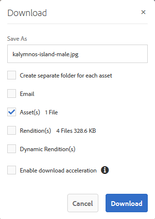
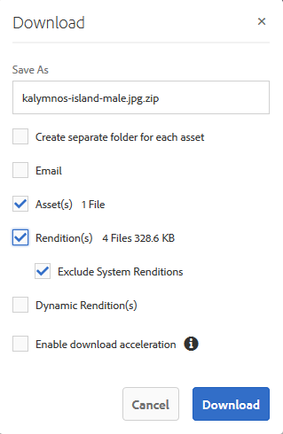

# Baixar ativos {#download-assets}

Todos os usuários podem baixar simultaneamente vários ativos e pastas acessíveis [!DNL Brand Portal]a eles. Dessa forma, os ativos de marca aprovados podem ser distribuídos com segurança para uso offline. Faça a leitura para saber como baixar ativos aprovados e [!DNL Brand Portal]o que esperar do desempenho [do download](../using/brand-portal-download-users.md#main-pars-header).

>[!NOTE]
>
>Somente os administradores podem baixar ativos expirados. Para obter mais informações sobre ativos expirados, consulte [Gerenciar direitos digitais de ativos](../using/manage-digital-rights-of-assets.md).

## Etapas para baixar ativos {#steps-to-download-assets}

Para baixar ativos ou pastas que contenham ativos para [!DNL Brand Portal], siga estas etapas:

1. Na [!DNL Brand Portal] interface, execute um dos procedimentos a seguir:

   * Selecione as pastas ou os ativos que deseja baixar. Na barra de ferramentas na parte superior, clique no **ícone Download** .
   

   * Para baixar uma única pasta ou um ativo, passe o ponteiro do mouse sobre a pasta ou o ativo. Nas miniaturas de ação rápida disponíveis, clique no **ícone Download** .
   

   >[!NOTE]
   >
   >Se os ativos que você está baixando também incluírem ativos licenciados, será redirecionado para a página **Gerenciamento** de direitos autorais. Nessa página, selecione os ativos, clique **em Concordar** e em **Download**. Se você optar por discordar, os ativos licenciados não serão baixados.\
   >Os ativos protegidos por licença possuem [contrato de licença anexado](https://helpx.adobe.com/experience-manager/6-5/assets/using/drm.html#DigitalRightsManagementinAssets) a eles, o que é feito pela definição da propriedade [de metadados do ativo](https://helpx.adobe.com/experience-manager/6-5/assets/using/drm.html#DigitalRightsManagementinAssets) em [!DNL AEM] Ativos.

   

   A caixa de diálogo **Download** é exibida com **a** opção Ativos selecionada por padrão.

   

   >[!NOTE]
   >
   >Se os ativos que você está baixando forem arquivos de imagem e selecionar apenas a **opção** Ativos na caixa de diálogo Download, mas não [forem autorizados pelo administrador a ter acesso às representações originais de arquivos](../using/brand-portal-adding-users.md#main-pars-procedure-202029708) de imagem, nenhum arquivo de imagem será baixado e um Aviso será avisado, informando que foi restringido pelo administrador para acessar representações originais.

   

2. Para baixar as representações de ativos além dos ativos, selecione **Representações**. Entretanto, para permitir que renderizações geradas automaticamente sejam baixadas com execuções personalizadas, desmarque **Excluir representações geradas automaticamente**, que é selecionado por padrão.

   

   Para baixar apenas as execuções, desmarque **Ativos**.

   >[!NOTE]
   >
   >Por padrão, somente os ativos são baixados. No entanto, as representações originais de arquivos de imagem não são baixadas se você não [estiver autorizado pelo administrador a ter acesso às representações originais de arquivos de imagem](../using/brand-portal-adding-users.md#main-pars-procedure-202029708).

   * Para acelerar o download dos arquivos de ativos, [!DNL Brand Portal]selecione **Ativar a opção de aceleração** de download e [siga o assistente](../using/accelerated-download.md#main-pars-header-405749062). Para saber mais sobre o download mais rápido dos ativos, consulte [Guia para acelerar os downloads de [! DNL Brand Portal]](../using/accelerated-download.md).

   * Para aplicar uma [predefinição de imagem personalizada ao ativo e suas execuções](../using/brand-portal-image-presets.md#applyimagepresetswhendownloadingimages), selecione **Representações dinâmicas**. Especifique propriedades predefinidas de imagens (tamanho, formato, espaço de cor, resolução e modificador de imagem) para aplicar a predefinição de imagens personalizadas ao baixar o ativo e suas execuções. Para baixar apenas as representações dinâmicas, exclua **os ativos**.
   

   >[!NOTE]
   >
   >Para visualizar (ou baixar) representações dinâmicas de qualquer ativo, certifique-se de que a mídia dinâmica esteja ativada e [!UICONTROL que a] renderização de pirâmide do ativo existe na instância [!DNL AEM] do autor, de onde os ativos foram publicados. Quando um ativo é publicado [!DNL Brand Portal], sua [!UICONTROL renderização tiff] Pirramid também é publicada. Não há uma forma de gerar [!UICONTROL a execução tiff] Pirâmid.[!DNL Brand Portal]

   * Para preservar a hierarquia [!DNL Brand Portal] de pastas ao baixar ativos, selecione **Criar pasta separada para cada ativo**. Por padrão, [!DNL Brand Portal] a hierarquia de pastas é ignorada e todos os ativos são baixados em uma pasta no sistema local.

   * Para enviar uma notificação por email para usuários com um link para baixar os ativos, selecione **Email**.
   

   >[!NOTE]
   >
   >O link de download por email expira após 45 dias.
   >
   >Os administradores podem personalizar mensagens de e-mail, isto é, logotipo, descrição e rodapé, usando o recurso [Marca](../using/brand-portal-branding.md) .

3. Clique **em Download**.

   Os ativos (e execuções se selecionados) são baixados como um arquivo ZIP para sua pasta local. No entanto, nenhum arquivo zip é criado se um único ativo for baixado sem qualquer das execuções, garantindo assim o download rápido.

   As representações originais dos ativos selecionados não serão baixadas se você não [estiver autorizado pelo administrador a ter acesso às representações originais](../using/brand-portal-adding-users.md#main-pars-procedure-202029708).

   >[!NOTE]
   >
   >Os ativos selecionados individualmente e baixados ficam visíveis no relatório baixado de ativos. No entanto, se uma pasta que contém ativos for baixada, nem a pasta nem os ativos serão exibidos no relatório baixado de ativos.

   Para saber como baixar ativos de links compartilhados, consulte [Download de ativos de links compartilhados](../using/brand-portal-link-share.md#main-pars-header-1703469193).

## O desempenho de download esperado {#expected-download-performance}

A experiência de download de arquivo pode variar para usuários em locais clientes diferentes, dependendo de fatores como conexão local na Internet e latência do servidor. O desempenho de download esperado para o arquivo 2 GB observado em locais clientes diferentes é o seguinte, com [!DNL Brand Portal] o servidor em Oregon nos Estados Unidos:

| Localização do cliente | Latência entre cliente e servidor | Velocidade de download esperada | Tempo gasto para baixar um arquivo 2 GB |
|-------------------------|-----------------------------------|-------------------------|------------------------------------|
| Oeste dos EUA (N. Califórnia) | 18 milissegundos | 7.68 MB/s | 4 minutos |
| Oeste dos EUA (Oregon) | 42 milissegundos | 3.84 MB/s | 9 minutos |
| Leste dos EUA (N. Virgínia) | 85 milissegundos | 1.61 MB/s | 21 minutos |
| APAC (Tóquio) | 124 milissegundos | 1.13 MB/s | 30 minutos |
| Noida | 275 milissegundos | 0.5 MB/s | 68 minutos |
| Sydney | 175 milissegundos | 0.49 MB/s | 69 minutos |
| Londres | 179 milissegundos | 0.32 MB/s | 106 minutos |
| Cingapura | 196 milissegundos | 0.5 MB/s | 68 minutos |

**Observação**: Os dados citados são observados em condições de teste, o que pode variar para usuários em locais diferentes, testemunhando latência e largura de banda variadas.
