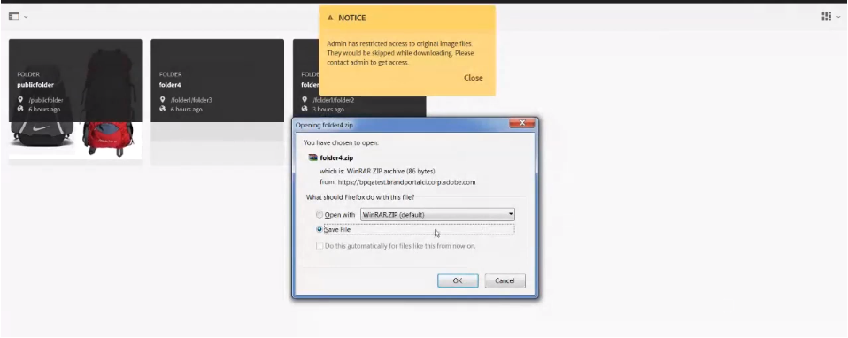

# Baixar ativos {#download-assets}

Todos os usuários podem baixar simultaneamente vários ativos e pastas acessíveis a eles no Portal de marcas. Dessa forma, os ativos aprovados da marca podem ser distribuídos com segurança para uso offline. Leia para saber como baixar os ativos aprovados no Brand Portal e o que esperar do desempenho [do](../using/brand-portal-download-users.md#main-pars-header)download.

>[!NOTE]
>
>Somente administradores podem baixar ativos expirados. Para obter mais informações sobre ativos expirados, consulte [Gerenciar direitos digitais de ativos](../using/manage-digital-rights-of-assets.md).

## Etapas para baixar ativos {#steps-to-download-assets}

Para baixar ativos ou pastas que contêm ativos para o Brand Portal, siga estas etapas:

1. Na interface do Brand Portal, execute um dos procedimentos a seguir:

   * Selecione as pastas ou os ativos que deseja baixar. From the toolbar at the top, click the **[!UICONTROL Download]** icon.
   

   * Para baixar uma única pasta ou um ativo, passe o ponteiro sobre a pasta ou o ativo. Nas miniaturas de ação rápida disponíveis, clique no ícone **[!UICONTROL Download]** .
   

   >[!NOTE]
   >
   >If the assets you are downloading also include licensed assets, you are redirected to the Copyright Management page. **** Nesta página, selecione os ativos, clique em **[!UICONTROL Concordar]** e em **[!UICONTROL Baixar]**. Se você optar por discordar, os ativos licenciados não serão baixados.\
   >Os ativos protegidos por licença têm o contrato de [licença anexado](https://helpx.adobe.com/experience-manager/6-5/assets/using/drm.html#DigitalRightsManagementinAssets) a eles, o que é feito ao configurar a propriedade [de](https://helpx.adobe.com/experience-manager/6-5/assets/using/drm.html#DigitalRightsManagementinAssets) metadados do ativo nos ativos AEM.

   

   The Download dialog box appears with the Asset(s) option selected by default.********

   

   >[!NOTE]
   >
   >If the assets you are downloading are image files, and you select only the Asset(s) option in Download dialog but are not authorized by the administrator to have access to the original renditions of image files then no image files are downloaded and a Notice prompts, stating that you have been restricted by administrator to access original renditions.****

   

1. Para baixar as representações de ativos além dos ativos, selecione **[!UICONTROL Representações]**. However, to allow auto-generated renditions to download along with custom renditions, deselect Exclude Auto Generated Renditions, which is selected by default.****

   

   Para baixar somente as representações, desmarque **[!UICONTROL Ativo(s)]**.

   >[!NOTE]
   >
   >By default, only the assets are downloaded. However, original renditions of image files are not downloaded if you are not authorized by the administrator to have access to the original renditions of image files.

   * To speed up the download of asset files from Brand Portal, select Enable download acceleration option and follow the wizard. **** To know more about faster download of assets refer guide to accelerate downloads from Brand Portal.

   * To apply a [custom image preset to the asset and its renditions](../using/brand-portal-image-presets.md#applyimagepresetswhendownloadingimages), select **[!UICONTROL Dynamic Rendition(s)]**. Specify custom image preset properties (size, format, color space, resolution, and image modifier) to apply the custom image preset while downloading the asset and its renditions. To download only the dynamic renditions, delesect Asset(s).****
   

   >[!NOTE]
   >
   >To preview (or download) dynamic renditions of any asset, ensure that the dynamic media is enabled and the asset's Pyramid tiff rendition exists at the AEM author instance, from where the assets have been published. When an asset is published to Brand Portal, its Pyramid tiff rendition is also published. There is no way of generating the Pyramid tiff rendition from Brand Portal.

   * Para preservar a hierarquia de pastas do Brand Portal ao baixar ativos, selecione **[!UICONTROL Criar pasta separada para cada ativo]**. Por padrão, a hierarquia de pastas do Brand Portal é ignorada e todos os ativos são baixados em uma pasta no sistema local.

   * Para enviar uma notificação por email aos usuários com um link para baixar os ativos, selecione **[!UICONTROL Enviar por email]**.
   

   >[!NOTE]
   >
   >O link de download na notificação por email expira após 45 dias.
   >
   >Os administradores podem personalizar mensagens de email, isto é, logotipo, descrição e rodapé, usando o recurso [Marca](../using/brand-portal-branding.md) .

1. Clique em **[!UICONTROL Download]**.

   Os ativos (e as representações, se selecionadas) são baixados como um arquivo ZIP para a pasta local. No entanto, nenhum arquivo zip será criado se um único ativo for baixado sem nenhuma das representações, garantindo assim um download rápido.

   As representações originais dos ativos selecionados não são baixadas se você não estiver [autorizado pelo administrador a ter acesso às representações](../using/brand-portal-adding-users.md#main-pars-procedure-202029708)originais.

   >[!NOTE]
   >
   >Os ativos selecionados individualmente e baixados ficam visíveis no relatório de ativos baixados. No entanto, se uma pasta que contém ativos for baixada, nem a pasta nem os ativos serão exibidos no relatório de ativos baixados.

   Para saber como baixar ativos de links compartilhados, consulte [baixando ativos de links](../using/brand-portal-link-share.md#main-pars-header-1703469193)compartilhados.

## Desempenho de download esperado {#expected-download-performance}

A experiência de download de arquivo pode variar para usuários em diferentes locais de cliente, dependendo de fatores como conectividade local à Internet e latência do servidor. O desempenho de download esperado para um arquivo de 2 GB observado em diferentes locais do cliente é o seguinte, com o servidor Brand Portal, no Oregon, Estados Unidos:

| Local do cliente | Latência entre cliente e servidor | Velocidade de download esperada | Tempo necessário para baixar um arquivo de 2 GB |
|-------------------------|-----------------------------------|-------------------------|------------------------------------|
| Oeste dos EUA (N. Califórnia) | 18 milissegundos | 7,68 MB/s | 4 minutos |
| Oeste dos EUA (Oregon) | 42 milissegundos | 3,84 MB/s | 9 minutos |
| Leste dos EUA (N. Virgínia) | 85 milissegundos | 1.61 MB/s | 21 minutes |
| APAC (Tóquio) | 124 milliseconds | 1,13 MB/s | 30 minutos |
| Noida | 275 milliseconds | 0,5 MB/s | 68 minutes |
| Sydney | 175 milissegundos | 0,49 MB/s | 69 minutos |
| Londres | 179 milissegundos | 0.32 MB/s | 106 minutos |
| Cingapura | 196 milissegundos | 0.5 MB/s | 68 minutos |

**Note: Cited data are observed under test conditions, which may vary for users at different locations witnessing varied latency and bandwidth.**
