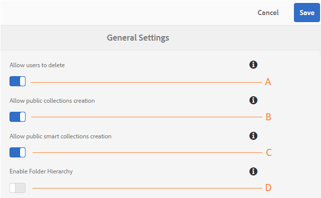

# Administrar configurações de locatários gerais {#administer-general-tenant-configurations}

O Experience Manager Assets Brand Portal permite que as organizações configurem os seguintes recursos para locatários específicos:

* Exclusão de ativos por administradores
* Criação de coleção pública por usuários não administradores
* Criação de coleção inteligente pública por usuários não administradores
* Hierarquia pai de pastas compartilhadas visível para usuários não administradores

Essas configurações foram fornecidas como configurações **[!UICONTROL Configurações Gerais]** no painel Ferramentas administrativas.

****   Configuração do AConfiguration para permitir que os administradores excluam ativos do Brand Portal. (O padrão está ativado)

****   BConfiguration para permitir que usuários não administradores criem coleções públicas. (O padrão está ativado)

****   Configuração para permitir que usuários não administradores criem coleções inteligentes públicas. (O padrão está ativado)

****  Configuração para exibir a hierarquia de pastas (da raiz) das pastas compartilhadas para usuários não administradores (Editores, Visualizadores, Usuários Convidados). (O padrão está desativado)

## Ativar/desativar Configurações gerais {#enable-disable-general-configurations}

Para ativar/desativar cada uma dessas configurações:

1. Faça logon com privilégios de administrador.
1. Selecione o logotipo do Experience Manager para acessar ferramentas administrativas, na barra de ferramentas na parte superior.
1. No painel de ferramentas administrativas, selecione **[!UICONTROL Geral]** para abrir a página **[!UICONTROL Configurações gerais]**.
1. Use o respectivo switch de alternância para ativar/desativar qualquer uma das configurações Gerais.
1. **[!UICONTROL Salve as alterações.]**
1. Faça logoff para que as alterações entrem em vigor.

## Permitir que usuários administradores excluam ativos do Brand Portal {#allow-admin-users-to-delete-assets-from-brand-portal}

**[!UICONTROL Permitir que usuários]** excluam a configuração permite que as organizações permitam (ou restrinjam) que usuários com privilégios de administrador excluam ativos e pastas do Brand Portal.

## Permitir a criação de coleções públicas por não administradores {#allow-public-collections-creation-by-non-admins}

[[!UICONTROL Permitir que coleções públicas ]](../using/brand-portal-share-collection.md#main-pars-text-1915052376) criem controles de configuração se não administradores podem criar coleções públicas no Brand Portal. A configuração é ativada por padrão. Ao desabilitar a configuração, as organizações podem evitar a existência de várias coleções públicas em seu portal para que o espaço do sistema possa ser salvo.

## Permitir a criação de coleções inteligentes públicas por não administradores {#allow-public-smart-collections-creation-by-non-admins}

[[!UICONTROL Permitir que coleções inteligentes públicas ]](../using/brand-portal-searching.md#main-pars-header-500620467) criem controles de configuração se não administradores podem salvar suas pesquisas como coleções inteligentes e torná-las públicas para esse locatário. A configuração é ativada por padrão. Ao desabilitar as organizações de configuração, é possível evitar um grande número de coleções inteligentes públicas criadas por usuários não administradores no Brand Portal da organização.

<!-- 
## Allow download acceleration {#allow-download-acceleration}

[[!UICONTROL Allow download acceleration]](../using/accelerated-download.md) configuration lets the organizations to allow accelerated downloads of assets from Brand Portal and shared links, by integrating with IBM Aspera Connect that is an install-on-demand application. The application uses proprietary technology to remove TCP overheads.
-->

## Ativar hierarquia de pastas {#enable-folder-hierarchy}

[[!UICONTROL Ativar ]](../using/brand-portal-sharing-folders.md#non-admin-user-access-to-shared-folders) hierarquia de pastas permite que os administradores controlem como os usuários não administradores (editores, visualizadores e usuários convidados) visualizam as pastas compartilhadas após fazer logon.
