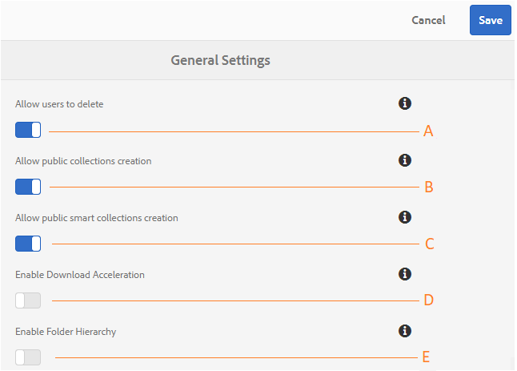

# Administrar configurações gerais de locatário {#administer-general-tenant-configurations}

[!DNL AEM] Os ativos [!DNL Brand Portal] permitem que as organizações configurem os seguintes recursos para inquilinos específicos:

* Exclusão de ativo por administradores
* Criação de [!UICONTROL coleção] pública por usuários não administradores
* Criação de [!UICONTROL coleção] inteligente pública por usuários não administradores
* Aceleração de download
* Hierarquia principal das pastas compartilhadas visíveis para usuários não administradores

Essas configurações foram fornecidas como **configurações gerais de configurações** no painel de ferramentas administrativas.

**Uma** Configuração para permitir que os administradores excluam ativos de [!DNL Brand Portal]. (O padrão está ativado)

**Configuração B** para permitir que usuários não administradores criem [!UICONTROL coleções públicas]. (O padrão está ativado)

**Configuração C** para permitir que usuários não administradores criem coleções inteligentes [!UICONTROL públicas]. (O padrão está ativado)

**Configuração D** para permitir a aceleração de download dos ativos baixados do portal e dos links compartilhados. (O padrão está desativado)

**Configuração** para exibir a hierarquia de pastas (da raiz) das pastas compartilhadas para usuários não administradores (Editores, Visualizadores, Usuários convidados). (O padrão está desativado)

## Ativar/desativar configurações gerais {#enable-disable-general-configurations}

Para ativar/desativar cada uma dessas configurações:

1. Faça logon com privilégios de administrador.
2. Selecione o [!DNL AEM] logotipo para acessar as ferramentas administrativas, na barra de ferramentas na parte superior.
3. No painel de ferramentas administrativas, selecione **Geral** para abrir a **página Configurações** gerais.
4. Use a respectiva mudança de alternância para ativar/desativar qualquer uma das configurações Gerais.
5. **Salve as alterações.**
6. Faça logout para que as alterações tenham efeito.

## Permitir que usuários administradores excluam ativos de [!DNL Brand Portal]{#allow-admin-users-to-delete-assets-from-brand-portal}

**Permitir que os usuários excluam** a configuração permite que as organizações possam permitir (ou restringir) usuários com privilégios de administrador para excluir ativos e pastas.[!DNL Brand Portal]

## Permitir a criação de coleções públicas por usuários que não sejam administradores {#allow-public-collections-creation-by-non-admins}

[Permitir criação de [!UICONTROL coleções]públicas] (../using/brand-portal-share-[!UICONTROL collection]. md # main-pars-text -1915052376) controla se não administradores podem criar [!UICONTROL coleções]públicas. [!DNL Brand Portal] A configuração é habilitada por padrão. Desativar as organizações de configuração pode impedir a presença de várias [!UICONTROL coleções públicas]em seu portal para que o espaço do sistema possa ser salvo.

## Permitir a criação de coleções inteligentes públicas por usuários que não sejam administradores {#allow-public-smart-collections-creation-by-non-admins}

[Permitir a configuração de criação](../using/brand-portal-searching.md#main-pars-header-500620467) de coleções inteligentes públicas controla se não os administradores podem salvar suas pesquisas como [!UICONTROL coleções inteligentes] e torná-las públicas para o locatário. A configuração é habilitada por padrão. Desativar as organizações de configuração pode evitar ter um grande número de coleções inteligentes [!UICONTROL públicas] criadas por usuários não administradores na organização [!DNL Brand Portal].

## Permitir aceleração de download {#allow-download-acceleration}

[Permitir a configuração de aceleração](../using/accelerated-download.md) de download permite que as organizações permitem downloads acelerados de ativos de [!DNL Brand Portal] links e links compartilhados, através da integração com o IBM Aspera Connect que é um aplicativo de demanda de instalação. O aplicativo usa tecnologia proprietária para remover sobreposições TCP.

## Ativar hierarquia de pastas {#enable-folder-hierarchy}

[Habilitar a configuração Hierarquia](../using/brand-portal-sharing-folders.md#non-admin-user-access-to-shared-folders) de pastas permite que os administradores controlem como os usuários não administradores (Editores, Visualizadores e Usuários convidados) veem as pastas compartilhadas após fazer logon.
