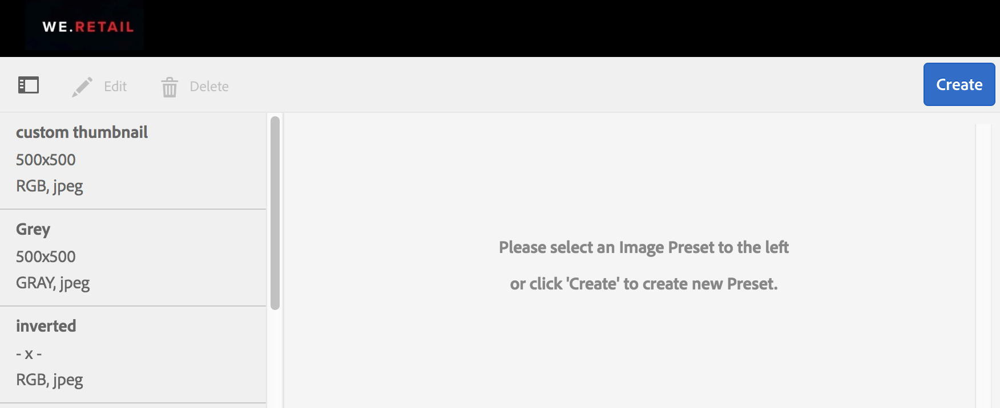
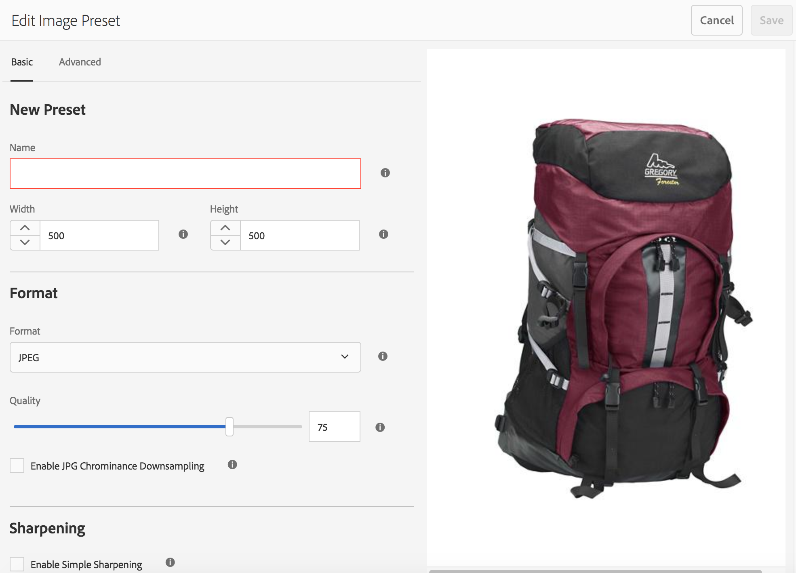
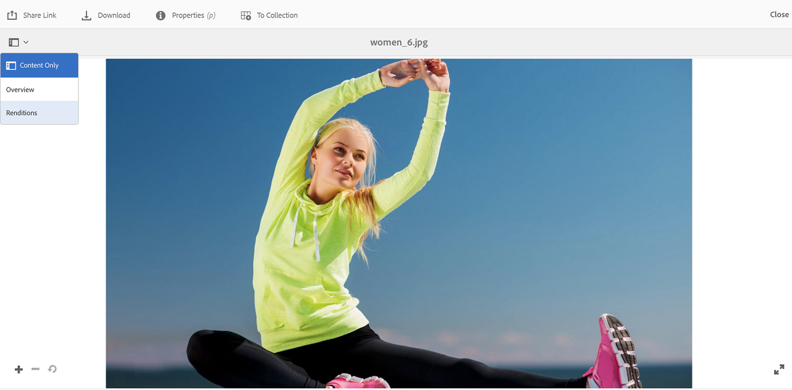
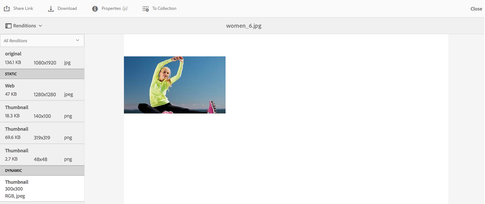
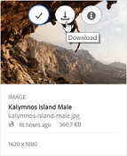
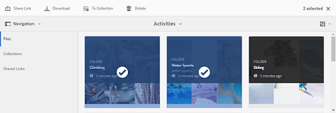
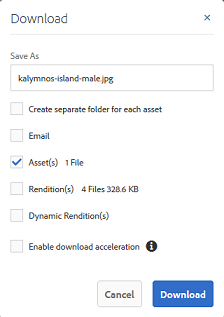
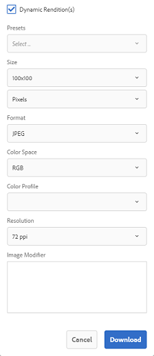

# Aplicar predefinições de imagens ou representações dinâmicas {#apply-image-presets-or-dynamic-renditions}

Como uma macro, uma predefinição de imagem é uma coleção predefinida de comandos de dimensionamento e formatação salvos em um nome. As predefinições de imagens permitem que o AEM Assets Brand Portal forneça dinamicamente imagens de diferentes tamanhos, formatos e propriedades.

Uma predefinição de imagem é usada para gerar representações dinâmicas de imagens que podem ser visualizadas e baixadas. Ao visualizar imagens e suas representações, você pode escolher uma predefinição para reformatar imagens de acordo com as especificações definidas pelo Administrador.

(*Se AEM instância do autor estiver em execução em **Modo Dynamic Media Híbrido***) Para exibir representações dinâmicas de um ativo no Brand Portal, verifique se a representação tiff em Pyramid existe na instância do autor AEM de onde você publica no Brand Portal. Ao publicar o ativo, sua representação PTIFF também é publicada no Brand Portal.

>[!NOTE]
>
>Ao baixar imagens e suas representações, não há opção para escolher entre as predefinições existentes. Em vez disso, você pode especificar as propriedades de uma predefinição de imagem personalizada. Para obter mais informações, consulte [Aplicar predefinições de imagens ao baixar imagens](../using/brand-portal-image-presets.md#main-pars-text-1403412644).

Para obter mais informações sobre os parâmetros necessários ao criar predefinições de imagens, consulte [Gerenciar predefinições de imagens](https://docs.adobe.com/docs/en/AEM/6-0/administer/integration/dynamic-media/image-presets.html).

## Criar uma predefinição de imagem {#create-an-image-preset}

Os administradores de AEM podem criar predefinições de imagens que são exibidas como representações dinâmicas na página de detalhes do ativo. Você pode criar uma predefinição de imagem do zero ou salvar uma predefinição existente com um novo nome. Ao criar uma predefinição de imagem, escolha um tamanho para a entrega de imagem e os comandos de formatação. Quando uma imagem é entregue para exibição, sua aparência é otimizada de acordo com os comandos escolhidos.

>[!NOTE]
>
>As representações dinâmicas de uma imagem são criadas usando seu TIFF de pirâmide. Se o TIFF de Pirâmide não estiver disponível para nenhum ativo, as representações dinâmicas desse ativo não poderão ser buscadas no Portal da Marca.
>
>Se AEM instância do autor estiver em execução no **Modo híbrido Dynamic Media**, as representações de Pyramid TIFF de ativos de imagem serão criadas e salvas AEM repositório.
>
>Enquanto que, se AEM instância do autor estiver em execução no **modo Dynamic Media Scene7**, as representações de Pyramid TIFF de ativos de imagem existem no servidor Scene7.
>
>Quando esses ativos são publicados no portal da marca, as predefinições de imagem são aplicadas e as representações dinâmicas são exibidas.

1. Na barra de ferramentas AEM na parte superior, clique no logotipo Adobe para acessar as ferramentas administrativas.

1. No painel de ferramentas administrativas, clique em **[!UICONTROL Predefinições de imagem]**.

   

1. Na página de predefinições da imagem, clique em **[!UICONTROL Criar]**.

   

1. Na página **[!UICONTROL Editar predefinição de imagem]**, insira valores nas guias **[!UICONTROL Básico]** e **[!UICONTROL Avançado]** conforme apropriado, incluindo um nome. As opções são descritas em [Opções de predefinição de imagem](https://docs.adobe.com/docs/en/AEM/6-0/administer/integration/dynamic-media/image-presets.html#Image%20preset%20options). As predefinições aparecem no painel à esquerda e podem ser usadas junto com outros ativos.

   

   >[!NOTE]
   >
   >Você também pode usar a página **[!UICONTROL Editar predefinição de imagem]** para editar as propriedades de uma predefinição de imagem existente. Para editar uma predefinição de imagem, selecione-a na página predefinições de imagem e clique em **[!UICONTROL Editar]**.

1. Clique em **[!UICONTROL Salvar]**. A predefinição de imagem é criada e exibida na página de predefinições de imagem.
1. Para excluir uma predefinição de imagem, selecione-a na página de predefinições de imagem e clique em **[!UICONTROL Excluir]**. Na página de confirmação, clique em **[!UICONTROL Delete]** para confirmar a exclusão. A predefinição de imagem é removida da página de predefinições de imagem.

## Aplicar predefinições de imagens ao visualizar imagens  {#apply-image-presets-when-previewing-images}

Ao visualizar imagens e suas representações, escolha entre as predefinições existentes para reformatar as imagens de acordo com as especificações definidas pelo Administrador.

1. Na interface do Brand Portal, clique em uma imagem para abri-la.
1. Clique no ícone de sobreposição à esquerda e escolha **[!UICONTROL Representações]**.

   

1. Na lista **[!UICONTROL Representações]**, selecione a representação dinâmica apropriada, por exemplo, **[!UICONTROL Miniatura]**. A imagem de visualização é renderizada com base na sua escolha da representação.

   

## Aplicar predefinições de imagens ao baixar imagens {#apply-image-presets-when-downloading-images}

Ao baixar imagens e suas representações do Brand Portal, não é possível escolher entre as predefinições de imagens existentes. Entretanto, é possível personalizar as propriedades da predefinição de imagens com base nas quais deseja reformatar as imagens.

1. Na interface do Brand Portal, execute um dos seguintes procedimentos:

   * Passe o ponteiro do mouse sobre a imagem que deseja baixar. Nas miniaturas de ação rápida disponíveis, clique no ícone **[!UICONTROL Download]**.

   

   * Selecione a imagem que deseja baixar. Na barra de ferramentas na parte superior, clique no ícone **[!UICONTROL Download]**.

   

1. Na caixa de diálogo **[!UICONTROL Download]**, selecione as opções necessárias, dependendo se deseja baixar o ativo com ou sem suas representações.

   

1. Para baixar representações dinâmicas do ativo, selecione a opção **[!UICONTROL Representações dinâmicas]** .
1. Personalize propriedades de predefinições de imagens com base nas quais deseja reformatar dinamicamente a imagem e suas representações durante o download. Especifique o tamanho, o formato, o espaço de cor, a resolução e o modificador de imagem.

   

1. Clique em **[!UICONTROL Baixar]**. As representações dinâmicas personalizadas são baixadas em um arquivo ZIP, juntamente com a imagem e as representações que você escolheu baixar. No entanto, nenhum arquivo zip será criado se um único ativo for baixado, o que garante o download rápido.
