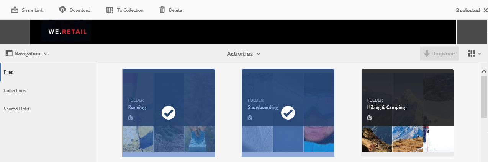
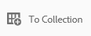
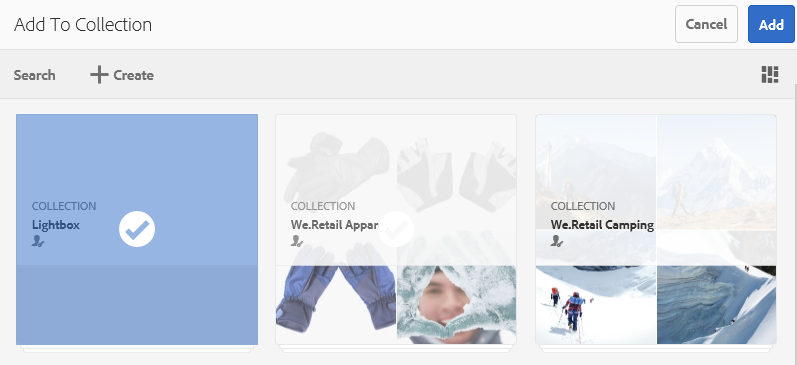
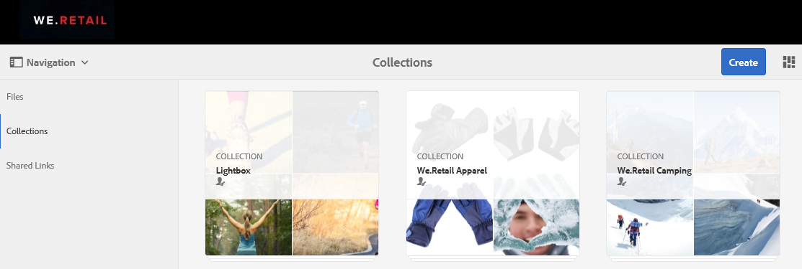
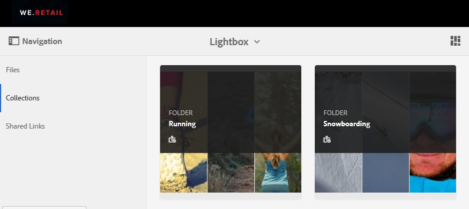
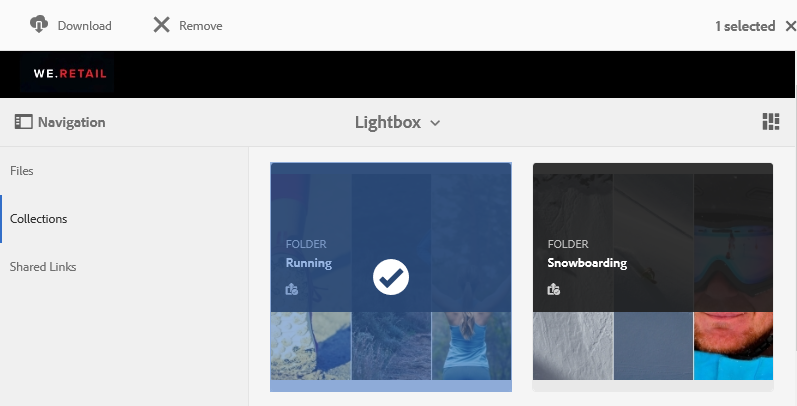

# Gerenciar a coleção lightbox {#manage-the-lightbox-collection}

[!UICONTROL O Lightbox] é um tipo especial de coleção que fornece acesso fácil aos ativos. Cada usuário tem um [!UICONTROL Lightbox] exclusivo criado automaticamente quando eles fazem logon no Brand Portal pela primeira vez. A coleção [!UICONTROL Lightbox] não pode ser excluída.

## Adicionar ativos ao lightbox {#add-assets-to-lightbox}

Para adicionar ativos ao [!UICONTROL Lightbox], faça o seguinte:

1. Vá até o local dos ativos que deseja adicionar ao [!UICONTROL Lightbox]e selecione os ativos.

   

2. Na barra de ferramentas na parte superior, clique no ícone adicionar à coleção.

   

3. Na página **[!UICONTROL Adicionar à coleção]** , a coleção [!UICONTROL do Lightbox] é selecionada por padrão.

   Clique em **[!UICONTROL Adicionar]**. Os ativos selecionados são adicionados ao [!UICONTROL Lightbox].

   

4. Para revisar os ativos adicionados ao [!UICONTROL Lightbox], clique **[!UICONTROL em Coleções]** no painel esquerdo e clique na **[!UICONTROL coleção Lightbox]** .

   

   Os ativos adicionados ao [!UICONTROL Lightbox] aparecem na página [!UICONTROL Lightbox] .

   

## Remover ativos do lightbox {#remove-assets-from-lightbox}

1. Para revisar os ativos no [!UICONTROL Lightbox], clique **[!UICONTROL em Coleções]** no painel esquerdo e clique na [!UICONTROL coleção Lightbox] .

   

2. Selecione a pasta que deseja remover da coleção e clique **[!UICONTROL em Remover]** da barra de ferramentas na parte superior.

   

3. Na caixa de mensagem de aviso, clique **[!UICONTROL em Remover]** para confirmar a remoção.

A pasta é excluída da coleção [!UICONTROL do Lightbox] .
