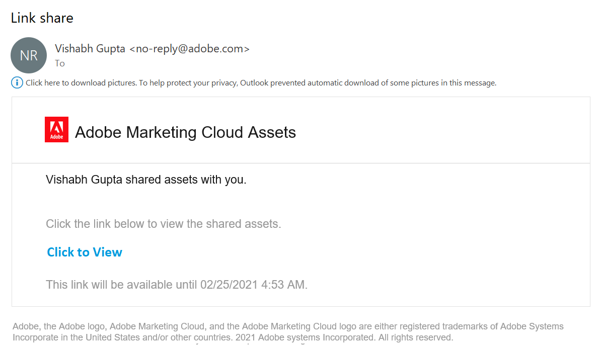
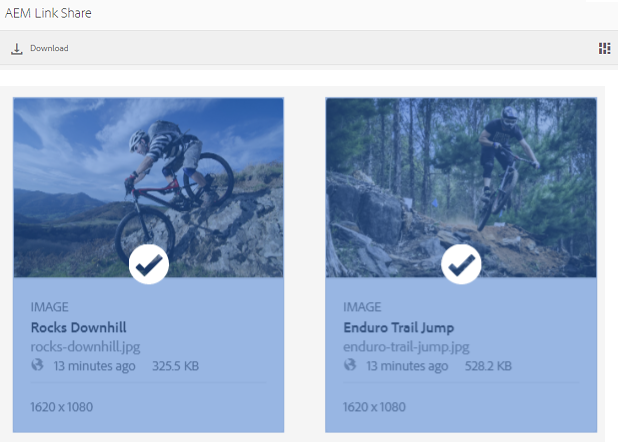
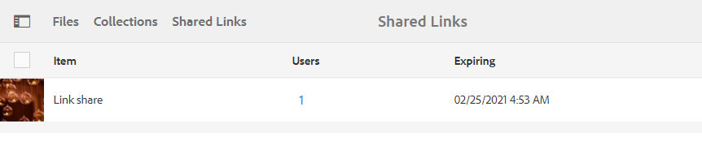
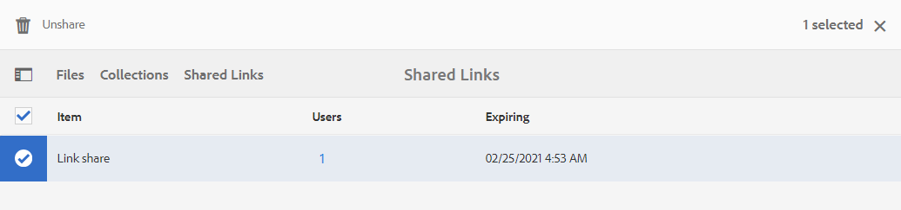

# Compartilhar ativos como um link {#share-assets-as-a-link}

Os administradores do Portal de marcas do Adobe Experience Manager Assets podem compartilhar links de vários ativos com usuários internos autorizados e entidades externas, inclusive parceiros e fornecedores. Os editores podem visualização e compartilhar somente os ativos compartilhados com eles.

Compartilhar ativos por meio de um link é uma maneira conveniente de disponibilizá-los a terceiros, já que os receptores não precisam fazer logon no Brand Portal para acessar os ativos.

<!-- Link sharing access is restricted to editors and administrators. 
-->

Para obter mais informações, consulte [Gerenciamento de usuários, grupos e funções de usuário](../using/brand-portal-adding-users.md#manage-user-roles).

>[!NOTE]
>
>É permitido até 5 GB de zip download usando o recurso de compartilhamento de link no Brand Portal.

Veja a seguir as etapas para compartilhar ativos como um link:

1. Faça logon no seu locatário do Brand Portal. Por padrão, a visualização **[!UICONTROL Arquivos]** é aberta, contendo todos os ativos e pastas publicados.

1. Selecione os ativos ou pastas que deseja compartilhar ou navegue até a visualização **[!UICONTROL Coleções]** para compartilhar as coleções que você criou.

   

1. Na barra de ferramentas na parte superior, clique no ícone **[!UICONTROL Compartilhar link]**.

   A caixa de diálogo **[!UICONTROL Compartilhamento de links]** é exibida.

   

   * Na caixa de endereço de email, digite a ID de email do usuário com quem você deseja compartilhar o link. Você pode compartilhar o link com vários usuários. Se o usuário for membro de sua organização, selecione sua ID de e-mail nas sugestões exibidas na lista suspensa. Se o usuário for externo, digite a ID de email completa e pressione **[!UICONTROL Enter]**; a ID de email é adicionada à lista dos usuários.

      

   * Na caixa **[!UICONTROL Assunto]**, digite um assunto para o ativo que deseja compartilhar.
   * Na caixa **[!UICONTROL Message]**, digite uma mensagem, se necessário.
   * No campo **[!UICONTROL Expiração]**, use o seletor de datas para especificar uma data e hora de expiração para o link. Por padrão, a data de expiração é definida como 7 dias a partir da data em que você compartilha o link.
   * Ative a caixa de seleção **[!UICONTROL Permitir download do arquivo original]** para permitir que os destinatários baixem a representação original.

   Os ativos compartilhados pelo link expiram após a data e a hora especificadas no campo **[!UICONTROL Expiração]**. Para obter informações sobre o comportamento dos ativos expirados e alterações nas atividades permitidas com base nas funções de usuário no Brand Portal, consulte [Gerenciar direitos digitais de ativos](../using/manage-digital-rights-of-assets.md#asset-expiration).

   >[!NOTE]
   >
   >O tempo de expiração padrão do link é de 7 dias. O link deve ser enviado por email para os usuários usando a caixa de diálogo **[!UICONTROL Compartilhamento de link]**. Não copie e compartilhe o link separadamente.

1. Clique em **[!UICONTROL Compartilhar]**. Uma mensagem confirma que o link é compartilhado com os usuários. Os usuários recebem um email contendo o link compartilhado.

   

   >[!NOTE]
   >
   >Os administradores podem personalizar as mensagens de email, o que inclui personalizar o logotipo, a descrição e o rodapé com o recurso [Marca](../using/brand-portal-branding.md).

## Baixar ativos de links compartilhados {#download-assets-from-shared-links}

Clique no link no email para acessar o ativo compartilhado. A página Compartilhamento de links AEM é aberta.

Para baixar os ativos compartilhados:

1. Clique nos ativos ou pastas e, em seguida, clique no ícone **[!UICONTROL Download]** na barra de ferramentas.

   

   >[!NOTE]
   >
   >Atualmente, você pode gerar uma pré-visualização e uma miniatura somente para determinados ativos, dependendo do formato do arquivo. Para obter mais informações sobre os formatos de arquivo suportados, consulte [Pré-visualização e suporte de miniatura para formatos de ativos](#preview-thumbnail-support).

1. A caixa de diálogo **[!UICONTROL Download]** é exibida.

   

1. Por padrão, a configuração **[!UICONTROL Download rápido]** está ativada em **[!UICONTROL Configurações de download]**. Portanto, uma caixa de confirmação é exibida para continuar a baixar usando o IBM Aspera Connect.

   Para continuar usando **[!UICONTROL Download rápido]**, clique em **[!UICONTROL Permitir]**.

   Todas as representações selecionadas são baixadas em uma pasta zip contendo uma pasta separada para cada ativo.

   >[!NOTE]
   >
   >Se uma pasta, coleção ou mais de 20 ativos forem selecionados para download, a caixa de diálogo **[!UICONTROL Download]** será ignorada e todas as representações de ativos acessíveis ao usuário, excluindo as representações dinâmicas, serão baixadas em uma pasta zip. Uma pasta separada é criada para cada ativo dentro da pasta zip.

   >[!NOTE]
   >
   >As representações originais não são baixadas usando o link compartilhado se o usuário que compartilhou os ativos como um link não estiver [autorizado pelo administrador a ter acesso às representações originais](../using/brand-portal-adding-users.md#manage-group-roles-and-privileges).

>[!NOTE]
>
>O Brand Portal restringe o download de ativos maiores que 5 GB por tamanho de arquivo.

<!--
1. The **[!UICONTROL Download]** dialog box appears.

   

    * To speed up the download of asset files shared as the link, select **[!UICONTROL Enable download acceleration]** option and [follow the wizard](../using/accelerated-download.md#download-workflow-using-file-accelerator). To know more about the fast download of assets on Brand Portal refer [Guide to accelerate downloads from Brand Portal](../using/accelerated-download.md).
    
1. To download the renditions of assets in addition to the assets from the shared link, select **[!UICONTROL Rendition(s)]** option. When you do so, **[!UICONTROL Exclude System Renditions]** option appears that is selected by default. This prevents the download of out-of-the-box renditions along with approved assets or their custom renditions.

   However, to allow auto-generated renditions to download along with custom renditions, deselect the **[!UICONTROL Exclude System Renditions]** option.

   >[!NOTE]
   >
   >Original renditions are not downloaded using the shared link if the user who shared the assets as a link is not [authorized by the administrator to have access to the original renditions](../using/brand-portal-adding-users.md#manage-group-roles-and-privileges).

   

1. Click **[!UICONTROL Download]**. The assets (and renditions if selected) are downloaded as a ZIP file to your local folder. However, no zip file is created if a single asset is downloaded without any of the renditions, thereby ensuring speedy download.

>[!NOTE]
>
>Brand Portal restricts downloading assets larger than 5GB per file size.
-->

## Suporte de pré-visualização e miniatura para formatos de ativos {#preview-thumbnail-support}

A matriz a seguir lista os formatos de ativos para os quais o Brand Portal suporta miniaturas e pré-visualizações:

| Formato do ativo | Suporte a miniaturas | Suporte à pré-visualização |
|--------------|-------------------|-----------------|
| PNG | Satélite | Satélite |
| GIF | Satélite | Satélite |
| TIFF | Satélite | ✕ |
| JPEG | Satélite | Satélite |
| BMP | Satélite | ✕ |
| PNM* | ND | ND |
| PGM* | ND | ND |
| PBM* | ND | ND |
| PPM* | ND | ND |
| PSD | Satélite | ✕ |
| EPS | ND | ✕ |
| DNG | Satélite | ✕ |
| PICT | Satélite | ✕ |
| PSB* | Satélite | ✕ |
| JPG | Satélite | Satélite |
| AI | Satélite | ✕ |
| DOC | ✕ | ✕ |
| DOCX | ✕ | ✕ |
| ODT* | ✕ | ✕ |
| PDF | Satélite | ✕ |
| HTML | ✕ | ✕ |
| RTF | ✕ | ✕ |
| TXT | Satélite | ✕ |
| XLS | ✕ | ✕ |
| XLSX | ✕ | ✕ |
| ODS | ✕ | ✕ |
| PPT | Satélite | ✕ |
| PPTX | ✕ | ✕ |
| ODP | ✕ | ✕ |
| INDD | Satélite | ✕ |
| PS | ✕ | ✕ |
| QXP | ✕ | ✕ |
| EPUB | Satélite | ✕ |
| AAC | ✕ | ✕ |
| MIDI | ✕ | ✕ |
| 3GP | ✕ | ✕ |
| MP3 | ✕ | ✕ |
| MP4 | ✕ | ✕ |
| OGA | ✕ | ✕ |
| OGG | ✕ | ✕ |
| RA | ✕ | ✕ |
| WAV | ✕ | ✕ |
| WMA | ✕ | ✕ |
| DVI | ✕ | ✕ |
| FLV | ✕ | ✕ |
| M4V | ✕ | ✕ |
| MPG | ✕ | ✕ |
| OGV | ✕ | ✕ |
| MOV | ✕ | ✕ |
| WMV | ✕ | ✕ |
| SWF | ✕ | ✕ |
| TGZ | ND | ✕ |
| JAR | Satélite | ✕ |
| RAR | ND | ✕ |
| TAR | ND | ✕ |
| ZIP | Satélite | ✕ |

A seguinte legenda explica os símbolos usados na matriz:

| Símbolo | Significado |
|---|---|
| Satélite | Este formato de arquivo suporta este recurso |
| ✕ | Este formato de arquivo não é compatível com este recurso |
| ND | Este recurso não se aplica a este formato de arquivo |
| * | Este recurso requer suporte adicional para este formato de arquivo AEM instância do autor, mas não no Portal da Marca após a publicação dos ativos no Portal da Marca |

## Descompartilhar ativos compartilhados como um link {#unshare-assets-shared-as-a-link}

Para cancelar o compartilhamento de ativos compartilhados anteriormente como um link, faça o seguinte:

1. Quando você faz logon no Brand Portal, a visualização **[!UICONTROL File]** é aberta por padrão. Para visualização dos ativos compartilhados como links, navegue até a visualização **[!UICONTROL Links compartilhados]**.

1. Revise os links que você compartilhou da lista exibida.

   

1. Para cancelar o compartilhamento de um link da lista, selecione-o e clique no ícone **[!UICONTROL Cancelar compartilhamento]** na barra de ferramentas na parte superior.

   

   >[!NOTE]
   >
   >A exibição de links compartilhados é específica do usuário. Este recurso não exibe todos os links compartilhados por todos os usuários de um locatário.

1. Na caixa de mensagem de aviso, clique em **[!UICONTROL Continue]** para confirmar o cancelamento do compartilhamento. A entrada do link é removida da lista de links compartilhados.
