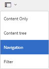
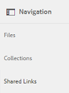
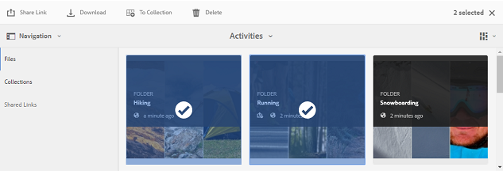
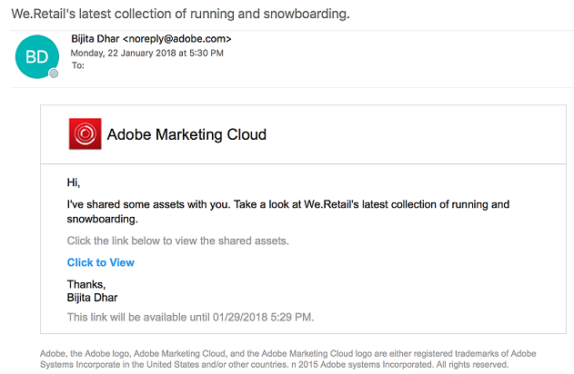
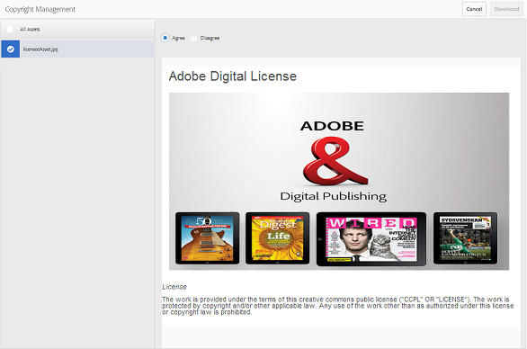
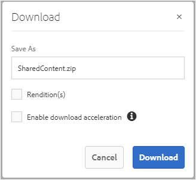
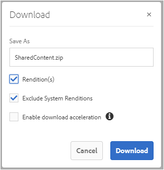

# Compartilhar ativos como um link {#share-assets-as-a-link}

Os administradores do Portal de marcas da AEM Assets podem compartilhar links de vários ativos com usuários internos e entidades externas autorizados, inclusive parceiros e fornecedores. Os editores podem visualização e compartilhar somente os ativos compartilhados com eles.

Compartilhar ativos por meio de um link é uma maneira conveniente de disponibilizá-los a terceiros, já que os receptores não precisam fazer logon no Brand Portal para acessar os ativos.

O acesso ao compartilhamento de links é restrito a editores e administradores.

Para obter mais informações, consulte [Gerenciamento de usuários, grupos e funções de usuário](../using/brand-portal-adding-users.md#manage-user-roles).

>[!NOTE]
>
>É permitido até 5 GB de zip download usando o recurso de compartilhamento de link no Brand Portal.

Veja a seguir as etapas para compartilhar ativos como um link:

1. Clique no ícone de sobreposição à esquerda e escolha **[!UICONTROL Navegação]**.

   

1. Do lado esquerdo, clique em **[!UICONTROL Arquivos]** para compartilhar pastas ou imagens. Para compartilhar coleções, clique em **[!UICONTROL Coleções]**.

   

1. Selecione as pastas ou coleções que deseja compartilhar como um link.

   

1. Na barra de ferramentas na parte superior, clique no ícone **[!UICONTROL Compartilhar link]**.

   A caixa de diálogo **[!UICONTROL Compartilhamento de links]** é exibida.

   

   >[!NOTE]
   >
   >O campo **[!UICONTROL Compartilhar link]** exibe um link de ativo criado automaticamente. O tempo de expiração padrão para este link é de 7 dias. Você pode copiar o link e compartilhá-lo separadamente com os usuários ou compartilhá-lo da caixa de diálogo **[!UICONTROL Compartilhamento de link]**.

1. Na caixa de endereço de email, digite a ID de email do usuário com quem você deseja compartilhar o link. Você pode compartilhar o link com vários usuários.

   Se o usuário for membro de sua organização, selecione sua ID de e-mail nas sugestões exibidas na lista suspensa. Se o usuário for externo, digite a ID de email completa e pressione **[!UICONTROL Enter]**; a ID de email é adicionada à lista dos usuários.

   

1. Na caixa **[!UICONTROL Assunto]**, digite um assunto para o ativo que deseja compartilhar.
1. Na caixa **[!UICONTROL Message]**, digite uma mensagem, se necessário.
1. No campo **[!UICONTROL Expiração]**, use o seletor de datas para especificar uma data e hora de expiração para o link. Por padrão, a data de expiração é definida como 7 dias a partir da data em que você compartilha o link.

   Os ativos compartilhados pelo link expiram após a data e a hora especificadas no campo **[!UICONTROL Expiração]**. Para obter informações sobre o comportamento dos ativos expirados e alterações nas atividades permitidas com base nas funções de usuário no Brand Portal, consulte [Gerenciar direitos digitais de ativos](../using/manage-digital-rights-of-assets.md#asset-expiration).

1. Clique em **[!UICONTROL Compartilhar]**. Uma mensagem confirma que o link é compartilhado com os usuários. Os usuários recebem um email contendo o link.

   

   >[!NOTE]
   >
   >Os administradores podem personalizar as mensagens de email, o que inclui personalizar o logotipo, a descrição e o rodapé com o recurso [Marca](../using/brand-portal-branding.md).

## Baixar ativos de links compartilhados {#download-assets-from-shared-links}

Clique no link no email para visualização do ativo compartilhado. A página Compartilhamento de links AEM é aberta.

Para baixar os ativos compartilhados:

1. Clique nos ativos e no ícone **[!UICONTROL Download]** na barra de ferramentas.

   

   >[!NOTE]
   >
   >Atualmente, você pode gerar uma pré-visualização e uma miniatura somente para determinados ativos, dependendo do formato do arquivo. Para obter mais informações sobre os formatos de arquivo suportados, consulte [Pré-visualização e suporte de miniatura para formatos de ativos](#preview-thumbnail-support).

   >[!NOTE]
   >
   >Se os ativos que você está baixando também incluírem ativos licenciados, você será redirecionado para a página **[!UICONTROL Gerenciamento de direitos autorais]**. Nesta página, selecione os ativos licenciados, clique em **[!UICONTROL Concordar]** e, em seguida, clique em **[!UICONTROL Baixar]**. Se você optar por discordar, somente os ativos não licenciados serão baixados.\
   >Os ativos protegidos por licença têm [contrato de licença anexado](https://helpx.adobe.com/experience-manager/6-5/assets/using/drm.html#DigitalRightsManagementinAssets) a eles, o que é feito ao configurar a [propriedade de metadados do ativo](https://helpx.adobe.com/experience-manager/6-5/assets/using/drm.html#DigitalRightsManagementinAssets) em [!DNL AEM Assets].

   

   A caixa de diálogo **[!UICONTROL Download]** é exibida.

   

   * Para acelerar o download de arquivos de ativos compartilhados como o link, selecione a opção **[!UICONTROL Ativar aceleração de download]** e [siga o assistente](../using/accelerated-download.md#download-workflow-using-file-accelerator). Para saber mais sobre o rápido download de ativos no Brand Portal, consulte [Guia para acelerar os downloads do Brand Portal](../using/accelerated-download.md).

1. Para baixar as representações de ativos além dos ativos do link compartilhado, selecione a opção **[!UICONTROL Representação(ões)]**. Ao fazer isso, a opção **[!UICONTROL Excluir representações do sistema]** é exibida e selecionada por padrão. Isso impede o download de execuções prontas juntamente com ativos aprovados ou suas execuções personalizadas.

   No entanto, para permitir que execuções geradas automaticamente baixem juntamente com execuções personalizadas, desmarque a opção **[!UICONTROL Excluir representações do sistema]**.

   >[!NOTE]
   >
   >As representações originais não são baixadas usando o link compartilhado se o usuário que compartilhou os ativos como um link não estiver [autorizado pelo administrador a ter acesso às representações originais](../using/brand-portal-adding-users.md#manage-group-roles-and-privileges).

   

1. Toque/ clique em **[!UICONTROL Download]**. Os ativos (e as representações, se selecionadas) são baixados como um arquivo ZIP para a pasta local. No entanto, nenhum arquivo zip será criado se um único ativo for baixado sem nenhuma das representações, garantindo assim um download rápido.

>[!NOTE]
>
>O Brand Portal restringe o download de ativos maiores que 5 GB por tamanho de arquivo.

## Suporte de pré-visualização e miniatura para formatos de ativos {#preview-thumbnail-support}

A matriz a seguir lista os formatos de ativos para os quais o Brand Portal suporta miniaturas e pré-visualizações:

| Formato do ativo | Suporte a miniaturas | Suporte à pré-visualização |
|--------------|-------------------|-----------------|
| PNG | Satélite | Satélite |
| GIF | Satélite | Satélite |
| TIFF | Satélite | ✕ |
| JPEG | Satélite | Satélite |
| BMP | Satélite | ✕ |
| PNM* | ND | ND |
| PGM* | ND | ND |
| PBM* | ND | ND |
| PPM* | ND | ND |
| PSD | Satélite | ✕ |
| EPS | ND | ✕ |
| DNG | Satélite | ✕ |
| PICT | Satélite | ✕ |
| PSB* | Satélite | ✕ |
| JPG | Satélite | Satélite |
| AI | Satélite | ✕ |
| DOC | ✕ | ✕ |
| DOCX | ✕ | ✕ |
| ODT* | ✕ | ✕ |
| PDF | Satélite | ✕ |
| HTML | ✕ | ✕ |
| RTF | ✕ | ✕ |
| TXT | Satélite | ✕ |
| XLS | ✕ | ✕ |
| XLSX | ✕ | ✕ |
| ODS | ✕ | ✕ |
| PPT | Satélite | ✕ |
| PPTX | ✕ | ✕ |
| ODP | ✕ | ✕ |
| INDD | Satélite | ✕ |
| PS | ✕ | ✕ |
| QXP | ✕ | ✕ |
| EPUB | Satélite | ✕ |
| AAC | ✕ | ✕ |
| MIDI | ✕ | ✕ |
| 3GP | ✕ | ✕ |
| MP3 | ✕ | ✕ |
| MP4 | ✕ | ✕ |
| OGA | ✕ | ✕ |
| OGG | ✕ | ✕ |
| RA | ✕ | ✕ |
| WAV | ✕ | ✕ |
| WMA | ✕ | ✕ |
| DVI | ✕ | ✕ |
| FLV | ✕ | ✕ |
| M4V | ✕ | ✕ |
| MPG | ✕ | ✕ |
| OGV | ✕ | ✕ |
| MOV | ✕ | ✕ |
| WMV | ✕ | ✕ |
| SWF | ✕ | ✕ |
| TGZ | ND | ✕ |
| JAR | Satélite | ✕ |
| RAR | ND | ✕ |
| TAR | ND | ✕ |
| ZIP | Satélite | ✕ |

A seguinte legenda explica os símbolos usados na matriz:

| Símbolo | Significado |
|---|---|
| Satélite | Este formato de arquivo suporta este recurso |
| ✕ | Este formato de arquivo não é compatível com este recurso |
| ND | Este recurso não se aplica a este formato de arquivo |
| * | Este recurso requer suporte adicional para este formato de arquivo AEM instância do autor, mas não no Portal da Marca após a publicação dos ativos no Portal da Marca |

## Descompartilhar ativos compartilhados como um link {#unshare-assets-shared-as-a-link}

Para cancelar o compartilhamento de ativos compartilhados anteriormente como um link, faça o seguinte:

1. Para visualização dos ativos compartilhados como links, clique no ícone de sobreposição à esquerda e escolha **[!UICONTROL Navegação]**.

   

1. Do lado de fora, clique em **[!UICONTROL Links compartilhados]**.

   

1. Revise os links que você compartilhou da lista exibida.
1. Para cancelar o compartilhamento de um link da lista, selecione-o e clique no ícone bin ao lado da entrada do link ou no ícone **[!UICONTROL Unshare]** da barra de ferramentas na parte superior.

   

   >[!NOTE]
   >
   >A exibição de links compartilhados é específica do usuário. Este recurso não exibe todos os links compartilhados por todos os usuários de um locatário.

1. Na caixa de mensagem de aviso, clique em **[!UICONTROL Continue]** para confirmar o cancelamento do compartilhamento. A entrada do link é removida da lista de links compartilhados.
