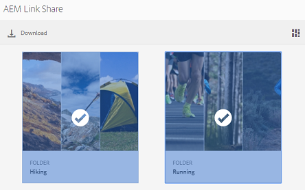

# Compartilhar ativos como um link {#share-assets-as-a-link}

Os administradores do AEM Assets Brand Portal podem compartilhar links de vários ativos com usuários internos autorizados e entidades externas, incluindo parceiros e fornecedores. Os editores podem visualizar e compartilhar somente os ativos compartilhados com eles.

Compartilhar ativos por meio de um link é uma maneira conveniente de disponibilizá-los para partes externas, pois os destinatários não precisam fazer logon no Portal da marca para acessar os ativos.

O acesso ao compartilhamento de link está restrito a editores e administradores. Para obter mais informações, consulte [Gerenciamento de usuários, grupos e funções de usuário](../using/brand-portal-adding-users.md#manage-user-roles).

>[!NOTE]
>
>É permitido até 5 GB de download zip usando o recurso de compartilhamento de links no Portal da marca.

Para compartilhar ativos como um link, siga estas etapas:

1. Clique no ícone de sobreposição à esquerda e escolha **[!UICONTROL Navegação]**.

   

2. Na extremidade à esquerda, clique **[!UICONTROL em Arquivos]** para compartilhar pastas ou imagens. Para compartilhar coleções, clique **[!UICONTROL em Coleções]**.

   

3. Selecione as pastas ou coleções que deseja compartilhar como um link.

   

4. Na barra de ferramentas na parte superior, clique no **[!UICONTROL ícone Compartilhar link]** .

   A caixa **[!UICONTROL de diálogo Compartilhamento]** de links é exibida.

   

   >[!NOTE]
   >
   >O campo **[!UICONTROL Compartilhar link]** exibe um link de ativo criado automaticamente. O tempo de expiração padrão para esse link é de 7 dias. Você pode copiar o link e compartilhá-lo separadamente com usuários ou compartilhá-lo na caixa **[!UICONTROL de diálogo Compartilhamento]** de links.

5. Na caixa de endereço de email, digite a ID de e-mail do usuário com quem você deseja compartilhar o link. Você pode compartilhar o link com vários usuários.

   Se o usuário for membro da sua organização, selecione a ID de e-mail das sugestões que aparecem na lista suspensa. Se o usuário for externo, digite a ID de email completa e pressione **[!UICONTROL Enter]**; a ID de email é adicionada à lista de usuários.

   

6. Na caixa **[!UICONTROL Assunto]** , digite um assunto para o ativo que deseja compartilhar.
7. Na caixa **[!UICONTROL Mensagem]** , digite uma mensagem, se necessário.
8. No campo **[!UICONTROL Expiração]** , use o seletor de datas para especificar uma data e hora de expiração para o link. Por padrão, a data de expiração é definida como 7 dias a partir da data em que você compartilha o link.

   Os ativos compartilhados por meio do link expiram após cruzar a data e a hora especificadas no campo **[!UICONTROL Expiração]** . Para obter informações sobre o comportamento dos ativos expirados e alterações nas atividades permitidas com base nas funções do usuário no Brand Portal, consulte [Gerenciar direitos digitais de ativos](../using/manage-digital-rights-of-assets.md#asset-expiration).

9. Clique em **[!UICONTROL Compartilhar]**. Uma mensagem confirma que o link é compartilhado com os usuários. Os usuários recebem um e-mail contendo o link.

   

   >[!NOTE]
   >
   >Os administradores podem personalizar as mensagens de email, que incluem o logotipo, a descrição e o rodapé com [recursos de marca](../using/brand-portal-branding.md) .

## Baixar ativos de links compartilhados {#download-assets-from-shared-links}

Clique no link do email para exibir o ativo compartilhado. A página Compartilhar link do AEM é aberta.

Para baixar os ativos compartilhados:

1. Clique nos ativos e clique no ícone **[!UICONTROL Download]** na barra de ferramentas.

   

   >[!NOTE]
   >
   >Atualmente, é possível gerar uma visualização e miniatura somente para alguns ativos, dependendo do formato de arquivo. Para obter mais informações sobre os formatos de arquivo suportados, consulte [Visualizar e suporte a miniaturas para formatos de ativos](#preview-thumbnail-support).

   >[!NOTE]
   >
   >Se os ativos que você está baixando também incluírem ativos licenciados, será redirecionado para a página **[!UICONTROL Gerenciamento]** de direitos autorais. Nessa página, selecione os ativos licenciados, clique **[!UICONTROL em Concordar]** e em **[!UICONTROL Download]**. Se você optar por discordar, somente os ativos não licenciados serão baixados.\
   >Os ativos protegidos por licença possuem [contrato de licença anexado](https://helpx.adobe.com/experience-manager/6-5/assets/using/drm.html#DigitalRightsManagementinAssets) a eles, o que é feito pela propriedade [de metadados do ativo](https://helpx.adobe.com/experience-manager/6-5/assets/using/drm.html#DigitalRightsManagementinAssets) em [!DNL AEM Assets].

   

   A caixa de diálogo [!UICONTROL Download] é exibida.
   

   * Para acelerar o download dos arquivos de ativos compartilhados como link, selecione **[!UICONTROL Ativar a opção de aceleração]** de download e [siga o assistente](../using/accelerated-download.md#download-workflow-using-file-accelerator). Para saber mais sobre o download rápido dos ativos no Brand Portal, consulte [Guia para acelerar os downloads do Brand Portal](../using/accelerated-download.md).
[! UICONTROL
2. Para baixar as representações de ativos além dos ativos do link compartilhado, selecione **[!UICONTROL a]** opção Representações. Quando você fizer isso, **a** opção Excluir representações do sistema] será exibida, por padrão. Isso impede o download de representações predefinidas juntamente com ativos aprovados ou suas representações personalizadas.

   No entanto, para permitir que representações geradas automaticamente sejam baixadas com execuções personalizadas, desmarque **[!UICONTROL a opção Excluir representações]** do sistema.

   >[!NOTE]
   >
   >As execuções originais não são baixadas usando o link compartilhado se o usuário que compartilhou os ativos como um link não [for autorizado pelo administrador a ter acesso às representações originais](../using/brand-portal-adding-users.md#manage-group-roles-and-privileges).

   

3. Toque/clique **[!UICONTROL em Download]**. Os ativos (e execuções se selecionados) são baixados como um arquivo ZIP para sua pasta local. No entanto, nenhum arquivo zip é criado se um único ativo for baixado sem qualquer das execuções, garantindo assim o download rápido.

>[!NOTE]
>
>O Brand Portal restringe o download de ativos maiores que 5 GB por tamanho de arquivo.

## Visualização e suporte a miniaturas para formatos de ativos {#preview-thumbnail-support}

A seguinte matriz lista os formatos de ativos para os quais o Brand Portal oferece suporte à miniatura e visualização:

| Formato do ativo | Suporte a miniaturas | Suporte para visualização |
|--------------|-------------------|-----------------|
| PNG | ✓ | ✓ |
| GIF | ✓ | ✓ |
| TIFF | ✓ | ✕ |
| JPEG | ✓ | ✓ |
| BMP | ✓ | ✕ |
| PNM * | ND | ND |
| PGM * | ND | ND |
| PBM * | ND | ND |
| PPM * | ND | ND |
| PSD | ✓ | ✕ |
| EPS | ND | ✕ |
| DNG | ✓ | ✕ |
| PICT | ✓ | ✕ |
| PSB * | ✓ | ✕ |
| JPG | ✓ | ✓ |
| AI | ✓ | ✕ |
| DOC | ✕ | ✕ |
| DOCX | ✕ | ✕ |
| ODT * | ✕ | ✕ |
| PDF | ✓ | ✕ |
| HTML | ✕ | ✕ |
| RTF | ✕ | ✕ |
| TXT | ✓ | ✕ |
| XLS | ✕ | ✕ |
| XLSX | ✕ | ✕ |
| ODS | ✕ | ✕ |
| PPT | ✓ | ✕ |
| PPTX | ✕ | ✕ |
| ODP | ✕ | ✕ |
| INDD | ✓ | ✕ |
| PS | ✕ | ✕ |
| QXP | ✕ | ✕ |
| EPUB | ✓ | ✕ |
| AAC | ✕ | ✕ |
| MIDI | ✕ | ✕ |
| 3GP | ✕ | ✕ |
| MP3 | ✕ | ✕ |
| MP4 | ✕ | ✕ |
| OGA | ✕ | ✕ |
| OGG | ✕ | ✕ |
| RA | ✕ | ✕ |
| WAV | ✕ | ✕ |
| WMA | ✕ | ✕ |
| DVI | ✕ | ✕ |
| FLV | ✕ | ✕ |
| M4V | ✕ | ✕ |
| MPG | ✕ | ✕ |
| OGV | ✕ | ✕ |
| MOV | ✕ | ✕ |
| WMV | ✕ | ✕ |
| SWF | ✕ | ✕ |
| TGZ | ND | ✕ |
| JAR | ✓ | ✕ |
| RAR | ND | ✕ |
| TAR | ND | ✕ |
| ZIP | ✓ | ✕ |

A seguinte legenda explica os símbolos usados na matriz:

| Símbolo | Significado |
|---|---|
| ✓ | Esse formato de arquivo oferece suporte a esse recurso |
| ✕ | Esse formato de arquivo não é compatível com este recurso |
| ND | Esse recurso não é aplicável a esse formato de arquivo |
| * | Esse recurso requer suporte adicional para este formato de arquivo na instância de autor de AEM, mas não no Portal da marca depois que os ativos são publicados no Brand Portal |

## Cancelar compartilhamento de ativos compartilhados como um link {#unshare-assets-shared-as-a-link}

Para não compartilhar ativos compartilhados anteriormente como um link, faça o seguinte:

1. Para exibir os ativos compartilhados como links, clique no ícone de sobreposição à esquerda e escolha **[!UICONTROL Navegação]**.

   

2. Na ustail, clique em Links **[!UICONTROL compartilhados]**.

   

3. Analise os links compartilhados da lista exibida.
4. Para cancelar o compartilhamento de um link da lista, selecione-o e clique no ícone de compartimento próximo à entrada do link, ou o ícone **[!UICONTROL Cancelar compartilhamento]** na barra de ferramentas na parte superior.

   

   >[!NOTE]
   >
   >A exibição de links compartilhados é específica do usuário. Esse recurso não exibe todos os links compartilhados por todos os usuários de um locatário.

5. Na caixa de mensagem de aviso, clique **[!UICONTROL em Continuar]** para confirmar não compartilhar. A entrada para o link é removida da lista de links compartilhados.
