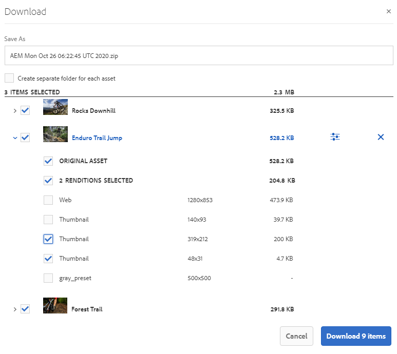

# Compartilhar ativos como um link {#share-assets-as-a-link}

Os administradores do Adobe Experience Manager Assets Brand Portal podem compartilhar links de vários ativos com usuários internos autorizados e entidades externas, incluindo parceiros e fornecedores. Os editores podem visualizar e compartilhar somente os ativos compartilhados com eles.

O compartilhamento de ativos por meio de um link é uma maneira conveniente de disponibilizá-los a terceiros, pois os destinatários não precisam fazer logon no Brand Portal para acessar os ativos.

<!-- Link sharing access is restricted to editors and administrators. 
-->

Para obter mais informações, consulte [Gerenciamento de usuários, grupos e funções de usuário](../using/brand-portal-adding-users.md#manage-user-roles).

Veja a seguir as etapas para compartilhar ativos como um link:

1. Faça logon no seu locatário do Brand Portal. Por padrão, a variável **[!UICONTROL Arquivos]** a visualização abre, que contém todos os ativos e pastas publicados.

1. Selecione os ativos ou pastas que deseja compartilhar ou navegue até o **[!UICONTROL Coleções]** exibir para compartilhar as coleções criadas.

   

1. Na barra de ferramentas na parte superior, clique no botão **[!UICONTROL Compartilhar link]** ícone.

   A variável **[!UICONTROL Compartilhamento de link]** é exibida.

   

   * Na caixa de endereço de email, digite a ID de email do usuário com quem deseja compartilhar o link. Você pode compartilhar o link com vários usuários. Se o usuário for membro da organização, selecione a ID de email dele nas sugestões exibidas na lista suspensa. Se o usuário for externo, digite a ID de email completa e pressione **[!UICONTROL Enter]**; a ID de e-mail é adicionada à lista de usuários.

      

   * No **[!UICONTROL Assunto]** digite um assunto para o ativo que deseja compartilhar.
   * No **[!UICONTROL Mensagem]** digite uma mensagem, se necessário.
   * No **[!UICONTROL Expiração]** use o seletor de datas para especificar uma data e hora de expiração para o link. Por padrão, a data de expiração é definida como 7 dias a partir da data em que você compartilha o link.
   * Ativar o **[!UICONTROL Permitir download do arquivo original]** para permitir que os recipients baixem a representação original.

   Os ativos compartilhados por meio do link expiram após ultrapassarem a data e a hora especificadas no **[!UICONTROL Expiração]** campo. Para obter informações sobre o comportamento de ativos expirados e alterações nas atividades permitidas com base nas funções de usuário no Brand Portal, consulte [Gerenciar direitos digitais dos ativos](../using/manage-digital-rights-of-assets.md#asset-expiration).

   >[!NOTE]
   >
   >O tempo de expiração padrão do link é de 7 dias. O link deve ser enviado por email para os usuários que usam o **[!UICONTROL Compartilhamento de link]** não copie nem compartilhe o link separadamente.

1. Clique em **[!UICONTROL Compartilhar]**. Uma mensagem confirma que o link é compartilhado com os usuários. Os usuários recebem um email contendo o link compartilhado.

   

   >[!NOTE]
   >
   >Os administradores podem personalizar as mensagens de email, o que inclui personalizar o logotipo, a descrição e o rodapé com o [Marcas](../using/brand-portal-branding.md) recurso.

## Baixar ativos em links compartilhados {#download-assets-from-shared-links}

Clique no link no email para acessar o ativo compartilhado. A página Compartilhamento de link AEM é aberta.

Para baixar os ativos compartilhados:

1. Clique nos ativos ou pastas e, em seguida, clique na guia **[!UICONTROL Baixar]** ícone na barra de ferramentas.

   

   >[!NOTE]
   >
   >Atualmente, é possível gerar uma pré-visualização e miniatura somente para determinados ativos, dependendo do formato do arquivo. Para obter mais informações sobre os formatos de arquivo compatíveis, consulte [Suporte de pré-visualização e miniatura para formatos de ativos](#preview-thumbnail-support).

1. A variável **[!UICONTROL Baixar]** é exibida.

   

1. Por padrão, a variável **[!UICONTROL Download rápido]** está ativada na variável **[!UICONTROL Configurações de download]**. Portanto, uma caixa de confirmação aparece para continuar o download usando o IBM Aspera Connect.

   Para continuar usando o **[!UICONTROL Download rápido]**, clique em **[!UICONTROL Permitir]**.

   Todas as representações selecionadas são baixadas em uma pasta zip que contém uma pasta separada para cada ativo.

   >[!NOTE]
   >
   >Uma pasta separada é criada para cada ativo ao baixar os ativos de um link compartilhado.
   >
   >Se uma pasta, coleção ou mais de 20 ativos forem selecionados para download, a variável **[!UICONTROL Baixar]** A caixa de diálogo é ignorada e todas as representações de ativos acessíveis ao usuário, excluindo as representações dinâmicas, são baixadas em uma pasta zip que contém uma pasta separada para cada ativo.

   >[!NOTE]
   >
   >As representações originais não são baixadas usando o link compartilhado se o usuário que compartilhou os ativos como um link não estiver [autorizado pelo administrador a ter acesso às representações originais](../using/brand-portal-adding-users.md#manage-group-roles-and-privileges).

>[!NOTE]
>
>O Brand Portal restringe o download de pastas ou ativos com tamanho superior a 5 GB, usando o compartilhamento de link.

<!--
1. The **[!UICONTROL Download]** dialog box appears.

   

    * To speed up the download of asset files shared as the link, select **[!UICONTROL Enable download acceleration]** option and [follow the wizard](../using/accelerated-download.md#download-workflow-using-file-accelerator). To know more about the fast download of assets on Brand Portal refer [Guide to accelerate downloads from Brand Portal](../using/accelerated-download.md).
    
1. To download the renditions of assets in addition to the assets from the shared link, select **[!UICONTROL Rendition(s)]** option. When you do so, **[!UICONTROL Exclude System Renditions]** option appears that is selected by default. This prevents the download of out-of-the-box renditions along with approved assets or their custom renditions.

   However, to allow auto-generated renditions to download along with custom renditions, deselect the **[!UICONTROL Exclude System Renditions]** option.

   >[!NOTE]
   >
   >Original renditions are not downloaded using the shared link if the user who shared the assets as a link is not [authorized by the administrator to have access to the original renditions](../using/brand-portal-adding-users.md#manage-group-roles-and-privileges).

   

1. Click **[!UICONTROL Download]**. The assets (and renditions if selected) are downloaded as a ZIP file to your local folder. However, no zip file is created if a single asset is downloaded without any of the renditions, thereby ensuring speedy download.

-->

## Suporte de pré-visualização e miniatura para formatos de ativos {#preview-thumbnail-support}

A matriz a seguir lista os formatos de ativos para os quais o Brand Portal oferece suporte à miniatura e à visualização:

| Formato do ativo | Suporte a miniaturas | Suporte de visualização |
|--------------|-------------------|-----------------|
| PNG | ✓ | ✓ |
| GIF | ✓ | ✓ |
| TIFF | ✓ | ✕ µ |
| JPEG | ✓ | ✓ |
| BMP | ✓ | ✕ |
| PNM* | ND | ND |
| PGM* | ND | ND |
| PBM* | ND | ND |
| PPM* | ND | ND |
| PSD | ✓ | ✕ |
| EPS | ND | ✕ |
| DNG | ✓ | ✕ |
| PICT | ✓ | ✕ |
| PSB* | ✓ | ✕ |
| JPG | ✓ | ✓ |
| IA | ✓ | ✕ |
| DOC | ✕ | ✕ |
| DOCX | ✕ | ✕ |
| ODT* | ✕ | ✕ |
| PDF | ✓ | ✕ |
| HTML | ✕ | ✕ |
| RTF | ✕ | ✕ |
| TXT | ✓ | ✕ |
| XLS | ✕ | ✕ |
| XLSX | ✕ | ✕ |
| ODS | ✕ | ✕ |
| PPT | ✓ | ✕ |
| PPTX | ✕ | ✕ |
| ODP | ✕ | ✕ |
| INDD | ✓ | ✕ |
| PS | ✕ | ✕ |
| QXP | ✕ | ✕ |
| EPUB | ✓ | ✕ |
| AAC | ✕ | ✕ |
| MIDI | ✕ | ✕ |
| 3GP | ✕ | ✕ |
| MP3 | ✕ | ✕ |
| MP4 | ✕ | ✕ |
| OGA | ✕ | ✕ |
| OGG | ✕ | ✕ |
| RA | ✕ | ✕ |
| WAV | ✕ | ✕ |
| WMA | ✕ | ✕ |
| DVI | ✕ | ✕ |
| FLV | ✕ | ✕ |
| M4V | ✕ | ✕ |
| MPG | ✕ | ✕ |
| OGV | ✕ | ✕ |
| MOV | ✕ | ✕ |
| WMV | ✕ | ✕ |
| SWF | ✕ | ✕ |
| TGZ | ND | ✕ |
| JAR | ✓ | ✕ |
| RAR | ND | ✕ |
| TAR | ND | ✕ |
| ZIP | ✓ | ✕ |

A legenda a seguir explica os símbolos usados na matriz:

| Símbolo | Significado |
|---|---|
| ✓ | Este formato de arquivo é compatível com este recurso |
| ✕ | Este formato de arquivo não dá suporte a este recurso |
| ND | Este recurso não se aplica a este formato de arquivo |
| &#42; | Esse recurso exige suporte complementar para esse formato de arquivo na instância de autor do AEM, mas não no Brand Portal depois que os ativos são publicados no Brand Portal |

## Cancelar o compartilhamento de ativos compartilhados como um link {#unshare-assets-shared-as-a-link}

Para cancelar o compartilhamento de ativos compartilhados anteriormente como um link, faça o seguinte:

1. Ao fazer logon no Brand Portal, a variável **[!UICONTROL Arquivo]** A visualização é aberta por padrão. Para exibir os ativos que você compartilhou como links, navegue até o **[!UICONTROL Links compartilhados]** exibição.

1. Revise os links compartilhados na lista exibida.

   

1. Para cancelar o compartilhamento de um link da lista, selecione-o e clique no link **[!UICONTROL Cancelar compartilhamento]** ícone na barra de ferramentas na parte superior.

   

   >[!NOTE]
   >
   >A exibição de links compartilhados é específica do usuário. Este recurso não exibe todos os links compartilhados por todos os usuários de um locatário.

1. Na caixa de mensagem de aviso, clique em **[!UICONTROL Continuar]** para confirmar o cancelamento de compartilhamento. A entrada do link é removida da lista de links compartilhados.
