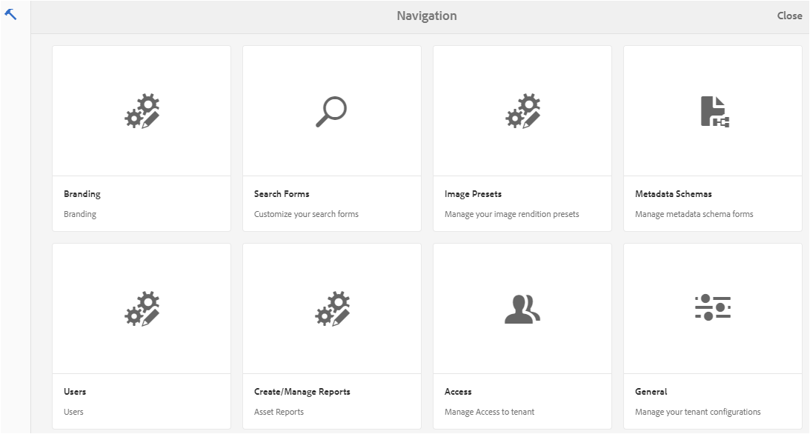
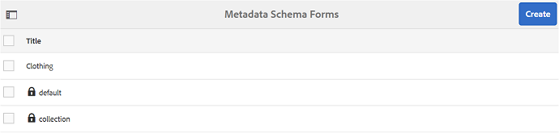
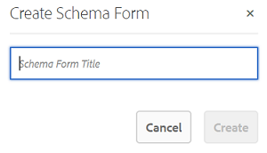
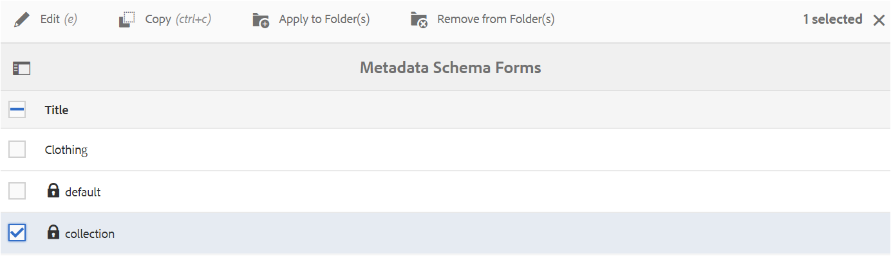
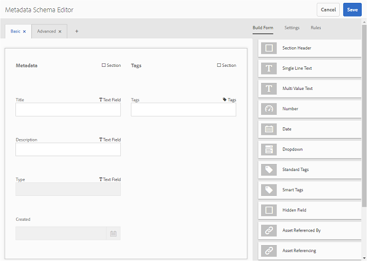
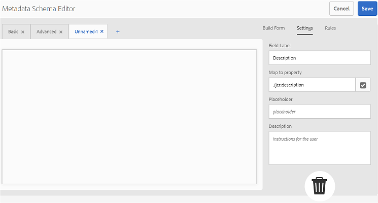
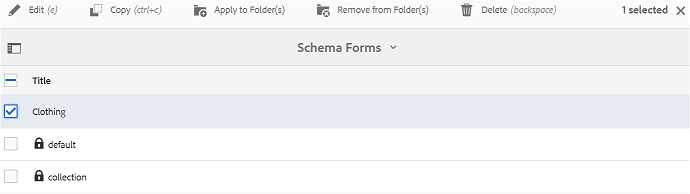
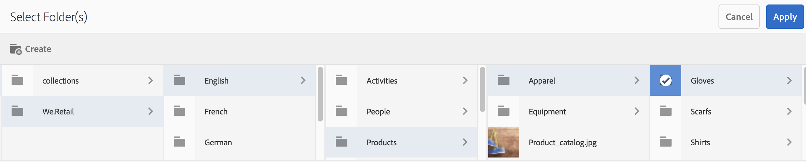
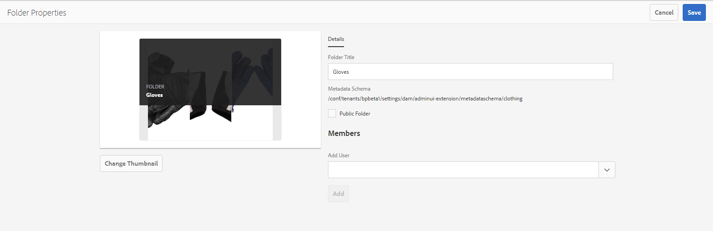

# Usar o formulário de esquema de metadados {#use-the-metadata-schema-form}

Um esquema de metadados descreve o layout da página Propriedades e as propriedades de metadados exibidas para ativos que usam o esquema específico. O esquema aplicado a um ativo determina os campos de metadados que aparecem na página Propriedades.

A página **[!UICONTROL Propriedades]** de cada ativo inclui propriedades de metadados padrão, dependendo do tipo MIME do ativo. Os administradores podem usar o Editor de esquema de metadados para modificar esquemas existentes ou adicionar esquemas de metadados personalizados. O Experience Manager Assets Brand Portal fornece formulários padrão para ativos de vários tipos MIME. No entanto, também é possível adicionar formulários personalizados a esses ativos.

## Adicionar um formulário de esquema de metadados {#add-a-metadata-schema-form}

Para criar um novo formulário de esquema de metadados, faça o seguinte:

1. Na barra de ferramentas na parte superior, clique no logotipo do Experience Manager para acessar as ferramentas administrativas.

   

1. No painel de ferramentas administrativas, clique em **[!UICONTROL Esquemas de metadados]**.

   

1. Na página **[!UICONTROL Forms]** do Esquema de Metadados, clique em **[!UICONTROL Criar]**.

   

1. Na caixa de diálogo **[!UICONTROL Criar formulário de esquema]**, especifique o título do formulário Esquema e clique em **[!UICONTROL Criar]** para concluir o processo de criação do formulário.

   

## Editar um formulário de esquema de metadados {#edit-a-metadata-schema-form}

É possível editar um formulário de esquema de metadados recém-adicionado ou existente. O formulário de esquema de metadados contém conteúdo derivado de seu pai, incluindo guias e itens de formulário em guias. Você pode mapear ou configurar esses itens de formulário em um campo dentro de um nó de metadados.

É possível adicionar novas guias ou itens de formulário ao formulário de esquema de metadados. As guias derivadas e os itens de formulário (do pai) estão no estado bloqueado. Não é possível alterá-los no nível filho.

Para editar um formulário de esquema de metadados, faça o seguinte:

1. Na barra de ferramentas na parte superior, clique no logotipo do Experience Manager para acessar as ferramentas administrativas.

   

1. No painel de ferramentas administrativas, clique em **[!UICONTROL Esquemas de metadados]**.
1. Na página **[!UICONTROL Forms]** do Esquema de Metadados, selecione um formulário de esquema para editar suas propriedades, por exemplo, **[!UICONTROL collection]**.

   

   >[!NOTE]
   >
   >Os modelos desatualizados exibem um símbolo de cadeado antes deles. Se você personalizar qualquer um dos modelos, o símbolo Bloquear antes do modelo desaparece.

1. Na barra de ferramentas na parte superior, clique em **[!UICONTROL Editar]**.

   A página **[!UICONTROL Editor de esquema de metadados]** é aberta com a guia **[!UICONTROL Básico]** aberta à esquerda e a guia **[!UICONTROL Criar formulário]** aberta à direita.

1. Na página **[!UICONTROL Editor de esquema de metadados]**, personalize a página **[!UICONTROL Propriedades]** do ativo arrastando um ou mais componentes de uma lista de tipos de componentes na guia **[!UICONTROL Criar formulário]** para a guia **[!UICONTROL Básico]**.

   

1. Para configurar um componente, selecione-o e modifique suas propriedades na guia **[!UICONTROL Settings]**.

### Componentes na guia Criar formulário {#components-in-the-build-form-tab}

A guia **[!UICONTROL Criar formulário]** lista itens que podem ser usados no formulário de esquema. A guia **[!UICONTROL Settings]** fornece os atributos de cada item selecionado na guia **[!UICONTROL Criar formulário]**. A tabela a seguir lista os itens de formulário disponíveis na guia **[!UICONTROL Criar formulário]**:

| Nome do componente | Descrição |
|---------------------|--------------------------------------------------------------------------------------------------------------------------------------------------------------------------------------------------------------------------------------------------------------------------------------------|
| **[!UICONTROL Título da seção]** | Adicione um cabeçalho de seção para obter uma lista de componentes comuns. |
| **[!UICONTROL Texto em linha única]** | Adicione uma propriedade de texto de linha única. Ele é armazenado como uma string. |
| **[!UICONTROL Multi-ValueText]** | Adicione uma propriedade de texto de vários valores. Ele é armazenado como uma matriz de sequência de caracteres. |
| **[!UICONTROL Número]** | Adicione um componente de número. |
| **[!UICONTROL Data]** | Adicione um componente de data. |
| **[!UICONTROL Lista suspensa]** | Adicione uma lista suspensa. |
| **[!UICONTROL Tags padrão]** | Adicionar uma tag. **Observação:** talvez os administradores precisem alterar o valor do caminho, por exemplo,  `/etc/tags/mac/<tenant_id>/<custom_tag_namespace>`, se publicarem o formulário de esquema de metadados do Experience Manager Assets, onde o caminho não inclui informações do locatário, por exemplo,  `/etc/tags/<custom_tag_namespace>`. |
| **[!UICONTROL Tags inteligentes]** | Tags detectadas automaticamente se você adquiriu e configurou o complemento de tags inteligentes do Experience Manager Assets. |
| **[!UICONTROL Campo oculto]** | Adicione um campo oculto. Ele é enviado como um parâmetro POST quando o ativo é salvo. |
| **[!UICONTROL Ativo referenciado por]** | Adicione este componente para exibir a lista de ativos referenciados pelo ativo. |
| **[!UICONTROL Fazer referência ao ativo]** | Adicionar para exibir uma lista de ativos que fazem referência ao ativo. |
| **[!UICONTROL Classificação do ativo]** | Classificação média de um ativo adicionado do Experience Manager Assets antes de ser publicado no Brand Portal. |
| **[!UICONTROL Metadados do contexto]** | Adicionar para controlar a exibição de outras guias de metadados na página Propriedades de ativos. |

>[!NOTE]
>
>Não use **[!UICONTROL Referências de produto]**, pois não está funcional.

#### Editar o componente de metadados {#edit-the-metadata-component}

Para editar as propriedades de um componente de metadados no formulário, clique no componente e edite suas propriedades na guia **[!UICONTROL Settings]**.

* **[!UICONTROL Rótulo]** do campo: O nome da propriedade de metadados exibida na página Propriedades do ativo.

* **[!UICONTROL Mapear para propriedade]**: O valor dessa propriedade fornece o caminho/nome relativo para o nó do ativo, onde ele é salvo no repositório CRX. Começa com &quot;**./**&quot; porque indica que o caminho está sob o nó do ativo.

A seguir estão os valores válidos para essa propriedade:

-- `./jcr:content/metadata/dc:title`: armazena o valor no nó de metadados do ativo como a propriedade [!UICONTROL `dc:title`].

-- `./jcr:created`: exibe a propriedade jcr no nó do ativo. Se você configurar essas propriedades nas propriedades de exibição, recomendamos marcá-las como Desativar edição, pois elas estão protegidas. Caso contrário, o erro &quot;Os ativos falharam ao serem modificados&quot; ocorre ao salvar as propriedades do ativo.

* **[!UICONTROL Espaço reservado]**: Use essa propriedade para fornecer ao usuário quaisquer informações relevantes sobre a propriedade de metadados.
* **[!UICONTROL Obrigatório]**: Use essa propriedade para marcar uma propriedade de metadados como obrigatória na página Propriedades .
* **[!UICONTROL Desativar edição]**: Use essa propriedade para tornar uma propriedade de metadados não editável na página Propriedades .
* **[!UICONTROL Mostrar Campo Vazio Em Somente]** Leitura: Marque essa propriedade para exibir uma propriedade de metadados na página Propriedades, mesmo que ela não tenha um valor. Por padrão, quando uma propriedade de metadados não tem valor, ela não é listada na página Propriedades .
* **[!UICONTROL Descrição]**: Use essa propriedade para adicionar uma breve descrição para o componente de metadados.
* **[!UICONTROL Ícone]** Excluir : Clique nesse ícone para excluir um componente do formulário de esquema.

>[!NOTE]
>
>Todos os campos de metadados são somente leitura no formulário editor de metadados de um ativo. Como os metadados do ativo devem ser editados no Experience Manager Assets antes que um ativo seja publicado no Brand Portal.

#### Adicionar ou excluir uma guia no formulário de esquema {#add-or-delete-a-tab-in-the-schema-form}

O formulário de esquema padrão inclui as guias **[!UICONTROL Basic]** e **[!UICONTROL Advanced]**. O editor de esquema permite adicionar ou excluir uma guia.

* Para adicionar uma nova guia em um formulário de esquema, clique em **[!UICONTROL +]**. Por padrão, a nova guia tem o nome &quot;Unnamed-1&quot;. Você pode modificar o nome da guia **[!UICONTROL Settings]**.

* Para excluir uma guia, clique em **[!UICONTROL x]**. Clique em **[!UICONTROL Save]** para salvar as alterações.

## Aplicar um esquema de metadados a uma pasta {#apply-a-metadata-schema-to-a-folder}

O Brand Portal permite personalizar e controlar o esquema de metadados de modo que a página **[!UICONTROL Propriedades]** de um ativo exiba apenas as informações específicas que você escolher revelar. Para controlar os metadados exibidos na página **[!UICONTROL Properties]**, remova os metadados necessários do formulário de esquema de metadados e aplique-os à pasta específica.

Para aplicar um formulário de esquema de metadados a uma pasta, faça o seguinte:

1. Na barra de ferramentas na parte superior, clique no logotipo do Experience Manager para acessar as ferramentas administrativas.

   

1. No painel de ferramentas administrativas, clique em **[!UICONTROL Esquemas de metadados]**.

1. Na página **[!UICONTROL Forms]** do Esquema de Metadados, selecione o formulário de esquema que deseja aplicar a um ativo, por exemplo, **[!UICONTROL vestuário]**.

   

1. Na barra de ferramentas na parte superior, clique em **[!UICONTROL Aplicar à(s) pasta(s)]**.

1. Na página **[!UICONTROL Select Folder(s)]** , navegue até a pasta à qual deseja aplicar o esquema de metadados **[!UICONTROL vestuário]**, por exemplo, **[!UICONTROL Luvas]**.

   

1. Clique em **[!UICONTROL Aplicar]** para aplicar o formulário de esquema de metadados à pasta.

   Os metadados disponíveis no formulário de esquema de metadados **[!UICONTROL vestuário]** são aplicados à pasta **[!UICONTROL Luvas]** e visíveis na página **[!UICONTROL Propriedades]** da pasta.

   

>[!NOTE]
>
>Se você aplicar um esquema que inclui esquemas aninhados a uma pasta contendo arquivos de vídeo, as propriedades de metadados dos arquivos de vídeo poderão não ser renderizadas corretamente. Para garantir que as propriedades dos metadados sejam renderizadas corretamente, remova os esquemas aninhados e aplique apenas o schema pai à pasta.

## Excluir um formulário de esquema de metadados {#delete-a-metadata-schema-form}

O Brand Portal permite excluir somente formulários de esquema personalizados. Ela não permite excluir os formulários/modelos de esquema padrão. No entanto, é possível excluir quaisquer alterações personalizadas nesses formulários.

Para excluir um formulário, selecione-o e clique no ícone **[!UICONTROL Delete]**.

>[!NOTE]
>
>Após excluir as alterações personalizadas feitas em um formulário padrão, o símbolo **[!UICONTROL Lock]** reaparece antes do nome do formulário na interface do Esquema de metadados para indicar que o formulário é revertido para seu estado padrão.

## Formulários de esquema para TIPOS MIME {#schema-forms-for-mime-types}

### Adicionar novos formulários para tipos MIME {#adding-new-forms-for-mime-types}

Além dos formulários padrão, você pode adicionar formulários personalizados a ativos de vários tipos MIME ou criar um novo formulário em um tipo de formulário apropriado. Por exemplo, para adicionar um novo modelo para o subtipo **[!UICONTROL image/png]**, crie o formulário nos formulários &quot;image&quot;. O título do formulário de esquema é o nome do subtipo. Nesse caso, o título é &quot;png&quot;.

#### Uso de um template de schema existente para vários tipos MIME {#using-an-existing-schema-template-for-various-mime-types}

Você pode usar um modelo existente para um tipo MIME diferente. Por exemplo, use o formulário **image/jpeg** para ativos do tipo MIME **image/png**.

Nesse caso, crie um novo nó em [!UICONTROL `/etc/dam/metadataeditor/mimetypemappings`] no repositório CRX. Especifique um nome para o nó e defina as seguintes propriedades:

| **Nome** | **Tipo** | **Valor** |
|---|---|---|
| exposedmimetype | Sequência de caracteres | image/jpeg |
| mimetypes | Sequência de caracteres[] | image/png |

* **exposedmimetype**: Nome do formulário existente a ser mapeado
* **mimetypes**: Lista de tipos MIME que usam o formulário definido em  **** exposedmimetypeattribute

O Brand Portal mapeia os seguintes tipos MIME e formulários de esquema:

| **Formulário de esquema** | **Tipos MIME** |
|---|---|
| image/jpeg | image/pjpeg |
| image/tiff | image/x-tiff |
| application/pdf | application/postscript |
| application/x-ImageSet | Multipart/Related; type=application/x-ImageSet |
| application/x-SpinSet | Multipart/Related; type=application/x-SpinSet |
| application/x-MixedMediaSet | Multipart/Related; type=application/x-MixedMediaSet |
| video/quicktime | vídeo/x-quicktime |
| vídeo/mpeg4 | video/mp4 |
| vídeo/avi | vídeo/avi, vídeo/msvideo, vídeo/x-msvideo |
| vídeo/wmv | video/x-ms-wmv |
| vídeo/flv | video/x-flv |

Veja a seguir uma lista de propriedades de metadados padrão:

* jcr:content/metadata/cq:tags
* jcr:content/metadata/dc:format
* jcr:content/metadata/dam:status
* jcr:content/metadata/videoCodec
* jcr:content/metadata/audioCodec
* jcr:content/metadata/dc:title
* jcr:content/metadata/dc:description
* jcr:content/metadata/xmpMM:InstanceID
* jcr:content/metadata/xmpMM:DocumentID
* jcr:content/metadata/dam:sha1
* jcr:content/metadata/dam:solutionContext
* jcr:content/metadata/videoBitrate
* jcr:content/metadata/audioBitrate
* jcr:content/usages/usedBy
* jcr:content/jcr:lastModified
* jcr:content/metadata/prism:expirationDate
* jcr:content/onTime
* jcr:content/offTime
* jcr:content/metadata/dam:size
* jcr:content/metadata/tiff:ImageWidth
* jcr:content/metadata/tiff:ImageLength
