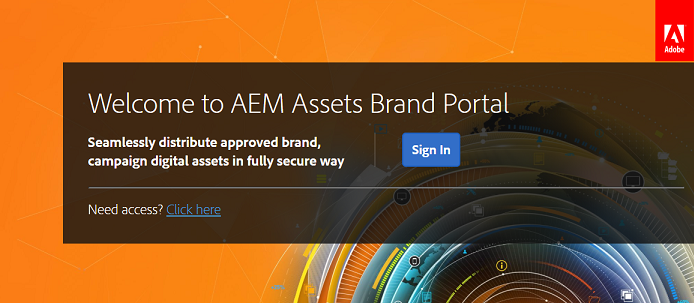

# Experiência de login pela primeira vez {#first-time-login-experience}

A primeira experiência de logon é a mesma para todos os novos usuários do Experience Manager Assets Brand Portal, incluindo Administradores. Depois que um administrador adiciona você à conta da Brand Portal de sua organização, você não precisa aceitar convites e é adicionado automaticamente. Você recebe um email de boas-vindas que contém um link para a conta da Brand Portal de sua organização.

A seguir estão as etapas a serem executadas para os usuários que fazem logon no Brand Portal pela primeira vez:

1. Abra o email de boas-vindas e clique em **[!UICONTROL Introdução]**.

1. Na página de inscrição, especifique seus detalhes (incluindo nome, sobrenome, senha e país/região).
   >[!NOTE]
   >
   >Se você for um usuário existente do Adobe Marketing Cloud, uma página de logon será exibida em vez da página de inscrição. Para fazer logon no Adobe Marketing Cloud, digite sua Adobe ID e senha.

   >[!NOTE]
   >
   >Se sua organização usar Enterprise IDs, em vez de visualizar essa página de inscrição, você será redirecionado para a página de logon corporativo. Para obter mais informações, consulte [Enterprise ID, logon e ajuda da conta](https://helpx.adobe.com/in/enterprise/kb/enterprise-id-faq.html).

1. Clique em **[!UICONTROL Continuar]** para prosseguir para a página Brand Portal de sua organização.
1. Na página de logon da Brand Portal, clique em **[!UICONTROL Conectar]** para fazer logon no Brand Portal.

   

   >[!NOTE]
   >
   >Para fazer logon no Brand Portal, você deve ter direito a pelo menos um perfil de produto do Experience Manager Assets.
