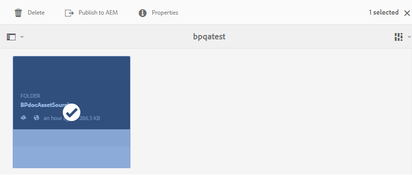

# Publicar pasta de contribuição nos ativos AEM {#publish-contribution-folder-to-aem}

Os usuários do Brand Portal podem publicar a pasta de contribuição nos ativos AEM sem precisar acessar a instância do autor do AEM.

Verifique se você passou pelos requisitos [de](brand-portal-download-asset-requirements.md) ativos e fez upload dos ativos recém-criados na pasta **NEW** na pasta de contribuição. Consulte [Fazer upload de ativos para a pasta](brand-portal-upload-assets-to-contribution-folder.md)de contribuição.

**Para publicar a pasta de contribuição:**

1. Faça logon na instância do Brand Portal.
1. Selecione a pasta de contribuição do painel do Brand Portal.
1. Clique em **[!UICONTROL Publicar no AEM]** .
   

Uma notificação por email/pulso é enviada ao Brand Portal e ao AEM, ao administrador e ao usuário em várias etapas do fluxo de trabalho de publicação:
1. **Em fila** - ao publicar acionadores de fluxo de trabalho no Brand Portal, a pasta de contribuição é publicada do Brand Portal para o AEM.
1. **Em andamento** - quando os ativos AEM começarem a importar a pasta de contribuição.
1. **Concluído** - quando a ação de publicação estiver concluída, a pasta de contribuição será importada com êxito para os ativos AEM.

