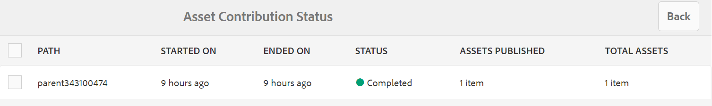
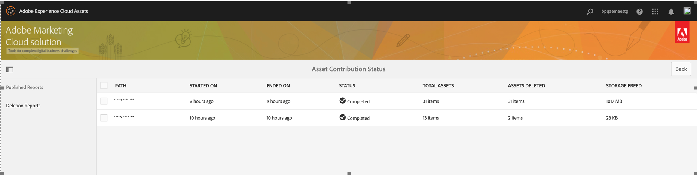

# Publicar pasta de contribuição para o Experience Manager Assets {#using-asset-souring-in-bp}

Os usuários do Brand Portal com permissões apropriadas podem fazer upload de vários ativos, ou pastas contendo vários ativos, para a pasta contribuição. No entanto, os usuários do Brand Portal só podem fazer upload de ativos para o **NOVO** pasta. A variável **COMPARTILHADO** A pasta destina-se à distribuição de ativos de linha de base (conteúdo de referência) que podem ser usados pelos usuários do Brand Portal ao criar novos ativos para contribuição.

Um usuário do Brand Portal com permissão para acessar a pasta contribuição pode executar as seguintes atividades:

* [Baixar requisitos de ativos](#download-asset-requirements)
* [Fazer upload de novos ativos para a pasta de contribuição](#uplad-new-assets-to-contribution-folder)
* [Publicar pasta de contribuição para o Experience Manager Assets](#publish-contribution-folder-to-aem)

## Baixar requisitos de ativos {#download-asset-requirements}

Os usuários do Brand Portal recebem automaticamente notificações por email/pulso sempre que uma pasta de contribuição é compartilhada pelo usuário do Experience Manager Assets, permitindo baixar o breve documento (requisito de ativos), bem como os ativos da linha de base (conteúdo de referência), da **COMPARTILHADO** para garantir que eles entendam os requisitos do ativo.

O usuário do Brand Portal realiza as seguintes atividades para baixar requisitos de ativos:

* **Download do resumo**: Baixe o resumo (documento de requisito de ativo) anexado à pasta de contribuição que contém informações relacionadas ao ativo, como tipo de ativos, finalidade, formatos compatíveis, tamanho máximo do ativo etc.
* **Baixar ativos da linha de base**: baixe os ativos de linha de base que podem ser usados para entender os tipos de ativos necessários. Os usuários do Brand Portal podem usar esses ativos como referência para criar novos ativos para contribuição.

O painel do Brand Portal reflete todas as pastas existentes permitidas ao usuário do Brand Portal, juntamente com a pasta de contribuição recém-compartilhada. Neste exemplo, o usuário do Brand Portal só tem acesso à pasta de contribuição recém-criada. Nenhuma outra pasta existente é compartilhada com o usuário.

**Para baixar requisitos de ativos:**

1. Faça logon na sua instância do Brand Portal.
1. Selecione pasta de contribuição no painel do Brand Portal.
1. Clique em **[!UICONTROL Propriedades]**. A janela Propriedade, que contém os detalhes da pasta de contribuição, é aberta.

   

   

1. Clique no link **[!UICONTROL Baixar resumo]** opção para baixar o documento de requisitos de ativos no computador local.

   

1. Volte para o painel do Brand Portal.
1. Clique para abrir a pasta de contribuição. Você pode ver duas subpastas-**[!UICONTROL COMPARTILHADO]** e **[!UICONTROL NOVO]** na pasta contribuição. A pasta COMPARTILHADOS contém todos os ativos da linha de base (conteúdo de referência) compartilhados pelos administradores.
1. Você pode baixar o **[!UICONTROL COMPARTILHADO]** pasta que contém todos os ativos de linha de base do computador local.
Ou você pode abrir a variável **[!UICONTROL COMPARTILHADO]** e clique no link **Baixar** ícone para baixar arquivos/pastas individuais.

   

   

Percorra o resumo (documento de requisitos de ativos) e consulte os ativos da linha de base para entender os requisitos de ativos. Agora é possível criar novos ativos para contribuição e carregá-los na pasta de contribuição.

## Fazer upload de ativos para a pasta de contribuição {#upload-new-assets-to-contribution-folder}

Depois de analisar os requisitos de ativos, os usuários do Brand Portal podem criar novos ativos para contribuição e carregá-los na NOVA pasta da pasta contribuição. Um usuário pode fazer upload de vários ativos para uma pasta de contribuição de ativos. No entanto, somente uma pasta pode ser criada de cada vez.

>[!NOTE]
>
>Os usuários do Brand Portal podem fazer upload de ativos (máximo de **2** GB por tamanho de arquivo) para a pasta NEW.
>
>O limite máximo de upload para qualquer locatário do Brand Portal é **10** GB, que é aplicado cumulativamente a todas as pastas de contribuição.
>
>Os ativos carregados para o Brand Portal não são processados para representações e não contêm visualizações.

>[!NOTE]
>
>É recomendável liberar o espaço de upload após a publicação da pasta de contribuição no Experience Manager Assets para que ela fique disponível para os outros usuários do Brand Portal para contribuição.
>
>Se houver necessidade de estender o limite de upload do seu locatário do Brand Portal além **10** GB, entre em contato com o Suporte ao cliente especificando o requisito.

**Para fazer upload de novos ativos:**

1. Faça logon na sua instância do Brand Portal.
O painel do Brand Portal reflete todas as pastas existentes permitidas ao usuário do Brand Portal, juntamente com a pasta de contribuição recém-compartilhada.

1. Selecione a pasta de contribuição e clique em para abri-la. A pasta de contribuição contém duas subpastas - **[!UICONTROL COMPARTILHADO]** e **[!UICONTROL NOVO]**.

1. Clique no link **[!UICONTROL NOVO]** pasta.

   

1. Clique em **[!UICONTROL Criar]** > **[!UICONTROL Arquivos]** para fazer upload de arquivos ou pastas individuais (.zip) contendo vários ativos.

   

1. Procurar e fazer upload de ativos (arquivos ou pastas) para o **[!UICONTROL NOVO]** pasta.

   

Depois de fazer upload de todos os ativos ou pastas para a NOVA pasta, publique a pasta de contribuição para o Experience Manager Assets.

## Publicar pasta de contribuição para o Experience Manager Assets {#publish-contribution-folder-to-aem}

Os usuários do Brand Portal podem publicar a pasta de contribuição no Experience Manager Assets sem precisar acessar a instância do autor do Experience Manager.

Verifique se você passou pelos requisitos do ativo e fez upload dos ativos recém-criados no **NOVO** pasta dentro da pasta contribuição.

**Para publicar a pasta de contribuição:**

1. Faça logon na sua instância do Brand Portal.

1. Selecione pasta de contribuição no painel do Brand Portal.
1. Clique em **[!UICONTROL Publicar no AEM]**.

   

   

Uma notificação por email/pulso é enviada ao usuário e aos administradores do Brand Portal em diferentes estágios do fluxo de trabalho de publicação:

1. **Em fila** - Uma notificação é enviada ao usuário do Brand Portal e aos administradores do Brand Portal quando um fluxo de trabalho de publicação é acionado no Brand Portal.

1. **Concluído** - Uma notificação é enviada ao usuário do Brand Portal e aos administradores do Brand Portal quando a pasta de contribuição é publicada com êxito no Experience Manager Assets.

Depois de publicar os ativos recém-criados no Experience Manager Assets, os usuários do Brand Portal podem excluí-los da pasta NEW. Ao passo que o administrador do Brand Portal pode excluir os ativos da pasta NOVO e COMPARTILHADO.

Quando o objetivo de criar a pasta de contribuição for atingido, o administrador do Brand Portal poderá excluir a pasta de contribuição para liberar o espaço de upload para outros usuários.

## Publicando status do trabalho {#publishing-job-status}

Há dois relatórios que os administradores podem utilizar para visualizar o status das pastas de contribuição de ativos publicadas do Brand Portal para o Experience Manager Assets.

* No Brand Portal, navegue até **[!UICONTROL Ferramentas]** > **[!UICONTROL Status de contribuição do ativo]**. Esse relatório reflete o status de todos os trabalhos de publicação em estágios diferentes do fluxo de trabalho de publicação.

   

* No Experience Manager Assets (no local ou no managed service), navegue até **[!UICONTROL Assets]** > **[!UICONTROL Tarefas]**. Esse relatório reflete o estado final (Sucesso ou Erro) de todos os trabalhos de publicação.

   

* No Experience Manager Assets as a Cloud Service, navegue até **[!UICONTROL Assets]** > **[!UICONTROL Tarefas]**.

   Ou você pode navegar diretamente para **[!UICONTROL Tarefas]** na navegação global.

   Este relatório reflete o estado final (Sucesso ou Erro) de todos os trabalhos de publicação, incluindo a importação de ativos do Brand Portal para o Experience Manager Assets as a Cloud Service.

   

<!--
>[!NOTE]
>
>Currently, no report is generated in AEM Assets as a Cloud Service for the Asset Sourcing workflow. 
-->

## Exclusão automática de ativos publicados no Experience Manager Assets da pasta Contribuição {#automatically-delete-published-assets-from-contribution-folder}

O Brand Portal agora executa tarefas automáticas a cada doze horas para verificar todas as pastas de Contribuição e excluir todos os ativos publicados no AEM. Como resultado, não é necessário excluir os ativos na pasta Contribuição manualmente para manter o tamanho da pasta abaixo de [limite](#upload-new-assets-to-contribution-folder). Você também pode monitorar o status dos trabalhos de exclusão executados automaticamente nos últimos sete dias. O relatório de uma tarefa fornece os seguintes detalhes:

* Hora de início do trabalho
* Hora de término do trabalho
* Status do trabalho
* Total de ativos incluídos em um trabalho
* Total de ativos excluídos com êxito em um trabalho
* Armazenamento total disponibilizado como resultado da execução do trabalho

   

Também é possível detalhar mais para exibir os detalhes de cada ativo incluído em um trabalho de exclusão. Detalhes como título do ativo, tamanho, autor, status de exclusão e tempo de exclusão são incluídos no relatório.

>[!NOTE]
>
> * Os clientes podem solicitar ao Suporte ao cliente do Adobe que desative e reative o recurso de exclusão automática de trabalho ou altere a frequência de sua execução.
> * Esse recurso está disponível com o Experience Manager 6.5.13.0 e versões posteriores.

### Exibir e baixar relatórios de exclusão {#view-delete-jobs}

Para exibir e baixar relatórios de um job de deleção:

1. No Brand Portal, navegue até **[!UICONTROL Ferramentas]**>**[!UICONTROL Status de contribuição do ativo]**>**[!UICONTROL Relatórios de exclusão]** opção.

1. Selecione um trabalho e clique em **[!UICONTROL Exibir]** para exibir o relatório.

   Visualize os detalhes de cada ativo incluído em um trabalho de exclusão. Detalhes como título do ativo, tamanho, autor, status de exclusão e tempo de exclusão são incluídos no relatório. Clique em **[!UICONTROL Baixar]** para baixar o relatório do processo no formato CSV.

   O status de exclusão de um ativo no relatório pode ter os seguintes valores possíveis:

   * **Excluído** - O ativo foi excluído da pasta Contribuição com sucesso.

   * **Não encontrado** - O Brand Portal não pôde localizar o ativo na pasta Contribuição. O ativo já foi excluído da pasta manualmente.

   * **Ignorado** - O Brand Portal ignorou a exclusão do ativo, pois há uma nova versão disponível para o ativo na pasta Contribuição, que ainda não foi publicada no Experience Manager.

   * **Failed** - O Brand Portal falhou ao excluir o ativo. Há três tentativas de excluir um ativo com um `Failed` excluir status. Se o ativo não passar na terceira tentativa de exclusão, será necessário excluir o ativo manualmente.

### Excluir um relatório

O Brand Portal também permite selecionar um ou vários relatórios e excluí-los manualmente.

Para excluir um relatório:

1. Navegue até **[!UICONTROL Ferramentas]**>**[!UICONTROL Status de contribuição do ativo]**>**[!UICONTROL Relatórios de exclusão]** opção.

1. Selecione um ou mais relatórios e clique em **[!UICONTROL Excluir]**.

