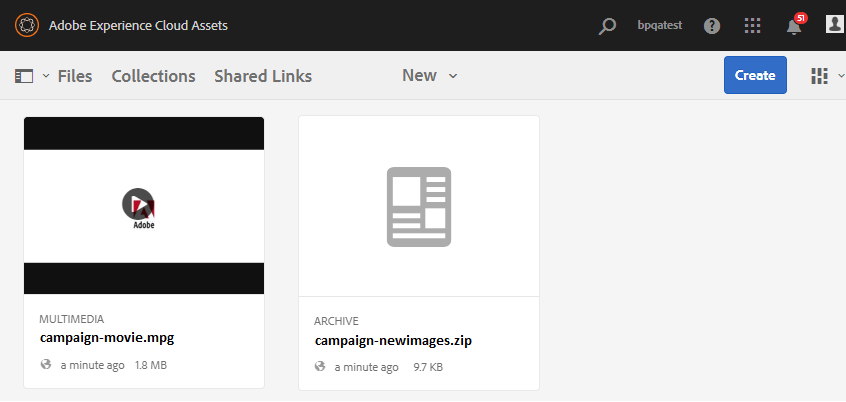

# Publicar a pasta de contribuição no Experience Manager Assets {#using-asset-souring-in-bp}

Os usuários da Brand Portal com permissões apropriadas podem fazer upload de vários ativos ou pastas contendo vários ativos para a pasta de contribuição. No entanto, os usuários do Brand Portal só podem fazer upload de ativos para a pasta **NEW**. A pasta **SHARED** destina-se à distribuição de ativos de linha de base (conteúdo de referência) que podem ser usados pelos usuários do Brand Portal ao criar novos ativos para contribuição.

O usuário do Brand Portal com permissão para acessar a pasta de contribuição pode executar as seguintes atividades:

* [Baixar requisitos de ativos](#download-asset-requirements)
* [Fazer upload de novos ativos para a pasta de contribuição](#uplad-new-assets-to-contribution-folder)
* [Publicar a pasta de contribuição no Experience Manager Assets](#publish-contribution-folder-to-aem)

## Baixar requisitos de ativos {#download-asset-requirements}

Os usuários do Brand Portal recebem automaticamente notificações por email/pulso sempre que uma pasta de contribuição é compartilhada pelo usuário do Experience Manager Assets, permitindo baixar o documento resumido (requisito de ativo), bem como baixar os ativos da linha de base (conteúdo de referência), da pasta **SHARED** para garantir que eles compreendam os requisitos do ativo.

O usuário do Brand Portal realiza as seguintes atividades para baixar os requisitos de ativos:

* **Resumo** do download: Baixe o resumo (documento de requisito de ativo) anexado à pasta de contribuição que contém informações relacionadas ao ativo, como tipo de ativos, finalidade, formatos compatíveis, tamanho máximo do ativo etc.
* **Baixar ativos** da linha de base: Baixe os ativos da linha de base que podem ser usados para entender os tipos de ativos necessários. Os usuários da Brand Portal podem usar esses ativos como referência para criar novos ativos para contribuição.

O painel do Brand Portal reflete todas as pastas existentes permitidas para o usuário do Brand Portal junto com a pasta de contribuição compartilhada recentemente. Neste exemplo, o usuário do Brand Portal só tem acesso à pasta de contribuição recém-criada, nenhuma outra pasta existente é compartilhada com o usuário.

**Para baixar os requisitos de ativos:**

1. Faça logon na instância do Brand Portal.
1. Selecione a pasta de contribuição no painel da Brand Portal.
1. Clique em **[!UICONTROL Propriedades]**. A janela Propriedade que contém os detalhes da pasta de contribuição é aberta.

   

   

1. Clique na opção **[!UICONTROL Baixar resumo]** para baixar o documento de requisito de ativos em sua máquina local.

   

1. Volte para o painel do Brand Portal.
1. Clique para abrir a pasta de contribuição, você pode ver duas subpastas -**[!UICONTROL SHARED]** e **[!UICONTROL NEW]** na pasta de contribuição. A pasta COMPARTILHADA contém todos os ativos de linha de base (conteúdo de referência) compartilhados pelos administradores.
1. Você pode baixar a pasta **[!UICONTROL SHARED]** contendo todos os ativos da linha de base em sua máquina local.
Ou abra a pasta **[!UICONTROL SHARED]** e clique no ícone **Download** para baixar arquivos/pastas individuais.

   

   

Analise o resumo (documento de requisito de ativo) e consulte os ativos da linha de base para entender os requisitos de ativos. Agora, você pode criar novos ativos para contribuição e carregá-los na pasta de contribuição.

## Fazer upload de ativos para a pasta de contribuição {#uplad-new-assets-to-contribution-folder}

Após verificar os requisitos de ativos, os usuários do Brand Portal podem criar novos ativos para contribuição e carregá-los na pasta NOVA na pasta de contribuição.

>[!NOTE]
>
>Os usuários do Brand Portal podem fazer upload de ativos somente para a pasta NEW .
>
>O limite máximo de upload para qualquer locatário do Brand Portal é **10** GB que é aplicado cumulativamente a todas as pastas de contribuição.

>[!NOTE]
>
>É recomendável liberar o espaço de upload após a publicação da pasta de contribuição nos Ativos do Experience Manager para que ele fique disponível para contribuição dos outros usuários do Brand Portal.
>
>Se for necessário estender o limite de upload do seu locatário do Brand Portal para além de **10** GB, entre em contato com o Suporte ao cliente especificando o requisito.

**Para fazer upload de novos ativos:**

1. Faça logon na instância do Brand Portal.
O painel do Brand Portal reflete todas as pastas existentes permitidas para o usuário do Brand Portal junto com a pasta de contribuição compartilhada recentemente.

1. Selecione a pasta de contribuição e clique em para abri-la. A pasta de contribuição contém duas subpastas - **[!UICONTROL SHARED]** e **[!UICONTROL NEW]**.

1. Clique na pasta **[!UICONTROL NEW]**.

   

1. Clique em **[!UICONTROL Create]** > **[!UICONTROL Files]** para carregar arquivos individuais ou pastas (.zip) contendo vários ativos.

   

1. Navegue e faça upload de ativos (arquivos ou pastas) para a pasta **[!UICONTROL NEW]**.

   

Após fazer upload de todos os ativos ou pastas para a NOVA pasta, publique a pasta de contribuição nos Ativos do Experience Manager.

## Publicar a pasta de contribuição no Experience Manager Assets {#publish-contribution-folder-to-aem}

Os usuários do Brand Portal podem publicar a pasta de contribuição no Experience Manager Assets sem precisar acessar a instância do autor do Experience Manager.

Certifique-se de ter passado pelos requisitos do ativo e carregado os ativos recém-criados na pasta **NEW** na pasta de contribuição.

**Para publicar a pasta de contribuição:**

1. Faça logon na instância do Brand Portal.

1. Selecione a pasta de contribuição no painel da Brand Portal.
1. Clique em **[!UICONTROL Publicar no AEM]**.

   

   

Uma notificação por email/pulso é enviada ao usuário e administradores do Brand Portal em diferentes estágios do fluxo de trabalho de publicação:

1. **Em fila**  - Uma notificação é enviada ao usuário do Brand Portal e aos administradores do Brand Portal quando um fluxo de trabalho de publicação é acionado no Brand Portal.

1. **Concluído**  - Uma notificação é enviada ao usuário da Brand Portal e aos administradores da Brand Portal quando a pasta de contribuição é publicada com êxito nos Ativos do Experience Manager.

Após publicar os ativos recém-criados no Experience Manager Assets, os usuários do Brand Portal podem excluí-los da NOVA pasta. Enquanto isso, o administrador do Brand Portal pode excluir os ativos das pastas NOVO e COMPARTILHADO.

Quando o objetivo de criar a pasta de contribuição for atingido, o administrador do Brand Portal poderá excluir a pasta de contribuição para liberar o espaço de upload para outros usuários.

## Publicar o status do trabalho {#publishing-job-status}

Há dois relatórios que os administradores podem utilizar para visualizar o status das pastas de contribuição de ativos publicadas do Brand Portal para o Experience Manager Assets.

* No Brand Portal, navegue até **[!UICONTROL Ferramentas]** > **[!UICONTROL Status de contribuição de ativos]**. Este relatório reflete o status de todos os trabalhos de publicação em estágios diferentes do fluxo de trabalho de publicação.

   

* No Experience Manager Assets (no local ou serviço gerenciado), navegue até **[!UICONTROL Assets]** > **[!UICONTROL Jobs]**. Este relatório reflete o estado final (Sucesso ou Erro) de todos os trabalhos de publicação.

   

* No Experience Manager Assets as a Cloud Service, navegue até **[!UICONTROL Assets]** > **[!UICONTROL Jobs]**.

   Ou você pode navegar diretamente para **[!UICONTROL Jobs]** a partir da navegação global.

   Este relatório reflete o estado final (Sucesso ou Erro) de todos os trabalhos de publicação, incluindo a importação de ativos do Brand Portal para o Experience Manager Assets as a Cloud Service.

   

<!--
>[!NOTE]
>
>Currently, no report is generated in AEM Assets as a Cloud Service for the Asset Sourcing workflow. 
-->
