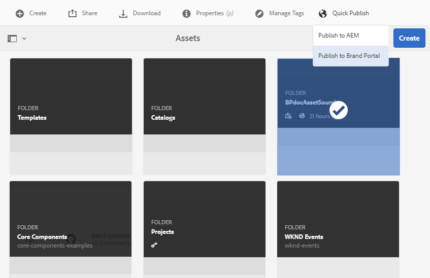

# Publicar pasta de contribuição no Brand Portal {#publish-contribution-folder-to-brand-portal}

Depois que a pasta de [contribuição é configurada](brand-portal-configure-contribution-folder-properties.md), AEM usuário (administrador/não administrador) pode publicar a pasta de contribuição da AEM Assets para o Brand Portal. Os usuários do Brand Portal com permissão para acessar a pasta de contribuição receberão uma notificação por email/pulso na conclusão da ação de publicação.

**Para publicar a pasta de contribuição:**

1. Faça logon na instância do autor AEM.
URL padrão: http:// localhost:4502/aem/start.html
1. Navegue até **[!UICONTROL Ativos > Arquivos]** e localize a pasta de contribuição na qual deseja publicar no Brand Portal.
1. Selecione a pasta de contribuição e clique em Publicação **[!UICONTROL rápida > Publicar no portal]**da marca.
   
Você receberá uma mensagem de sucesso assim que a pasta de contribuição for publicada no Brand Portal.

Uma notificação por email/pulso é enviada aos usuários do Brand Portal atribuídos à pasta de contribuição. Os usuários do Brand Portal podem acessar a pasta de contribuição e iniciar a contribuição. Consulte [Fazer upload de ativos para a pasta](brand-portal-upload-assets-to-contribution-folder.md)Contribuição.