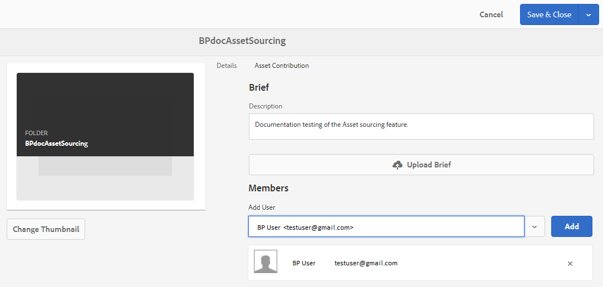

# Configurar pasta de contribuição no Experience Manager Assets {#configure-contribution-folder}

Para a origem colaborativa de ativos, os usuários do Experience Manager Assets (administradores e usuários não administradores com permissão) podem criar novas pastas do tipo **Contribuição de ativos**, verificando se a nova pasta criada está aberta para envio de ativos por usuários do Brand Portal.  Isso aciona automaticamente um workflow que cria duas subpastas adicionais, chamadas **COMPARTILHADO** e **NOVO**, dentro do recém-criado **Contribuição** pasta.

O usuário do Experience Manager Assets define os requisitos do ativo carregando um resumo sobre os tipos de ativos que devem ser adicionados à pasta contribuição, bem como um conjunto de ativos de linha de base, na **COMPARTILHADO** para garantir que os usuários do Brand Portal tenham as informações necessárias. O administrador pode conceder aos usuários ativos do Brand Portal acesso à pasta de contribuição antes de publicar a pasta de contribuição recém-criada no Brand Portal.

O vídeo a seguir demonstra como configurar uma pasta de Contribuição no Experience Manager Assets:

>[!VIDEO](https://video.tv.adobe.com/v/30547)

O usuário do Experience Manager Assets executa as seguintes atividades ao configurar uma pasta de contribuição:

* [Criar pasta de contribuição](#create-contribution-folder)
* [Fazer upload de requisitos de ativos e atribuir colaboradores](#configure-contribution-folder-properties)
* [Fazer upload de ativos da linha de base](#uplad-new-assets-to-contribution-folder)
* [Publicar pasta de contribuição do Experience Manager Assets para o Brand Portal](#publish-contribution-folder-to-brand-portal)

## Criar pasta de contribuição {#create-contribution-folder}

Administradores do Experience Manager Assets e usuários não administradores que têm permissão para criar uma nova pasta podem criar uma pasta de contribuição no Experience Manager Assets.
Para criar uma pasta de contribuição, crie uma nova pasta do tipo Contribuição de ativos, garantindo que a nova pasta criada esteja aberta para o envio de ativos por usuários do Brand Portal.  Isso aciona automaticamente um fluxo de trabalho que cria duas subpastas adicionais, chamadas COMPARTILHADAS e NOVAS, na pasta de contribuição.

>[!NOTE]
>
>Os administradores podem criar várias pastas de contribuição de ativos em uma pasta.
>
>Uma pasta de contribuição de ativos contém as pastas NEW e SHARED para a distribuição e contribuição dos ativos. Não crie um ativo, pasta ou pasta de contribuição em uma pasta de contribuição.

É possível configurar as propriedades da pasta de contribuição separadamente, bem como ao criar a pasta de contribuição. Neste exemplo, estamos configurando as propriedades separadamente.

**Para criar uma pasta de contribuição:**

1. Faça logon na sua instância do Experience Manager Assets.

1. Navegue até **[!UICONTROL Assets]** > **[!UICONTROL Arquivos]**. Ela lista todas as pastas existentes no repositório do Experience Manager Assets.

1. Clique em **[!UICONTROL Criar]** para criar uma nova pasta. **[!UICONTROL Criar pasta]** será aberta.

1. Enter **[!UICONTROL Título]** e **[!UICONTROL Nome]** da pasta e selecione o **[!UICONTROL Contribuição de ativos]** caixa de seleção
É recomendável usar letras minúsculas sem nenhum espaço para nomear a pasta.

1. Clique em **[!UICONTROL Criar]**. Você pode ver a pasta de contribuição listada no repositório do Experience Manager Assets.

   >[!NOTE]
   >
   >Um usuário não administrador pode criar e compartilhar uma pasta de contribuição de ativos, mas não pode modificá-la ou excluí-la.

   

1. Clique para abrir a pasta de contribuição. Você pode ver duas subpastas-**[!UICONTROL COMPARTILHADO]** e **[!UICONTROL NOVO]** são criados automaticamente na pasta contribuição.

   

## Configurar propriedades da pasta de contribuição {#configure-contribution-folder-properties}

O administrador do Experience Manager Assets executa as seguintes atividades ao configurar as propriedades de uma pasta de contribuição.

* **Adicionar descrição**: forneça uma descrição de alto nível da pasta de contribuição.
* **Fazer upload do resumo**: Carregue o documento de requisitos do ativo contendo informações relacionadas ao ativo.
* **Adicionar colaboradores**: adicione usuários do Brand Portal para conceder acesso à pasta de contribuição.

O requisito de ativo refere-se aos detalhes fornecidos pelos administradores para ajudar os contribuidores (usuários do Brand Portal) a entender a necessidade e os requisitos da pasta de contribuição. O administrador carrega um documento de requisitos de ativos que contém um resumo sobre o tipo de ativos que devem ser adicionados à pasta contribuição e informações relacionadas aos ativos, por exemplo, finalidade, tipo de imagens, tamanho máximo, etc.

**Para configurar as propriedades da pasta de contribuição:**

1. Faça logon na sua instância do Experience Manager Assets.

1. Navegue até **[!UICONTROL Ativos > Arquivos]** e localize a pasta contribuição.
1. Selecione a pasta de contribuição e clique em **[!UICONTROL Propriedades]** para abrir a janela Propriedades da pasta.

   

   

1. Navegue até **[!UICONTROL Contribuição de ativos]** guia.
1. Inserir nível superior **[!UICONTROL Descrição]** da pasta contribuição.
1. Clique em **[!UICONTROL Carregar resumo]** para navegar no computador local e fazer upload de um **Documento de requisito do ativo**.

   

1. No **[!UICONTROL Adicionar usuário]** adicione os usuários do Brand Portal com os quais deseja compartilhar a pasta contribuição. Esses usuários podem acessar e fazer upload de conteúdo para a pasta de contribuição usando a interface do Brand Portal.
1. Clique em **[!UICONTROL Salvar]**.

   

>[!NOTE]
>
>Os resultados da pesquisa se baseiam na lista de usuários do Brand Portal configurada no Experience Manager Assets. Verifique se você tem a lista de usuários atualizada do Brand Portal.

Os administradores podem baixar o `user.csv` arquivo de [!DNL Admin Console] e use-o como o modelo base para adicionar usuários do Brand Portal. Ir para [!UICONTROL Usuários] e clique no link [!UICONTROL Exportar lista de usuários para csv] opção para baixar o `users.csv` arquivo. A lista de usuários de amostra a seguir detalha os atributos necessários para adicionar os usuários. O único atributo obrigatório para uma entrada de usuário é o `Email` e todos os outros atributos são opcionais.

[Obter arquivo](assets/users.csv)

## Fazer upload de ativos para a pasta de contribuição {#uplad-new-assets-to-contribution-folder}

O usuário do Experience Manager Assets faz upload de um conjunto de ativos da linha de base para o **COMPARTILHADO** para garantir que os usuários do Brand Portal tenham as informações necessárias.

**Para fazer upload de ativos de baseline:**

1. Faça logon na sua instância do Experience Manager Assets.

1. Navegue até **[!UICONTROL Ativos > Arquivos]** e localize a pasta contribuição.

1. Selecione a pasta de contribuição e clique em para abri-la.

1. Clique no link **[!UICONTROL NOVO]** pasta.

   

1. Clique em **[!UICONTROL Criar]** > **[!UICONTROL Arquivos]** para fazer upload de arquivos ou pastas individuais (.zip) contendo vários ativos.

   

1. Procurar e fazer upload de ativos (arquivos ou pastas) para o **[!UICONTROL NOVO]** pasta.

   

Depois de fazer upload de todos os ativos ou pastas para a NOVA pasta, publique a pasta de contribuição para o Experience Manager Assets.

## Publicar pasta de contribuição para o Brand Portal {#publish-contribution-folder-to-brand-portal}

Depois que a pasta de contribuição é configurada, o usuário do Experience Manager Assets (administrador/usuário não administrador) pode publicar a pasta de contribuição do Experience Manager Assets para o Brand Portal. Os usuários do Brand Portal com permissão para acessar a pasta de contribuição receberão uma notificação por email/pulso após a conclusão da ação de publicação.

**Para publicar a pasta de contribuição:**

1. Faça logon na sua instância do Experience Manager Assets.

1. Navegue até **[!UICONTROL Ativos > Arquivos]** e localize a pasta de contribuição na qual deseja publicar no Brand Portal.
1. Selecione a pasta de contribuição e clique em **[!UICONTROL Publicação rápida]** > **[!UICONTROL Publicar no Brand Portal]**.

   

   Você receberá uma mensagem de sucesso assim que a pasta de contribuição for publicada no Brand Portal.

Uma notificação por email/pulso é enviada aos usuários do Brand Portal atribuídos à pasta de contribuição. Os usuários do Brand Portal podem acessar a pasta contribuição e iniciar a contribuição. Consulte [Fazer upload de ativos para a pasta de contribuição e publicar no Experience Manager Assets](brand-portal-publish-contribution-folder-to-aem-assets.md).
