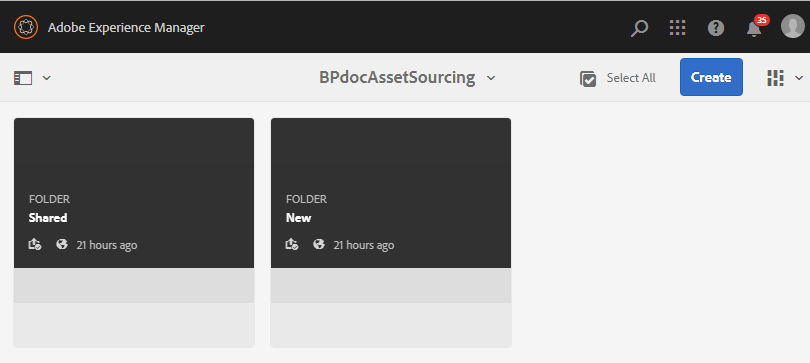
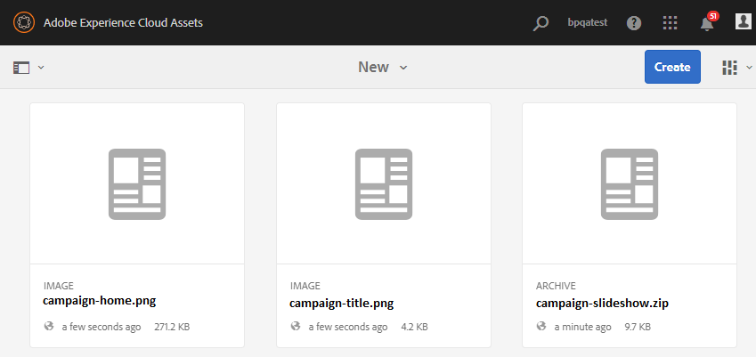

# Configurar a pasta de contribuição no Experience Manager Assets {#configure-contribution-folder}

Para o fornecimento de ativos colaborativos, os usuários do Experience Manager Assets (administradores e usuários não administradores com permissão) podem criar novas pastas do tipo **Contribuição de ativos**, garantindo que a nova pasta criada esteja aberta para o envio de ativos pelos usuários do Brand Portal.  Isso aciona automaticamente um workflow que cria duas subpastas adicionais, chamadas de **COMPARTILHADO** e **NOVO**, no **Contribuição** pasta.

O usuário do Experience Manager Assets então define os requisitos do ativo carregando um resumo sobre os tipos de ativos que devem ser adicionados à pasta de contribuição, bem como um conjunto de ativos da linha de base, à **COMPARTILHADO** para garantir que os usuários do Brand Portal tenham as informações necessárias. O administrador pode conceder aos usuários ativos da Brand Portal acesso à pasta de contribuição antes de publicar a pasta de Contribuição recém-criada na Brand Portal.

O vídeo a seguir demonstra como configurar uma pasta Contribuição no Experience Manager Assets:

>[!VIDEO](https://video.tv.adobe.com/v/30547)

O usuário do Experience Manager Assets executa as seguintes atividades ao configurar uma pasta de contribuição:

* [Criar pasta de contribuição](#create-contribution-folder)
* [Fazer upload dos requisitos de ativos e atribuir colaboradores](#configure-contribution-folder-properties)
* [Fazer upload de ativos da linha de base](#uplad-new-assets-to-contribution-folder)
* [Publicar a pasta de contribuição do Experience Manager Assets para o Brand Portal](#publish-contribution-folder-to-brand-portal)

## Criar pasta de contribuição {#create-contribution-folder}

Os administradores do Experience Manager Assets e usuários não administradores com permissão para criar uma nova pasta podem criar uma pasta de contribuição no Experience Manager Assets.
Para criar uma pasta de contribuição, crie uma nova pasta do tipo Contribuição de ativo, garantindo que a nova pasta criada esteja aberta para o envio de ativos pelos usuários da Brand Portal.  Isso aciona automaticamente um workflow que cria duas subpastas adicionais, chamadas SHARED e NEW, na pasta de contribuição.

>[!NOTE]
>
>Os administradores podem criar várias pastas de contribuição de ativos em uma pasta.
>
>Uma pasta de contribuição de ativos contém pastas NOVO e COMPARTILHADO para a distribuição e contribuição dos ativos. Não crie um ativo, pasta ou pasta de contribuição dentro de uma pasta de contribuição.

Você pode configurar as propriedades da pasta de contribuição separadamente e ao criar a pasta de contribuição. Neste exemplo, estamos configurando as propriedades separadamente.

**Para criar uma pasta de contribuição:**

1. Faça logon na instância do Experience Manager Assets.

1. Navegar para **[!UICONTROL Ativos]** > **[!UICONTROL Arquivos]**. Ele lista todas as pastas existentes no repositório do Experience Manager Assets.

1. Clique em **[!UICONTROL Criar]** para criar uma nova pasta. **[!UICONTROL Criar pasta]** será aberta.

1. Enter **[!UICONTROL Título]** e **[!UICONTROL Nome]** da pasta e selecione o **[!UICONTROL Contribuição de ativos]** caixa de seleção.
É recomendável usar letras minúsculas sem espaço para nomear a pasta.

1. Clique em **[!UICONTROL Criar]**. Você pode ver a pasta de contribuição listada no repositório do Experience Manager Assets.

   >[!NOTE]
   >
   >Um usuário não administrador pode criar e compartilhar uma pasta de contribuição de ativos, mas não pode modificá-la ou excluí-la.

   

1. Clique para abrir a pasta de contribuição, você pode ver duas subpastas -**[!UICONTROL COMPARTILHADO]** e **[!UICONTROL NOVO]** são criadas automaticamente na pasta de contribuição.

   

## Configurar as propriedades da pasta de contribuição {#configure-contribution-folder-properties}

O administrador do Experience Manager Assets executa as seguintes atividades ao configurar as propriedades de uma pasta de contribuição.

* **Adicionar descrição**: Forneça uma descrição de alto nível da pasta de contribuição.
* **Upload breve**: Fazer upload do documento de Requisito de ativo contendo informações relacionadas ao ativo.
* **Adicionar colaboradores**: Adicione usuários do Brand Portal para conceder acesso à pasta de contribuição.

O requisito de ativo refere-se aos detalhes fornecidos pelos administradores para ajudar os colaboradores (usuários do Brand Portal) a entender a necessidade e os requisitos da pasta de contribuição. O administrador faz upload de um documento de requisito de ativo que contém um resumo sobre o tipo de ativos que devem ser adicionados à pasta de contribuição e às informações relacionadas a ativos, por exemplo, finalidade, tipo de imagens, tamanho máximo etc.

**Para configurar as propriedades da pasta de contribuição:**

1. Faça logon na instância do Experience Manager Assets.

1. Navegar para **[!UICONTROL Ativos > Arquivos]** e localize a pasta de contribuição.
1. Selecione a pasta de contribuição e clique em **[!UICONTROL Propriedades]** para abrir a janela Propriedades da pasta.

   

   

1. Navegar para **[!UICONTROL Contribuição de ativos]** guia .
1. Inserir alto nível **[!UICONTROL Descrição]** da pasta de contribuição.
1. Clique em **[!UICONTROL Carregar resumo]** para navegar pelo computador local e fazer upload de um **Documento de requisitos de ativos**.

   

1. No **[!UICONTROL Adicionar usuário]** , adicione usuários do Brand Portal com quem deseja compartilhar a pasta de contribuição. Esses usuários podem acessar e fazer upload de conteúdo para a pasta de contribuição usando a interface do Brand Portal.
1. Clique em **[!UICONTROL Salvar]**.

   

>[!NOTE]
>
>Os resultados da pesquisa são baseados na lista de usuários do Brand Portal configurada no Experience Manager Assets. Certifique-se de ter atualizado a lista de usuários do Brand Portal.

Os administradores podem baixar a variável `user.csv` arquivo de [!DNL Admin Console] e usá-lo como o modelo base para adicionar usuários do Brand Portal. Ir para [!UICONTROL Usuários] e clique no botão [!UICONTROL Exportar lista de usuários para csv] para baixar a `users.csv` arquivo. A lista de usuários de exemplo a seguir detalha os atributos necessários para adicionar os usuários. O único atributo obrigatório para uma entrada de usuário é o `Email` e todos os outros atributos são opcionais.

[Obter arquivo](assets/users.csv)

## Fazer upload de ativos para a pasta de contribuição {#uplad-new-assets-to-contribution-folder}

O usuário do Experience Manager Assets faz upload de um conjunto de ativos da linha de base para a **COMPARTILHADO** para garantir que os usuários do Brand Portal tenham as informações necessárias.

**Para fazer upload de ativos da linha de base:**

1. Faça logon na instância do Experience Manager Assets.

1. Navegar para **[!UICONTROL Ativos > Arquivos]** e localize a pasta de contribuição.

1. Selecione a pasta de contribuição e clique em para abri-la.

1. Clique no botão **[!UICONTROL NOVO]** pasta.

   

1. Clique em **[!UICONTROL Criar]** > **[!UICONTROL Arquivos]** para carregar arquivos individuais ou pastas (.zip) contendo vários ativos.

   

1. Procure e faça upload de ativos (arquivos ou pastas) no **[!UICONTROL NOVO]** pasta.

   

Após fazer upload de todos os ativos ou pastas para a pasta NEW , publique a pasta de contribuição na Experience Manager Assets.

## Publicar a pasta de contribuição no Brand Portal {#publish-contribution-folder-to-brand-portal}

Depois que a pasta de contribuição é configurada, o usuário do Experience Manager Assets (administrador/não administrador) pode publicar a pasta de contribuição do Experience Manager Assets para o Brand Portal. Os usuários da Brand Portal que tiverem permissão para acessar a pasta de contribuição receberão uma notificação por e-mail/pulso na conclusão da ação de publicação.

**Para publicar a pasta de contribuição:**

1. Faça logon na instância do Experience Manager Assets.

1. Navegar para **[!UICONTROL Ativos > Arquivos]** e localize a pasta de contribuição na qual deseja publicar no Brand Portal.
1. Selecione a pasta de contribuição e clique em **[!UICONTROL Publicação rápida]** > **[!UICONTROL Publicar no Brand Portal]**.

   

   Você receberá uma mensagem de sucesso assim que a pasta de contribuição for publicada no Brand Portal.

Uma notificação por e-mail/pulso é enviada aos usuários da Brand Portal atribuídos à pasta de contribuição. Os usuários da Brand Portal podem acessar a pasta de contribuição e iniciar a contribuição. Consulte [Faça upload de ativos para a pasta de contribuição e publique no Experience Manager Assets](brand-portal-publish-contribution-folder-to-aem-assets.md).
