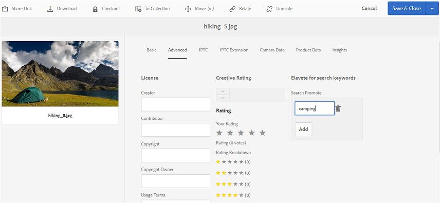

# Publish tags to Brand Portal {#publish-tags-to-brand-portal}

Saiba como publicar tags em [!DNL AEM] Ativos.[!DNL Brand Portal]

As tags são úteis na organização de ativos e aprimoramento da análise dos ativos aos quais estão associados. As tags podem ser pensadas como palavras-chave ou rótulos (metadados) anexados aos ativos e permitem que os ativos sejam rapidamente encontrados em resultado de uma pesquisa. Para saber como atribuir tags a ativos em [!DNL AEM] Ativos, consulte [Usar tags para organizar ativos](https://helpx.adobe.com/experience-manager/6-5/assets/using/organize-assets.html#Usetagstoorganizeassets).

As tags (associadas com ativos e coleções in [!DNL AEM]) são publicadas automaticamente quando [!DNL Brand Portal] os ativos (e coleções) com tags associadas são publicados [!DNL Brand Portal]. As tags publicadas são úteis para ativar as pesquisas para encontrar os ativos associados.

>[!NOTE]
>
>No entanto, é recomendado publicar tags exclusivamente para [!DNL Brand Portal] antes de publicar os ativos (e coleções) com os quais as tags estão associadas. Isso garante a publicação mais rápida dos ativos (e coleções) para [!DNL Brand Portal].

## Manage tags {#manage-tags}

Você pode usar as tags pré-existentes para anexar a um ativo ou criar novas tags do [!DNL AEM] console Tags (**Ferramentas | Marcação |[!DNL AEM]Tags**). Em ambos os cenários, primeiro você deve publicar as tags e [!DNL Brand Portal] associá-las a ativos apropriados.

Para criar tags [!DNL AEM]ativadas, publique [!DNL Brand Portal]e associe as tags com os ativos adequados (ou coleções), siga estas etapas:

1. **Criar tags**
na instância [!DNL AEM] do Autor com privilégios administrativos e acessar o console **[!DNL AEM]Tags** a partir da navegação global:

   1. Selecionar **ferramentas**

   2. Selecionar **geral**

   3. Selecione **Marcação**

2. Selecione **Criar** e selecione **Criar tag.**
3. Especificar:

   * **Título**
      *(obrigatório)* Um título de exibição para a tag.
   * **Nome**
      *(obrigatório)* Um nome para a tag. Se não for especificado, um nome de nó válido será criado a partir do Título. Consulte [tagid](https://helpx.adobe.com/experience-manager/6-5/sites/developing/using/framework.html#TagID).
   * **Descrição**
      *(opcional)* Uma descrição da tag.
   * **Caminho**JCR do caminho
de tag da tag.

4. Selecione **Enviar** para criar a tag.

   Após criar uma tag em [!DNL AEM] instância, a tag estará disponível para ser anexada a um ativo (usando a seção Propriedades ou a seção Gerenciar tags desse ativo).

5. **Publicar a tag.[!DNL Brand Portal]**

   Console Ir para **[!DNL AEM]tags** (Ferramentas | Marcação | [!DNL AEM] Tags), selecione a tag desejada e publique **[!DNL Brand Portal]**-a.

6. **Anexe a tag a um ativo (ou coleção)**.

   Selecione um ativo (ou coleção) e anexe a tag desejada usando a seção Propriedades ou a seção Gerenciar tags desse ativo. Para saber mais sobre como atribuir tags a ativos em [!DNL AEM] Ativos, consulte [Tags para organizar ativos](https://helpx.adobe.com/experience-manager/6-5/assets/using/organize-assets.html#Usetagstoorganizeassets).

7. **Publicar ativos (ou coleções) para[!DNL Brand Portal]**.\
   Quando você publica um ativo (ou coleção) para [!DNL Brand Portal], a tag anexada também está disponível [!DNL Brand Portal].

   Para ver a tag anexada no respectivo ativo (ou coleção) no [!DNL Brand Portal], faça logon e [!DNL Brand Portal] selecione o ativo, na seção Propriedades, você verá a tag anexada.

## Pesquisar Promover {#search-promote}

[!DNL AEM] Os ativos [!DNL Brand Portal] permitem que você faça ativos específicos como os principais resultados para pesquisas com base em uma tag de palavra-chave.

Para elevar um ativo para uma palavra-chave de pesquisa, siga estas etapas:

1. Abra a página **Propriedades** de um ativo na [!DNL AEM] instância do autor.
2. Vá até a guia **Avançado** .
3. Na **seção Pesquisar promoção** em **Elevar para palavras-chave** de pesquisa, selecione **Adicionar** para adicionar as palavras-chave de pesquisa ou tags.

   

4. Salve as alterações.
5. Publish the asset to [!DNL Brand Portal].
6. [!DNL Brand Portal]Faça logon. Exibir **a guia Avançado** na **seção Propriedades** do ativo.
Observe que a **palavra-chave do Search Promote** também está visível nas Propriedades desse ativo.
