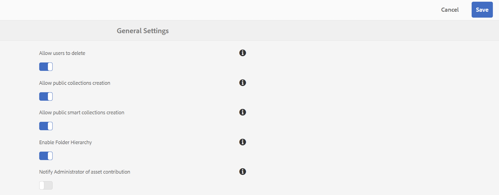

# Notas de versão {#release-notes}

Saiba mais sobre os novos recursos, melhorias, problemas críticos corrigidos e problemas conhecidos na versão 2023.05.0 do Adobe Experience Manager Assets Brand Portal.

## Informações da versão {#release-information}

| Produto | Adobe Experience Manager Assets Brand Portal |
|---|---|
| Versão | 2023.05.0 |
| Data | Maio de 2023 |

## Visão geral {#overview}

O Adobe Experience Manager (AEM) Assets Brand Portal ajuda você a adquirir, controlar e distribuir com facilidade ativos criativos aprovados para terceiros e usuários de negócios internos em todos os dispositivos. Ele ajuda a melhorar a eficiência do compartilhamento de ativos, acelera o tempo de comercialização dos ativos e reduz o risco de não-conformidade e acesso não autorizado. O Brand Portal permite que os usuários naveguem, pesquisem, visualizem, baixem e exportem ativos em formatos corporativos aprovados — a qualquer momento e em qualquer lugar.

## Novidades em 2023.05.0 {#whats-new-in-2023.05.0}

### Problemas Críticos Corrigidos {#critical-issues-fixed}

#### Correções de erros {#bug-fixes}

Esta versão inclui correções para os seguintes problemas críticos:
* Se ocorrer um erro ao baixar um Ativo de um link compartilhado, a variável `Notice` e `Close` os rótulos do prompt de erro não estão localizados.
* Brand Portal displays **Campos de cabeçalho de solicitação muito grandes** erro ao acessar filtros de pesquisa usando `Filter` painel.

### Problemas conhecidos {#known-issues}

Esta versão inclui os seguintes problemas conhecidos:

* Localização parcial no conteúdo do relatório de origem do Ativo.
* Alguns campos do perfil do usuário não podem ser editados no perfil do usuário.

## Versões anteriores

### Versão de fevereiro de 2023 {#feb-2023}

**Correções de erros**

Esta versão inclui correções para os seguintes problemas críticos:
* A imagem do perfil não pode ser atualizada no Brand Portal.
* O painel da árvore de conteúdo não é redimensionável. Se o nome do arquivo for maior que a largura padrão da árvore de conteúdo, não será possível arrastar a árvore de conteúdo na horizontal e na vertical. Como resultado, nomes de arquivo mais longos não são legíveis.
* Os resultados da pesquisa são inconsistentes para o mesmo predicado de propriedade usado duas vezes nos formulários de pesquisa.
* O texto nas páginas de logon intermediárias não está traduzido para todos os idiomas.

**Aprimoramentos**

Esta versão inclui os seguintes aprimoramentos:
* Um novo visualizador de PDF moderno está disponível para uma visualização aprimorada dos ativos de PDF.
* Agora você pode optar por ativar ou desativar as notificações de origem de ativos para Administradores. Navegue até [!UICONTROL Configurações gerais] e, em seguida, ativar ou desativar [!UICONTROL `Notify Administrator of asset contribution`].

   

* Um usuário não autorizado não pode solicitar acesso à Brand Portal se a solicitação de acesso estiver desativada.
* Somente as organizações provisionadas para o Brand Portal estão visíveis na lista do seletor de perfis.

**Problemas conhecidos**

Esta versão inclui os seguintes problemas conhecidos:

* Localização parcial no conteúdo do relatório de origem do Ativo.
* Alguns campos do perfil do usuário não podem ser editados no perfil do usuário.

### Versão de outubro de 2022 {#oct-2022}

**Problemas Críticos Corrigidos**

Essa versão inclui correções para os seguintes problemas críticos:
* Tempos de resposta lentos ao copiar arquivos grandes do Brand Portal para uma ferramenta de terceiros.
* Ao marcar a caixa de seleção Contagem de representações, as caixas de seleção para selecionar representações individuais são desativadas.
* Tempo de resposta lento para pesquisa.

>[!IMPORTANT]
>
>As notificações por push no AEM Assets Brand Portal serão descontinuadas a partir de 1º de dezembro de 2022. Em vez de notificações Pulse, você continuará recebendo notificações por email para os seguintes eventos:
>* Compartilhamento de ativos por meio de link
>* Solicitando fluxo de trabalho de acesso
>* Compartilhamento da pasta de contribuição
>* Iniciando exportação para AEM
>* Exportação para AEM concluída
>

### Versão de agosto de 2022 {#aug-2022}

**Problemas Críticos Corrigidos**

Essa versão inclui correções para os seguintes problemas críticos:
* Quando a NUI não processa um ativo no Experience Manager, o Brand Portal exibe um status de importação de ativo impreciso.
* Quando a ação de visualização falha, não há notificação para comunicar a falha.
* Valor impreciso da propriedade totalUploadedSize para cada ativo corrigido.
* Ao clicar em **Baixar todos os itens** e houver um grande número de representações disponíveis para um ativo, a Brand Portal baixa um arquivo .ZIP inválido.
* A tradução de algumas cadeias de caracteres é truncada na interface do usuário do Brand Portal.

### Versão de maio de 2022 {#may-2022}

**Novos recursos**

O Brand Portal agora executa processos automáticos a cada doze horas para excluir todos os ativos do Brand Portal publicados no AEM. Como resultado, não é necessário excluir manualmente os ativos na pasta Contribuição para manter o tamanho da pasta abaixo do limite.

**Problemas Críticos Corrigidos**

Esta versão inclui correções para os seguintes problemas críticos:

* Ao baixar uma pasta ou coleção que inclui ativos com tags de cores, um arquivo XML também é baixado.
* Ao baixar um vídeo que inclui representações, o Brand Portal cria um arquivo .ZIP inválido.
* Ao criar predefinições e ativos no AEM, publicá-los no Brand Portal e selecionar representações dinâmicas ao baixar os ativos, não é possível extrair o arquivo .ZIP baixado.
* Problemas ao baixar ativos de vídeo de determinadas pastas disponíveis no Brand Portal.
* Ao compartilhar o URL da pasta Contribuição por email, as funções de Visualizador e Editor enfrentam problemas ao acessar a pasta principal por meio da navegação estrutural.
* O relatório de publicação de origem exibe uma hora inicial de trabalho incorreta.

### Versão de fevereiro de 2022 {#feb-2022}

**Novos recursos**

* O limite de tempo limite de sessão para os usuários convidados foi reduzido de 2 horas para 15 minutos.
* O montante **[!UICONTROL Exibir páginas]** A opção foi removida para PDF de várias páginas, pois o usuário agora pode exibir as páginas de PDF do visualizador do Adobe Document Cloud.
* Os usuários não podem pesquisar, navegar ou abrir pastas. A interface do usuário reflete a mensagem de erro: `Failed to load data`.
* A variável **[!UICONTROL Representações]** O painel não lista todas as representações estáticas dos ativos publicados no Brand Portal.
* A variável **[!UICONTROL Representações]** O painel lista as representações de corte inteligente do ativo, no entanto, o usuário não pode visualizar ou baixar as representações de corte inteligente.
* A caixa de diálogo de download lista as representações de corte inteligente do ativo selecionado. No entanto, o usuário não pode baixar as representações de corte inteligente.
* Um usuário não administrador está obtendo somente a representação do ativo original ao baixar um ativo. O sistema e as representações personalizadas não são baixados.
* Ao aplicar o filtro de pesquisa para baixar um ativo, a variável `Download` O botão está desativado na caixa de diálogo de download e não permite que o usuário baixe o ativo.
* Se `Smart Tags` e (ou) `Color Tags` estiverem ativados, a caixa de diálogo de download listará as `json` arquivos como representações e faz o download desses `json` arquivos na pasta zip arquivada.
* Os usuários anônimos não conseguem baixar ativos usando um link compartilhado porque o link redireciona para a página de logon do Brand Portal.
* O sistema não está refletindo o valor correto para o número de usuários simultâneos ativos.

<!--
### New Features {#new-features}

This release includes the following new features:

* AEM Assets as a Cloud Service is now entitled to have a pre-configured Brand Portal instance. The Cloud Manager user can activate Brand Portal on the AEM Assets as a Cloud Service instance.

* Asset Sourcing feature is now available on AEM Assets as a Cloud Service. It allows the Brand Portal users to upload assets to the permitted contribution folders and publish the contribution folder from Brand Portal to AEM Assets as a Cloud Service instance. 

* An additional **[!UICONTROL Asset Download]** setting has been introduced under the **[!UICONTROL Download Settings]**. It creates a separate folder for each asset while downloading the folders, collections, or bulk download of assets. 
-->
<!-- 
* The **[!UICONTROL Download]** dialog is revamped in a list view with additional options to exclude the renditions which are not required, apply the same set of rules for similar asset types, and download the selected asset renditions.
-->

<!--
* The new **[!UICONTROL Download]** dialog now appears with all the renditions of the selected assets or folders containing assets in a list view, wherein the Brand Portal users can apply same set of renditions for similar asset types and download the selected asset renditions. 
-->

<!-- 
* Navigation to the **[!UICONTROL Files]**, **[!UICONTROL Collections]**, and **[!UICONTROL Shared Links]** is now possible from all the Brand Portal pages in one-click.  

* The **[!UICONTROL Renditions]** panel in the asset details page now allows the Brand Portal users to select the original asset and (or) specific asset renditions, and directly download them from the **[!UICONTROL Renditions]** panel without having to open the **[!UICONTROL Download]** dialog.
-->

<!--
Brand Portal users can exclude specific renditions which are not required and directly download the original asset and its renditions from the **[!UICONTROL Renditions]** panel on the asset details page. 
-->

<!-- 
* In addition to the existing **[!UICONTROL Download]** configurations, the Brand Portal administrators can also [configure permissions for different group of users]() to view and (or) download the original asset and its renditions from the asset details page. These configurations will define who can access and (or) download the asset renditions.
-->

<!--
### Enhancements {#enhancements}

Brand Portal 2021.08.0 is an internal release that introduces Business profiles for enterprise and teams customers to give organizations better control over their assets. 

This release includes the following enhancements:

* The users now have organization-specific entitlement on the new and migrated organizations. If a user is entitled to multiple organizations, the user has to select the organization at the time of login.

* The new users that are added in Admin Console must **Join Team** to get entitled to the organization. 

>[!NOTE]
>
>Business profiles are currently applicable for the new organizations that are created after August 16, 2021. 
>
>Until your organization is migrated, you can continue to use Adobe ID, Enterprise ID, or Federated ID types to access the organization.   
-->

<!-- 
* For folder download, a separate folder is created for each asset using share link irrespective of the **[!UICONTROL Download Settings]**. 
* The Brand Portal **[!UICONTROL Usage Report]** has been modified to reflect only the active Brand Portal users.
-->

<!--
* The threshold of session timeout for the guest users has been reduced from 2 hours to 15 minutes.
* The additional **[!UICONTROL View pages]** option has been removed for multi-page PDFs as the user can now view the PDF pages from the Adobe Document Cloud Viewer.

* The users are unable to search, navigate, or open folders. The user interface reflects the error message: `Failed to load data`. 
* The **[!UICONTROL Renditions]** panel does not list all the static renditions of the assets that are published to Brand Portal.
* The **[!UICONTROL Renditions]** panel lists the smart crop renditions of the asset, however, the user cannot preview or download the smart crop renditions.
* The download dialog lists the smart crop renditions of the selected asset, however, the user cannot download the smart crop renditions. 
* A non-admin user is getting only the original asset rendition when downloading an asset. The system and custom renditions are not downloaded.  
* When applying search filter to download an asset, the `Download` button is disabled in the download dialog and does not allows the user to download the asset.
* If `Smart Tags` and (or) `Color Tags` are enabled, the download dialog lists the `json` files as renditions and downloads these `json` files in the archived zip folder.
* The anonymous users are unable to download assets using a shared link because the link redirects to the Brand Portal login page. 
* The system is not reflecting the correct value for the number of active concurrent users.
-->

<!--
### New features {#new-features}

Brand Portal now executes automatic jobs every twelve hours to delete all Brand Portal assets that are published to AEM. As a result, you do not need to delete the assets in the Contribution folder manually to keep the folder size below the threshold limit. See [What's new in Experience Manager Assets Brand Portal](whats-new.md).
-->

<!--
This release includes fixes to the following critical issues:

* When you download a folder or a collection that includes assets with color tags, an XML file gets downloaded as well.

* When you download a video that includes renditions, Brand Portal creates an invalid .ZIP file.

* When you create presets and assets on AEM author and publish them to Brand Portal and then select dynamic renditions while downloading the assets, you cannot extract the downloaded .ZIP file.

* Issues while downloading video assets from certain folders available on Brand Portal.

* When you share the Contribution folder’s URL using an email, Viewer and Editor roles face issues while accessing its parent folder using the breadcrumb.

* Sourcing published report displays an incorrect job start time.
>
 
<!--
* Asset Sourcing email notifications are not delivered for some organizations. 

* Video files with extension `.mov` are not running on Brand Portal. 

* In the **[!UICONTROL Smart Collections]** dropdown list, only ten saved collections are visible. 
-->
<!--
* *_deleted tenants are listed as valid tenant which fails during the execution of TenantCustomizers/TenantUpdates where tenant id is returned as /etc/tenants/`<nodename>`.
-->

<!--
In case only the original assets are downloaded, the asset reflects its own extension and does not open until the extension is manually changed to zip. 
* The user interface of the collection folder does not respond on clicking the navigation arrow. 
* **[!UICONTROL Create]** button is visible in the **[!UICONTROL Column]** view even when the folders are empty.
* **[!UICONTROL Omni search]** fails with a 414 error message (Request-URI Too Long) if the dispatcher is bypassed while accessing the Brand Portal instance.
* An empty zip folder is downloaded if the asset contains a comma (`,`) in the file name.
* The viewer users get the option to add users to the collection they have created. 
* Inconsistent behavior is experienced when an asset (thumbnail or web rendition) is downloaded using share link.

See [what's new in Brand Portal 2021.02.0](whats-new.md).
-->

<!--
### Known Issues {#known-issues}

This release includes the following known issue:

* Search on the **[!UICONTROL Asset Reports]** shows processing on the product interface with no search result.
* The video DM encodes are not visible to the non-admin users on the asset details page.
* The alignment of the size of individual asset renditions and total download size is distorted in the Download dialog.
-->

<!--
* Download Settings configuration to configure asset download from Brand Portal. Fast download, custom renditions, and system renditions are the available configurations. 
-->

<!--
* Document Viewer has been introduced to enhance the PDF viewing experience. New options are available for viewing the PDF files in Brand Portal.

* Advances in the asset download process which improves the Brand Portal user experience while [downloading assets from Brand Portal](brand-portal-download-assets.md). Brand Portal administrators can configure **[!UICONTROL Fast Download]**, **[!UICONTROL Custom Renditions]**, and **[!UICONTROL System Renditions]** from the **[!UICONTROL Download]** settings. 

For details, see [what's new in Brand Portal 6.4.7](whats-new.md). 

### Critical Issues Fixed {#critical-issues-fixed-647}

This release includes fixes to the following critical issues:

* The viewer users are not permitted to share link for collections but the option to share is visible to them on the product interface.

* The **[!UICONTROL Download]** button on the options bar does not list all the licensed assets of the selected folder.

* The search takes longer to show the results for certain keywords.

* The **[!UICONTROL Agree]** and **[!UICONTROL Disagree]** check boxes does not appear on bulk selection of licensed and unlicensed assets during download.

* Filter-based search shows processing on the product interface with no search result. 

* The assets do not download from share link if the shared folder contains numerous and large assets.

### Known Issues {#known-issues-647}

This release includes the following known issues:

* If multiple assets are selected, license text does not appear on clicking Terms and Conditions on the license agreement page during download using share link.   

-->

## Idiomas {#languages}

A interface do usuário do Brand Portal está disponível nos seguintes idiomas:

* Inglês
* Alemão
* Francês
* Espanhol
* Italiano
* Português do Brasil
* Japonês
* Chinês Simplificado
* Coreano

## Plataformas certificadas {#certified-platforms}

Para determinar quais plataformas estão certificadas para execução com esta versão do Brand Portal, consulte **Suporte para interface otimizada para toque** na tabela no **Navegadores compatíveis com a interface de criação de usuário** seção de [Requisitos técnicos](https://experienceleague.adobe.com/docs/experience-manager-65/deploying/introduction/technical-requirements.html).

## Links {#links}

* [Página do produto Adobe Experience Manager em adobe.com](https://business.adobe.com/in/products/experience-manager/adobe-experience-manager.html)
* [Documentação do Assets Brand Portal](https://experienceleague.adobe.com/docs/experience-manager-brand-portal/using/home.html)

## Acesso e suporte do produto (sites restritos) {#product-access-and-support-restricted-sites}

Esses sites só estão disponíveis para clientes do. Se você for um cliente do e precisar de acesso, entre em contato com o gerente de conta da Adobe.

<!--
* [https://daycare.day.com](https://daycare.day.com) 
-->

<!--
* [Customer Support]()
-->
