# Trabalhar com relatórios {#work-with-reports}

O recurso de relatório é essencial para avaliar o uso do Brand Portal e saber como os usuários internos e externos interagem com ativos aprovados. Os administradores podem exibir o relatório de Uso do portal de marca, que está sempre disponível na página Relatórios de ativos. No entanto, os relatórios de logons de usuário e ativos baixados, expirados, publicados e ativos compartilhados por links podem ser gerados e exibidos a partir da página de Relatórios de ativo. Esses relatórios são úteis na análise da implantação de ativos, que permite que você derive métricas-chave de sucesso para medir a adoção de ativos aprovados dentro e fora da organização.

A interface de gerenciamento de relatórios é intuitiva e inclui opções e controles refinados para acessar relatórios salvos. Você pode exibir, baixar ou excluir relatórios da página Relatórios de ativos, onde todos os relatórios gerados anteriormente são listados.

## Exibir relatórios {#view-reports}

Para exibir um relatório, siga estas etapas:

1. Na barra de ferramentas na parte superior, toque/clique no logotipo do AEM para acessar as ferramentas administrativas.

   

2. No painel de ferramentas administrativas, clique **[!UICONTROL em Criar/gerenciar relatórios]** para abrir **[!UICONTROL a página Relatórios]** de ativo.

   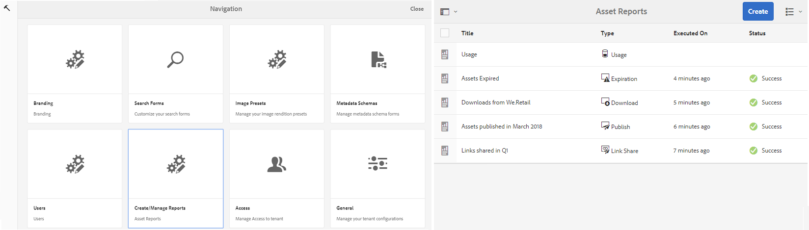

3. Acesso **[!UICONTROL de]** acesso e outros relatórios gerados a partir da página Relatórios de ativos.

   >[!NOTE]
   >
   >O relatório de uso está presente por padrão no Brand Portal. Ele não pode ser criado ou excluído. No entanto, você pode criar, baixar e excluir os relatórios Download, Expiração, Publicação, Compartilhamento de links e Logons de usuário.

   Para exibir um relatório, toque/clique no link do relatório. Como alternativa, selecione o relatório e toque/clique no ícone Exibir na barra de ferramentas.

   [!UICONTROL O Relatório] de uso exibe informações sobre o número de usuários atuais do Brand Portal, o espaço de armazenamento ocupado por todos os ativos e a contagem total de ativos no Portal da marca. O relatório também exibe a capacidade permitida para cada uma dessas métricas de informações.

   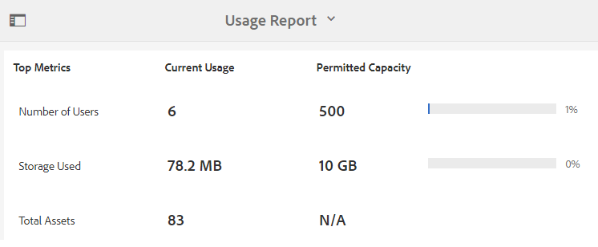

   [!UICONTROL O relatório de logons] de usuário fornece informações sobre os usuários que fizeram logon no Brand Portal. O relatório mostra nomes de exibição, IDs de e-mail, personalizados (administrador, visualizador, editor, convidado), grupos, último logon, status da atividade e contagem de login de cada usuário da implantação do Portal da marca 6.4.2 até a hora da geração do relatório.

   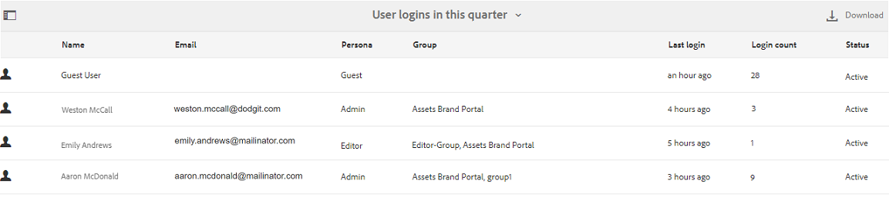

   [!UICONTROL Baixe] listas de relatórios e detalhes sobre todos os ativos baixados em uma data e hora específicas.

   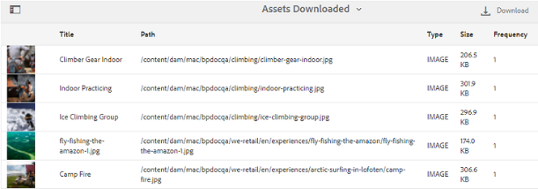

   >[!NOTE]
   >
   >O relatório [!UICONTROL de Download] de ativos exibe somente os ativos que foram individualmente selecionados e baixados do Brand Portal. Se um usuário tiver baixado uma pasta que contém ativos, o relatório não exibirá a pasta ou os ativos dentro dela.

   [!UICONTROL O relatório de expiração] lista e detalha todos os ativos que expiram em um intervalo de tempo específico.

   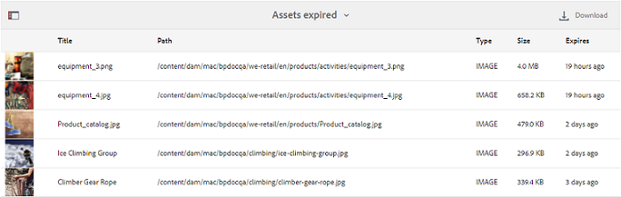

   [!UICONTROL Publicar] relatório lista e fornece informações sobre todos os ativos publicados do AEM para o Brand Portal em um período especificado.

   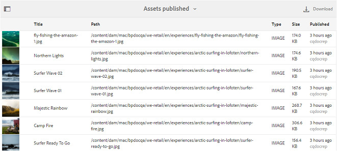

   >[!NOTE]
   >
   >Publicar relatório não exibe informações sobre fragmentos do conteúdo, já que os fragmentos do conteúdo não podem ser publicados no Portal da marca.

   [!UICONTROL O relatório] de compartilhamento de links lista todos os ativos compartilhados pelos links da interface do Brand Portal em um período específico. O relatório também informa quando foi o ativo compartilhado por link, por qual usuário, quando o link expira e o número de links compartilhados para o inquilino (e usuários com os quais o link de ativo foi compartilhado). As colunas do Relatório de compartilhamento de link não são personalizáveis.

   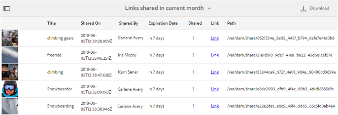

   >[!NOTE]
   >
   >O Relatório de compartilhamento de links não exibe os usuários que têm acesso ao ativo compartilhado por meio do link ou baixaram o ativo por meio do link.
   >
   >
   >Para rastrear downloads por meio do link compartilhado, é necessário gerar o relatório de download depois de selecionar **[!UICONTROL Somente a opção Downloads]** de compartilhamento de links na **[!UICONTROL página Criar relatório]** . No entanto, o usuário (Baixado por) é anônimo nesse caso.

## Gerar relatórios {#generate-reports}

Os administradores podem gerar e gerenciar os seguintes relatórios padrão, após serem gerados, eles serão salvos para [serem acessados](../using/brand-portal-reports.md#main-pars-header) posteriormente:

* Logons de usuário
* Download
* Expiração
* Publicação
* Compartilhamento de link

As colunas no relatório Download, Expiração e Publicação podem ser personalizadas para exibição. Para gerar um relatório, siga estas etapas:

1. Na barra de ferramentas na parte superior, toque/clique no logotipo do AEM para acessar as ferramentas administrativas.

   

2. No painel de ferramentas administrativas, toque/clique **[!UICONTROL em Criar/gerenciar relatórios]** para abrir a página** Relatórios de ativo**.

   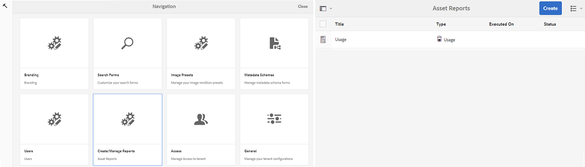

3. Na página Relatórios de ativos, toque/clique **[!UICONTROL em Criar]**.
4. Na página **[!UICONTROL Criar relatório]** , selecione um relatório a ser criado e toque/clique **[!UICONTROL em Avançar]**.

   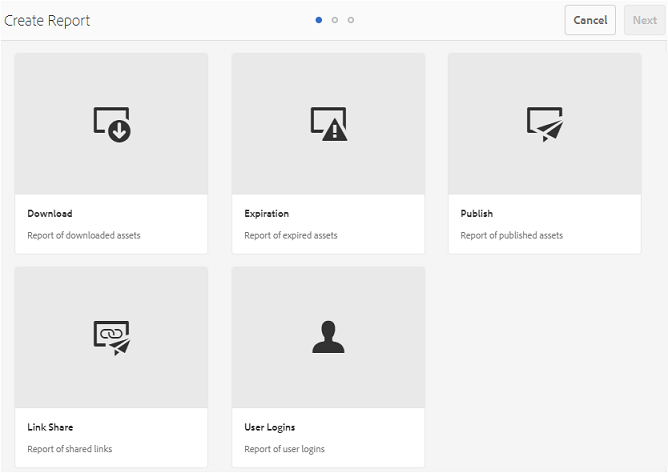

5. Configure os detalhes do relatório. Especifique título, descrição, estrutura de pastas (onde o relatório precisa executar e gerar estatísticas) e o intervalo de datas para [!UICONTROL relatórios de Download], [!UICONTROL Expiração]e [!UICONTROL Publicação] .

   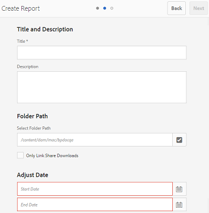

   Considerando que o [!UICONTROL Relatório] de compartilhamento de link precisa apenas do título, descrição e parâmetros de intervalo de datas.

   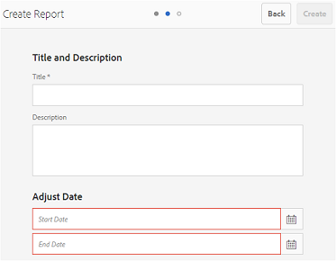

   >[!NOTE]
   >
   >Caracteres especiais # e % no título do relatório são substituídos por um hífen (-) na geração do relatório.

6. Toque/clique **[!UICONTROL em Avançar]**, para configurar as colunas de relatórios de Download, Expiração e Publicação.
7. Marque ou desmarque as caixas de seleção apropriadas conforme necessário. Por exemplo, para exibir nomes de usuários (que baixaram ativos) no [!UICONTROL Relatório Download] , selecione **[!UICONTROL Baixado por]**. A imagem a seguir ilustra a seleção de colunas padrão no Relatório de download.

   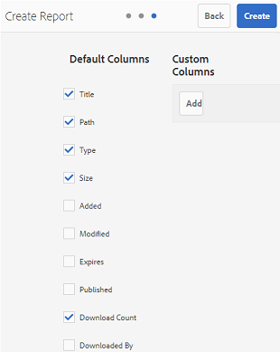

   Você também pode adicionar colunas personalizadas a esses relatórios para exibir mais dados para seus requisitos personalizados.

   Para adicionar colunas personalizadas a Download, publicação ou expiração do relatório, siga estas etapas:

   1. Para exibir uma coluna personalizada, toque/clique **[!UICONTROL em Adicionar]** em [!UICONTROL Colunas personalizadas].
   2. Especifique o nome da coluna no **[!UICONTROL campo Nome]** da coluna.
   3. Selecione a propriedade à qual a coluna precisa mapear, usando o seletor de propriedades.

      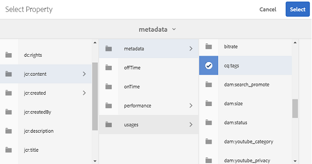Como alternativa, digite o caminho no campo caminho da propriedade.

      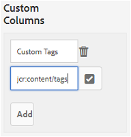

      Para adicionar mais colunas personalizadas, toque/clique **em Adicionar** e repita as etapas 2 e 3.

8. Toque/clique em **[!UICONTROL Criar]**. Uma mensagem notifica que a geração de relatórios foi iniciada.

## Download de relatórios {#download-reports}

Para salvar e baixar um relatório como arquivo. csv, execute um dos seguintes procedimentos:

* Selecione um relatório na página Relatórios de ativos e toque/clique **[!UICONTROL em Download]** na barra de ferramentas na parte superior.

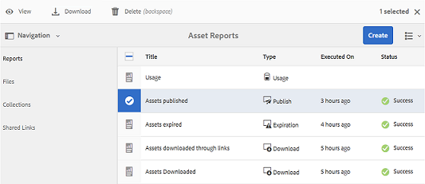

* Na página Relatórios de ativos, abra um relatório. Selecione **[!UICONTROL a opção Download]** na parte superior da página do relatório.

## Excluir relatórios {#delete-reports}

Para excluir um relatório existente, selecione o relatório da **[!UICONTROL página Relatórios]** de ativos e toque/clique **[!UICONTROL em Excluir]** na barra de ferramentas na parte superior.

>[!NOTE]
>
>[!UICONTROL O relatório de uso] não pode ser excluído.
