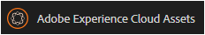

# Trabalhar com relatórios {#work-with-reports}

A capacidade de geração de relatórios é fundamental para avaliar o uso do Brand Portal e saber como usuários internos e externos interagem com ativos aprovados. Os administradores podem exibir o relatório de Uso do Brand Portal , que está sempre disponível na página Relatórios de ativos . No entanto, os relatórios para logons de usuários e ativos baixados, expirados, publicados e compartilhados por meio de links podem ser gerados e exibidos na página Relatórios de ativos . Esses relatórios são úteis na análise da implantação de ativos, que permitem derivar métricas principais de sucesso para medir a adoção de ativos aprovados dentro e fora da organização.

A interface de gerenciamento de relatórios é intuitiva e inclui opções e controles otimizados para acessar relatórios salvos. Você pode visualizar, baixar ou excluir relatórios da página Relatórios de ativos , onde todos os relatórios gerados anteriormente são listados.

## Exibir relatórios {#view-reports}

Para visualizar um relatório, siga estas etapas:

1. Na barra de ferramentas na parte superior, toque/clique no logotipo do AEM para acessar as ferramentas administrativas.

   

1. No painel de ferramentas administrativas, clique em **[!UICONTROL Criar/gerenciar relatórios]** para abrir a página **[!UICONTROL Relatórios de ativos]**.

   

1. Acesse o relatório de **[!UICONTROL Uso]** e outros relatórios gerados na página Relatórios de ativos .

   >[!NOTE]
   >
   >O relatório de uso é um relatório padrão gerado no Brand Portal. Ele não pode ser criado ou excluído. Entretanto, é possível criar, baixar e excluir os relatórios de Download, Expiração, Publicação, Compartilhamento de links e Logons de usuários.

   Para exibir um relatório, clique no link do relatório. Como alternativa, selecione o relatório e toque/clique no ícone Exibir na barra de ferramentas.

   **[!UICONTROL O]** Relatório de uso exibe informações sobre o número de usuários ativos do Brand Portal, o espaço de armazenamento ocupado por todos os ativos e o total de ativos contam no Brand Portal. Os usuários do portal da marca que não estão atribuídos a nenhum perfil de produto no Admin Console são considerados usuários inativos e não são refletidos no **[!UICONTROL Relatório de uso]**.
O relatório também exibe a capacidade permitida para cada uma dessas métricas de informações.

   

   **[!UICONTROL O relatório]** Logons de usuário fornece informações sobre os usuários que fizeram logon no Brand Portal. O relatório mostra nomes para exibição, IDs de email, personas (administrador, visualizador, editor, convidado), grupos, último logon, status da atividade e contagem de logon de cada usuário da implantação do Brand Portal 6.4.2 até o momento da geração do relatório.

   

   **** Fazer download de relatórios lista e detalhes sobre todos os ativos baixados em um intervalo de datas e hora específico.

   

   >[!NOTE]
   >
   >O relatório de ativos **[!UICONTROL Download]** exibe somente os ativos que foram selecionados e baixados individualmente do Brand Portal. Se um usuário tiver baixado uma pasta contendo ativos, o relatório não exibirá a pasta ou os ativos dentro dela.

   **** Expiration report lista e detalha todos os ativos que expiraram em um período específico.

   

   **** Publicar relatório lista e fornece informações sobre todos os ativos publicados do AEM no Brand Portal em um período especificado.

   

   >[!NOTE]
   >
   >Publicar relatório não exibe informações sobre fragmentos de conteúdo, pois os fragmentos de conteúdo não podem ser publicados no Brand Portal.

   **[!UICONTROL O]** relatório Compartilhamento de links lista todos os ativos compartilhados por meio de links da interface do Brand Portal em um período específico. O relatório também informa quando o ativo foi compartilhado por link, por meio do qual o usuário, quando o link expira e o número de links compartilhados para o locatário (e usuários com os quais o link de ativo foi compartilhado). As colunas do Relatório de compartilhamento de link não são personalizáveis.

   

   >[!NOTE]
   >
   >O Relatório de compartilhamento de link não exibe os usuários que têm acesso ao ativo compartilhado por meio do link ou que baixaram o ativo por meio do link.
   >
   >Para rastrear downloads por meio do link compartilhado, é necessário gerar um relatório de download depois de selecionar a opção **[!UICONTROL Somente compartilhar links downloads]** na página **[!UICONTROL Criar relatório]** . No entanto, o usuário (baixado por) é anônimo nesse caso.

## Gerar relatórios {#generate-reports}

Os administradores podem gerar e gerenciar os seguintes relatórios padrão, depois de gerados, eles são salvos para serem [acessados](../using/brand-portal-reports.md#main-pars-header) mais tarde:

* Logons de usuário
* Download
* Expiração
* Publicação
* Compartilhamento de link

As colunas no relatório Download, Expiração e Publicação podem ser personalizadas para visualização. Para gerar um relatório, siga estas etapas:

1. Na barra de ferramentas na parte superior, toque/clique no logotipo do AEM para acessar as ferramentas administrativas.

1. No painel Ferramentas administrativas, toque/clique em **[!UICONTROL Criar/gerenciar relatórios]** para abrir a página **[!UICONTROL Relatórios de ativos]**.

   

1. Na página Relatórios de ativos, toque/clique em **[!UICONTROL Criar]**.
1. Na página **[!UICONTROL Criar relatório]**, selecione um relatório a ser criado e toque/clique em **[!UICONTROL Próximo]**.

   

1. Configure os detalhes do relatório. Especifique o título, a descrição, a estrutura da pasta (onde o relatório precisa executar e gerar estatísticas) e o intervalo de datas para os relatórios **[!UICONTROL Download]**, **[!UICONTROL Expiração]** e **[!UICONTROL Publicar]**.

   

   Enquanto isso, **[!UICONTROL Relatório de compartilhamento de link]** precisa apenas do título, da descrição e dos parâmetros do intervalo de datas.

   

   >[!NOTE]
   >
   >Caracteres especiais # e % no título do relatório são substituídos por um hífen (-) na geração do relatório.

1. Toque/clique em **[!UICONTROL Next]** para configurar as colunas dos relatórios Download, Expiração e Publicação .
1. Marque ou desmarque as caixas de seleção apropriadas, conforme necessário. Por exemplo, para exibir nomes de usuários (que baixaram ativos) no relatório **[!UICONTROL Download]**, selecione **[!UICONTROL Baixado por]**. A imagem a seguir ilustra a seleção de colunas padrão no relatório Download .

   

   Você também pode adicionar colunas personalizadas a esses relatórios para exibir mais dados para suas necessidades personalizadas.

   Para adicionar colunas personalizadas ao relatório Download, Publicação ou Expiração, siga estas etapas:

   1. Para exibir uma coluna personalizada, toque/clique em **[!UICONTROL Adicionar]** dentro de [!UICONTROL Colunas personalizadas].
   1. Especifique o nome da coluna no campo **[!UICONTROL Nome da coluna]**.
   1. Selecione a propriedade para a qual a coluna precisa ser mapeada, usando o seletor de propriedades.

      
Como alternativa, digite o caminho no campo do caminho da propriedade.

      

      Para adicionar mais colunas personalizadas, toque/clique em **Adicionar** e repita as etapas 2 e 3.

1. Toque/clique em **[!UICONTROL Criar]**. Uma mensagem notifica que a geração de relatório foi iniciada.

## Baixar relatórios {#download-reports}

Para salvar e baixar um relatório como arquivo .csv, siga um destes procedimentos:

* Selecione um relatório na página Relatórios de ativos e toque/clique em **[!UICONTROL Download]** na barra de ferramentas na parte superior.

* Na página Relatórios de ativos , abra um relatório. Selecione a opção **[!UICONTROL Download]** na parte superior da página do relatório.

## Excluir relatórios {#delete-reports}

Para excluir um relatório existente, selecione o relatório da página **[!UICONTROL Relatórios de ativos]** e toque/clique em **[!UICONTROL Excluir]** na barra de ferramentas na parte superior.

>[!NOTE]
>
>**** Não é possível excluir o Usagereport.
