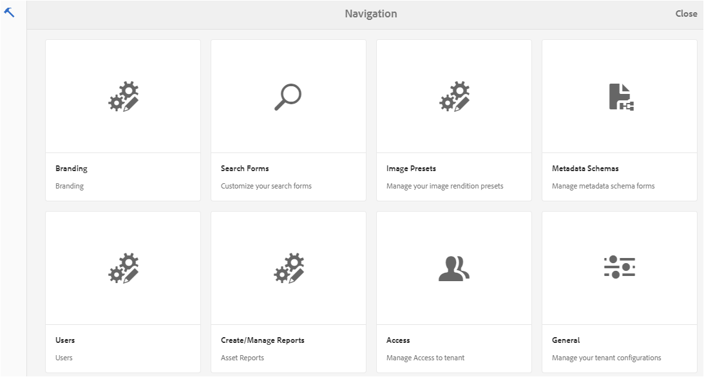
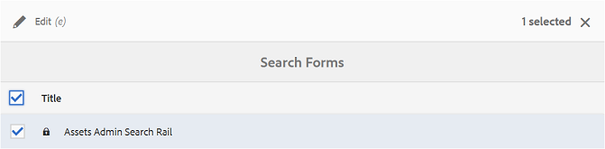
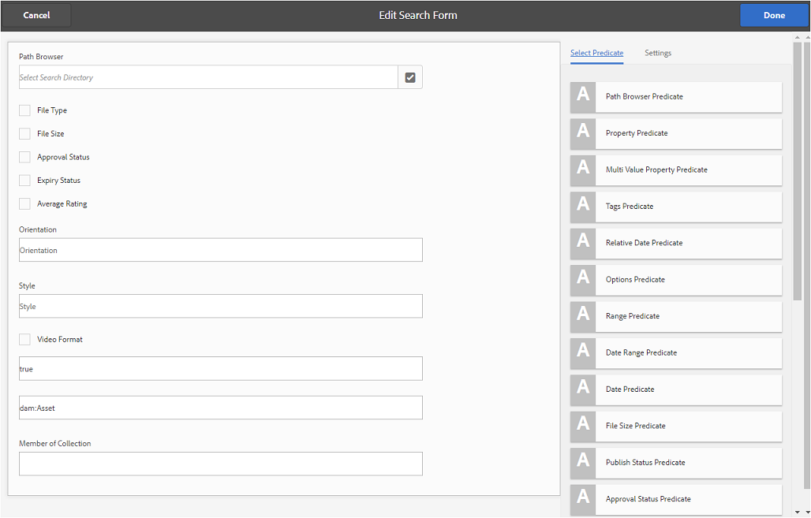
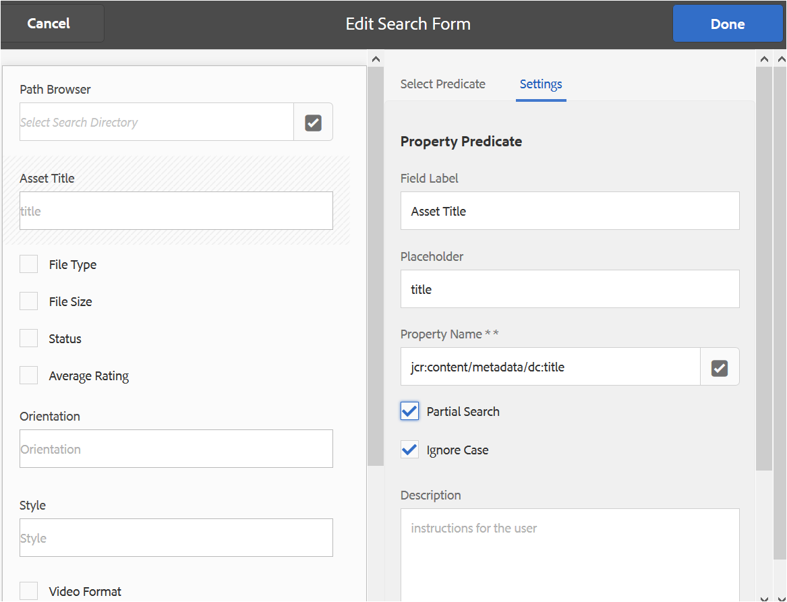
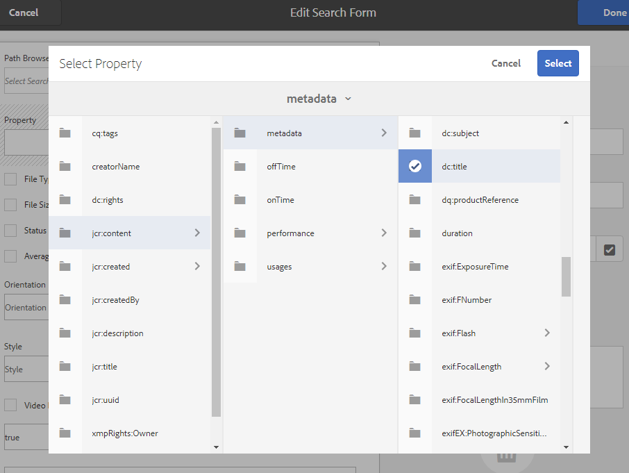
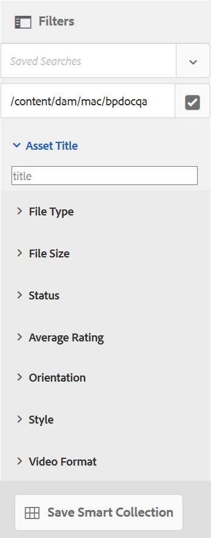
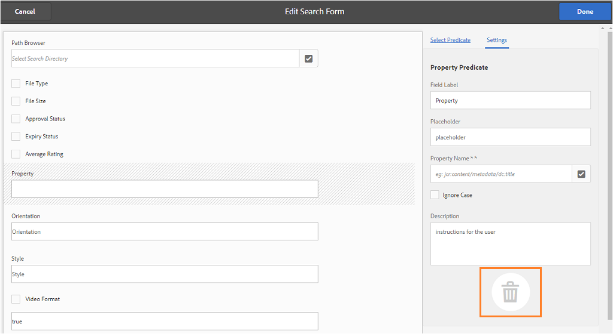

# Usar facetas de busca personalizada {#use-custom-search-facets}

Os administradores podem adicionar predicados de pesquisa à [!UICONTROL Filtros] painel para personalizar a pesquisa e tornar a funcionalidade de pesquisa versátil.

O Brand Portal oferece suporte [pesquisa facetada](../using/brand-portal-searching.md#search-using-facets-in-filters-panel) para pesquisas granulares de recursos de marcas aprovados, o que é possível devido a [**Filtros** painel](../using/brand-portal-searching.md#search-using-facets-in-filters-panel). Os aspectos de pesquisa são disponibilizados no painel Filtros por meio do **[!UICONTROL Formulário de pesquisa]** nas ferramentas administrativas. Existe um formulário de pesquisa padrão chamado Painel de pesquisa do administrador de ativos na página Pesquisar no Forms das ferramentas administrativas. No entanto, os administradores podem personalizar o painel Filtros padrão editando o formulário de pesquisa padrão (Painel de pesquisa do administrador de ativos) adicionando, modificando ou removendo predicados de pesquisa, tornando assim a funcionalidade de pesquisa versátil.

Você pode usar vários predicados de pesquisa para personalizar a variável **[!UICONTROL Filtros]** painel. Por exemplo, adicione o predicado de propriedade para procurar ativos que correspondam a uma única propriedade especificada neste predicado. Adicione o predicado de opções para procurar ativos que correspondam a um ou mais valores especificados para uma propriedade específica. Adicione o predicado de intervalo de datas para pesquisar ativos criados em um intervalo de datas especificado.

>[!NOTE]
>
>O Experience Manager Assets permite que as organizações [publicar os formulários de pesquisa personalizados do AEM Author](../using/publish-schema-search-facets-presets.md#publish-search-facets-to-brand-portal) para o Brand Portal, em vez de recriar o mesmo formulário no Brand Portal.

## Adicionar um predicado de pesquisa {#add-a-search-predicate}

Para adicionar um predicado de pesquisa à variável **[!UICONTROL Filtros]** painel:

1. Para acessar as ferramentas administrativas, clique no logotipo Experience Manager na barra de ferramentas na parte superior.

   

1. No painel de ferramentas administrativas, clique em **[!UICONTROL Pesquisar no Forms]**.

   

1. No **[!UICONTROL Pesquisar no Forms]** selecione **[!UICONTROL Trilho de pesquisa do administrador de ativos]**.

   

1. Na barra de ferramentas exibida na parte superior, clique em **[!UICONTROL Editar]** para abrir o formulário editar pesquisa.

   

1. No [!UICONTROL Editar formulário de pesquisa] arraste um predicado da caixa de diálogo [!UICONTROL Selecionar predicado] para o painel principal. Por exemplo, arrastar **[!UICONTROL Predicado da propriedade]**.

   A variável **[!UICONTROL Propriedade]** aparecerá no painel principal e a variável **[!UICONTROL Configurações]** A guia à direita exibe os predicados da propriedade.

   

   >[!NOTE]
   >
   >O rótulo do cabeçalho na variável **[!UICONTROL Configurações]** A guia identifica o tipo de predicado selecionado.

1. No **[!UICONTROL Configurações]** insira um rótulo, um texto de espaço reservado e uma descrição para o predicado da propriedade.

   * Selecionar **[!UICONTROL Pesquisa parcial]**, se quiser permitir a pesquisa parcial de frases (e a pesquisa com curinga) de ativos com base no valor da propriedade especificada. Por padrão, o predicado é compatível com a pesquisa de texto completo.
   * Selecionar **[!UICONTROL Ignorar maiúsculas e minúsculas]**, se você quiser que a pesquisa de ativos baseada no valor da propriedade não diferencie maiúsculas de minúsculas. Por padrão, a pesquisa por valores de propriedade no Filtro de pesquisa diferencia maiúsculas de minúsculas.

   >[!NOTE]
   >
   >Ao selecionar **[!UICONTROL Pesquisa parcial]** caixa de seleção **[!UICONTROL Ignorar maiúsculas e minúsculas]** é selecionada por padrão.

1. No **[!UICONTROL Nome da propriedade]** , abra o seletor de propriedades e selecione a propriedade com base na qual a pesquisa é realizada. Como alternativa, insira um nome para a propriedade. Por exemplo, insira `  jcr :content/metadata/dc:title` ou `./jcr:content/metadata/dc:title`.

   >[!NOTE]
   >
   >No Brand Portal, todas as propriedades (exceto as que começam com `xmp`) no `jcrcontent/metadata` de `dam:asset` são indexados por padrão.
   >
   >Qualquer propriedade indexada pode ser usada ao criar um predicado de propriedade. Se qualquer propriedade não indexada for configurada, a consulta de pesquisa em uma propriedade não indexada poderá não fornecer nenhum resultado de pesquisa.

   

1. Clique em **[!UICONTROL Concluído]** para salvar as configurações.
1. No [!UICONTROL Assets] clique no ícone de sobreposição e escolha **[!UICONTROL Filtro]** para navegar até o **[!UICONTROL Filtros]** painel. A variável **[!UICONTROL Propriedade]** O predicado é adicionado ao painel.

   

1. Insira um título para o ativo a ser pesquisado na variável **[!UICONTROL Propriedade]** texto. Por exemplo, &quot;Adobe&quot;. Ao realizar uma pesquisa, os ativos com o título correspondente a &quot;Adobe&quot; são exibidos nos resultados da pesquisa.

## Lista de predicados de pesquisa {#list-of-search-predicates}

Semelhante à maneira como você adiciona um **[!UICONTROL Propriedade]** predicado, você pode adicionar os seguintes predicados à variável **[!UICONTROL Filtros]** painel:

| **Nome do predicado** | **Descrição** | **Propriedades** |
|-------|-------|----------|
| **[!UICONTROL Navegador de caminhos]** | Pesquisar predicado para pesquisar ativos em um local específico. **Nota:** *Para um usuário conectado, o navegador de caminho no Filtro mostra somente a estrutura de conteúdo das pastas (e seus antecessores) compartilhadas com o usuário.*   Os usuários administradores podem pesquisar ativos em qualquer pasta navegando até essa pasta usando o Navegador de caminho.   Ao passo que os usuários não administradores podem pesquisar ativos em uma pasta (acessível a eles) navegando até essa pasta no Navegador de caminho. | <ul><li>Rótulo do campo</li><li>Caminho </li><li>Descrição</li></ul> |
| **[!UICONTROL Propriedade]** | Pesquise ativos com base em uma propriedade de metadados específica. **Nota:** *Ao selecionar Pesquisa parcial, Ignorar maiúsculas e minúsculas é selecionado por padrão*. | <ul><li>Rótulo do campo</li><li>Espaço reservado</li><li>Nome da Propriedade</li><li>Pesquisa parcial</li><li>Ignorar diferença entre maiúsculas e minúsculas</li><li> Descrição</li></ul> |
| **[!UICONTROL Propriedade multivalor]** | Semelhante ao predicado da propriedade, mas permite vários valores de entrada, separados por um delimitador (o padrão é VÍRGULA[,]) ativos que correspondem a qualquer um dos valores de entrada são retornados em resultados. | <ul><li>Rótulo do campo</li><li>Espaço reservado</li><li>Nome da propriedade</li><li>Suporte do delimitador</li><li>Ignorar diferença entre maiúsculas e minúsculas</li><li>Descrição</li></ul> |
| **[!UICONTROL Tags]** | Pesquisar predicado para pesquisar ativos com base em tags. Você pode configurar a propriedade Caminho para preencher várias tags na lista Tags. *Observação: talvez os administradores precisem alterar o valor do caminho, por exemplo, [!UICONTROL `/etc/tags/mac/<tenant_id>/<custom_tag_namespace>`], se eles publicarem o formulário de pesquisa do AEM, onde o caminho não inclui informações do locatário, por exemplo, [!UICONTROL `/etc/tags/<custom_tag_namespace>`]. | <ul><li>Rótulo do campo</li><li>Nome da propriedade</li><li>Caminho </li><li>Descrição</li></ul> |
| **[!UICONTROL Caminho]** | Pesquisar predicado para pesquisar ativos em um local específico. | <ul><li>Rótulo do campo</li><li>Caminho </li><li>Descrição</li></ul> |  |
| **[!UICONTROL Data relativa]** | Predicado de pesquisa para pesquisar ativos com base na data relativa de sua criação. | <ul><li>Rótulo do campo</li><li>Nome da propriedade</li><li>Data relativa</li></ul> |
| **[!UICONTROL Intervalo]** | Pesquisar predicado para pesquisar ativos que estão dentro de um intervalo especificado de valores de propriedade. No painel Filtros, você pode especificar valores de propriedade mínimos e máximos para o intervalo. | <ul><li>Rótulo do campo</li><li>Nome da propriedade</li><li>Descrição</li></ul> |
| **[!UICONTROL Intervalo de datas]** | Pesquisar predicado para pesquisar ativos criados em um intervalo especificado para uma propriedade de data. No painel Filtros, você pode especificar datas de início e término. | <ul><li>Rótulo do campo</li><li>Espaço reservado</li><li>Nome da propriedade</li><li>Texto do intervalo (de)</li><li>Texto do intervalo (até)</li><li>Descrição</li></ul> |
| **[!UICONTROL Data]** | Pesquisar predicado para uma pesquisa com base em controle deslizante de ativos com base em uma propriedade de data. | <ul><li>Rótulo do campo</li><li>Nome da propriedade</li><li>Descrição</li></ul> |
| **[!UICONTROL Tamanho do arquivo]** | Pesquisar predicado para pesquisar ativos com base em seu tamanho. | <ul><li>Rótulo do campo</li><li>Nome da propriedade</li><li>Caminho </li><li>Descrição</li></ul> |
| **[!UICONTROL Última modificação do ativo]** | Pesquisar predicado para pesquisar ativos com base na data da última modificação. | <ul><li>Rótulo do campo</li><li>Nome da propriedade</li><li>Descrição</li></ul> |
| **[!UICONTROL Status de aprovação]** | Predicado de pesquisa para pesquisar ativos com base na propriedade de metadados de aprovação. O nome padrão da propriedade é **dam:status**. | <ul><li>Rótulo do campo</li><li>Nome da propriedade</li><li>Descrição</li></ul> |
| **[!UICONTROL Status da retirada]** | Pesquisar predicado para pesquisar ativos com base no status de check-out de um ativo quando ele foi publicado na AEM Assets. | <ul><li>Rótulo do campo</li><li>Nome da propriedade</li><li>Descrição</li></ul> |
| **[!UICONTROL Retirado por]** | Predicado de pesquisa para pesquisar ativos com base no usuário que fez check-out do ativo. | <ul><li>Rótulo do campo</li><li>Nome da propriedade</li><li>Descrição</li></ul> |
| **[!UICONTROL Status da expiração]** | Pesquisar predicado para pesquisar ativos com base no status de expiração. | <ul><li>Rótulo do campo</li><li>Nome da propriedade</li><li>Descrição</li></ul> |
| **[!UICONTROL Membro de coleção]** | Pesquisar predicado para pesquisar ativos com base no fato de um ativo fazer parte de uma coleção. | Descrição |
| **[!UICONTROL Oculto]** | Esse predicado não é explicitamente visível para os usuários finais e é usado para qualquer restrição oculta normalmente para restringir o tipo de resultados de pesquisa a **dam:Asset**. | <ul><li>Rótulo do campo</li><li>Nome da propriedade</li><li>Descrição</li></ul> |

>[!NOTE]
>
>Não usar **[!UICONTROL Predicado de opções]**, **[!UICONTROL Publicar o status do predicado]**, e **[!UICONTROL Predicado de classificação]** já que esses predicados não são funcionais no Brand Portal.

## Excluir um predicado de pesquisa {#delete-a-search-predicate}

Para excluir um predicado de pesquisa, siga estas etapas:

1. Clique no logotipo Adobe para acessar as ferramentas administrativas.

   

1. No painel de ferramentas administrativas, clique em **[!UICONTROL Pesquisar no Forms]**.

   

1. No **[!UICONTROL Pesquisar no Forms]** selecione **[!UICONTROL Trilho de pesquisa do administrador de ativos]**.

   

1. Na barra de ferramentas exibida na parte superior, clique em **[!UICONTROL Editar]** para abrir o formulário editar pesquisa.

   

1. No [!UICONTROL Editar formulário de pesquisa] página, no painel principal, selecione o predicado que deseja excluir. Por exemplo, selecione **[!UICONTROL Predicado da propriedade]**.

   A variável **[!UICONTROL Configurações]** A guia à direita exibe os campos de predicado de propriedade.

1. Para excluir o predicado de propriedade, clique no ícone de compartimento. No **[!UICONTROL Excluir campo]** , clique em **[!UICONTROL Excluir]** para confirmar a ação de exclusão.

   A variável **[!UICONTROL Predicado da propriedade]** for removido do painel principal e o campo **[!UICONTROL Configurações]** fica vazia.

   

1. Para salvar as alterações, clique **[!UICONTROL Concluído]** na barra de ferramentas.
1. No **[!UICONTROL Assets]** clique no ícone de sobreposição e escolha **[!UICONTROL Filtro]** para navegar até o **[!UICONTROL Filtros]** painel. A variável **[!UICONTROL Propriedade]** o predicado é removido do painel.

   
