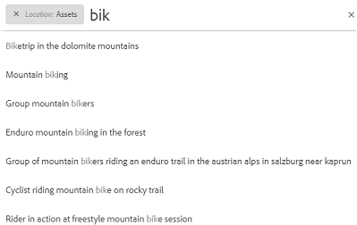
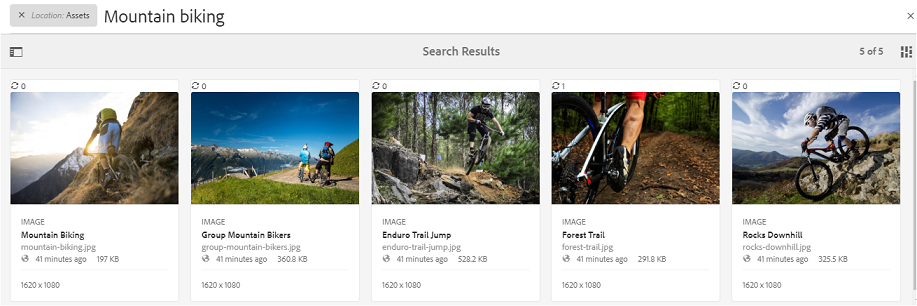
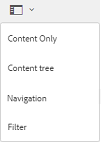
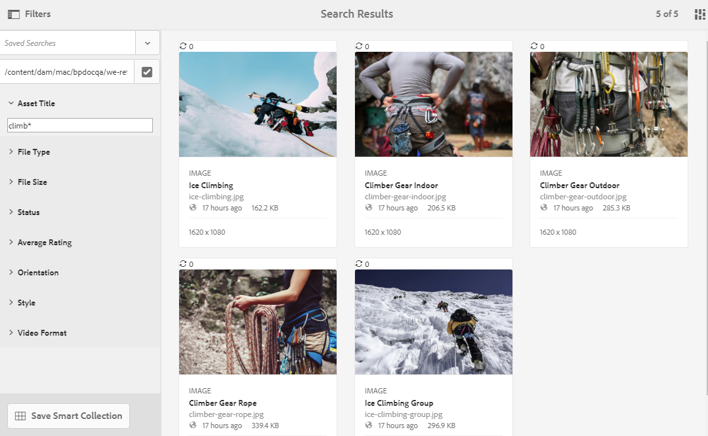
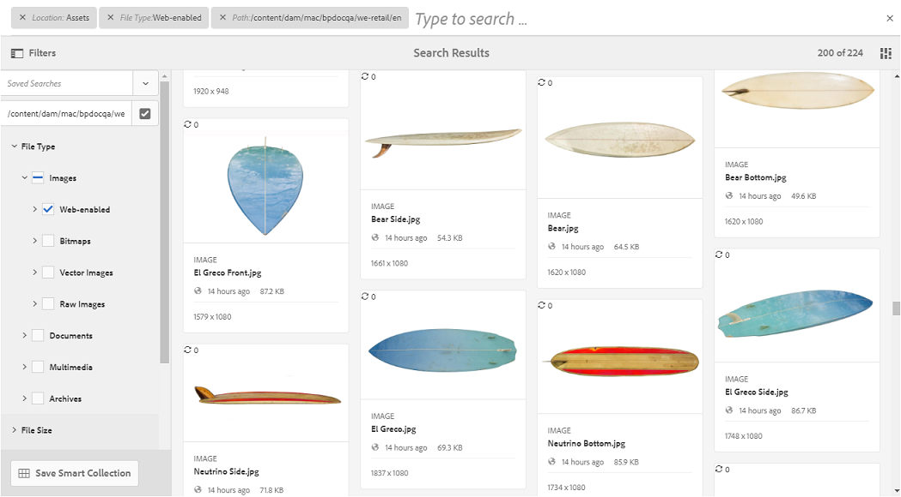
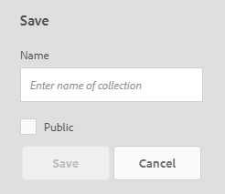
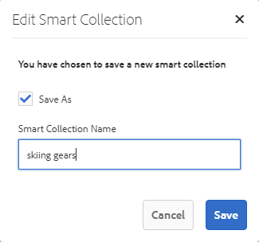
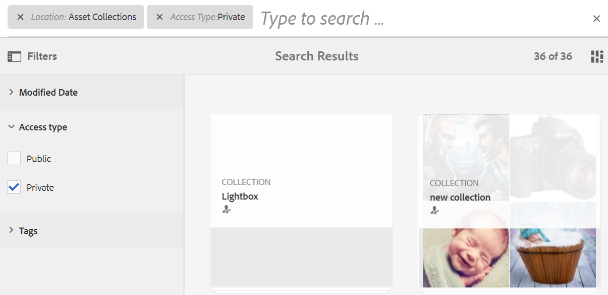

# Buscar ativos no Brand Portal {#search-assets-on-brand-portal}

O recurso de pesquisa do Brand Portal permite pesquisar rapidamente ativos relevantes usando o omnisearch e a pesquisa facetada que usa filtros para ajudá-lo a restringir ainda mais sua pesquisa. Você pode pesquisar ativos no nível de arquivos ou pastas e salvar os resultados da pesquisa como coleções inteligentes.

>[!NOTE]
>
>A Brand Portal não oferece suporte à pesquisa de coleção usando o omnisearch.
>
>No entanto, você pode usar [pesquisar filtros para obter a lista de coleções relevantes](#search-collection).

## Pesquisar ativos usando o Omnisearch {#search-assets-using-omnisearch}

Para pesquisar ativos no Brand Portal:

1. Na barra de ferramentas, clique na guia **[!UICONTROL Pesquisar]** ou pressione o botão &quot;**[!UICONTROL /]**&quot; chave para iniciar o Omnisearch.

   

1. Na caixa de pesquisa, digite uma palavra-chave para os ativos que deseja pesquisar.

   

   >[!NOTE]
   >
   >* Pelo menos 3 caracteres são necessários no omnisearch para que as sugestões de pesquisa sejam exibidas.
   >* Ao pesquisar por `mountain biking`, o omnisearch retorna todos os ativos nos resultados da pesquisa que têm ambos `mountain` e `biking` disponíveis nos campos de metadados. Por exemplo, `mountain` no `Title` campo e `biking` no `Description` campo. Ambos os termos devem estar disponíveis nos campos de metadados para serem exibidos nos resultados da pesquisa. No entanto, o omnisearch retorna o ativo nos resultados da pesquisa mesmo se apenas um dos dois termos estiver disponível no campo de metadados Tags inteligentes. Por exemplo, se um ativo contiver `mountain` como uma das Tags inteligentes e não contém `biking` em qualquer outro campo de metadados e procurar `mountain biking`, o omnisearch ainda retornará o ativo nos resultados da pesquisa.

1. Selecione entre as sugestões relacionadas exibidas na lista suspensa para acessar rapidamente os ativos relevantes.

   

   *Pesquisa de ativos usando omnisearch*

Para saber mais sobre o comportamento de pesquisa com ativos com tags inteligentes, consulte [compreender os resultados e o comportamento da pesquisa](https://experienceleague.adobe.com/docs/experience-manager-65/assets/using/search-assets.html).

## Pesquisar usando aspectos no painel Filtros {#search-using-facets-in-filters-panel}

Os aspectos de pesquisa no painel Filtros adicionam granularidade à experiência de pesquisa e tornam a funcionalidade de pesquisa eficiente. Os aspectos de pesquisa usam várias dimensões (predicados) que permitem realizar pesquisas complexas. Você pode facilmente detalhar o nível desejado de detalhes para uma pesquisa mais focada.

Por exemplo, se estiver procurando uma imagem, você pode escolher se deseja uma imagem de bitmap ou de vetor. É possível reduzir ainda mais o escopo da pesquisa especificando o tipo MIME da imagem na faceta de pesquisa Tipo de arquivo. Da mesma forma, ao pesquisar documentos, você pode especificar o formato, por exemplo, formato PDF ou MS® Word.

A variável **[!UICONTROL Filtros]** inclui algumas facetas padrão, como- **[!UICONTROL Navegador de caminhos]**, **[!UICONTROL Tipo de arquivo]**, **[!UICONTROL Tamanho do arquivo]**, **[!UICONTROL Status]**, e **[!UICONTROL Orientação]**. No entanto, é possível [adicionar aspectos de pesquisa personalizados](../using/brand-portal-search-facets.md) ou remova aspectos de pesquisa específicos da **[!UICONTROL Filtros]** adicionando ou removendo predicados no Formulário de pesquisa subjacente. Consulte a lista de aplicativos disponíveis e utilizáveis [pesquisar predicados no Brand Portal](../using/brand-portal-search-facets.md#list-of-search-predicates).

Para aplicar filtros à sua pesquisa, usando os [pesquisar aspectos](../using/brand-portal-search-facets.md):

1. Clique no ícone de sobreposição e selecione **[!UICONTROL Filtro]**.

   

1. No **[!UICONTROL Filtros]** à esquerda, selecione as opções apropriadas para aplicar os filtros relevantes.
Por exemplo, use os seguintes filtros padrão:

   * **[!UICONTROL Navegador de caminhos]** para pesquisar ativos em um diretório específico. O caminho de pesquisa padrão do predicado para Navegador de caminho é `/content/dam/mac/<tenant-id>/`, que pode ser configurado ao editar o formulário de pesquisa padrão.
   >[!NOTE]
   >
   >Para usuários não administradores, [!UICONTROL Navegador de caminhos] in [!UICONTROL Filtro] O painel mostra apenas a estrutura de conteúdo das pastas (e suas pastas ancestrais) compartilhadas com elas.\
   >Para usuários administradores, o Navegador de caminhos permite navegar até qualquer pasta no Brand Portal.

   * **[!UICONTROL Tipo de arquivo]** para especificar o tipo (imagem, documento, multimídia, arquivo) do arquivo de ativo que você está procurando. Além disso, é possível restringir o escopo da pesquisa. Por exemplo, especifique o tipo MIME (Tiff, Bitmap, Imagens GIMP) para imagem ou formato (PDF ou MS® Word) para os documentos.
   * **[!UICONTROL Tamanho do arquivo]** para pesquisar ativos com base em seu tamanho. Você pode especificar os limites inferiores e superiores para o intervalo de tamanho para restringir sua pesquisa e especificar a unidade de medida a ser pesquisada.
   * **[!UICONTROL Status]** para pesquisar ativos com base nos status dos ativos, como Aprovação (Aprovada, Alterações Solicitadas, Rejeitada, Pendente) e Expiração.
   * **[!UICONTROL Classificação média]** para pesquisar ativos com base na classificação dos ativos.
   * **[!UICONTROL Orientação]** para pesquisar ativos com base na orientação (horizontal, vertical, quadrada) dos ativos.
   * **[!UICONTROL Estilo]** para pesquisar ativos com base no estilo (colorido, monocromático) dos ativos.
   * **[!UICONTROL Formato de vídeo]** para pesquisar ativos de vídeo com base no formato (DVI, Flash, MPEG4, MPEG, OGG Theora, QuickTime, Windows Media, WebM).

   Você pode usar [aspectos da pesquisa personalizada](../using/brand-portal-search-facets.md) no painel Filtros editando o Formulário de pesquisa subjacente.

   * **[!UICONTROL Predicado da propriedade]** se usado no formulário de pesquisa, permite procurar ativos que correspondem a uma propriedade de metadados para a qual o predicado é mapeado.\
      Por exemplo, se o predicado de propriedade for mapeado para [!UICONTROL `jcr:content /metadata/dc:title`], você pode pesquisar ativos com base no título.\
      A variável [!UICONTROL Predicado da propriedade] O oferece suporte a pesquisas de texto para:

      **Frases parciais**
Para permitir a pesquisa do ativo usando frases parciais no predicado da propriedade, maque a caixa de seleção **[!UICONTROL Pesquisa parcial]** em Pesquisar formulário. Isso permite pesquisar pelos ativos desejados mesmo que não especifique as palavras/frases exatas usadas nos metadados do ativo.

      >[!NOTE]
      >
      > O Brand Portal oferece suporte aos seguintes campos para Pesquisa parcial:
      >* jcr:content/metadata/dc:title
      >* jcr:content/jcr:title
      >* jcr:content/metadata/dam:search_promote
      >* jcr:content/metadata/dc:format

      É possível:
      * Especifique uma palavra que ocorra na sua frase pesquisada na faceta no painel Filtros. Por exemplo, se você pesquisar pelo termo **subir** (e o predicado de propriedade é mapeado para [!UICONTROL `dc:title`] ), então todos os ativos com a palavra **subir** na frase de título são retornados.
      * Especifique uma parte da palavra que ocorre na frase pesquisada, juntamente com o caractere curinga (&#42;) para preencher as lacunas.
Por exemplo, pesquisando por:
         * **subir&#42;** retorna todos os ativos que têm palavras que começam com os caracteres &quot;climb&quot; na frase de título.
         * **&#42;subir** retorna todos os ativos que têm palavras que terminam com os caracteres &quot;climb&quot; na frase de título.
         * **&#42;subir&#42;** retorna todos os ativos que têm palavras que compreendem os caracteres &quot;climb&quot; na frase de título.

Para permitir pesquisa sem distinção de maiúsculas e minúsculas no predicado da propriedade, ative a opção       **Texto sem distinção entre maiúsculas e minúsculas**
Para permitir pesquisa sem distinção de maiúsculas e minúsculas no predicado da propriedade, ative a opção **[!UICONTROL Ignorar maiúsculas e minúsculas]** caixa de seleção no Formulário de pesquisa. Por padrão, a pesquisa de texto no predicado de propriedade diferencia maiúsculas de minúsculas.
   >[!NOTE]
   >
   >Ao selecionar **[!UICONTROL Pesquisa parcial]** caixa de seleção **[!UICONTROL Ignorar maiúsculas e minúsculas]** é selecionada por padrão.

   

   Os resultados da pesquisa são exibidos de acordo com os filtros aplicados, juntamente com a contagem de resultados da pesquisa.

   

   Resultado da pesquisa de ativos com contagem de resultados da pesquisa.

1. Você pode navegar facilmente para um item do resultado da pesquisa e retornar ao mesmo resultado usando o botão Voltar no navegador sem precisar executar a consulta novamente.

## Salvar suas pesquisas como coleção inteligente {#save-your-searches-as-smart-collection}

Você pode salvar as configurações de pesquisa como uma coleção inteligente para poder repetir rapidamente a mesma pesquisa sem precisar refazer as mesmas configurações posteriormente. No entanto, não é possível aplicar filtros de pesquisa em uma coleção.

Para salvar as configurações de pesquisa como uma coleção inteligente:

1. Toque/clique **[!UICONTROL Salvar conjunto inteligente]** e forneça um nome para a coleção inteligente.

   Para tornar a coleção inteligente acessível a todos os usuários, selecione **[!UICONTROL Público]**. Uma mensagem confirma que a coleção inteligente foi criada e adicionada à lista de pesquisas salvas.

   >[!NOTE]
   >
   >Usuários não administradores podem ter restrições para tornar as coleções inteligentes públicas, evitando assim um grande número de coleções públicas inteligentes criadas por usuários não administradores no Brand Portal da organização. As organizações podem desativar o **[!UICONTROL Permitir criação de coleções públicas inteligentes]** configuração de **[!UICONTROL Geral]** configurações disponíveis no painel ferramentas administrativas.

   

1. Para salvar a coleção inteligente com um nome diferente e selecionar ou limpar o **[!UICONTROL Público]** , clique em **[!UICONTROL Editar coleção inteligente]**.

   

1. No **[!UICONTROL Editar coleção inteligente]** caixa de diálogo, selecione **[!UICONTROL Salvar como]** e insira um nome para a coleção inteligente. Clique em **[!UICONTROL Salvar]**.

   

## Pesquisar coleção {#search-collection}

O Omnisearch não é compatível com coleções. No entanto, é possível aplicar filtros de pesquisa para listar as coleções relevantes dentro do [!UICONTROL Coleções] interface.

No [!UICONTROL Coleções] clique no ícone de sobreposição para abrir o painel de filtro no painel esquerdo. Aplicar um ou vários filtros de pesquisa a partir dos filtros disponíveis (`modified date`, `access type`, e `tags`). Ele lista o conjunto de coleções mais relevante com base nos filtros aplicados.

