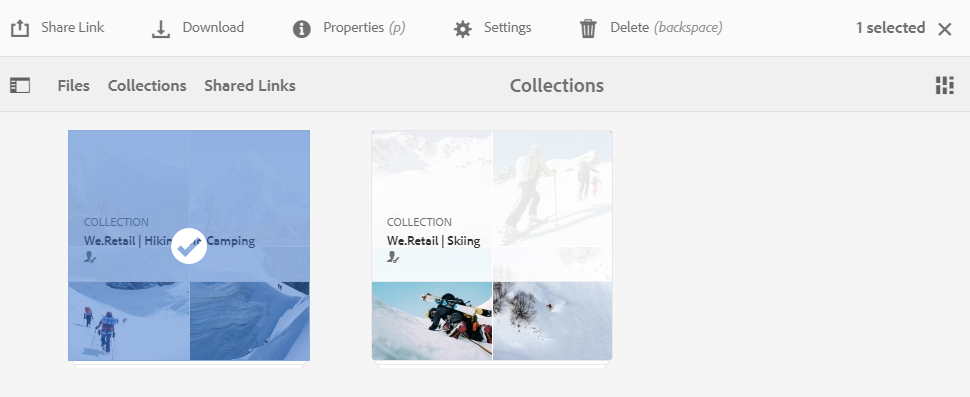

# Compartilhar coleções {#share-collections}

Uma coleção representa um grupo de ativos relacionados armazenados juntos no Adobe Experience Manager Assets Brand Portal. Os usuários podem criar coleções inteligentes ao [aplicação da pesquisa omnisearch ou facet para filtrar ativos relacionados](brand-portal-searching.md) e armazene-os juntos para facilitar o acesso e compartilhar o conteúdo com outros usuários do Brand Portal.

Os administradores podem compartilhar e descompartilhar uma coleção com os usuários autorizados do Brand Portal. Editores e visualizadores podem visualizar e compartilhar as coleções criadas por eles, compartilhadas com eles e coleções públicas.

>[!NOTE]
>
>Os editores não podem alterar uma coleção pública para uma coleção não pública e, portanto, não têm a **[!UICONTROL Coleção pública]** caixa de seleção disponível em **[!UICONTROL Configurações da coleção]** diálogo.

## Compartilhar uma coleção {#share-collection}

Veja a seguir as etapas para compartilhar uma coleção com os usuários autorizados do Brand Portal:

1. Faça logon no seu locatário do Brand Portal. Por padrão, a variável **[!UICONTROL Arquivos]** a visualização abre, que contém todos os ativos e pastas publicados.

1. Nas navegações rápidas na parte superior, clique em **[!UICONTROL Coleções]**.

1. No **[!UICONTROL Coleções]** execute um dos procedimentos a seguir:

   * Passe o ponteiro sobre a coleção que você deseja compartilhar. Nas miniaturas de ação rápida disponíveis para a coleção, clique no link **[!UICONTROL Configurações]** ícone.

      

   * Selecione a coleção que deseja compartilhar. Na barra de ferramentas na parte superior, clique em **[!UICONTROL Configurações]**.

      

1. No **[!UICONTROL Configurações da coleção]** , selecione os usuários com os quais deseja compartilhar a coleção e selecione a função para o usuário que corresponda à sua função global. Por exemplo, atribuir a função Editor a um editor global, função Visualizador a um visualizador global.

   Como alternativa, para disponibilizar a coleção para todos os usuários independentemente de sua associação de grupo e função, torne-a pública selecionando o **[!UICONTROL Coleção pública]** caixa de seleção

   >[!NOTE]
   >
   >No entanto, os usuários não administradores podem ser impedidos de criar coleções públicas, a fim de evitar ter várias coleções públicas para que o espaço do sistema possa ser salvo. As organizações podem desativar o **[!UICONTROL Permitir criação de coleções públicas]** configuração de **[!UICONTROL Geral]** configurações disponíveis no painel ferramentas administrativas.

   

   Os editores não podem alterar uma coleção pública para outra e, portanto, não têm **[!UICONTROL Coleção pública]** caixa de seleção disponível em **[!UICONTROL Configurações da coleção]** diálogo.

   

1. Clique em **[!UICONTROL Adicionar]** botão para adicionar o usuário e, em seguida, clique em **[!UICONTROL Salvar]**. A coleção é compartilhada com os usuários.

   >[!NOTE]
   >
   >A função de um usuário controla o acesso aos ativos e pastas dentro de uma coleção. Se um usuário não tiver acesso aos ativos, uma coleção vazia será compartilhada com o usuário. Além disso, a função de um usuário controla as ações disponíveis para coleções.

## Deixar de compartilhar uma coleção {#unshare-a-collection}

Para cancelar o compartilhamento de uma coleção compartilhada anteriormente, faça o seguinte:

1. No **[!UICONTROL Coleções]** selecione a coleção que deseja cancelar o compartilhamento.

   Na barra de ferramentas na parte superior, clique em **[!UICONTROL Configurações]**.

   

1. No **[!UICONTROL Configurações da coleção]** caixa de diálogo, no campo **[!UICONTROL Membros]** clique na guia **[!UICONTROL x]** símbolo ao lado dos usuários para removê-los da lista de usuários com acesso à coleção.

   

1. Uma mensagem de aviso é exibida. Clique em **[!UICONTROL Confirmar o]** para cancelar o compartilhamento da coleção.

1. Clique em **[!UICONTROL Salvar]** para aplicar as alterações.

   Depois que o usuário for removido da lista compartilhada, a coleção não compartilhada será removida do **[!UICONTROL Coleções]** console.

<!--
1. Click the overlay icon on the left, and choose **[!UICONTROL Navigation]**.

   

1. From the siderail on the left, click **[!UICONTROL Collections]**.

   

1. From the **[!UICONTROL Collections]** console, do one of the following:

    * Hover the pointer over the collection you want to share. From the quick action thumbnails available for the collection, click the **[!UICONTROL Settings]** icon.

   

    * Select the collection you want to share. From the toolbar at the top, click **[!UICONTROL Settings]**.
    
   

1. In the [!UICONTROL Collection Settings] dialog box, select the users or groups with whom you want to share the collection and select the role for a user or a group to match their global role. For example, assign the Editor role to a global editor, the Viewer role to a global viewer.

   Alternatively, to make the collection available to all users irrespective of their group membership and role, make it public by selecting the **[!UICONTROL Public Collection]** check-box.

   >[!NOTE]
   >
   >However, non-admin users can be restricted from creating public collections, to avoid having numerous public collections so that system space can be saved. Organizations can disable the **[!UICONTROL Allow public collections creation]** configuration from [!UICONTROL General] settings available in admin tools panel.

   

   Editors cannot change a public collection to a non-public collection and, therefore, do not have **[!UICONTROL Public Collection]** check-box available in **[!UICONTROL Collection Settings]** dialog.

   

1. Select **[!UICONTROL Add]**, and then **[!UICONTROL Save]**. The collection is shared with the chosen users.

   >[!NOTE]
   >
   >A user's role governs access to the assets and folders inside a collection. If a user does not have access to assets, an empty collection is shared with the user. Also, a user's role governs the actions available for collections.

## Unshare a collection {#unshare-a-collection}

To unshare a previously shared collection, do the following:

1. From the **[!UICONTROL Collections]** console, select the collection you want to unshare.

   In the toolbar, click **[!UICONTROL Settings]**.

   

1. On the **[!UICONTROL Collection Settings]** dialog box, under **[!UICONTROL Members]**, click the **[!UICONTROL x]** symbol next to users or groups to remove them from the list of users you shared the collection with.

   

1. In the warning message box, click **[!UICONTROL Confirm]** to confirm unshare.

   Click **[!UICONTROL Save]**.

1. Log in to Brand Portal with the credentials of the user you removed from the shared list. The collection is removed from the **[!UICONTROL Collections]** console.
-->
