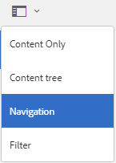
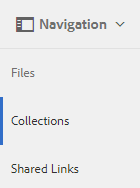
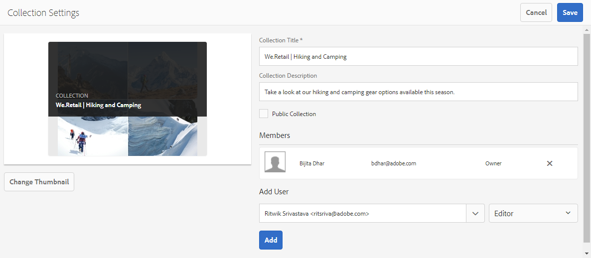
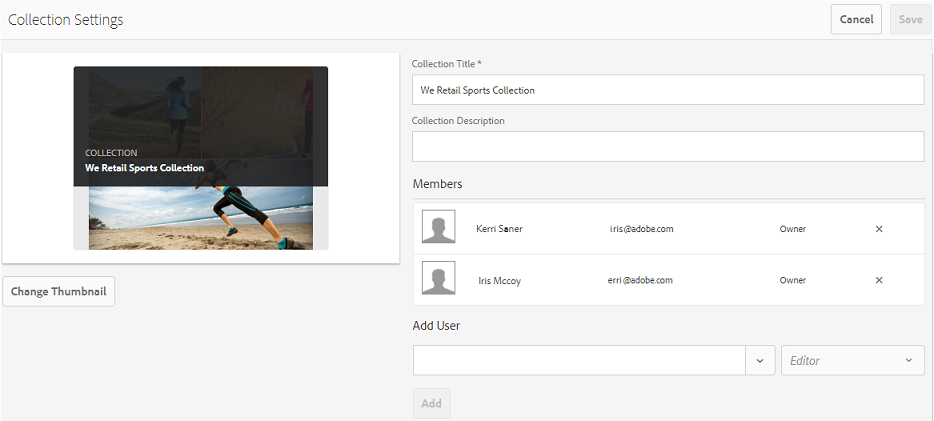
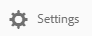
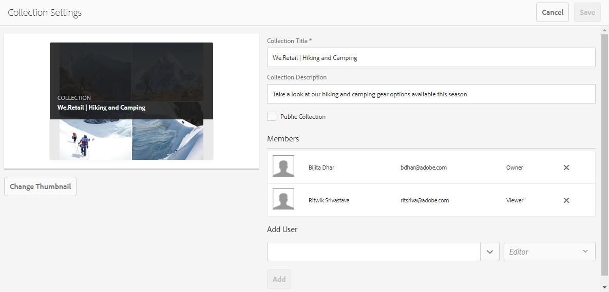

# Compartilhar coleções no Brand Portal {#share-collections-bp}

Os administradores do AEM Assets Brand Portal podem compartilhar e cancelar a compartilhamento de uma coleção ou uma coleção inteligente com usuários autorizados. Os editores podem visualizar e compartilhar apenas as coleções criadas por eles, compartilhadas com eles e coleções públicas. No entanto, editores não podem alterar uma coleção pública para uma coleção não pública.

>[!NOTE]
>
>Os editores não podem alterar uma coleção pública para uma coleção não pública e, portanto, não têm **a caixa de seleção Coleção** pública disponível na **caixa de diálogo Configurações** da coleção.

## Compartilhar uma coleção {#share-collection}

Para compartilhar uma coleção, siga estas etapas:

1. Clique no ícone de sobreposição à esquerda e escolha **Navegação**.

   

1. Na extremidade à esquerda, clique **em Coleções**.

   

1. No console **Coleções** , execute um dos procedimentos a seguir:

   * Passe o ponteiro do mouse sobre a coleção que deseja compartilhar. Nas miniaturas de ação rápida disponíveis para a coleção, clique no ícone **Configurações** .
   

   * Selecione a coleção que deseja compartilhar. Na barra de ferramentas na parte superior, clique **em Configurações**.
   

1. Na caixa **de diálogo Configurações** da coleção, selecione os usuários ou grupos com os quais você deseja compartilhar a coleção e selecione a função para que um usuário ou grupo corresponda à sua função global. Por exemplo, atribua a função Editor a um editor global, a função do Visualizador a um visualizador global.

   Como alternativa, para disponibilizar a coleção para todos os usuários independentemente da associação e da função de grupo, torne-a pública selecionando a caixa **de seleção Coleção** pública.

   >[!NOTE]
   >
   >No entanto, os usuários não administradores podem ser limitados a criar coleções públicas, a fim de evitar várias coleções públicas, para que o espaço do sistema possa ser salvo. As organizações podem desativar **a configuração de criação** de coleções públicas de configurações **Gerais** disponíveis no painel de ferramentas administrativas.

   

   Os editores não podem alterar uma coleção pública para uma coleção não pública e, portanto, não têm **a caixa de seleção Coleção** pública disponível na **caixa de diálogo Configurações** da coleção.

   

1. Clique **em Adicionar** e **em Salvar**. A coleção é compartilhada com os usuários escolhidos.

   >[!NOTE]
   >
   >A função de um usuário governa o acesso aos ativos e pastas dentro de uma coleção. Se um usuário não tiver acesso a ativos, uma coleção vazia será compartilhada com o usuário. Além disso, a função de um usuário governa as ações disponíveis para coleções.

## Cancelar compartilhamento de uma coleção {#unshare-a-collection}

Para cancelar a compartilhamento de uma coleção compartilhada anteriormente, faça o seguinte:

1. No console **Coleções** , selecione a coleção que deseja cancelar o compartilhamento.

   In the toolbar, click **Settings**.

   

1. Na caixa **de diálogo Configurações** da coleção, em **Membros**, clique no **símbolo x** ao lado de usuários ou grupos para removê-los da lista de usuários com os quais você compartilhou a coleção.

   

1. Na caixa de mensagem de aviso, clique **em Confirmar** para confirmar não compartilhar.

   Clique em **Salvar**.

1. Faça logon no Brand Portal com as credenciais do usuário removidas da lista compartilhada. A coleção é removida do console **Coleções** .
