# Compartilhar pastas no Brand Portal {#share-folders}

Os ativos precisam ser publicados no Brand Portal a partir de uma instância pré-configurada do Autor de AEM, já que o Brand Portal não suporta ingestão de ativos.

## Fluxo de trabalho de compartilhamento de pasta no Brand Portal {#folder-sharing-workflow-in-brand-portal}

A seguir, descreva o fluxo de trabalho de compartilhamento de pasta e o acesso do usuário:

* Por padrão, todas as pastas publicadas do AEM Assets para o Brand Portal são visíveis somente para o Administrador do Brand Portal, a menos que marcadas como públicas ao configurar a replicação.
* O administrador usa o [!UICONTROL console Propriedades] da pasta para compartilhar uma pasta com usuários ou grupos seletivos. Somente os usuários ou grupos com os quais a pasta é compartilhada podem ver a pasta depois de fazerem logon no Brand Portal. A pasta não está visível para outros usuários.
* O administrador também pode escolher tornar uma pasta pública por meio da [!UICONTROL caixa de seleção Pasta] pública no [!UICONTROL console Propriedades] da pasta. Uma pasta pública é visível para todos os usuários.

* Independentemente das funções e dos privilégios do usuário, quando os usuários fizerem logon no Brand Portal, eles verão todas as pastas públicas e as pastas compartilhadas diretamente com eles ou com um grupo ao qual pertencem. Pastas privadas ou pastas compartilhadas com outros usuários não estão visíveis para todos os usuários.

### Compartilhar pastas com grupos de usuários no Brand Portal {#sharing-folders-with-user-groups-on-brand-portal}

Direitos de acesso em ativos de uma pasta dependem dos direitos de acesso na pasta pai, independentemente das configurações das pastas secundárias. Esse comportamento é regido por [acls](https://helpx.adobe.com/experience-manager/6-5/sites/administering/using/security.html#PermissionsinAEM) no AEM, já que pastas secundárias herdam acls de suas pastas pai. Por exemplo, se uma pasta A contém a pasta B que contém a pasta C, um grupo de usuários (ou usuários) tem direitos de acesso na pasta A também tem os mesmos direitos de acesso na pasta A e a pasta C.A pasta B sendo a pasta secundária de A herda os acls e a pasta C sendo a pasta secundária de B herdada os acls.

Da mesma forma, os grupos de usuários (ou usuários) com permissões para acessar apenas a pasta B têm as mesmas permissões de acesso na pasta C, mas não na pasta A. Portanto, é recomendável que as organizações organizem seu conteúdo de forma que os ativos mais expostos sejam colocados na pasta infantil e que os filhos acessem o acesso da pasta raiz.

### Public folder publish {#public-folder-publish}

A menos que a [!UICONTROL opção Publicação] de pasta pública esteja selecionada ao configurar a replicação do Brand Portal, os usuários não administradores (como Editores e Visualizadores) não terão acesso aos ativos publicados nos ativos AEM para o Portal da marca.

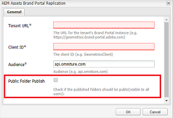

Se a opção [!UICONTROL Publicar] pasta pública estiver desativada, os administradores precisarão compartilhar especificamente esses ativos com usuários não administradores usando o recurso compartilhar.

>[!NOTE]
>
>A opção para habilitar [!UICONTROL a Publicação pública está] disponível no AEM 6.3.2.1 em diante.

## Acesso a pastas compartilhadas {#access-to-shared-folders}

A seguinte matriz discute os direitos de acesso e os direitos de compartilhar/cancelar a compartilhamento de ativos para várias funções do usuário:

|  | Acesso a todas as pastas publicadas nos ativos AEM para o Brand Portal | Acesso a pastas compartilhadas | Compartilhar/cancelar o compartilhamento de direitos de pasta |
|---------------|-----------|-----------|------------|
| Administrador | Sim | Sim | Sim |
| Editor | Não* | Sim, somente se compartilhados com eles ou com o grupo ao qual pertencem | Sim, somente para as pastas compartilhadas com eles ou com o grupo ao qual pertencem |
| Visualizador | Não* | Sim, somente se compartilhados com eles ou com o grupo ao qual pertencem | Não |
| Usuário convidado | Não* | Sim, somente se compartilhados com eles ou com o grupo ao qual pertencem | Não |

** Por padrão,[!UICONTROL a opção Publicação]de pasta pública está desativada ao configurar a replicação do Portal de marcas com Autor de AEM. Se a opção estiver ativada, as pastas publicadas no Brand Portal estarão acessíveis a todos os usuários (usuários não administradores também) por padrão.*

### Acesso de usuário não administrador a pastas compartilhadas {#non-admin-user-access-to-shared-folders}

Usuários não administradores podem acessar apenas as pastas compartilhadas com eles no Brand Portal. No entanto, como essas pastas são exibidas no portal quando o logon depende das configurações [!UICONTROL da configuração Ativar hierarquia] de pastas.

**Se a configuração estiver desativada**

Usuários não administradores veem todas as pastas compartilhadas com eles na página de aterrissagem, ao fazer logon no Brand Portal.

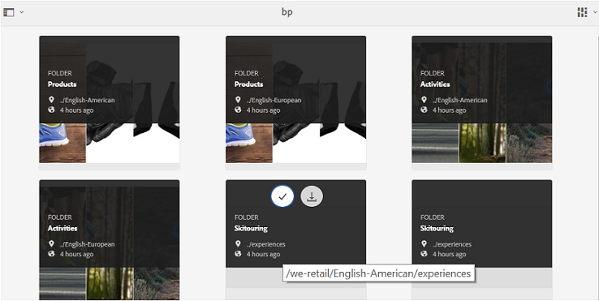

**Se a configuração estiver ativada**

Os usuários não administradores veem a árvore de pastas (começando pela pasta raiz) e as pastas compartilhadas organizadas em suas respectivas pastas pai, ao fazer logon no Portal da marca.

Essas pastas pai são pastas virtuais e nenhuma ação pode ser executada neles. Você pode reconhecer essas pastas virtuais com um ícone de cadeado.

Nenhuma tarefa de ação é visível ao passar o mouse ou selecioná-las na Exibição [!UICONTROL de cartão], ao contrário das pastas compartilhadas. [!UICONTROL O] botão Visão geral é mostrado na seleção de uma pasta virtual na Exibição [!UICONTROL de coluna] e na Exibição [!UICONTROL de lista].

>[!NOTE]
>
>Observe que a miniatura padrão das pastas virtuais é a imagem em miniatura da primeira pasta compartilhada.

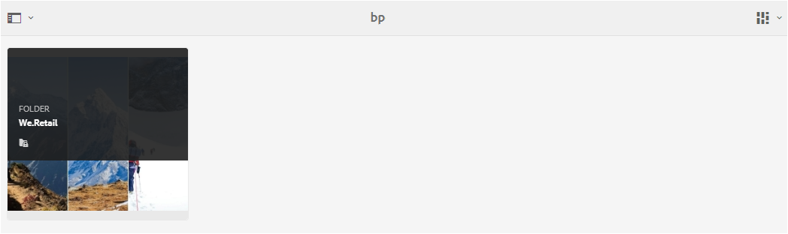 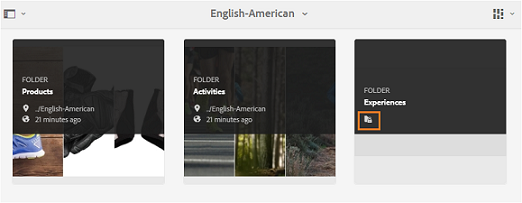 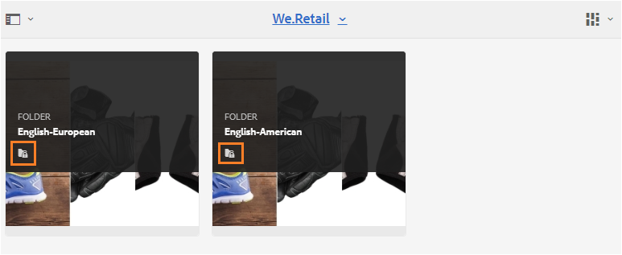 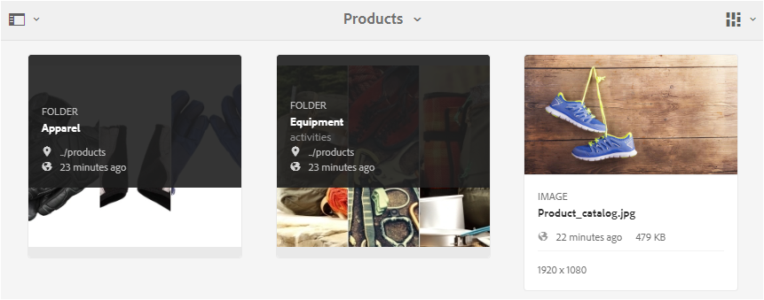

## Compartilhar pastas {#how-to-share-folders}

Para compartilhar uma pasta com usuários no Brand Portal, siga estas etapas:

1. Clique no ícone de sobreposição à esquerda e escolha **[!UICONTROL Navegação]**.

   

2. Na extremidade à esquerda, selecione **[!UICONTROL Arquivos]**.

   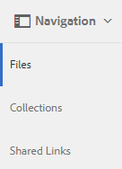

3. Na interface do Brand Portal, selecione a pasta que deseja compartilhar.

   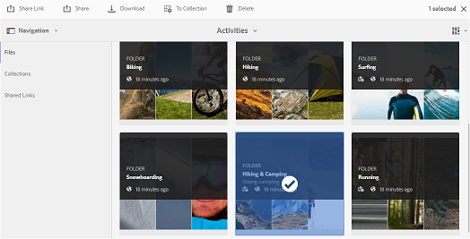

4. Na barra de ferramentas na parte superior, selecione **[!UICONTROL Compartilhar]**.

   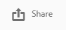

   O [!UICONTROL console Propriedades] da pasta é exibido.

   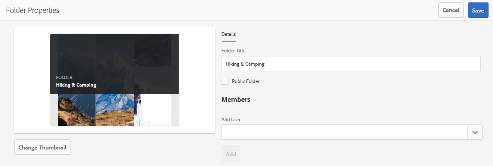

5. No console [!UICONTROL Propriedades] da pasta, especifique o título da pasta no campo [!UICONTROL Título] da pasta se você não quiser que o nome padrão seja exibido aos usuários.
6. Na lista [!UICONTROL Adicionar usuário] , selecione os usuários ou grupos com os quais você deseja compartilhar a pasta e clique **[!UICONTROL em Adicionar]**.
Para compartilhar a pasta somente com usuários convidados e nenhum outro usuário, selecione **[!UICONTROL Usuários]** anônimos na lista suspensa [!UICONTROL Membros] .

   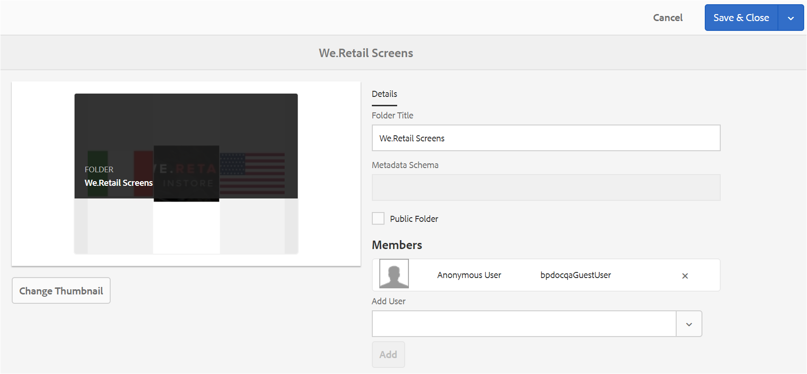

   >[!NOTE]
   >
   >Para disponibilizar a pasta para todos os usuários independentemente da associação e da função de grupo, torne-a pública selecionando a caixa **[!UICONTROL de seleção Pasta]** pública.

7. Se necessário, clique **[!UICONTROL em Alterar miniatura]** para modificar a imagem em miniatura da pasta.
8. Clique em **[!UICONTROL Salvar]**.
9. Para acessar a pasta compartilhada, faça logon no Portal da marca com as credenciais do usuário com as quais você compartilhou a pasta. Revise a pasta compartilhada na interface.

## Não compartilhar pastas {#unshare-the-folders}

Para cancelar a compartilhamento de uma pasta compartilhada anteriormente, siga estas etapas:

1. Na interface do Brand Portal, selecione a pasta que deseja não compartilhar.

   

2. Na barra de ferramentas na parte superior, clique **[!UICONTROL em Compartilhar]**.
3. No console [!UICONTROL Propriedades] da pasta, em [!UICONTROL Membros], clique no símbolo **[!UICONTROL x]** ao lado de um usuário para removê-los da lista de usuários com os quais você compartilhou a pasta.

   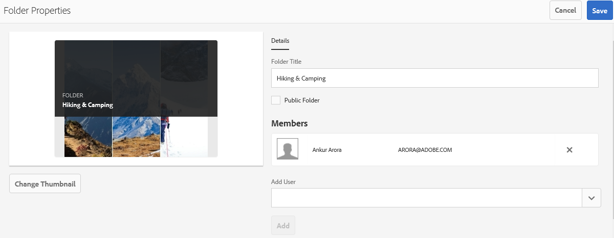

4. Na caixa de mensagem de aviso, clique **[!UICONTROL em Confirmar]** para confirmar não compartilhar.
Clique em **[!UICONTROL Salvar]**.

5. Faça logon no Brand Portal com as credenciais do usuário removidas da lista compartilhada. A pasta não está mais disponível na interface do Brand Portal para o usuário.
