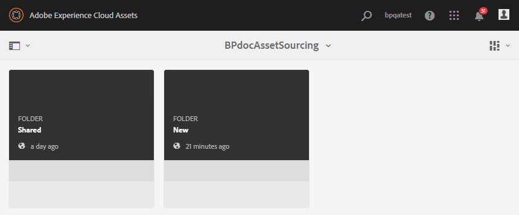
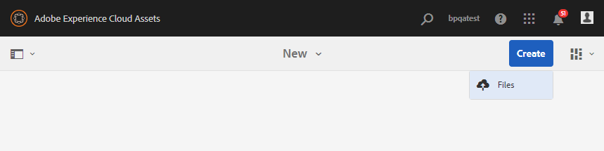

# Fazer upload de ativos para a pasta de contribuição {#uplad-new-assets-to-contribution-folder}

Os usuários do Brand Portal podem [baixar os requisitos](brand-portal-download-asset-requirements.md) de ativos para entender a necessidade de contribuição.
Em seguida, eles podem criar novos ativos para contribuição e carregá-los para a pasta NOVO na pasta de contribuição.

>[!NOTE]
>
>Os usuários do Brand Portal podem fazer upload de ativos apenas para a pasta NEW.
>
>O limite máximo de upload para qualquer locatário do Brand Portal é de **10** GB, que é aplicado cumulativamente a todas as pastas de contribuição.

Depois de publicar os ativos criados recentemente na AEM Assets, os usuários do Brand Portal podem excluí-los da pasta NEW. Enquanto isso, o administrador do Brand Portal pode excluir os ativos das pastas NEW e SHARED.

Quando o objetivo de criar a pasta de contribuição for atingido, o administrador do Brand Portal poderá excluir a pasta de contribuição para liberar o espaço de upload para outros usuários.

>[!NOTE]
>
>É recomendável liberar o espaço de upload depois de publicar a pasta de contribuição na AEM Assets para que ela esteja disponível para contribuição para outros usuários do Brand Portal.
>
>Se for necessário estender o limite de upload do seu locatário do Brand Portal para além de **10** GB, entre em contato com o Suporte ao Adobe especificando o requisito.

**Para carregar novos ativos:**

1. Faça logon na instância do Brand Portal.
O painel do Brand Portal reflete todas as pastas existentes permitidas para o usuário do Brand Portal junto com a pasta de contribuição compartilhada recentemente.

1. Selecione a pasta de contribuição e clique para abri-la. A pasta de contribuição contém duas subpastas - **[!UICONTROL COMPARTILHADO]** e **[!UICONTROL NOVO]**.

1. Clique na pasta **[!UICONTROL NEW]** .

   

1. Clique em **[!UICONTROL Criar]** > **[!UICONTROL Arquivos]** para fazer upload de arquivos individuais ou pastas (.zip) que contêm vários ativos.

   

1. Procure e carregue ativos (arquivos ou pastas) na pasta **[!UICONTROL NOVA]** .

   

Depois de fazer upload de todos os ativos ou pastas para a pasta NEW, publique a pasta de contribuição na AEM Assets. Consulte [Publicar pasta de contribuição para a AEM Assets](brand-portal-publish-contribution-folder-to-aem-assets.md).
