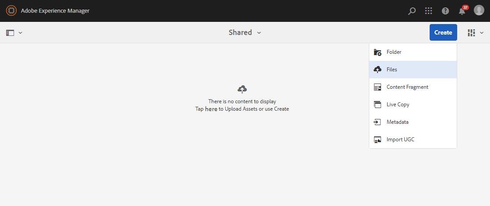
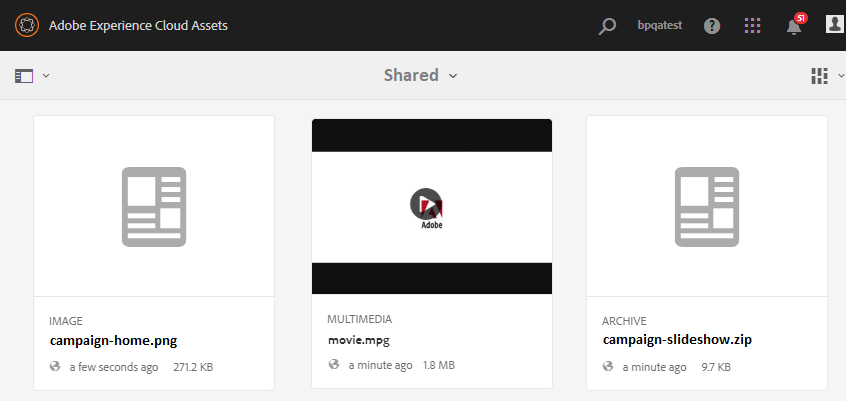

# Carregar ativos de linha de base {#upload-baseline-assets}

AEM administrador carrega os ativos da linha de base na pasta **SHARED** para ajudar os usuários do Brand Portal a entenderem os tipos de ativos necessários durante a contribuição. Esses recursos podem ser usados como conteúdo de referência pelos usuários do Brand Portal ao criar novos recursos para contribuição.

**Para fazer upload dos ativos da linha de base:**

1. Faça logon na instância do autor AEM.
URL padrão: http:// localhost:4502/aem/start.html
1. Navegue até **[!UICONTROL Ativos > Arquivos]** e localize a pasta de contribuição na qual você deseja carregar ativos da linha de base.
1. Clique para abrir a pasta de contribuição, você pode ver duas subpastas -**[!UICONTROL SHARED]** e **[!UICONTROL NEW]** na pasta de contribuição.
1. Clique na pasta **[!UICONTROL COMPARTILHADO]**.
1. Clique em **[!UICONTROL Criar > Arquivos]**  para fazer upload de ativos individuais.
Ou clique em **[!UICONTROL Criar > Pasta]** para carregar a pasta (.zip) que contém vários ativos.
   
1. Procure e carregue ativos de linha de base (arquivos/pastas) na pasta **[!UICONTROL COMPARTILHADO]**.
   

Quando o upload for concluído, os administradores poderão publicar a pasta de contribuição no Brand Portal. Consulte, [Publicar pasta de contribuição para o Brand Portal](brand-portal-publish-contribution-folder-to-brand-portal.md).