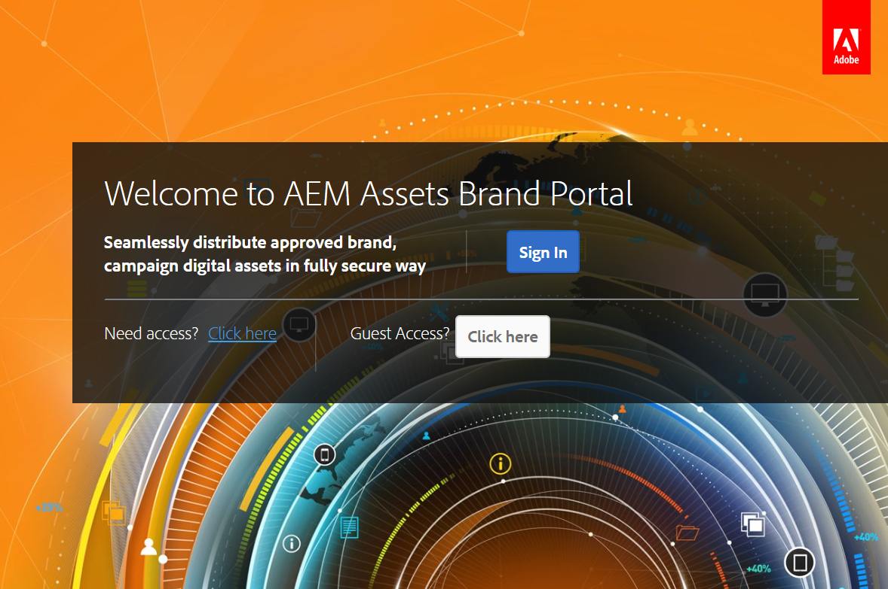
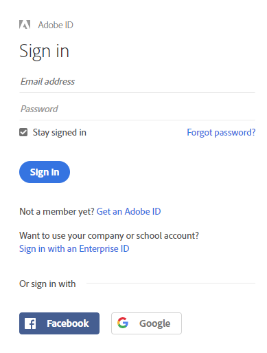
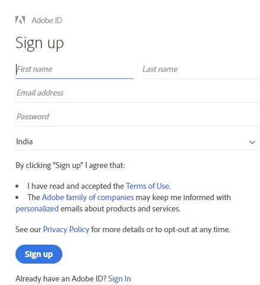
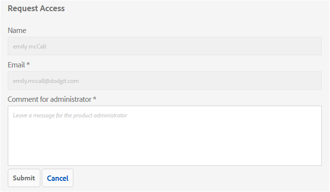
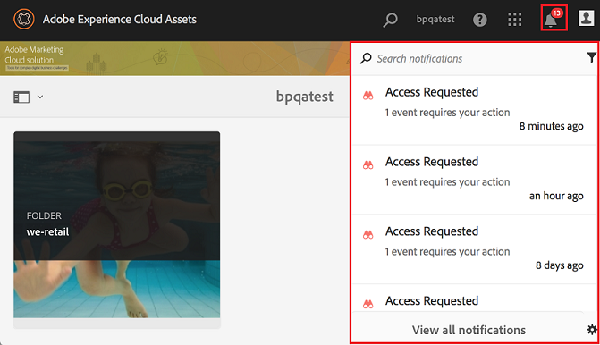
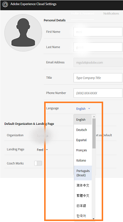
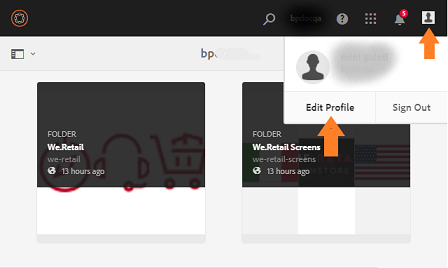
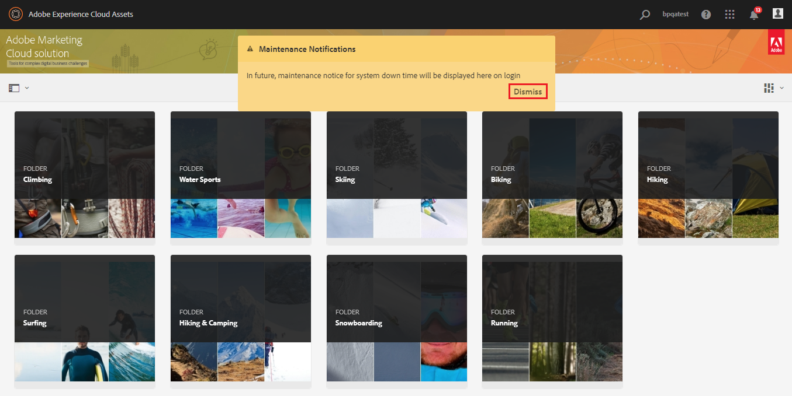

# Visão geral do Portal de marcas da AEM Assets {#overview-of-aem-assets-brand-portal}

Como profissional de marketing, às vezes é necessário colaborar com parceiros de canais e usuários empresariais internos para criar, gerenciar e fornecer rapidamente conteúdo digital relevante aos clientes. O delivery atempado de conteúdo relevante em toda a jornada do cliente é essencial para aumentar a demanda, a conversão, o envolvimento e a fidelidade do cliente.

No entanto, é um desafio desenvolver soluções que suportem o compartilhamento eficiente e seguro de logotipos de marca aprovados, diretrizes, ativos de campanha ou capturas de produtos com equipes internas, parceiros e revendedores estendidos.

**O Portal** de marcas dos ativos Adobe Experience Manager (AEM) foca na necessidade do comerciante de colaborar com os usuários do Brand Portal distribuídos globalmente, fornecendo recursos de distribuição de ativos e contribuição de ativos.

A distribuição de ativos permite que você adquira, controle e distribua com facilidade ativos criativos aprovados para terceiros e usuários empresariais internos em dispositivos. Enquanto isso, a contribuição de ativos permite que os usuários do Brand Portal possam fazer upload de ativos para o Brand Portal e publicar na AEM Assets, sem precisar acessar o ambiente do autor. O recurso de contribuição é chamado de Fonte de **ativos no Portal**da marca. E, juntos, melhora a experiência geral do Brand Portal de distribuição de ativos e a contribuição dos usuários do Brand Portal (agências/equipes externas), acelera o tempo de comercialização dos ativos e reduz o risco de não-conformidade e acesso não autorizado.
Consulte Seleção de [recursos no Portal](brand-portal-asset-sourcing.md)de marcas.

O ambiente de portal baseado em navegador permite que você carregue, navegue, pesquise, pré-visualização e exporte ativos facilmente em formatos aprovados.

## Configurar o AEM Assets com o Brand Portal {#configure-brand-portal}

Os ativos Adobe Experience Manager (AEM) são configurados com o Brand Portal via Adobe Developer Console, que obtém um token IMS para autorização do locatário do Brand Portal.

>[!NOTE]
>
>A configuração do AEM Assets com o Brand Portal via Adobe Developer Console é suportada no AEM Assets como Cloud Service, AEM Assets 6.3 e superior.

### Prerequisites to configure AEM Assets with Brand Portal {#prerequisites}

Você precisa do seguinte para configurar o AEM Assets com o Brand Portal:

* Uma instância do AEM Assets ativa e em execução.
* URL do locatário do Brand Portal.
* Um usuário com privilégios de administrador do sistema na organização IMS do locatário do Brand Portal.

Para obter mais informações, consulte [Configuração do AEM Assets com Brand Poral](../using/configure-aem-assets-with-brand-portal.md).

## Personalidades do usuário no Brand Portal {#Personas}

O Brand Portal suporta as seguintes funções de usuário:

* Usuário convidado
* Visualizador
* Editor
* Administrador

A tabela a seguir lista as tarefas que os usuários nessas funções podem executar:

|  | **Navegar** | **Pesquisar** | **Download** | **Compartilhar pastas** | **Compartilhar uma coleção** | **Compartilhar ativos como um link** | **Acesso às Ferramentas administrativas** |
|--- |--- |--- |--- |--- |--- |--- |--- |
| **Usuário convidado** | ✓* | ✓* | ✓* | x | x | x | x |
| **Visualizador** | ✓ | ✓ | ✓ | x | x | x | x |
| **Editor** | ✓ | ✓ | ✓ | ✓ | ✓ | ✓ | x |
| **Administrador** | ✓ | ✓ | ✓ | ✓ | ✓ | ✓ | ✓ |

* Os usuários convidados podem navegar, acessar e pesquisar ativos somente em pastas públicas e coleções.

<!--
&#42; Viewer users can access and download the public assets shared with them, and can add these assets to create their own collections.

>[!NOTE]
 >
 >There is a known issue that the share link for collections is currently visible to the viewer users. The viewer users does not have the privilege to add users to create a share link. This issue will be fixed in the upcoming release, the option to share link for the collections will not be available to the viewer users.
 >
 
-->

### Guest user {#guest-user}

Qualquer usuário com acesso limitado aos ativos no Brand Portal sem passar pela autenticação é um usuário convidado. A sessão de convidado permite que os usuários acessem pastas públicas e coleções. Como usuário convidado, você pode navegar pelos detalhes do ativo e ter visualização completa de ativos de membros de pastas públicas e coleções. Você pode pesquisar, baixar e adicionar ativos públicos à coleção do [!UICONTROL Lightbox] .

No entanto, a sessão de convidado impede que você crie coleções e pesquisas salvas, além de compartilhá-las ainda mais. Os usuários em uma sessão de convidado não podem acessar as configurações de pastas e coleções e não podem compartilhar ativos como links. Esta é uma lista de tarefas que um usuário convidado pode executar:

[Procurar e acessar ativos públicos](browse-assets-brand-portal.md)

[Pesquisar ativos públicos](brand-portal-searching.md)

[Baixar ativos públicos](brand-portal-download-assets.md)

[Adicionar ativos ao [!UICONTROL Lightbox]](brand-portal-light-box.md#add-assets-to-lightbox)

### Visualizador {#viewer}

Um usuário padrão no Brand Portal normalmente é um usuário com a função de Visualizador. Um usuário com essa função pode acessar pastas, coleções e ativos permitidos. O usuário também pode navegar, pré-visualização, baixar e exportar ativos (execuções originais ou específicas), definir configurações de conta e procurar ativos. Esta é uma lista de tarefas que um visualizador pode executar:

[Procurar ativos](browse-assets-brand-portal.md)

[Pesquisar ativos](brand-portal-searching.md)

[Baixar ativos](brand-portal-download-assets.md)

### Editor {#editor}

Um usuário com a função de Editor pode executar todas as tarefas que um Visualizador pode executar. Além disso, e o Editor podem visualização os arquivos e pastas compartilhados por um administrador. O usuário com a função de um Editor também pode compartilhar conteúdo (arquivos, pastas, coleções) com outras pessoas.

Além das tarefas que um visualizador pode executar, um editor pode executar as seguintes tarefas adicionais:

[Compartilhar pastas](brand-portal-sharing-folders.md)

[Compartilhar uma coleção](brand-portal-share-collection.md)

[Compartilhar ativos como um link](brand-portal-link-share.md)

### Administrador {#administrator}

Um administrador inclui um usuário marcado como administrador do sistema ou como administrador de produto do Portal de marca no [!UICONTROL Admin Console]. Um administrador pode adicionar e remover administradores e usuários do sistema, definir predefinições, enviar e-mail para usuários e usar o portal de visualização e relatórios de armazenamento.

Um administrador pode executar todas as tarefas que um editor pode executar as seguintes tarefas adicionais:

[Gerenciar usuários, grupos e cargos de usuários](brand-portal-adding-users.md)

[Personalizar papel de parede, cabeçalhos de página e e-mails](brand-portal-branding.md)

[Usar facetas de busca personalizada](brand-portal-search-facets.md)

[Usar o formulário de esquema de metadados](brand-portal-metadata-schemas.md)

[Aplicar predefinições de imagens ou representações dinâmicas](brand-portal-image-presets.md)

[Trabalhar com relatórios](brand-portal-reports.md)

Além das tarefas acima, um Autor no AEM Assets pode executar as seguintes tarefas:

[Configurar o AEM Assets com o Brand Portal](../using/configure-aem-assets-with-brand-portal.md)

[Publicar pastas no Brand Portal](https://helpx.adobe.com/experience-manager/6-5/assets/using/brand-portal-publish-folder.html)

[Publicar coleções no Brand Portal](https://helpx.adobe.com/experience-manager/6-5/assets/using/brand-portal-publish-collection.html)

## Alias alternativo para url do Brand Portal {#tenant-alias-for-portal-url}

A partir do Brand Portal 6.4.3, as organizações podem ter um URL alternativo (alias) para o URL existente do locatário do Brand Portal. O URL do alias pode ser criado com um prefixo alternativo no URL.\
Observe que somente o prefixo do URL do Portal de Marcas pode ser personalizado e não o URL inteiro. Por exemplo, uma organização com o domínio existente **[!UICONTROL geomettrix.brand-portal.adobe.com]** pode obter **[!UICONTROL geomettrixinc.brand-portal.adobe.com]** criado mediante solicitação.

No entanto, a instância do autor de AEM pode ser [configurada](../using/configure-aem-assets-with-brand-portal.md) somente com o URL de ID do locatário e não com o URL de alias do locatário (alternativo).

>[!NOTE]
>
>Para obter um alias para o nome do locatário no URL do portal existente, as organizações precisam entrar em contato com o suporte ao Adobe com uma nova solicitação de criação de alias do locatário. Essa solicitação é processada primeiro verificando se o alias está disponível e depois criando o alias.
>
>Para substituir o alias antigo ou excluí-lo, é necessário seguir o mesmo processo.

## Request access to Brand Portal {#request-access-to-brand-portal}

Os usuários podem solicitar acesso ao Brand Portal na tela de logon. Essas solicitações são enviadas para os administradores do Brand Portal, que concedem acesso aos usuários por meio do Adobe [!UICONTROL Admin Console]. Depois que o acesso é concedido, os usuários recebem um email de notificação.

Para solicitar acesso, faça o seguinte:

1. Na página de logon do Brand Portal, selecione **[!UICONTROL Clique aqui]** correspondente à opção **[!UICONTROL Precisa de acesso?]**. Entretanto, para entrar na sessão de convidado, selecione o **[!UICONTROL Clique aqui]** correspondente ao Acesso **[!UICONTROL de convidado?]**.

   

   A página [!UICONTROL Solicitar acesso] é aberta.

1. Para solicitar acesso ao Brand Portal de uma organização, é necessário ter um [!UICONTROL Adobe ID], um [!UICONTROL Enterprise ID]ou um [!UICONTROL Federated ID]válido.

   Na página [!UICONTROL Solicitar acesso] , faça logon usando sua ID (cenário 1) ou crie um [!UICONTROL Adobe ID] (cenário 2): 
   ![[!UICONTROL Solicitar acesso]](assets/bplogin_request_access_2.png)

   **Cenário 1**
   1. Se você tiver um [!UICONTROL Adobe ID], [!UICONTROL Enterprise ID]ou [!UICONTROL Federated ID], clique em **[!UICONTROL Entrar]**.
A página [!UICONTROL Entrar] é aberta.
   1. Forneça suas credenciais do [!UICONTROL Adobe ID] e clique em **[!UICONTROL Fazer logon]**. 

   

   Você é redirecionado para a página [!UICONTROL Solicitar acesso] . 
   **Cenário 2**
   1. Se você não tiver um [!UICONTROL Adobe ID], para criar um, clique em **[!UICONTROL Obter um Adobe ID]** na página [!UICONTROL Solicitar acesso] .
A página [!UICONTROL Entrar] é aberta.
   1. Click **[!UICONTROL Get an Adobe ID]**.
A página [!UICONTROL Inscrever] é aberta.
   1. Digite seu nome e sobrenome, ID de e-mail e senha.
   1. Selecione **[!UICONTROL Cadastrar-se]**. 

   

   Você é redirecionado para a página [!UICONTROL Solicitar acesso] .

1. A próxima página exibe seu nome e ID de e-mail usados para solicitar acesso. Deixe um comentário para o administrador e clique em **[!UICONTROL Enviar]**. 

   

## Os administradores de produtos concedem acesso {#grant-access-to-brand-portal}

Os administradores de produtos do Brand Portal recebem solicitações de acesso na área de notificação do Brand Portal e por meio de emails em sua caixa de entrada.

Para conceder acesso, os administradores de produtos precisam clicar na notificação relevante na área de notificação do Brand Portal e, em seguida, clicar em **[!UICONTROL Conceder acesso]**.
Como alternativa, os administradores de produtos podem seguir o link fornecido no email de solicitação de acesso para visitar o Adobe [!UICONTROL Admin Console] e adicionar o usuário à configuração relevante do produto.

Você é redirecionado para o home page [Adobe [!UICONTROL Admin Console]](https://adminconsole.adobe.com/enterprise/overview) . Use o Adobe [!UICONTROL Admin Console] para criar usuários e atribuí-los a perfis de produtos (anteriormente conhecidos como configurações de produtos), que são exibidos como grupos no Brand Portal. Para obter mais informações sobre como adicionar usuários ao [!UICONTROL Admin Console], consulte [Adicionar um usuário](brand-portal-adding-users.md#add-a-user) (siga as Etapas 4 a 7 no procedimento para adicionar um usuário).

## Idiomas do Brand Portal {#brand-portal-language}

Você pode alterar o idioma do Brand Portal nas Configurações [!UICONTROL do Adobe]Experience Cloud.

Para alterar o idioma:

1. Selecione [!UICONTROL Usuário] > [!UICONTROL Editar Perfil] no menu superior. 

   

1. Na página Configurações [!UICONTROL do] Experience Cloud, selecione um idioma no menu suspenso [!UICONTROL Idioma] .

## Notificação de manutenção do Portal de marcas {#brand-portal-maintenance-notification}

Antes que o Brand Portal esteja programado para manutenção, uma notificação será exibida como um banner depois que você fizer logon no Brand Portal. Uma notificação de amostra:

Você pode descartar esta notificação e continuar usando o Brand Portal. Esta notificação é exibida em todas as novas sessões.

## Informações sobre a versão e o sistema {#release-and-system-information}

* [Novidades](whats-new.md)
* [Notas de lançamento](brand-portal-release-notes.md)
* [Formatos de arquivo não suportados](brand-portal-supported-formats.md)

## Related resources {#related-resources}

* [Atendimento ao cliente Adobe](https://helpx.adobe.com/br/marketing-cloud/contact-support.html)
* [Fóruns do AEM](https://www.adobe.com/go/aod_forums_en)