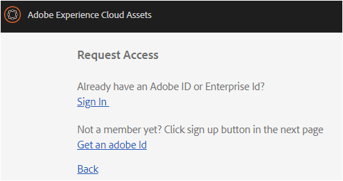
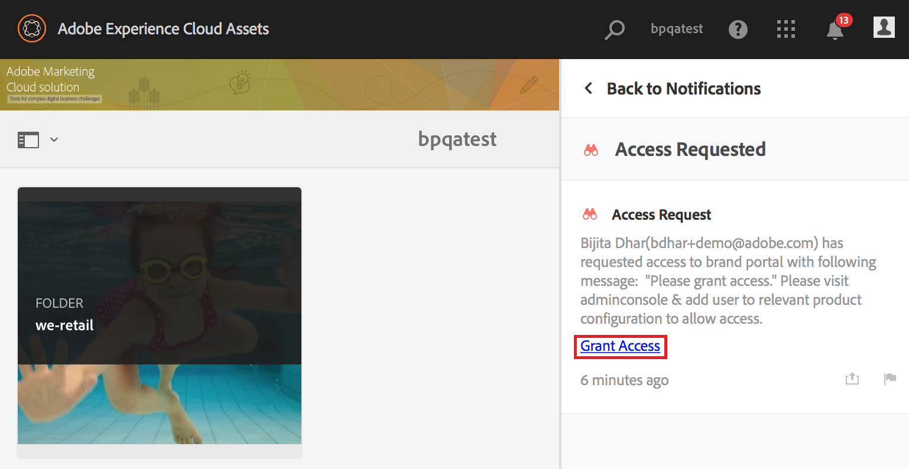

# Visão geral do AEM Assets Brand Portal {#overview-of-aem-assets-brand-portal}

Como comerciante, você precisa colaborar com parceiros de canal e usuários empresariais internos para criar, gerenciar e fornecer rapidamente conteúdo digital relevante aos clientes. A entrega oportuna de conteúdo relevante em toda a jornada do cliente é fundamental para causar maior demanda, conversão, envolvimento e fidelidade do cliente.

No entanto, é um desafio desenvolver soluções que oferecem suporte a compartilhamento eficiente e seguro de logotipos de marca aprovados, orientações, ativos da campanha ou capturas de produtos com equipes internas, parceiros e revendedores estendidos.

**[!DNL Adobe Experience Manager (AEM) Assets Brand Portal]** pode ajudá-lo a adquirir, controlar e distribuir com segurança ativos criativos aprovados a terceiros e usuários empresariais internos em todos os dispositivos. Isso ajuda a melhorar a eficiência do compartilhamento de ativos, acelera o mercado de ativos e reduz o risco de acesso não autorizado e não autorizado.

O ambiente do portal baseado em navegador permite carregar, navegar, pesquisar, visualizar e exportar facilmente ativos em formatos aprovados.

## Personalizar o usuário no Brand Portal {#Personas}

[!DNL Brand Portal] oferecem suporte para as seguintes funções do usuário:

* Usuário convidado
* Visualizador
* Editor
* Administrador

A tabela a seguir lista as tarefas que os usuários nessas funções podem executar:

|  | **Navegar** | **Pesquisar** | **Download** | **Compartilhar pastas** | **Compartilhar uma coleção** | **Compartilhar ativos como um link** | **Acesso às Ferramentas administrativas** |
|--- |--- |--- |--- |--- |--- |--- |--- |
| **Usuário convidado** | ✓* | ✓* | ✓* | x | x | x | x |
| **Visualizador** | ✓ | ✓ | ✓ | x | x | x | x |
| **Editor** | ✓ | ✓ | ✓ | ✓ | ✓ | ✓ | x |
| **Administrador** | ✓ | ✓ | ✓ | ✓ | ✓ | ✓ | ✓ |

* Os usuários convidados podem procurar, acessar e pesquisar ativos somente em pastas públicas e coleções.

### Guest user {#guest-user}

Qualquer usuário que tenha acesso limitado a ativos sem [!DNL Brand Portal] autenticação é um usuário convidado. A sessão de convidados permite que os usuários acessem pastas e coleções públicas. Como usuário convidado, você pode navegar pelos detalhes do ativo e ter uma visão completa de ativos de pastas públicas e coleções. Você pode pesquisar, baixar e adicionar ativos públicos à [!UICONTROL coleção lightbox].

No entanto, a sessão de convidados restringe a criação de coleções e pesquisas salvas, além de compartilhá-las ainda mais. Os usuários em uma sessão de convidados não podem acessar configurações de pastas e coleções, e não podem compartilhar ativos como link. Esta é uma lista de tarefas que um usuário convidado pode executar:

[Procurar e acessar ativos públicos](browse-assets-brand-portal.md)

[Pesquisar ativos públicos](brand-portal-searching.md)

[Baixar ativos públicos](brand-portal-download-users.md)

[Adicionar ativos a [! UICONTROL lightbox]](brand-portal-light-box.md#add-assets-to-lightbox)

### Visualizador {#viewer}

Um usuário padrão em [!DNL Brand Portal] geralmente é um usuário com a função do Visualizador. Um usuário com essa função pode acessar pastas, coleções e ativos permitidos. O usuário também pode navegar, visualizar, baixar e exportar ativos (representações originais ou específicas), definir configurações de conta e pesquisar ativos. Esta é uma lista de tarefas que um visualizador pode executar:

[Procurar ativos](browse-assets-brand-portal.md)

[Pesquisar ativos](brand-portal-searching.md)

[Baixar ativos](brand-portal-download-users.md)

### Editor {#editor}

Um usuário com a função do Editor pode executar todas as tarefas que um visualizador pode executar. Além disso, o Editor pode exibir os arquivos e pastas que um administrador compartilha. O usuário com a função de um Editor também pode compartilhar conteúdo (arquivos, pastas, coleções) com outras pessoas.

Além das tarefas que um visualizador pode realizar, um editor pode realizar as seguintes tarefas adicionais:

[Compartilhar pastas](brand-portal-sharing-folders.md)

[Compartilhar uma coleção](brand-portal-share-collection.md)

[Compartilhar ativos como um link](brand-portal-link-share.md)

### Administrador {#administrator}

Um administrador inclui um usuário marcado como administrador do sistema ou [!DNL Brand Portal] administrador de produto no [!UICONTROL Console de administração]. Um administrador pode adicionar e remover administradores de sistema e usuários, definir predefinições, enviar e-mails para usuários e exibir relatórios de uso e armazenamento do portal.

Um administrador pode realizar todas as tarefas que um editor pode executar e as seguintes tarefas adicionais:

[Gerenciar usuários, grupos e funções de usuário](brand-portal-adding-users.md)

[Personalizar papel de parede, cabeçalhos de página e e-mails](brand-portal-branding.md)

[Usar aspectos de pesquisa personalizados](brand-portal-search-facets.md)

[Usar o formulário de esquema de metadados](brand-portal-metadata-schemas.md)

[Aplicar predefinições de imagens ou representações dinâmicas](brand-portal-image-presets.md)

[Trabalhar com relatórios](brand-portal-reports.md)

Além das tarefas acima, um Autor em [!DNL AEM Assets] pode realizar as seguintes tarefas:

[Configurar [! Integração DNL AEM Assets] com [! DNL Brand Portal]](https://helpx.adobe.com/experience-manager/6-5/assets/using/brand-portal-configuring-integration.html)

[Publicar pastas em [! DNL Brand Portal]](https://helpx.adobe.com/experience-manager/6-5/assets/using/brand-portal-publish-folder.html)

[Publicar coleções em [! DNL Brand Portal]](https://helpx.adobe.com/experience-manager/6-5/assets/using/brand-portal-publish-collection.html)

## Alias alternativos para url do Brand Portal {#tenant-alias-for-portal-url}

[!DNL Brand Portal] 6.4.3 Em diante, as organizações podem ter um URL alternativo (alias) para URL existente de seu [!DNL Brand Portal] inquilino. O URL de alias pode ser criado com um prefixo alternativo no URL.\
Observe que apenas o prefixo do [!DNL Brand Portal] URL pode ser personalizado e não todo o URL. Por exemplo, uma organização com domínio existente **[!UICONTROL geomettrix.brand-portal.adobe.com]** pode obter **[!UICONTROL geomettrixinc.brand-portal.adobe.com]** criado mediante solicitação.

No entanto,**[!DNL AEM] Instância do autor pode ser [configurada](https://helpx.adobe.com/experience-manager/6-5/assets/using/brand-portal-configuring-integration.html) somente com o URL da ID do inquilino e não com o URL alias (alternativo) do locatário.

>[!NOTE]
>
>Para obter um alias do nome do inquilino no URL do portal existente, as organizações precisam entrar em contato com**[!DNL Adobe support] com uma solicitação de criação de alias do novo locatário. Essa solicitação é processada pela primeira verificação se o alias estiver disponível e, em seguida, criar o alias.
>
>Para substituir o antigo ou excluir o alias antigo, o mesmo processo precisa ser seguido.

## Solicitar acesso ao Brand Portal {#request-access-to-brand-portal}

Os usuários podem solicitar acesso a [!DNL Brand Portal] partir da tela de logon. Essas solicitações são enviadas a [!DNL Brand Portal] administradores, que concedem acesso aos usuários por meio do Adobe Admin Console. Depois que o acesso é concedido, os usuários recebem um email de notificação.

Para solicitar acesso, faça o seguinte:

1. Na página [!DNL Brand Portal] de logon, selecione o **clique** aqui correspondente à **necessidade de acesso?**. No entanto, para entrar na sessão de convidados, selecione o **clique** aqui correspondente ao **Acesso a convidados?**

   

   A página **Solicitar acesso** é aberta.

2. Para solicitar acesso a uma organização [!DNL Brand Portal], você deve ter uma [!UICONTROL Adobe ID], [!UICONTROL Enterprise ID]ou [!UICONTROL Federated ID válida].

   Na página **Solicitar acesso** , faça logon usando a ID (cenário 1) ou crie uma ID [!UICONTROL da Adobe] (cenário 2):
   

   **Cenário 1**
   1. Se você tiver uma [!UICONTROL Adobe ID], [!UICONTROL Enterprise ID]ou [!UICONTROL Federated ID], clique ****em Fazer logon.
A página **Entrar** é aberta.
   2. Forneça suas credenciais [!UICONTROL da Adobe ID] e clique ****em Fazer logon.
      
   Você é redirecionado à página **Solicitar acesso** .
   **Cenário 2**
   1. Se você não tiver uma [!UICONTROL Adobe ID], para criar uma, clique **em Obter uma Adobe ID** na página **Solicitar acesso** .
A página **Entrar** é aberta.
   2. Click **Get an Adobe ID**.
**A** página Cadastre-se.
   3. Insira seu nome e sobrenome, ID de email e senha. Clique em **Inscrever**-se.
      
   Você é redirecionado à página **Solicitar acesso** .

3. A próxima página exibe seu nome e ID de e-mail usada para solicitar acesso. Deixe um comentário para o administrador e clique **em Enviar**.

   

## Os administradores de produtos concedem acesso {#grant-access-to-brand-portal}

[!DNL Brand Portal] os administradores de produtos recebem solicitações de acesso em sua [!DNL Brand Portal] área de notificação e por e-mails em sua caixa de entrada.

Para conceder acesso, os administradores de produtos precisam clicar na notificação relevante na [!DNL Brand Portal] área de notificação e clicar **em Conceder acesso**.
Como alternativa, os administradores de produtos podem seguir o link fornecido no email de solicitação de acesso para visitar [!DNL Adobe Admin Console] e adicionar o usuário à configuração de produto relevante.

Você é redirecionado para o [[! Página inicial do Console de administração](https://adminconsole.adobe.com/enterprise/overview) do DNL. Use [!DNL Adobe Admin Console] para criar usuários e atribuí-los a perfis de produtos (anteriormente conhecidos como configurações de produto), que são exibidos como grupos. [!DNL Brand Portal] Para obter mais informações sobre como adicionar usuários, [!DNL Admin Console]consulte [Adicionar um usuário](brand-portal-adding-users.md#add-a-user) (siga as Etapas 4a 7 no procedimento para adicionar um usuário).

## Notificação de manutenção do Brand Portal {#brand-portal-maintenance-notification}

Antes [!DNL Brand Portal] de programar para baixo para manutenção, uma notificação é exibida como um banner após o logon [!DNL Brand Portal]. Uma notificação de amostra:

Você pode rejeitar esta notificação e continuar a usar [!DNL Brand Portal]. Esta notificação é exibida em todas as novas sessões.

## Informações do lançamento e do sistema {#release-and-system-information}

<!--* [What's new](../using/whats-new.md)-->
* [Notas de versão](brand-portal-release-notes.md)
* [Formatos de arquivo suportados](brand-portal-supported-formats.md)

## Related resources {#related-resources}

* [Atendimento ao cliente da Adobe](https://helpx.adobe.com/marketing-cloud/contact-support.html)
* [Fóruns do AEM](https://www.adobe.com/go/aod_forums_en)