# Procurar ativos no Brand Portal {#browsing-assets-on-brand-portal}

O Experience Manager Assets Brand Portal fornece vários recursos e elementos da interface do usuário que facilitam a navegação pelos recursos, a passagem de hierarquias de ativos e a pesquisa de ativos ao usar opções de exibição diferentes.

O logotipo Experience Manager na barra de ferramentas na parte superior facilita o acesso dos usuários administradores ao painel de ferramentas administrativas.

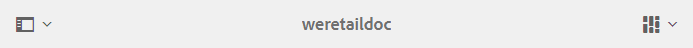 

Seletor de painéis no canto superior esquerdo da lista suspensa do Brand Portal para expor as opções para navegar nas hierarquias de ativos, simplificar sua pesquisa e exibir recursos.

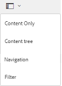

Você pode visualizar, navegar e selecionar ativos usando qualquer uma das exibições disponíveis (Cartão, Coluna e Lista) no seletor de exibições na parte superior direita do Brand Portal.

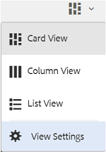

## Visualização e seleção de recursos {#viewing-and-selecting-resources}

Visualizar, navegar e selecionar cada um são conceitualmente iguais em todas as exibições, mas têm pequenas variações de manuseio, dependendo da exibição usada.

É possível visualizar, navegar e selecionar (para outras ações) os recursos com qualquer uma das exibições disponíveis:

* Exibição de coluna
* Exibição de cartão
* Exibição de lista  

### Exibição de cartão

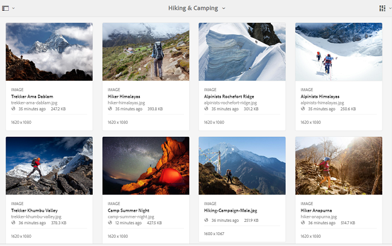

A Exibição de cartão exibe cartões de informações para cada item no nível atual. Esses cartões fornecem os seguintes detalhes:

* Uma representação visual do ativo/pasta.
* Tipo
* Título
* Nome
* Data e hora em que o ativo foi publicado na Brand Portal a partir da AEM
* Tamanho
* Dimensões

Você pode navegar para baixo na hierarquia tocando/clicando em cartões (com cautela para evitar as ações rápidas) ou para cima novamente usando a [navegação estrutural no cabeçalho](https://helpx.adobe.com/experience-manager/6-5/sites/authoring/using/basic-handling.html#TheHeader).

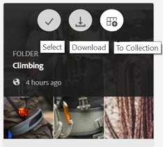

#### Exibição de cartão para usuários não administradores

Cartões de pastas, na Exibição de cartão, exibem informações de hierarquia de pastas para usuários não administradores (Editor, Visualizador e Usuário convidado). Essa funcionalidade permite que os usuários saibam o local das pastas que estão acessando, em relação à hierarquia principal.
As informações de hierarquia de pastas são particularmente úteis na diferenciação de pastas com nomes semelhantes a outras pastas compartilhadas de uma hierarquia de pasta diferente. Se os usuários não administradores não estiverem cientes da estrutura de pastas dos ativos compartilhados com eles, os ativos/pastas com nomes semelhantes parecerão confusos.

* Os caminhos mostrados nos respectivos cartões são truncados para se ajustarem aos tamanhos dos cartões. No entanto, os usuários podem ver o caminho completo como uma dica de ferramenta ao passar o cursor sobre o caminho truncado.

**Opção de visão geral para exibir propriedades de ativos**

A opção Visão geral está disponível para usuários não administradores (Editores, Visualizadores, Usuários convidados) para exibir as Propriedades do ativo de ativos de ativos/pastas selecionadas. A opção Visão geral está visível:

* na barra de ferramentas, na parte superior, ao selecionar um ativo/pasta.
* na lista suspensa ao selecionar o Seletor de painel.

Ao selecionar a opção **[!UICONTROL Visão geral]** enquanto um ativo/pasta é selecionado, os usuários podem ver o título, o caminho e o horário da criação do ativo. Enquanto isso, na página Detalhes do ativo, a opção Visão geral permite que os usuários vejam os metadados do ativo.

#### Exibir configurações na exibição de cartão

**[!UICONTROL A caixa de]** diálogo Exibir configurações é aberta ao selecionar  **[!UICONTROL Exibir]** configurações no seletor de exibições. Ela permite redimensionar as miniaturas de ativos na exibição de Cartão. Dessa forma, você pode personalizar sua visualização e controlar o número de miniaturas exibidas.

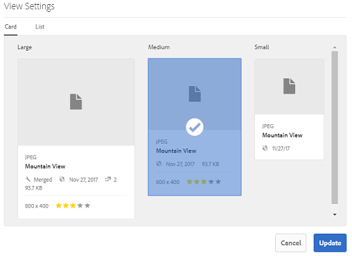

### Exibição de lista  

A exibição de lista exibe informações para cada recurso no nível atual. A exibição de Lista fornece os seguintes detalhes:

* Imagem em miniatura de ativos
* Nome
* Título
* Localidade
* Tipo
* Dimension
* Tamanho
* Classificação
* Caminho da pasta que mostra a hierarquia de ativos*
* Data de publicação do ativo no Brand Portal

A coluna Caminho permite identificar facilmente o local do ativo na hierarquia de pastas. Você pode navegar para baixo na hierarquia tocando/clicando no nome do recurso e fazer backup usando a [navegação estrutural no cabeçalho](https://helpx.adobe.com/experience-manager/6-5/sites/authoring/using/basic-handling.html#TheHeader).

<!--
Comment Type: draft lastmodifiedby="mgulati" lastmodifieddate="2018-08-17T03:12:05.096-0400" type="annotation">Removed:- "Selecting assets in list view To select all items in the list, use the checkbox at the upper left of the list. When all items in the list are selected, this check box appears checked. To deselect all, click or tap the checkbox. When only some items are selected, it appears with a minus sign. To select all, click or tap the checkbox. To deselect all, click or tap the checkbox again. You can change the order of items using the dotted vertical bar at the far right of each item in the list. Tap/click the vertical selection bar and drag the item to a new position in the list."
 -->

### Exibir configurações na exibição de lista

A exibição de Lista mostra o ativo **[!UICONTROL Nome]** como a primeira coluna por padrão. Informações adicionais, como ativo **[!UICONTROL Título]**, **[!UICONTROL Localidade]**, **[!UICONTROL Tipo]**, **[!UICONTROL Dimension]**, **[!UICONTROL Tamanho]**, **[!UICONTROL Classificação]**, o status de publicação também são mostradas. No entanto, é possível selecionar as colunas a serem mostradas usando **[!UICONTROL Configurações de exibição]**.

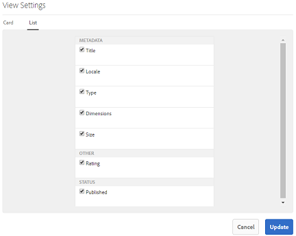

### Exibição de coluna

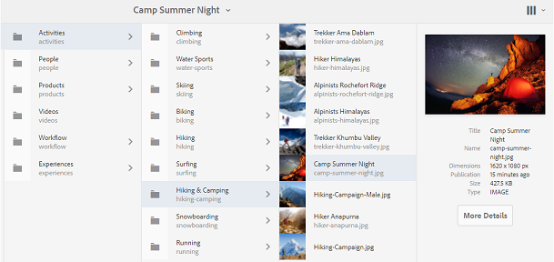

Use a exibição de coluna para navegar por uma árvore de conteúdo por uma série de colunas em cascata. Essa exibição ajuda a visualizar e navegar pela hierarquia do ativo.

Selecionar um recurso na primeira coluna (na extremidade esquerda) exibe os recursos filhos na segunda coluna à direita. Selecionar um recurso na segunda coluna exibe recursos filhos na terceira coluna à direita e assim por diante.

É possível navegar para cima e para baixo na árvore, tocando ou clicando no nome do recurso ou na divisa à direita do nome do recurso.

* O nome do recurso e a divisa são destacados quando tocados ou clicados.
* Tocar ou clicar na miniatura seleciona o recurso.
* Quando selecionada, uma marca de seleção é sobreposta à miniatura e o nome do recurso é destacado.
* Os detalhes do recurso selecionado são mostrados na coluna final.

Quando um ativo é selecionado na exibição de coluna, a representação visual do ativo é exibida na coluna final junto com os seguintes detalhes:

* Título
* Nome
* Dimensões
* Data e hora em que o ativo foi publicado na Brand Portal a partir da AEM
* Tamanho
* Tipo
* Opção Mais detalhes, para acessar a página de detalhes do ativo

<!--
Comment Type: draft

<h3>Selecting Resources</h3>
-->

<!--
Comment Type: draft

Selecting a specific resource depends on a combination of the view and the device:

-->

<!--
Comment Type: draft

<table border="1" cellpadding="1" cellspacing="0" width="100%">
<tbody>
<tr>
<td> </td>
<td>Select</td>
<td>Deselect</td>
</tr>
<tr>
<td>Column View  </td>
<td>
<ul>
<li>Desktop:  Mouseover, then use the check mark quick action</li>
<li>Mobile device:  Tap the thumbnail</li>
</ul> </td>
<td>
<ul>
<li>Desktop:  Click the thumbnail</li>
<li>Mobile device:  Tap the thumbnail</li>
</ul> </td>
</tr>
<tr>
<td>Card View  </td>
<td>
<ul>
<li>Desktop:  Mouseover, then use the check mark quick action</li>
<li>Mobile device:  Tap-and-hold the card</li>
</ul> </td>
<td>
<ul>
<li>Desktop:  Click the card</li>
<li>Mobile device:  Tap the card</li>
</ul> </td>
</tr>
<tr>
<td>List View</td>
<td>
<ul>
<li>Desktop:  Mouseover, then use the check mark quick action</li>
<li>Mobile device:  Tap the thumbnail</li>
</ul> </td>
<td>
<ul>
<li>Desktop:  Click the thumbnail</li>
<li>Mobile device:  Tap the thumbnail</li>
</ul> </td>
</tr>
</tbody>
</table>
-->

<!--
Comment Type: draft

Deselecting All
-->

<!--
Comment Type: draft

In all cases, as you select items the count of the items selected is displayed at the upper right of the toolbar.

You can deselect all items and exit selection mode by clicking or tapping the X next to the count.

-->

<!--
Comment Type: draft

In all views, all items can be deselected by tapping escape on the keyboard if you are using a desktop device.

-->

## Árvore de conteúdo {#content-tree}

Além dessas exibições, use a exibição em árvore para detalhar a hierarquia de ativos enquanto exibe e seleciona os ativos ou pastas desejados.

Para abrir a visualização de árvore, toque/clique no seletor do painel no canto superior esquerdo e selecione a **[!UICONTROL Árvore de conteúdo]** no menu.

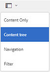

Na hierarquia de conteúdo, navegue até o ativo desejado.

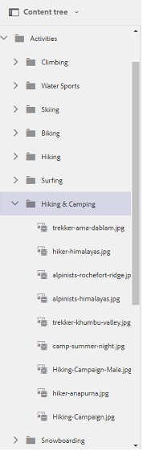

## Detalhes do ativo {#asset-details}

A página Detalhes do ativo permite visualizar um ativo, baixar, compartilhar o link do ativo, movê-lo para uma coleção ou exibir sua página de propriedades. Também permite navegar pela página de detalhes de outros ativos da mesma pasta em sucessão.

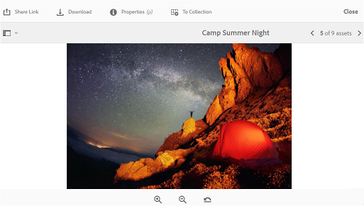

Para exibir os metadados do ativo ou suas várias representações, use o seletor do painel na página de detalhes do ativo.

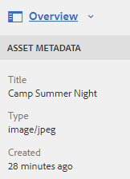

Você pode exibir todas as representações disponíveis do ativo na página de detalhes do ativo e selecionar uma representação para visualizá-lo.

Para abrir a página de propriedades do ativo, use a opção **[!UICONTROL Propriedades (p)]** na barra superior.

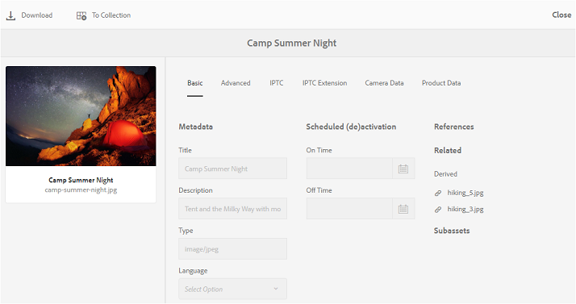

Também é possível exibir uma lista de todos os ativos relacionados (ativos de origem ou de derivados no AEM) na página de propriedades de um ativo, já que o relacionamento de ativo também é publicado do AEM para a Brand Portal.
