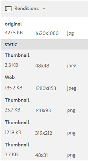

# Pesquisar ativos no Brand Portal {#browsing-assets-on-brand-portal}

O AEM Assets Brand Portal fornece vários recursos e elementos da interface do usuário que facilitam a navegação pelos recursos, a passagem pelas hierarquias de ativos e a pesquisa de ativos ao mesmo tempo que usam opções de exibição diferentes.

O logotipo do AEM na barra de ferramentas do AEM na parte superior facilita que os usuários administradores acessem o painel de ferramentas administrativas.

Seletor de painéis no canto superior esquerdo do Brand Portal suspenso para expor opções para navegar nas hierarquias de ativos, dinamizar sua pesquisa e exibir recursos.

Você pode exibir, navegar e selecionar ativos usando qualquer uma das exibições disponíveis (Cartão, Coluna e Lista) no seletor de exibições no canto superior direito do Portal de Marcas.

## Visualização e seleção de recursos {#viewing-and-selecting-resources}

Visualizar, navegar e selecionar cada uma são conceitualmente iguais em todas as exibições, mas têm pequenas variações na manipulação, dependendo da exibição usada.

Você pode exibir, navegar e selecionar (para mais ações) seus recursos com qualquer uma das exibições disponíveis:

* Visualização de coluna
* Exibição de cartão
* Exibição de lista

### Exibição de cartão

A Exibição de cartão exibe cartões de informações para cada item no nível atual. Esses cartões fornecem os seguintes detalhes:

* Uma representação visual do ativo/pasta.
* Tipo
* Título
* Nome
* Data e hora em que o ativo foi publicado no Brand Portal do AEM
* Tamanho
* Dimensões

You can navigate down the hierarchy by tapping/clicking cards (taking care to avoid the quick actions) or up again by using the [breadcrumbs in the header](https://helpx.adobe.com/experience-manager/6-5/sites/authoring/using/basic-handling.html#TheHeader).

#### Exibição de cartão para usuários não administradores

Cartões de pastas, na Visualização de cartão, exibem informações de hierarquia de pastas para usuários não administradores (Editor, Visualizador e Usuário convidado). Essa funcionalidade permite que os usuários saibam o local das pastas que estão acessando, em relação à hierarquia pai.
As informações de hierarquia de pastas são particularmente úteis na diferenciação de pastas com nomes semelhantes a outras pastas compartilhadas de uma hierarquia de pastas diferente. Se os usuários não administradores não estiverem cientes da estrutura de pastas dos ativos compartilhados com eles, ativos/pastas com nomes semelhantes parecerão confusos.

* Os caminhos mostrados nos respectivos cartões são truncados para se ajustarem aos tamanhos dos cartões. No entanto, os usuários podem ver o caminho completo como uma dica de ferramenta ao passar o mouse sobre o caminho truncado.

**Opção Visão geral para exibir as propriedades do ativo**

A opção Visão geral está disponível para usuários não administradores (editores, visualizadores, usuários convidados) para exibir Propriedades do ativo de ativos/pastas selecionadas. A opção Visão geral está visível:

* na barra de ferramentas na parte superior da seleção de um ativo/pasta.
* na lista suspensa ao selecionar o Seletor de painel.

Ao selecionar a opção [!UICONTROL Visão geral] enquanto um ativo/pasta é selecionado, os usuários podem ver o título, o caminho e a hora da criação do ativo. Enquanto isso, na página de detalhes do ativo, selecionar a opção Visão geral permite que os usuários vejam metadados do ativo.

#### Exibir configurações na exibição de cartão

[!UICONTROL A caixa de diálogo Configurações] de exibição é aberta ao selecionar Configurações **[!UICONTROL de]** exibição no seletor de exibição. Permite redimensionar as miniaturas de ativos na exibição Cartão. Dessa forma, você pode personalizar sua exibição e controlar o número de miniaturas exibidas.

### Exibição de lista

A exibição de lista exibe informações para cada recurso no nível atual. A exibição de Lista fornece os seguintes detalhes:

* Imagem em miniatura de ativos
* Nome
* Título
* Localidade
* Tipo
* Dimensão
* Tamanho
* Classificação
* Caminho da pasta mostrando a hierarquiado ativo*
* Data de publicação do ativo no Brand Portal

* A coluna Caminho permite identificar facilmente o local do ativo na hierarquia de pastas. You can navigate down the hierarchy by tapping/clicking the resource name, and back up by using the [breadcrumbs in the header](https://helpx.adobe.com/experience-manager/6-5/sites/authoring/using/basic-handling.html#TheHeader).

<!--
Comment Type: draft lastmodifiedby="mgulati" lastmodifieddate="2018-08-17T03:12:05.096-0400" type="annotation">Removed:- "Selecting assets in list view To select all items in the list, use the checkbox at the upper left of the list. When all items in the list are selected, this check box appears checked. To deselect all, click or tap the checkbox. When only some items are selected, it appears with a minus sign. To select all, click or tap the checkbox. To deselect all, click or tap the checkbox again. You can change the order of items using the dotted vertical bar at the far right of each item in the list. Tap/click the vertical selection bar and drag the item to a new position in the list."
 -->

### Exibir configurações na exibição de lista

A exibição de Lista mostra o [!UICONTROL Nome] do ativo como a primeira coluna por padrão. Informações adicionais, como [!UICONTROL Título]do ativo, [!UICONTROL Localidade], [!UICONTROL Tipo], [!UICONTROL Dimensões], [!UICONTROL Tamanho], Classificação, status de publicação também são mostradas. However, you can select the columns to be shown using [!UICONTROL View Settings].

### Visualização de coluna

Use a exibição de coluna para navegar em uma árvore de conteúdo por uma série de colunas em cascata. Esta exibição ajuda a visualizar e navegar pela hierarquia de ativos.

A seleção de um recurso na primeira coluna (na extremidade esquerda) exibe recursos filhos na segunda coluna à direita. A seleção de um recurso na segunda coluna exibe recursos filhos na terceira coluna à direita e assim por diante.

Você pode navegar para cima e para baixo na árvore tocando ou clicando no nome do recurso ou na divisa à direita do nome do recurso.

* O nome do recurso e a divisa são destacados quando tocados ou clicados.
* Tocar ou clicar na miniatura seleciona o recurso.
* Quando selecionada, uma marca de seleção é sobreposta na miniatura e o nome do recurso é realçado.
* Os detalhes do recurso selecionado são mostrados na coluna final.

Quando um ativo é selecionado na exibição de coluna, a representação visual do ativo é exibida na coluna final junto com os seguintes detalhes:

* Título
* Nome
* Dimensões
* Data e hora em que o ativo foi publicado no Brand Portal do AEM
* Tamanho
* Tipo
* Opção Mais Detalhes, para acessar a página de detalhes do ativo

<!--
Comment Type: draft

<h3>Selecting Resources</h3>
-->

<!--
Comment Type: draft

Selecting a specific resource depends on a combination of the view and the device:

-->

<!--
Comment Type: draft

<table border="1" cellpadding="1" cellspacing="0" width="100%">
<tbody>
<tr>
<td> </td>
<td>Select</td>
<td>Deselect</td>
</tr>
<tr>
<td>Column View  </td>
<td>
<ul>
<li>Desktop:  Mouseover, then use the check mark quick action</li>
<li>Mobile device:  Tap the thumbnail</li>
</ul> </td>
<td>
<ul>
<li>Desktop:  Click the thumbnail</li>
<li>Mobile device:  Tap the thumbnail</li>
</ul> </td>
</tr>
<tr>
<td>Card View  </td>
<td>
<ul>
<li>Desktop:  Mouseover, then use the check mark quick action</li>
<li>Mobile device:  Tap-and-hold the card</li>
</ul> </td>
<td>
<ul>
<li>Desktop:  Click the card</li>
<li>Mobile device:  Tap the card</li>
</ul> </td>
</tr>
<tr>
<td>List View</td>
<td>
<ul>
<li>Desktop:  Mouseover, then use the check mark quick action</li>
<li>Mobile device:  Tap the thumbnail</li>
</ul> </td>
<td>
<ul>
<li>Desktop:  Click the thumbnail</li>
<li>Mobile device:  Tap the thumbnail</li>
</ul> </td>
</tr>
</tbody>
</table>
-->

<!--
Comment Type: draft

<h4>Deselecting All</h4>
-->

<!--
Comment Type: draft

In all cases, as you select items the count of the items selected is displayed at the upper right of the toolbar.

You can deselect all items and exit selection mode by clicking or tapping the X next to the count.

-->

<!--
Comment Type: draft

In all views, all items can be deselected by tapping escape on the keyboard if you are using a desktop device.

-->

## Árvore de conteúdo {#content-tree}

Além dessas exibições, use a exibição em árvore para detalhar a hierarquia do ativo enquanto exibe e seleciona os ativos ou pastas desejados.

Para abrir a exibição em árvore, toque/clique no seletor de painel na parte superior esquerda e selecione a árvore **** Conteúdo no menu.

Na hierarquia de conteúdo, navegue até o ativo desejado.

## Detalhes do ativo {#asset-details}

A página de detalhes do ativo permite exibir um ativo, baixar, compartilhar o link do ativo, movê-lo para uma coleção ou exibir sua página de propriedades. Também permite navegar pela página de detalhes de outros ativos da mesma pasta sucessivamente.

Para exibir os metadados do ativo ou suas várias representações, use o seletor de trilho na página de detalhes do ativo.

Você pode exibir todas as representações disponíveis do ativo na página de detalhes do ativo e selecionar uma representação para visualizá-lo.

Para abrir a página de propriedades do ativo, use a opção **[!UICONTROL Propriedades (p)]** na barra superior.

Você também pode exibir uma lista de todos os ativos relacionados (ativos de origem ou derivados no AEM) na página de propriedades de um ativo, já que a relação de ativos também é publicada no AEM para o Brand Portal.
