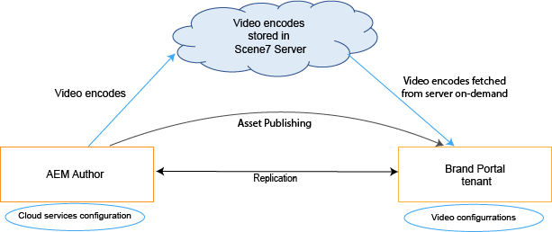
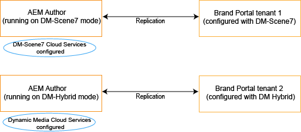
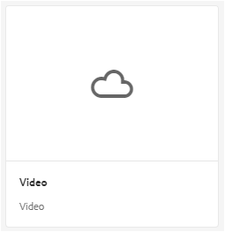
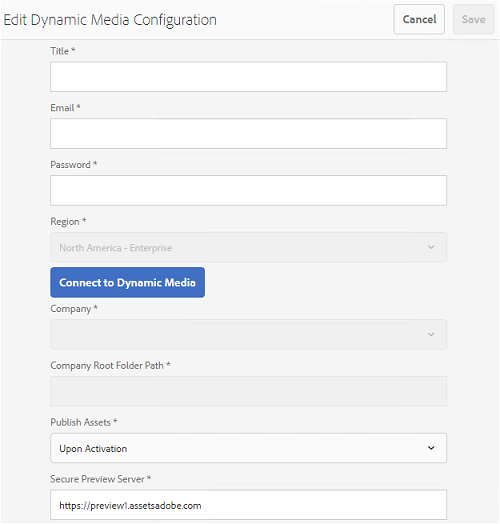

# Suporte a vídeo dinâmico no Brand Portal {#dynamic-video-support-on-brand-portal}

Pré-visualize e reproduza vídeos de forma adaptável no Brand Portal com suporte ao Dynamic Media. Baixe também as representações dinâmicas do portal e os links compartilhados.
Os usuários do Brand Portal podem:

* Visualize vídeos na página Detalhes do ativo, na Exibição de cartão e na página de visualização do compartilhamento de link.
* Reproduzir códigos de vídeo na página Detalhes do ativo.
* Exibir representações dinâmicas na guia Representações na página Detalhes do ativo.
* Baixe códigos de vídeo e pastas que contêm vídeos.

>[!NOTE]
>
>Para trabalhar com vídeos e publicá-los no Brand Portal, verifique se a instância do autor do Experience Manager está configurada no modo Híbrido do Dynamic Media ou no Dynamic Media **[!DNL Scene7]** modo.

Para visualizar, reproduzir e baixar vídeos, o Brand Portal expõe as duas configurações a seguir para os administradores:

* [Configuração híbrida do Dynamic Media](#configure-dm-hybrid-settings)
Se a instância do autor do Experience Manager estiver sendo executada no modo híbrido da mídia dinâmica.
* [Dynamic Media [!DNL Scene7] configuração](#configure-dm-scene7-settings)
Se a instância do autor do Experience Manager estiver em execução no Dynamic Media-**[!DNL Scene7]** modo.
Defina qualquer uma dessas configurações com base nas configurações definidas na instância do autor do Experience Manager com o qual o locatário do Brand Portal é replicado.

>[!NOTE]
>
>Os locatários do Brand Portal configurados com o Experience Manager Author em execução não oferecem suporte para vídeos dinâmicos **[!UICONTROL Scene7Connect]** modo de execução.

## Como os vídeos dinâmicos são reproduzidos? {#how-are-dynamic-videos-played}

Se configurações do Dynamic Media ([Híbrido](../using/dynamic-video-brand-portal.md#configure-dm-hybrid-settings) ou [[!DNL Scene7]](../using/dynamic-video-brand-portal.md#configure-dm-scene7-settings) configurações) forem configuradas no Brand Portal, as representações dinâmicas serão buscadas no **[!DNL Scene7]** servidor. As codificações de vídeo são, portanto, visualizadas e reproduzidas sem atraso e distorção na qualidade.

Como os códigos de vídeo não são armazenados no repositório do Brand Portal e são buscados no **[!DNL Scene7]** , verifique se as configurações do Dynamic Media na Instância do autor do Adobe Experience Manager e no Brand Portal são iguais.

>[!NOTE]
>
>Visualizadores de vídeo e predefinições do visualizador não são compatíveis com o Brand Portal. Os vídeos são visualizados e reproduzidos nos visualizadores padrão no Brand Portal.

## Pré-requisitos {#prerequisites}

Para trabalhar com vídeos dinâmicos no Brand Portal, certifique-se de:

* **Iniciar o Experience Manager Author no modo Dynamic Media**
Inicie a instância do autor do Experience Manager (com a qual o Brand Portal está configurado) no [DYNAMIC MEDIA - [!DNL Scene7] modo](https://experienceleague.adobe.com/docs/experience-manager-65/assets/dynamic/config-dms7.html?lang=en#enabling-dynamic-media-in-scene-mode) ou em [Dynamic Media - Modo híbrido](https://experienceleague.adobe.com/docs/experience-manager-65/assets/dynamic/config-dynamic.html) ou
* **Configurar o Dynamic Media Cloud Services no Experience Manager Author**
Com base no modo Dynamic Media (modo Scene7 ou modo Híbrido) em que o Experience Manager Author está sendo executado, defina [CLOUD SERVICES DYNAMIC MEDIA ([!DNL Scene7] mode)](https://experienceleague.adobe.com/docs/experience-manager-65/assets/dynamic/config-dms7.html?lang=pt-BR#configuring-dynamic-media-cloud-services) ou [Dynamic Media Cloud Services (modo híbrido)](https://experienceleague.adobe.com/docs/experience-manager-65/assets/dynamic/config-dynamic.html?lang=en#configuring-dynamic-media-cloud-services) no autor do Experience Manager de **Ferramentas** | **Cloud Services** | **Dynamic Media**.
* **Configurar o Dynamic Media no Brand Portal**
Com base nas configurações de nuvem do Dynamic Media no Experience Manager Author, configure [Configurações do Dynamic Media](#configure-dm-hybrid-settings) ou [[!DNL Scene7] configurações](#configure-dm-scene7-settings) das ferramentas administrativas do Brand Portal.
Verifique se [inquilinos separados do Brand Portal](#separate-tenants) são usados para instâncias do Autor do Experience Manager configuradas no Dynamic Media - **[!UICONTROL Scene7]** e Dynamic Media - Modo híbrido. Especialmente se você usar funcionalidades do Dynamic Media **[!UICONTROL S7]** e Dynamic Media Hybrid.
* **Publicar pastas com códigos de vídeo aplicados ao Brand Portal**
Aplicar [codificações de vídeo](https://experienceleague.adobe.com/docs/experience-manager-65/assets/dynamic/video-profiles.html) e publique a pasta que contém ativos de mídia avançada da instância do autor do Experience Manager para o Brand Portal.
* **➡ Incluir na lista de permissões IPs de saída em SPS se a visualização segura estiver ativada**
Se estiver usando o Dynamic Media-**[!DNL Scene7]** (com [visualização segura ativada](https://experienceleague.adobe.com/docs/dynamic-media-classic/using/upload-publish/testing-assets-making-them-public.html) para uma empresa), então recomenda-se que **[!DNL Scene7]** administrador da empresa [incluir na lista de permissões os IPs de saída públicos](https://experienceleague.adobe.com/docs/dynamic-media-classic/using/upload-publish/testing-assets-making-them-public.html#testing-the-secure-testing-service) para as respectivas regiões que utilizam o RPU (**[!UICONTROL Scene7]** Sistema de publicação) flash UI.
Os IPs de saída são os seguintes:

| **Região** | **IP de saída** |
|--- |--- |
| ND | 130.248.160.68,  20.94.203.130 |
| EMEA | 185.34.189.3,  51.132.146.75 |
| APAC | 63.140.44.54 |

Para adicionar um desses IPs de saída à lista de permissões, consulte [preparar sua conta para o serviço de teste seguro](https://experienceleague.adobe.com/docs/dynamic-media-classic/using/upload-publish/testing-assets-making-them-public.html#testing-the-secure-testing-service).

## Práticas recomendadas    

Para garantir que seus ativos de vídeo dinâmico sejam visualizados, reproduzidos e baixados com êxito da Brand Portal (e links compartilhados), siga estas práticas:

### Locatários separados para Dynamic Media - Scene7 e Dynamic Media - Modos híbridos {#separate-tenants}

Se você usar o Dynamic Media - **[!DNL Scene7]** e Dynamic Media - recursos do modo híbrido, use diferentes locatários do Brand Portal para instâncias do Experience Manager Author configuradas com o Dynamic Media - **[!DNL Scene7]** e Dynamic Media - modos híbridos.

### Mesmos detalhes de configuração na instância do autor do Experience Manager e no Brand Portal

Verifique se os detalhes da configuração são os mesmos no Brand Portal e **[!UICONTROL Configuração na nuvem do Experience Manager]**. Os mesmos detalhes de configuração incluem o seguinte:

* **[!UICONTROL Título]**
* **[!UICONTROL ID de registro]**
* **[!UICONTROL URL do serviço de vídeo]** in **[!UICONTROL Dynamic Media - Modo híbrido]**
* **[!UICONTROL Título]**
* Credenciais (**[!UICONTROL E-mail]** e senha)
* **[!UICONTROL Região]**
* **[!UICONTROL Empresa]** no Dynamic Media - **[!DNL Scene7]** modo

### Lista de permissões Pesquisar IPs de saída pública para o modo Dynamic Media Scene7

Se o Dynamic Media **[!UICONTROL Scene7]**-tendo [visualização segura ativada](https://experienceleague.adobe.com/docs/dynamic-media-classic/using/upload-publish/testing-assets-making-them-public.html)- é usado para fornecer ativos de vídeo ao Brand Portal e, em seguida, **[!UICONTROL Scene7]** O estabelece um servidor de imagens dedicado para ambientes de preparo ou aplicativos internos. Qualquer solicitação a esse servidor verifica o endereço IP de origem. Se a solicitação recebida não estiver na lista aprovada de endereços IP, uma resposta de falha será retornada.
A variável **[!UICONTROL Scene7]** O Administrador da empresa, portanto, configura uma lista aprovada de endereços IP para a **[!UICONTROL Teste seguro]** ambiente, por meio de **[!UICONTROL SPS]** (Scene7 Publishing System) interface do usuário do flash. Verifique se o IP de saída da sua respectiva região (a seguir) foi adicionado a essa lista aprovada.
Para adicionar um desses IPs de saída à lista de permissões, consulte [preparar sua conta para o serviço de teste seguro](https://experienceleague.adobe.com/docs/dynamic-media-classic/using/upload-publish/testing-assets-making-them-public.html#testing-the-secure-testing-service).
Os IPs de saída são os seguintes:

| **Região** | **IP de saída** |
|--- |--- |
| ND | 130.248.160.66, 20.94.203.130 |
| EMEA | 51.132.146.75, 130.248.244.202, 130.248.244.203, 130.248.244.204, 130.248.244.210, 130.248.244.211, 130.248.244.212 |
| APAC | 63.140.44.54 |

## Definir configurações do Dynamic Media (híbrido) {#configure-dm-hybrid-settings}

Se a instância do autor do Experience Manager estiver em execução no modo híbrido do Dynamic Media, use **[!UICONTROL Vídeo]** mova a tela do painel ferramentas administrativas para definir as configurações do gateway do Dynamic Media.

>[!NOTE]
>
>A variável [perfis de codificação de vídeo](https://experienceleague.adobe.com/docs/experience-manager-65/assets/dynamic/video-profiles.html) não são publicados no Brand Portal, em vez disso, são buscados no **[!UICONTROL Scene7]** servidor. Portanto, para que as codificações de vídeo sejam reproduzidas com sucesso no Brand Portal, verifique se os detalhes da configuração são os mesmos que os do [CLOUD SERVICES DYNAMIC MEDIA ([!DNL Scene7] mode)](https://experienceleague.adobe.com/docs/experience-manager-65/assets/dynamic/config-dms7.html?lang=pt-BR#configuring-dynamic-media-cloud-services) na instância do autor do Experience Manager.

Para definir as configurações do Dynamic Media nos locatários do Brand Portal:

1. Selecione o logotipo do Experience Manager para acessar as ferramentas administrativas na barra de ferramentas na parte superior, no Brand Portal.
1. No painel de ferramentas administrativas, selecione a **[!UICONTROL Vídeo]** bloco.

   

   **[!UICONTROL Editar configuração do Dynamic Media]** é aberta.

   

1. Especificar **[!UICONTROL ID de registro]** e **[!UICONTROL URL do serviço de vídeo]** (URL do gateway DM). Certifique-se de que esses detalhes sejam os mesmos que os detalhes em **[!UICONTROL Ferramentas > Cloud Services]** na instância do autor do Experience Manager.
1. Selecionar **Salvar** para salvar a configuração.

## Definir configurações do Dynamic Media Scene7 {#configure-dm-scene7-settings}

Se a instância do autor do Experience Manager estiver em execução no Dynamic Media- **[!UICONTROL Scene7]** e, em seguida, use **[!UICONTROL Configuração do Dynamic Media]** mosaico do painel ferramentas administrativas para configurar o **[!UICONTROL Scene7]** configurações do servidor.

Para configurar o Dynamic Media **[!UICONTROL Scene7]** configurações nos locatários do Brand Portal:

1. Selecione o logotipo do Experience Manager para acessar as ferramentas administrativas na barra de ferramentas na parte superior, no Brand Portal.

2. No painel de ferramentas administrativas, selecione a **[!UICONTROL Configuração do Dynamic Media]** bloco.

   ![DM [!UICONTROL Scene7] configuração no Brand Portal](assets/DMS7-Tile.png)

   **[!UICONTROL Editar configuração do Dynamic Media]** é aberta.

   

3. Fornecer:

   * **[!UICONTROL Título]**
   * Credenciais (**[!UICONTROL ID de e-mail]** e **[!UICONTROL Senha]**) para acessar o servidor do Scene7
   * **[!UICONTROL Região]**

   Verifique se esses valores são os mesmos que os valores encontrados na instância do autor do Experience Manager.

4. Selecionar **[!UICONTROL Conectar-se ao Dynamic Media]**.

5. Forneça o **[!UICONTROL Nome da empresa]**, e **[!UICONTROL Salvar]** a configuração.
