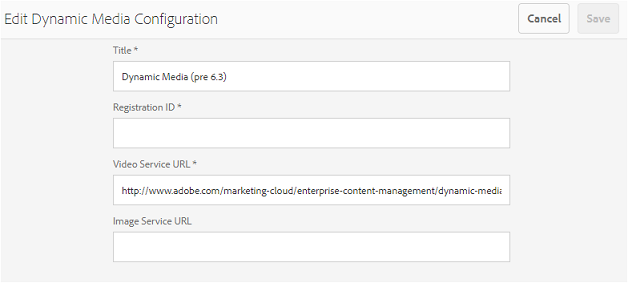

# Suporte a vídeo dinâmico no Brand Portal {#dynamic-video-support-on-brand-portal}

Visualize e reproduza vídeos de forma adaptável no Brand Portal com suporte para Dynamic Media. Baixe também as renderizações dinâmicas do portal e dos links compartilhados.
Os usuários do Brand Portal podem:

* Visualize vídeos na página Detalhes do ativo, Visualização de cartão e página de visualização de compartilhamento de link.
* Reproduzir codificações de vídeo na página Detalhes do ativo.
* Exibir representações dinâmicas na guia Representações na página Detalhes do ativo.
* Baixe as codificações e pastas de vídeo que contêm vídeos.

>[!NOTE]
>
>Para trabalhar com vídeos e publicá-los no Brand Portal, verifique se a instância do autor de AEM está configurada no modo Dynamic Media Hybrid ou no modo Dynamic Media [!DNL Scene 7] .

Para visualizar, reproduzir e baixar vídeos, o Brand Portal expõe as duas configurações a seguir aos administradores:

* [Configuração](#configure-dm-hybrid-settings)do Dynamic Media Hybrid Se a instância do autor de AEM estiver sendo executada no modo híbrido de mídia dinâmica.
* [Configuração](#configure-dm-scene7-settings)do Dynamic Media [!DNL Scene 7] Se a instância do autor de AEM estiver sendo executada no modo de mídia dinâmica[!DNL Scene 7] .
Defina qualquer uma dessas configurações com base nas configurações definidas na instância do autor de AEM com a qual o locatário do Brand Portal é replicado.

>[!NOTE]
>
>Vídeos dinâmicos não são suportados em locatários do Brand Portal integrados ao autor de AEM em execução no modo de execução [!UICONTROL Scene7Connect] .

## Como os vídeos dinâmicos são reproduzidos? {#how-are-dynamic-videos-played}

Se as configurações do Dynamic Media (configurações[Híbrido](../using/dynamic-video-brand-portal.md#configure-dm-hybrid-settings) ou [[!DNL Scene 7]](../using/dynamic-video-brand-portal.md#configure-dm-scene7-settings) ) estiverem configuradas no Brand Portal, as renderizações dinâmicas serão obtidas do [!DNL Scene 7] servidor. Portanto, as codificações de vídeo são visualizadas e reproduzidas sem demora e distorcem a qualidade.

Como as codificações de vídeo não são armazenadas no repositório do Brand Portal e são obtidas do [!DNL Scene 7] servidor, verifique se as configurações do Dynamic Media na instância do autor de AEM e no Portal de marca são as mesmas.

>[!NOTE]
>
>Os visualizadores de vídeo e as predefinições do visualizador não são suportados no Brand Portal. Os vídeos são visualizados e reproduzidos nos visualizadores padrão no Brand Portal.

## Pré-requisitos {#prerequisites}

Para trabalhar com vídeos dinâmicos no Brand Portal, certifique-se de:

* **Inicie o autor de AEM no modo** DM (Dynamic Media) Inicie a instância do autor de AEM (com a qual o Portal de marca está integrado) no modo [Híbrido de mídia](https://helpx.adobe.com/experience-manager/6-5/assets/using/config-dynamic.html#EnablingDynamicMedia) dinâmica ou no modo Dynamic Media [!DNL Scene 7].
* **Configurar os serviços de nuvem do Dynamic Media no autor** AEM Com base no modo de Mídia dinâmica em que o autor AEM está sendo executado, defina os serviços [de nuvem do](https://helpx.adobe.com/experience-manager/6-5/assets/using/config-dynamic.html#ConfiguringDynamicMediaCloudServices) Dynamic Media ou os serviços [de nuvem](https://helpx.adobe.com/experience-manager/6-5/assets/using/config-dms7.html#ConfiguringDynamicMediaCloudServices) [!DNL Scene 7] no autor de AEM em **Ferramentas** | Serviços **** em nuvem| Mídia **dinâmica**.
* **Configure o Dynamic Media no Brand Portal** com base nas configurações de nuvem do Dynamic Media no AEM Author, defina as configurações [do](#configure-dm-hybrid-settings) Dynamic Media ou [[!DNL Scene 7] nas ferramentas](#configure-dm-scene7-settings) administrativas do Brand Portal.
Certifique-se de que locatários [separados do Brand Portal sejam usados para instâncias do autor de AEM configuradas com os modos Dynamic Media Hybrid e Dynamic Media](#separate-tenants) Scene7 [!UICONTROL , se você estiver usando funcionalidades do Dynamic Media Hybrid e Dynamic Media] S7 .
* **Publique pastas com codificações de vídeo aplicadas ao Brand Portal** Aplique codificações [de](https://helpx.adobe.com/experience-manager/6-5/assets/using/video-profiles.html) vídeo e publique a pasta que contém ativos de mídia avançada da instância do autor de AEM para o Brand Portal.
* **IPs de saída da lista de permissões no SPS se a visualização segura estiver ativada** Se estiver usando o Dynamic Media-[!DNL Scene 7] (com a visualização [segura ativada](https://docs.adobe.com/content/help/en/dynamic-media-classic/using/upload-publish/testing-assets-making-them-public.html) para uma empresa), é aconselhável que o administrador da [!DNL Scene 7] empresa [coloque os IPs de saída públicos para as respectivas regiões usando a interface flash do SPS (](https://docs.adobe.com/content/help/en/dynamic-media-classic/using/upload-publish/testing-assets-making-them-public.html#testing-the-secure-testing-service) Scene 7 Publishing System).
Os IPs de saída são os seguintes:

| **Região** | **IP de saída** |
|--- |--- |
| ND | 192.243.237.86 |
| EMEA | 185.34.189.4 |
| APAC | 63.140.44.54 |

Para adicionar um desses IPs de saída à lista de permissões, consulte [Preparar sua conta para o serviço](https://docs.adobe.com/content/help/en/dynamic-media-classic/using/upload-publish/testing-assets-making-them-public.html#testing-the-secure-testing-service)de teste seguro.

## Práticas recomendadas

Para garantir que seus ativos de vídeo dinâmico sejam visualizados, reproduzidos e baixados com êxito do Brand Portal (e links compartilhados), siga estas práticas:

### Locatários separados para os modos Dynamic Media Hybrid e Dynamic Media Scene 7 {#separate-tenants}

Se você estiver usando os recursos Dynamic Media [!DNL Scene 7] e Dynamic Media Hybrid, recomendamos que use diferentes locatários do Brand Portal para instâncias de autor de AEM configuradas com os modos Dynamic Media Hybrid e Dynamic Media [!DNL Scene 7] . 

### Mesmos detalhes de configuração na instância do autor de AEM e no Portal de marcas

Certifique-se de que os detalhes de configuração, como [!UICONTROL Título], ID de registro, URL [!UICONTROL do serviço de] vídeo (no [!UICONTROL Dynamic Media Hybrid]) e [!UICONTROL Título]  [!DNL Scene 7], credenciais (Emaile Senha), Region, Empresa (no Dynamic Media), sejam os mesmos no Portal de marcas e na configuração da nuvem doAEM.

### IPs de saída públicos da lista de permissões para o modo Dynamic Media Scene 7

Se o Dynamic Media [!UICONTROL Scene 7]com visualização [segura ativada](https://docs.adobe.com/content/help/en/dynamic-media-classic/using/upload-publish/testing-assets-making-them-public.html)for usado para fornecer ativos de vídeo ao Brand Portal, o [!UICONTROL Scene 7] criará um servidor de imagem dedicado para ambientes de preparo ou aplicativos internos. Qualquer solicitação a este servidor verifica o endereço IP de origem. Se a solicitação recebida não estiver na lista aprovada de endereços IP, uma resposta de falha será retornada.
Portanto, o [!UICONTROL Scene-7] Company Administrator configura uma lista aprovada de endereços IP para o ambiente de teste  seguro de sua empresa, por meio da interface flash do [!UICONTROL SPS] (Scene-7 Publishing System). Certifique-se de que o IP de saída da sua região respectiva (a partir do seguinte) seja adicionado à lista aprovada.
Para adicionar um desses IPs de saída à lista de permissões, consulte [Preparar sua conta para o serviço](https://docs.adobe.com/content/help/en/dynamic-media-classic/using/upload-publish/testing-assets-making-them-public.html#testing-the-secure-testing-service)de teste seguro.
Os IPs de saída são os seguintes:

| **Região** | **IP de saída** |
|--- |--- |
| ND | 192.243.237.86 |
| EMEA | 185.34.189.4 |
| APAC | 63.140.44.54 |

## Definir configurações do Dynamic Media (Híbrido) {#configure-dm-hybrid-settings}

Se a instância do autor de AEM estiver sendo executada no modo híbrido de mídia dinâmica, use o bloco [!UICONTROL Vídeo] do painel de ferramentas administrativas para definir as configurações do gateway de Mídia dinâmica.
>[!NOTE]
>
>Os perfis [de codificação de](https://helpx.adobe.com/experience-manager/6-5/assets/using/video-profiles.html) vídeo não são publicados no Brand Portal, em vez disso, são obtidos do servidor [!UICONTROL Scene 7] . Portanto, para que as codificações de vídeo sejam reproduzidas com êxito no Brand Portal, certifique-se de que os detalhes de configuração sejam os mesmos da configuração [[!UICONTROL da nuvem do]](https://helpx.adobe.com/experience-manager/6-5/assets/using/config-dms7.html#ConfiguringDynamicMediaCloudServices) Scene7 na instância do autor de AEM.
Para configurar as configurações do Dynamic Media nos locatários do Brand Portal:

1. Selecione o logotipo do AEM para acessar as ferramentas administrativas na barra de ferramentas na parte superior, no Brand Portal.

2. No painel de ferramentas administrativas, selecione o bloco **[!UICONTROL Vídeo]** . 
   
   **[!UICONTROL Será aberta a página Editar configuração]** do Dynamic Media. 
   

3. Especifique a ID **[!UICONTROL de]** registro e o URL **[!UICONTROL do serviço de]** vídeo (URL do Gateway DM). Certifique-se de que esses detalhes sejam os mesmos em **[!UICONTROL Ferramentas &gt; Serviços]** em nuvem na instância do autor de AEM.

4. Selecione **Salvar** para salvar a configuração.

## Definir configurações do Dynamic Media Scene7 {#configure-dm-scene7-settings}

Se a instância do autor de AEM estiver sendo executada no modo Dynamic Media - [!UICONTROL Scene 7] , use o bloco de configuração **[!UICONTROL de Dynamic Media do painel de ferramentas administrativas para definir as configurações do servidor]** Scene 7  .

Para configurar o Dynamic Media [!UICONTROL Scene 7] nos locatários do Brand Portal:

1. Selecione o logotipo do AEM para acessar as ferramentas administrativas na barra de ferramentas na parte superior, no Brand Portal.

2. No painel de ferramentas administrativas, selecione o bloco Configuração **[!UICONTROL de mídia]** dinâmica. 
   ![Configuração do DM [!UICONTROL Scene 7] no Brand Portal](assets/DMS7-Tile.png)
   [!UICONTROL Será aberta a página Editar configuração] do Dynamic Media. 
   

3. Fornecer:
   * [!UICONTROL Título]
   * Credenciais (ID[!UICONTROL de] email e [!UICONTROL senha]) para acessar o servidor Scene 7
   * [!UICONTROL Região]Certifique-se de que esses valores sejam os mesmos da sua instância do autor de AEM.

4. Select **[!UICONTROL Connect to Dynamic Media]**.

5. Forneça o nome **[!UICONTROL da]** empresa e **[!UICONTROL Salve]** a configuração.
