# Acesso de convidado ao Brand Portal {#guest-access-to-brand-portal}

O portal de marcas AEM permite que os convidados acessem o portal. Um usuário convidado não precisa de credenciais para entrar no portal e tem acesso aos ativos públicos (e coleções) do portal. Os usuários na sessão de convidado podem adicionar ativos à sua lightbox (coleção privada) e fazer download do mesmo até que sua sessão dure, o que é 2 horas a partir do início da sessão, a menos que o usuário convidado escolha [[!UICONTROL Encerrar sessão]](#exit-guest-session).

A funcionalidade de acesso de convidado permite que as organizações compartilhem [rapidamente os ativos](../using/brand-portal-sharing-folders.md#how-to-share-folders) aprovados com a audiência desejada em escala sem precisar incorporá-los. A partir da versão 6.4.2 do Brand Portal está equipada para atender a vários usuários convidados simultâneos, o que representa 10% da cota total de usuários por organização. Permitir o acesso de convidados economiza tempo para gerenciar e a pontuação de usuários a bordo que precisam usar funcionalidades limitadas no Brand Portal.\
As organizações podem ativar (ou desativar) o acesso de convidados na conta do Brand Portal da organização usando a opção **[!UICONTROL Permitir acesso]** de convidados nas configurações de **[!UICONTROL acesso]** no painel de ferramentas administrativas.

<!--
Comment Type: annotation
Last Modified By: mgulati
Last Modified Date: 2018-08-17T10:42:59.879-0400
Removed the first para: "AEM Assets Brand Portal allows public users to enter the portal anonymously and have restricted access to the allowed public resources as guests. Organization users with guest role need not seek access and authentication from administrators."
-->

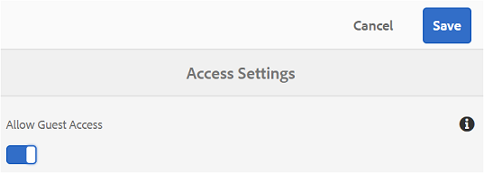

## Iniciar sessão de convidado {#begin-guest-session}

Para entrar no Brand Portal anonimamente, selecione **[!UICONTROL Clique aqui]** correspondente ao Acesso de **[!UICONTROL convidado?]** na tela de boas-vindas do Brand Portal. Digite a verificação de segurança de captura para conceder acesso ao uso do Brand Portal.

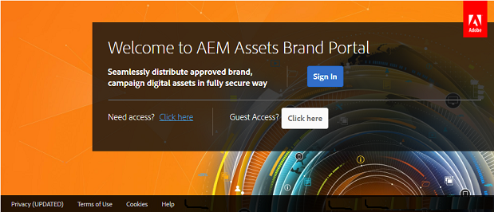

## Duração da sessão de convidado {#guest-session-duration}

Uma sessão de usuário convidado permanece ativa por 15 minutos.
Isso significa que o estado do **[!UICONTROL Lightbox]** é preservado por 15 minutos da hora do start da sessão e, depois disso, a sessão do convidado atual é reiniciada para que o estado do Lightbox seja perdido.

Por exemplo, um usuário convidado faz logon no Brand Portal às 1500 horas e adiciona recursos ao **[!UICONTROL Lightbox]** para download às 15:05 horas. Se o usuário não baixar a coleção do **[!UICONTROL Lightbox]** (ou seus ativos) antes das 15:15 horas (dentro de 15 minutos após o login), o usuário precisará reiniciar a sessão. A **[!UICONTROL Lightbox]** estará vazia, o que significa que os ativos carregados não estarão mais disponíveis se a sessão for perdida.

<!--
A guest user session remains active for 2 hours. This means that the state of the **[!UICONTROL Lightbox]** is preserved until 1 hour from the session start time, and after 2 hours the current guest session restarts so the Lightbox state is lost.  
For example, a guest user logs in to the Brand Portal at 1500 hours and adds assets to Lightbox for download at 16:50 hours. If the user doesn't download the **[!UICONTROL Lightbox]** collection (or its assets) before 17:00 hours, the **[!UICONTROL Lightbox]** will become empty as the user will have to restart the session at the end of 1 hour (that is 1700 hours).
-->

## Sessões de convidado simultâneas permitidas {#concurrent-guest-sessions-allowed}

O número de sessões de convidado simultâneas é limitado a 10% da cota total de usuários por organização. Isso significa que para uma organização com cota de usuário de 200, no máximo 20 usuários convidados podem trabalhar ao mesmo tempo. O acesso ao 21º usuário é negado e só pode ser acessado como convidado se a sessão de qualquer um dos 20 usuários convidados ativos for encerrada.

## Interação do usuário convidado com o Brand Portal {#guest-user-interaction-with-brand-portal}

### Navegação na interface do usuário convidado

Ao entrar no Brand Portal como convidado, os usuários podem ver todos os [ativos e pastas compartilhados](../using/brand-portal-sharing-folders.md#sharefolders) publicamente ou exclusivamente com usuários convidados. Essa visualização é a visualização somente de conteúdo, que exibe ativos em qualquer um dos layouts de cartão, lista ou coluna.

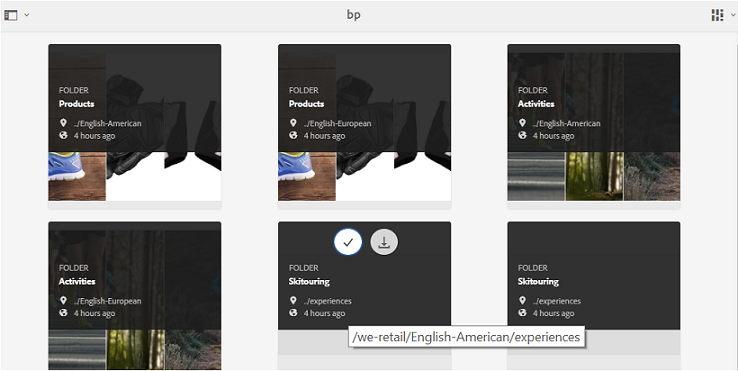

No entanto, os usuários convidados verão a árvore de pastas (começando pela pasta raiz) e as pastas compartilhadas organizadas em suas respectivas pastas pai ao fazer logon no Brand Portal, se os administradores tiverem ativado a configuração [Ativar hierarquia](../using/brand-portal-general-configuration.md#main-pars-header-1621071021) de pastas.

Essas pastas pai são as pastas virtuais e nenhuma ação pode ser executada nelas. É possível reconhecer essas pastas virtuais com um ícone de cadeado.

Nenhuma tarefa de ação é visível ao passar o mouse ou ao selecioná-la na Visualização **[!UICONTROL do]** cartão, ao contrário das pastas compartilhadas. **[!UICONTROL O botão Visão geral]** é exibido ao selecionar uma pasta virtual na Visualização **[!UICONTROL de]** Coluna e na Visualização **[!UICONTROL de]** Lista.

>[!NOTE]
>
>A miniatura padrão das pastas virtuais é a imagem em miniatura da primeira pasta compartilhada.

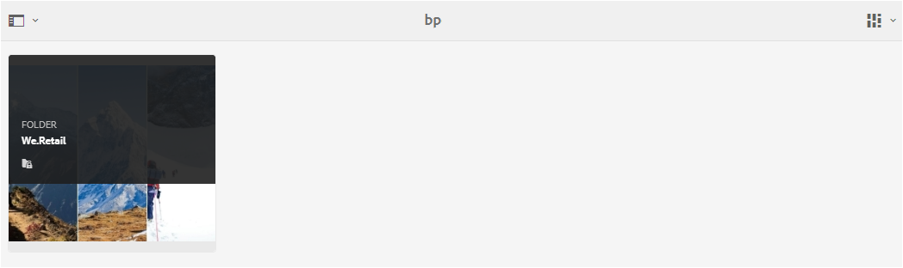 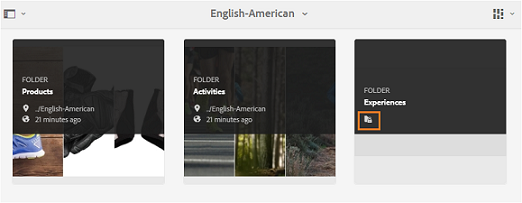 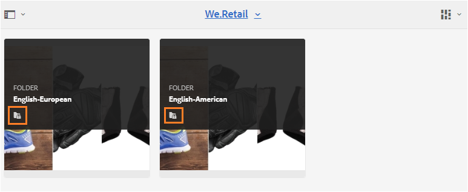 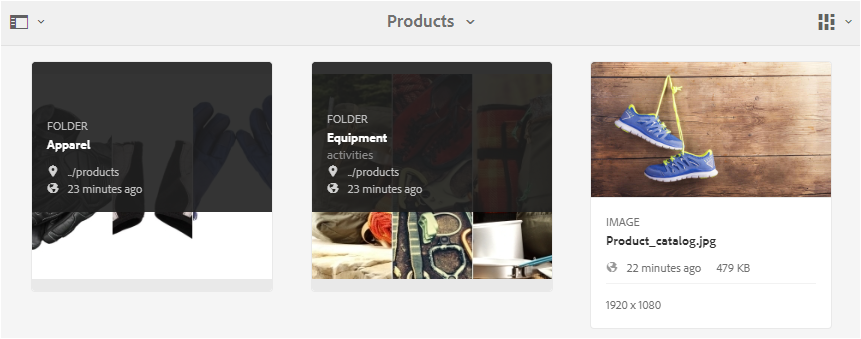

**[!UICONTROL A opção Configurações]** de visualização permite que os usuários convidados ajustem tamanhos de cartão na Visualização **[!UICONTROL do]** cartão ou colunas para exibição na Visualização **[!UICONTROL da]** Lista.

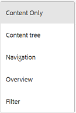

A árvore **** Conteúdo permite que você percorra a hierarquia de ativos.

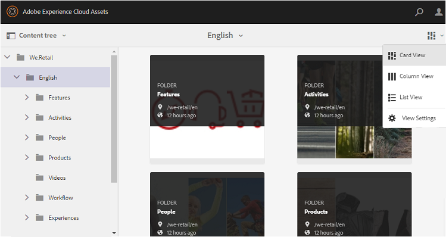

O Brand Portal fornece a opção **[!UICONTROL Visão geral]** para que os usuários convidados possam visualização em Propriedades **[!UICONTROL de]** ativos de ativos/pastas selecionadas. A opção **[!UICONTROL Visão geral]** está visível:

* Na barra de ferramentas na parte superior da seleção de um ativo/pasta.
* Na lista suspensa ao selecionar o Seletor de painel.
Ao selecionar a opção **[!UICONTROL Visão geral]** enquanto um ativo/pasta é selecionado, os usuários podem ver o título, o caminho e a hora da criação do ativo. Enquanto isso, na página de detalhes do ativo, selecionar a opção **[!UICONTROL Visão geral]** permite que os usuários vejam os metadados do ativo.

 

**[!UICONTROL A opção de navegação]** no painel esquerdo permite navegar de arquivos para coleções e voltar na sessão de convidado para que os usuários possam navegar pelos ativos em arquivos ou coleções.

**[!UICONTROL A opção Filtrar]** permite que usuários convidados filtrem arquivos de ativos e pastas usando predicados de pesquisa definidos pelo administrador.

### Recursos do usuário convidado

Os usuários convidados podem acessar ativos públicos no Brand Portal, e também ter algumas restrições, conforme discutido posteriormente.

**Os usuários convidados podem**:

* Acesse todas as pastas públicas e coleções destinadas a todos os usuários do Brand Portal.
* Procure membros, páginas detalhadas e tenha visualização completa de ativos dos membros de todas as pastas públicas e coleções.
* Pesquise ativos em pastas públicas e coleções.
* Adicione ativos à coleção de lightbox. Essas alterações na coleção persistem durante a sessão.
* Baixe ativos diretamente ou por meio da coleção de lightbox.

**Os usuários convidados não podem**:

* Crie coleções e pesquisas salvas, ou compartilhe-as ainda mais.
* Acesse as configurações de pastas e coleções.
* Compartilhar ativos como links.

### Baixar ativos na sessão de convidados

Os usuários convidados podem baixar diretamente ativos compartilhados publicamente ou exclusivamente com usuários convidados no Brand Portal. Os usuários convidados também podem adicionar ativos ao **[!UICONTROL Lightbox]** (coleção pública) e baixar a coleção do **[!UICONTROL Lightbox]** antes que a sessão expire.

Para baixar ativos e coleções, use o ícone de download de:

* Miniaturas de ação rápida, que aparecem ao passar o mouse sobre o ativo ou a coleção
* A barra de ferramentas na parte superior, que aparece ao selecionar o ativo ou a coleção

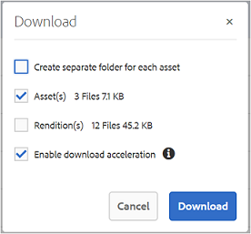

Selecionar **[!UICONTROL Ativar aceleração]** de download na caixa de diálogo [!UICONTROL Download] permite [aprimorar o desempenho](../using/accelerated-download.md)do download.

## Sair da sessão de convidado {#exit-guest-session}

Para sair de uma sessão de convidado, use **[!UICONTROL Encerrar sessão]** das opções disponíveis no cabeçalho. Entretanto, se a guia do navegador usada para a sessão de convidado estiver inativa, a sessão expirará automaticamente após duas horas de inatividade.

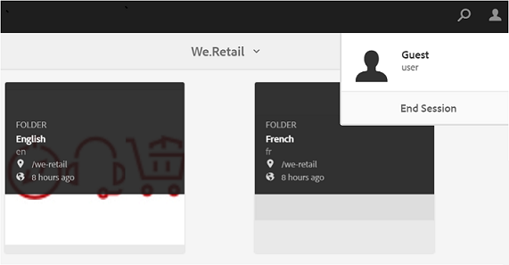

## Monitorando atividades de usuários convidados {#monitoring-guest-user-activities}

Os administradores podem monitorar a interação do usuário convidado com o Brand Portal. Os relatórios gerados no Brand Portal podem fornecer informações importantes sobre as atividades de usuários convidados. Por exemplo, o relatório **[!UICONTROL Download]** pode ser usado para rastrear a contagem de ativos baixados pelo usuário convidado. **[!UICONTROL O relatório de logons]** de usuário pode informar quando o usuário convidado fez logon pela última vez no portal e a frequência de logons em uma duração especificada.
